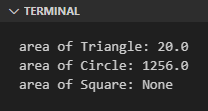
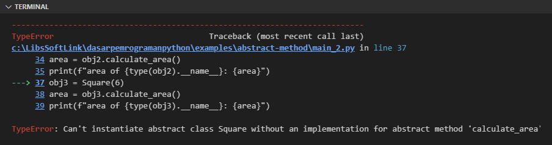
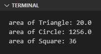

Pada chapter ini kita akan mempelejari tentang apa itu abstract method beserta bagaimana penerapannya pada pemrograman OOP menggunakan Python.

## A.42.1. Pengenalan abstract method

Abstract method merupakan jenis method yang dideklarasikan dengan isi tidak melakukan apa-apa, hanya statement `pass`. Nantinya ketika class (dimana method tersebut berada) di-inherit ke sub class lain, maka sub-class harus meng-override method milik super class tersebut.

Abstract method umum digunakan pada situasi dimana ada beberapa class yang memiliki method yang sama, namun isinya berbeda satu sama lain. Agar seragam, maka beberapa class tersebut harus menjadi sub class dari sebuah super class yang sama. Super class sendiri berisi abstract method, dibuat sebagai acuan spesifikasi untuk sub class.

> Pada pemrograman secara umum, fungsi tanpa isi biasa disebut dengan *header function*

Agar lebih mudah untuk memahami konsep dan penerapan abstract method, kita akan mulai pembelajaran dengan praktek tanpa penerapan abstract method terlebih dahulu.

Ok, siapkan sebuah class bernama `Object2D` dengan isi satu buah method bernama `calculate_area()`. Kemudian class tersebut diturunkan ke dua class baru bernama `Triangle` dan `Circle`.

Class `Triangle` dan `Circle` keduanya memiliki bentuk implementasi `calculate_area()` berbeda satu sama lain karena memang secara aturan rumus perhitungan luas segitiga dan lingkaran adalah berbeda.

Alasan kenapa ada deklarasi method `calculate_area()` di parent class adalah agar sub class `Triange` dan `Circle` memiliki method `calculate_area()` dengan skema seragam.

Berikut adalah source code-nya:

```python
class Object2D:
    def calculate_area(self):
        pass

class Triangle(Object2D):
    def __init__(self, b, h):
        self.b = b
        self.h = h

    def calculate_area(self):
        return 1/2 * self.b * self.h

class Circle(Object2D):
    def __init__(self, r):
        self.r = r

    def calculate_area(self):
        return 3.14 * self.r * self.r
        
obj1 = Triangle(4, 10)
area = obj1.calculate_area()
print(f"area of {type(obj1).__name__}: {area}")
# output ➜ area of Triangle: 20.0

obj2 = Circle(20)
area = obj2.calculate_area()
print(f"area of {type(obj2).__name__}: {area}")
# output ➜ area of Circle: 1256.0
```

Kode di atas berjalan normal sesuai harapan, namun memiliki kekurangan, yaitu ketika class `Object2D` diturunkan ke suatu class, bisa saja sub class tidak meng-override method `calculate_area()`.

Contoh, pada kode berikut dibuat class baru bernama `Square` yang tidak meng-override method `calculate_area()`:

```python
class Square(Object2D):
    def __init__(self, s):
        self.s = s

obj3 = Square(6)
area = obj3.calculate_area()
print(f"area of {type(obj3).__name__}: {area}")
# output ➜ area of Square: None
```

Output:



Kode di atas ketika di-run tidak menghasilkan error, berjalan normal, hanya saja outputnya tidak sesuai harapan karena class `Square` tidak mempunyai method `calculate_area()`. Tanpa adanya method tersebut, maka pemanggilan `calculate_area()` mengarah ke method super class yang isinya mengembalikan nilai `None`.

Di *real life*, ukuran source code yang kita maintain bisa saja berisi ratusan atau bahkan puluhan ribu baris dengan jumlah file sangat banyak. Di case yang seperti itu cukup susah mengecek mana class yang implementasinya sudah sesuai spesifikasi dan mana yang belum, karena saat program dijalankan tidak ada error atau warning. Untuk mengatasi masalah tersebut, solusinya adalah dengan mengimplementasikan abstract method.

## A.42.2. Praktek abstract method

Di Python versi 3.4+, suatu method menjadi abstract method ketika memenuhi kriteria berikut:

- Super class meng-inherit class bawaan Python bernama `ABC` milik module `abc`.
- Method yang dijadikan acuan (yang nantinya wajib di-override) perlu ditambahi decorator `@abstractmethod` milik module `abc`.

> ABC merupakan kependekan dari Abstract Base Class, sebuah module bawaan Python Standard Library yang berisi banyak property untuk keperluan abstraction.

Sekarang, aplikasikan 2 hal di atas ke kode yang telah ditulis. Kurang lebih hasil akhirnya seperti ini. Perbedaannya ada pada deklarasi class `Object2D` dan deklarasi method `calculate_area()`.

```python

from abc import ABC, abstractmethod

class Object2D(ABC):
    @abstractmethod
    def calculate_area(self):
        pass

class Triangle(Object2D):
    def __init__(self, b, h):
        self.b = b
        self.h = h

    def calculate_area(self):
        return 1/2 * self.b * self.h

class Circle(Object2D):
    def __init__(self, r):
        self.r = r

    def calculate_area(self):
        return 3.14 * self.r * self.r

class Square(Object2D):
    def __init__(self, s):
        self.s = s

obj1 = Triangle(4, 10)
area = obj1.calculate_area()
print(f"area of {type(obj1).__name__}: {area}")

obj2 = Circle(20)
area = obj2.calculate_area()
print(f"area of {type(obj2).__name__}: {area}")

obj3 = Square(6)
area = obj3.calculate_area()
print(f"area of {type(obj3).__name__}: {area}")
```

Selanjutnya, coba jalankan, pasti muncul error karena class `Square` tidak berisi implementasi method `calculate_area()`.



Untuk memperbaiki error, override method `calculate_area()` milik class `Square` agar sesuai spesifikasi.

```python
class Square(Object2D):
    def __init__(self, s):
        self.s = s

    def calculate_area(self):
        return self.s * self.s
```

Output program setelah diperbaiki:



---

<div class="section-footnote">

## Catatan chapter 📑

### ◉ Source code praktik

<pre>
    <a href="https://github.com/novalagung/dasarpemrogramanpython-example/tree/master/abstract-class">
        github.com/novalagung/dasarpemrogramanpython-example/../abstract-class
    </a>
</pre>

### ◉ Chapter relevan lainnya

- [OOP ➜ Class & Object](/basic/class-object)
- [OOP ➜ Instance Method](/basic/instance-method)
- [OOP ➜ Constructor](/basic/class-constructor)
- [OOP ➜ Class Method](/basic/class-method)
- [OOP ➜ Static Method](/basic/static-method)
- [Function ➜ Decorator](/basic/decorator)
- [OOP ➜ Class Inheritance](/basic/class-inheritance)

### ◉ Referensi

- https://docs.python.org/3/library/abc.html
- https://stackoverflow.com/questions/13646245/is-it-possible-to-make-abstract-classes-in-python/13646263#13646263

</div>
