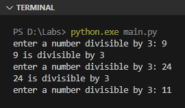
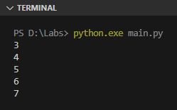

Keyword `break` dan `continue` sering dipergunakan dalam perulangan untuk alterasi flow secara paksa, seperti memberhentikan perulangan atau memaksa perulangan untuk lanjut ke iterasi berikutnya.

Pada chapter ini kita akan mempelajarinya.

## A.11.1. Keyword `break`

Pengaplikasian `break` biasanya dikombinasikan dengan seleksi kondisi. Sebagai contoh program sederhana berikut, yaitu program dengan spesifikasi:

- Berisi perulangan yang sifatnya berjalan terus-menerus tanpa henti (karena menggunakan nilai `True` sebagai kontrol).
- Perulangan hanya berhenti jika nilai `n` (yang didapat dari inputan user) adalah tidak bisa dibagi dengan angka `3`.

```python
while True:
    n = int(input("enter a number divisible by 3: "))
    if n % 3 != 0:
        break

    print("%d is divisible by 3" % (n))
```



## A.11.2. Keyword `continue`

Keyword `continue` digunakan untuk memaksa perulangan lanjut ke iterasi berikutnya (seperti proses skip).

Contoh penerapannya bisa dilihat pada program berikut, yang spesifikasinya:

- Program berisi perulangan dengan kontrol adalah data *range* sebanyak 10 (dimana isinya adalah angka numerik `0` hingga `9`).
- Ketika nilai variabel counter `i` adalah dibawah `3` atau di atas `7` maka iterasi di-skip.

```python
for i in range(10):
    if i < 3 or i > 7:
        continue
    print(i)
```

Efek dari `continue` adalah semua statement setelahnya akan di-skip. Pada program di atas, statement `print(i)` tidak dieksekusi ada `continue`.

Hasilnya bisa dilihat pada gambar berikut, nilai yang di-print adalah angka `3` hingga `7` saja.



## A.11.3. Label perulangan

Python tidak mengenal konsep perulangan yang memiliki label.

Teknik menamai perulangan dengan label umumnya digunakan untuk mengontrol flow pada perulangan bercabang / *nested*, misalnya untuk menghentikan perulangan terluar secara paksa ketika suatu kondisi terpenuhi.

Di Python, algoritma seperti ini bisa diterapkan namun menggunakan tambahan kode. Contoh penerapannya bisa dilihat pada kode berikut:

```python
max = int(input("jumlah bintang: "))

outerLoop = True
for i in range(max):
    if not outerLoop: 
        break

    for j in range(i + 1):
        print("*", end=" ")
        if j >= 7:
            outerLoop = False
            break
    print()
```

Penjelasan:

- Program yang memiliki perulanga *nested* dengan jumlah perulangan ada 2.
- Disiapkan sebuah variabel `bool` bernama `outerLoop` untuk kontrol perulangan terluar.
- Ketika nilai `j` (yang merupakan variabel counter perulangan terdalam) adalah lebih dari atau sama dengan `7`, maka variabel `outerLoop` di set nilainya menjadi `False`, dan perulangan terdalam di-`break` secara paksa.
- Dengan ini maka perulangan terluar akan terhenti.

---

<div class="section-footnote">

## Catatan chapter 📑

### ◉ Source code praktik

<pre>
    <a href="https://github.com/novalagung/dasarpemrogramanpython-example/tree/master/break-continue">
        github.com/novalagung/dasarpemrogramanpython-example/../break-continue
    </a>
</pre>

### ◉ Chapter relevan lainnya

- [Perulangan ➜ for & range](/basic/for-range)
- [Perulangan ➜ while](/basic/while)

### ◉ Referensi

- https://docs.python.org/3/tutorial/controlflow.html

</div>
