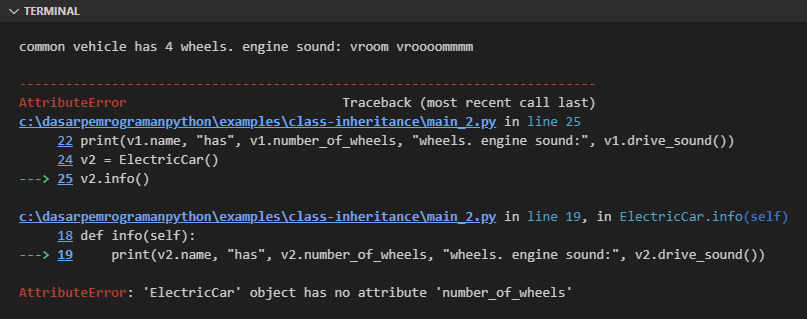

Chapter ini membahas tentang salah satu aspek penting dalam pemrograman OOP, yaitu inheritance atau pewarisan sifat, dimana sifat yang dimaksud adalah property seperti attribute, method, dan lainnya.

## A.41.1. Pengenalan Inheritance

Untuk mewujudkan inheritance setidaknya dua buah class dibutuhkan:

- Super class / parent class, yaitu class yang property-nya ingin diwariskan atau diturunkan ke class dibawahnya.
- Sub class / derrived class, yaitu class yang mewarisi property dari parent class.

Misalkan, ada sebuah class bernama `Vehicle` dan class ini memiliki property berikut:

1. Constructor
1. Class attribute `note`
1. Instance attribute `name`
1. Instance attribute `number_of_wheels`
1. Instance method `drive_sound()`

Class `Vehicle` kemudian dijadikan sebagai parent class pada class `ElectricCar`.

Class `ElectricCar` kita desain tidak memiliki attribute. Namun karena dia merupakan *sub class* dari `Vehicle` maka secara *implicit* mewarisi semua property yang ada di class `Vehicle`. Maka via object bertipe class `ElectricCar` nantinya kita bisa mengakses property class `Vehicle`.

Class `ElectricCar` memiliki satu buah method bernama `info()` yang isinya adalah menampilkan data property yang diwarisi oleh class `Vehicle`

Ilustrasi diagram UML-nya seperti ini:


Dari gambar di atas, secara teori, object yang dibuat dari class `ElectricCar` bisa mengakses property class itu sendiri serta property lain yang diwarisi super class.

Sedangkan object dari class `Vehicle` hanya bisa mengakses property class itu sendiri saja.

Ok, sekarang mari kita terapkan skenario di atas di Python. Definisikan class `Vehicle` dan class `ElectricCar` beserta isi masing-masing property.

```python
class Vehicle:
    note = "class to represent a car"
    
    def __init__(self):
        self.name = "common vehicle"
        self.number_of_wheels = 4
    
    def drive_sound(self):
        return "vroom vroooommmm"

class ElectricCar(Vehicle):
    def info(self):
        print(self.name, "has", self.number_of_wheels, "wheels. engine sound:", self.drive_sound())
```

Pada deklarasi class `ElectricCar` penulisannya ada yang unik. Nama class ditulis dengan notasi `ElectricCar(Vehicle)` yang artinya adalah class `ElectricCar` dideklarasikan sebagai sub class class `Vehicle`.

:::info

Notasi umum penulisan inheritance kurang lebih seperti ini:

```python
class SuperClass:
    pass

class SubClass(SuperClass):
    pass
```

:::

Dari dua class yang telah dideklarasikan, selanjutnya buat beberapa instance object lalu akses property-nya. Setelah itu coba run program dan lihat outputnya.

```python
v1 = Vehicle()
print(v1.name, "has", v1.number_of_wheels, "wheels. engine sound:", v1.drive_sound())
# output ➜ common vehicle has 4 wheels. engine sound: vroom vroooommmm

v2 = ElectricCar()
v2.name = "electric car"
print(v2.name, "has", v2.number_of_wheels, "wheels. engine sound:", v2.drive_sound())
# output ➜ electric car has 4 wheels. engine sound: vroom vroooommmm

v3 = ElectricCar()
v3.name = "electric car"
v3.info()
# output ➜ electric car has 4 wheels. engine sound: vroom vroooommmm
```

Bisa dilihat dari contoh, bahwa property milik class `Vehicle` bisa diakses via instance object yang dibuat dari class itu sendiri maupun dari object yang dibuat dari subclass `ElectricCar`.

## A.41.2. Class `object` inheritance

Python memiliki class bawaan bernama `object` yang pada praktiknya otomatis menjadi super class dari semua class bawaan Python maupun custom class yang kita buat sendiri.

Contohnya class `Vehicle` dan `ElectricCar` yang telah dibuat, kedua class tersebut otomatis juga menjadi sub class dari class `object` ini.

Untuk membuktikan, silakan test saja menggunakan kombinasi seleksi kondisi dan fungsi `isinstance()`.

```python
class Vehicle:
    note = "class to represent a car"
    
    def __init__(self):
        self.name = "common vehicle"
        self.number_of_wheels = 4
    
    def drive_sound(self):
        return "vroom vroooommmm"

class ElectricCar(Vehicle):
    def info(self):
        print(self.name, "has", self.number_of_wheels, "wheels. engine sound:", self.drive_sound())

v1 = Vehicle()
if isinstance(v1, Vehicle):
    print("v1 class inherit from class Vehicle")
if isinstance(v1, object):
    print("v1 class inherit from class object")

v2 = ElectricCar()
if isinstance(v2, ElectricCar):
    print("v2 class inherit from class ElectricCar")
if isinstance(v2, Vehicle):
    print("v2 class inherit from class Vehicle")
if isinstance(v2, object):
    print("v2 class inherit from class object")

# output ↓
# 
# v1 class inherit from class Vehicle
# v1 class inherit from class object
# 
# v2 class inherit from class ElectricCar
# v2 class inherit from class Vehicle
# v2 class inherit from class object
```

## A.41.3. Constructor overriding

*Overriding* adalah istilah pemrograman OOP untuk menimpa/mengganti suatu method dengan method baru yang nama dan strukturnya sama tapi isinya berbeda.

Pada section ini, teknik overriding kita akan terapkan pada constructor. Constructor `Vehicle` yang secara *implicit* diwariskan ke class `ElectricCar`, di sub class-nya kita replace dengan constructor baru. Silakan pelajari kode berikut agar lebih jelas:

```python
class Vehicle:
    note = "class to represent a car"
    
    def __init__(self):
        self.name = "common vehicle"
        self.number_of_wheels = 4

    def drive_sound(self):
        return "vroom vroooommmm"

class ElectricCar(Vehicle):
    def __init__(self):
        self.name = "electric car"

    def info(self):
        print(self.name, "has", self.number_of_wheels, "wheels. engine sound:", self.drive_sound())

v1 = Vehicle()
print(v1.name, "has", v1.number_of_wheels, "wheels. engine sound:", v1.drive_sound())

v2 = ElectricCar()
print(v2.name, "has", v2.number_of_wheels, "wheels. engine sound:", v2.drive_sound())

v3 = ElectricCar()
v3.info()
```

Perbedaan kode ini dibanding sebelumnya ada di bagian constructor class `ElectricCar`. Disitu untuk setiap object baru yang dibuat, nilai attribute `name`-nya diisi dengan string `electric car`.

Secara teori, idealnya program di atas bisa jalan normal. Maka mari coba run saja dan lihat hasilnya:



Oops! Statement pengaksesan property object `v1` berjalan normal, namun error muncul pada statement print ke-2 dimana property object `v2` diakses.

Pesan errornya kurang lebih menginformasikan bahwa class `ElectricCar` tidak memiliki attribute `number_of_wheels`. Aneh, padahal secara teori property tersebut diwariskan oleh super class yaitu `Vehicle`, namun setelah ditambahkan kode constructor baru yang meng-override constructor parent class, programnya malah error.

Perlu diketahui bahwa penerapan operasi override mengakibatkan kode pada super class benar-benar dihapus dan diganti dengan kode baru. Pada contoh yang sudah ditulis, di constructor `Vehicle` ada dua buah property dideklarasikan, yaitu `name` dan `number_of_wheels`. Sedangkan pada class `ElectricCar`, hanya property `name` dideklarasikan.

```python
class Vehicle:
    def __init__(self):
        self.name = "common vehicle"
        self.number_of_wheels = 4

# ... vs ...

class ElectricCar(Vehicle):
    def __init__(self):
        self.name = "electric car"
```

Constructor baru milik class `ElectricCar` menimpa constructor milik super class-nya. Dan pada constructor baru ini property `number_of_wheels` tidak dideklarasikan. Efeknya, property tersebut menjadi tidak ada, menyebabkan pesan error seperti berikut:

```
AttributeError: 'ElectricCar' object has no attribute 'number_of_wheels'
```

Solusi permasalahan di atas ada pada penjelasan section berikut ini.

## A.41.4. Fungsi `super()`

Fungsi `super()` adalah salah satu fungsi istimewa bawaan python, yang ketika diakses di dalam suatu instance method maka pemanggilannya mengarah ke variabel `self` milik super class (bukan variabel `self` milik class itu sendiri).

Misalnya statement `super()` ditulis pada constructor class `ElectricCar`, maka dari fungsi tersebut kita mendapatkan akses ke object `self` milik super class yaitu class `Vehicle`. Kemudian dari object `self`, property super class bisa diakses dengan mudah. Termasuk constructor super class juga bisa diakses.

Ok, sekarang mari coba tambahkan statement `super()` pada constructor `ElectricCar`, lalu dari nilai balik fungsi, chain lagi dengan mengakses constructor `__init__()` milik super class.

Terapkan perubahan tersebut lalu jalankan ulang program. Sekarang error tidak akan muncul.

```python
class Vehicle:
    note = "class to represent a car"

    def __init__(self):
        self.name = "common vehicle"
        self.number_of_wheels = 4

    def drive_sound(self):
        return "vroom vroooommmm"

class ElectricCar(Vehicle):
    def __init__(self):
        super().__init__()
        self.name = "electric car"

    def info(self):
        print(self.name, "has", self.number_of_wheels, "wheels. engine sound:", self.drive_sound())

v1 = Vehicle()
print(v1.name, "has", v1.number_of_wheels, "wheels. engine sound:", v1.drive_sound())
# output ➜ common vehicle has 4 wheels. engine sound: vroom vroooommmm

v2 = ElectricCar()
print(v2.name, "has", v2.number_of_wheels, "wheels. engine sound:", v2.drive_sound())
# output ➜ electric car has 4 wheels. engine sound: vroom vroooommmm

v3 = ElectricCar()
v3.info()
# output ➜ electric car has 4 wheels. engine sound: vroom vroooommmm
```

Jika dianalogikan, bisa dibilang kode di atas adalah ekuivalen dengan kode ke-2 berikut:

- Kode setelah perubahan:

    ```python
    class Vehicle:
        def __init__(self):
            self.name = "common vehicle"
            self.number_of_wheels = 4

    class ElectricCar(Vehicle):
        def __init__(self):
            super().__init__()
            self.name = "electric car"
    ```

- Ekuivalen dengan kode berikut:

    ```python
    class Vehicle:
        def __init__(self):
            self.name = "common vehicle"
            self.number_of_wheels = 4

    class ElectricCar(Vehicle):
        def __init__(self):
            # statement berikut terpanggil dari __init__() milik super class
            self.name = "common vehicle" 
            self.number_of_wheels = 4

            # kemudian statement berikut dieksekusi setelahnya
            self.name = "electric car"
    ```

Sampai sini semoga cukup jelas.

## A.41.5. Alternatif cara mengakses super class constructor

Selain menggunakan `super().__init__()` ada cara lain untuk memanggil konstruktor super class, yaitu dengan mengakses method `__init__()` via class secara langsung. Contoh:

```python
class Vehicle:
    note = "class to represent a car"

    def __init__(self):
        self.name = "common vehicle"
        self.number_of_wheels = 4

    def drive_sound(self):
        return "vroom vroooommmm"

class ElectricCar(Vehicle):
    def __init__(self):
        Vehicle.__init__(self)
        self.name = "electric car"

    def info(self):
        print(self.name, "has", self.number_of_wheels, "wheels. engine sound:", self.drive_sound())
```

Statement `Vehicle.__init__(self)` pada kode di atas adalah ekuivalen dengan kode `super().__init__()` pada program sebelumnya.

Teknik pemanggilan constructor via class ini lebih sering digunakan pada class yang memiliki parent class lebih dari satu. Lebih jelasnya akan kita bahas di bawah.

## A.41.6. Method overriding

Tidak hanya constructor, method super class juga bisa di-override dengan method baru. Pada kode berikut, method `drive_sound()` di-override dengan isi mengembalikan nilai string berbeda, yang sebelumnya `vroom vroooommmm` kini menjadi `zzzzzzz`.

Coba aplikasikan perubahan berikut lalu run ulang programnya.

```python
class Vehicle:
    note = "class to represent a car"

    def __init__(self):
        self.name = "common vehicle"
        self.number_of_wheels = 4

    def drive_sound(self):
        return "vroom vroooommmm"
    
class ElectricCar(Vehicle):
    def __init__(self):
        super().__init__()
        self.name = "electric car"

    def info(self):
        print(self.name, "has", self.number_of_wheels, "wheels. engine sound:", self.drive_sound())

    def drive_sound(self):
        return "zzzzzzz"
 
v1 = Vehicle()
print(v1.name, "has", v1.number_of_wheels, "wheels. engine sound:", v1.drive_sound())
# output ➜ common vehicle has 4 wheels. engine sound: vroom vroooommmm

v2 = ElectricCar()
v2.info()
# output ➜ electric car has 4 wheels. engine sound: zzzzzzz
```

Bisa dilihat pada statement ke-2, sekarang bunyi mesin berubah menjadi `zzzzzzz`.

Dalam konteks inheritance, ketika di sub class terdapat method dengan nama yang sama persis dengan super class, maka pemanggilan method tersebut dari object yang dibuat via sub class adalah mengarah ke method yang ada di sub class. Konsep ini disebut dengan method overriding.

- Object `v1` dibuat via class `Vehicle`, pengaksesan method `drive_sound()` mengarah ke method milik class tersebut
- Object `v2` dibuat via class `ElectricCar`, pengaksesan method `drive_sound()` (yang dilakukan secara implisit via method `info()`) mengarah ke method milik class tersebut, dan bukan milik super class.

## A.41.7. Aturan overriding

Setiap bahasa pemrograman yang mengadopsi OOP, aturan penerapan method overriding berbeda satu sama lain. Di Python sendiri, method dianggap meng-override suatu method atau constructor super class jika namanya adalah dideklarasikan sama persis. Perihal apakah skema parameter-nya diubah, atau return type-nya diubah, itu tidak menjadi syarat wajib overriding.

Agar lebih jelas silakan lihat dan pelajari kode berikut:

```python
class Vehicle:
    note = "class to represent a car"

    def __init__(self):
        self.name = "common vehicle"
        self.number_of_wheels = 4

    def drive_sound(self):
        return "vroom vroooommmm"

class ElectricCar(Vehicle):
    def __init__(self):
        super().__init__()
        self.name = "electric car"

    def info(self):
        print(self.name, "has", self.number_of_wheels, "wheels. engine sound:", self.drive_sound())

    def drive_sound(self, sound = "zzzzzzz"):
        return ("friendly sound", sound)

v1 = Vehicle()
print(v1.name, "has", v1.number_of_wheels, "wheels. engine sound:", v1.drive_sound())
# output ➜ common vehicle has 4 wheels. engine sound: vroom vroooommmm

v2 = ElectricCar()
v2.info()
# output ➜ electric car has 4 wheels. engine sound: ('friendly sound', 'zzzzzzz')
```

Method `drive_sound()` di-override dengan diubah skema parameternya, dari yang tidak memiliki parameter sekarang menjadi memiliki parameter `sound`. Selain itu tipe datanya juga diubah, dari yang sebelumnya string menjadi tuple.

## A.41.8. Nested inheritance

Penerapan inheritance tidak hanya terbatas pada dua buah class saja, melainkan bisa lebih. Class bisa diturunkan, kemudian turunannya diturunkan lagi, dan seterusnya.

Contoh pengaplikasiannya bisa dilihat pada kode berikut dimana ada class `Vehicle`, `Car`, dan `ElectricCar`; yang ketiganya menjalin hubungan inheritance dengan hirarki seperti ini:


Source code implementasi:

```python
class Vehicle:
    note = "class to represent a car"

    def __init__(self, name = "common vehicle", number_of_wheels = 4):
        self.name = name
        self.number_of_wheels = number_of_wheels

    def drive_sound(self):
        return "vroom vroooommmm"

class Car(Vehicle):
    pass

class ElectricCar(Car):
    def __init__(self):
        super().__init__(name="electric car")

    def info(self):
        print(self.name, "has", self.number_of_wheels, "wheels. engine sound:", self.drive_sound())

    def drive_sound(self, sound = "zzzzzzz"):
        return ("friendly sound", sound)
        
v1 = Vehicle()
print(v1.name, "has", v1.number_of_wheels, "wheels. engine sound:", v1.drive_sound())
# output ➜ common vehicle has 4 wheels. engine sound: vroom vroooommmm

v2 = Car()
v2.name = "common car"
print(v2.name, "has", v2.number_of_wheels, "wheels. engine sound:", v2.drive_sound())
# output ➜ common car has 4 wheels. engine sound: vroom vroooommmm

v3 = ElectricCar()
v3.info()
# output ➜ electric car has 4 wheels. engine sound: ('friendly sound', 'zzzzzzz')
```

## A.41.9. Special name ➜ class attribute `__mro__`

Setiap class memiliki class attribute `__mro__` yang berisi informasi hirarki class itu sendiri. Attribute tersebut bertipe data tuple. Dari nilai balik attribute tersebut gunakan perulangan untuk mengiterasi seluruh elemennya.

```python
print("hirarki class ElectricCar:")
for cls in ElectricCar.__mro__:
    print(f"➜ {cls.__name__}")

print("hirarki class Car:")
for cls in Car.__mro__:
    print(f"➜ {cls.__name__}")

print("hirarki class Vehicle:")
for cls in Vehicle.__mro__:
    print(f"➜ {cls.__name__}")

# output ↓
# 
# hirarki class ElectricCar:
# ➜ ElectricCar
# ➜ Car
# ➜ Vehicle
# ➜ object
# 
# hirarki class Car:
# ➜ Car
# ➜ Vehicle
# ➜ object
# 
# hirarki class Vehicle:
# ➜ Vehicle
# ➜ object
```

Hirarki paling atas semua class selalu class `object`.

> MRO sendiri merupakan kependekan dari istilah **Method Resolution Order**

## A.41.10. Multiple inheritance

Suatu class tidak dibatasi hanya bisa menjadi sub class dari 1 buah class saja. Bisa jadi ada lebih dari 1 class yang diturunkan dengan level hirarki yang sama.

Sebagai contoh kita buat penerapan inheritance dengan hirarki seperti diagram berikut:


Source code:

```python
class Vehicle:
    note = "class to represent a car"
    
    def __init__(self, name = "common vehicle", number_of_wheels = 4):
        self.name = name
        self.number_of_wheels = number_of_wheels


from typing import Final

ENGINE_ELECTRIC: Final = "electric engine"
ENGINE_PETROL: Final = "petrol engine"
ENGINE_DIESEL: Final = "diesel engine"

class Engine:
    note = "class to represent engine"
    
    def __init__(self, engine_name):
        self.engine_name = engine_name
    
    def drive_sound(self):
        if self.engine_name == ENGINE_ELECTRIC:
            return "zzzzzzz"
        elif self.engine_name == ENGINE_PETROL:
            return "vroom vroooommmm"
        elif self.engine_name == ENGINE_DIESEL:
            return "VROOM VROOM VROOOOMMM"


class ElectricCar(Vehicle, Engine):
    
    def __init__(self):
        Vehicle.__init__(self, "electric car", 4)
        Engine.__init__(self, ENGINE_ELECTRIC)

    def info(self):
        print(self.name, "has", self.number_of_wheels, "wheels. engine sound:", self.drive_sound())

v1 = ElectricCar()
v1.info()
# output ➜ electric car has 4 wheels. engine sound: zzzzzzz
```

Khusus untuk penerapan inheritance dengan lebih dari 1 super class, dianjurkan untuk tidak menggunakan fungsi `super()` untuk mengakses `self` milik parent class, karena `self` disitu mengarah ke object `self` milik super class urutan pertama (yang pada contoh adalah class `Vehicle`).

Dianjurkan untuk memanggil constructor super class secara langsung via `ClassName.__init__()` sesuai kebutuhan. Contohnya bisa dilihat di kode di atas, `Vehicle.__init__()` dan `Engine.__init__()` keduanya diakses pada constructor class `ElectricCar`.

---

<div class="section-footnote">

## Catatan chapter 📑

### ◉ Source code praktik

<pre>
    <a href="https://github.com/novalagung/dasarpemrogramanpython-example/tree/master/class-inheritance">
        github.com/novalagung/dasarpemrogramanpython-example/../class-inheritance
    </a>
</pre>

### ◉ Chapter relevan lainnya

- [OOP ➜ Class & Object](/basic/class-object)
- [OOP ➜ Abstract Method](/basic/abstract-method)
- [OOP ➜ Data Class](/basic/dataclass)

### ◉ Referensi

- https://docs.python.org/3/tutorial/classes.html#inheritance
- https://docs.python.org/3/library/stdtypes.html#class.__mro__
- https://en.wikipedia.org/wiki/Unified_Modeling_Language

</div>
