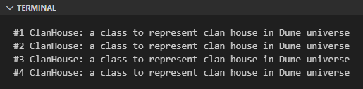

Pada chapter ini kita akan belajar tentang jenis method lain yang tersedia di Python, yaitu class method, serta perbedaannya dibanding instance method dan constructor.

## A.38.1. Pengenalan Class method

Class method adalah method yang pemiliknya adalah class dengan pengaksesan adalah via class, berbeda dibanding instance method yang diperuntukan untuk instance object. Jika instance method memiliki parameter `self` yang isinya adalah instance object, maka class method memiliki parameter `cls` yang isinya adalah tipe data class.

Jika dilihat dari segi deklarasinya, class method dan instance method memiliki perbedaan berikut:

- Instance method memiliki parameter pertama bernama `self`, dengan isi adalah instance object.
- Class method memiliki parameter pertama bernama `cls` yang merupakan alias dari class dimana method tersebut dideklarasikan (misalnya class method dideklarasikan dalam class `Car`, maka paramter `cls` berisi tipe data class `Car`).
- Selain perbedaan di atas, class method dideklariskan dengan menuliskan decorator `@classmethod`

> Pembahasan detail mengenai decorator dibahas pada chapter [Decorator](/basic/decorator)

Agar lebih jelas silakan pelajari kode berikut lalu praktekan. Disini sebuah class bernama `ClanHouse` dibuat dengan isi 3 buah fungsi:

- Constructor `__init__()` dengan overload parameter `name` dan `house`
- Class method `create()` digunakan untuk membuat instance object `ClassHouse`
- Instance method `info()` digunakan untuk menampilkan data `name` dan `house`

```python
class ClanHouse:

    def __init__(self, name = "", house = ""):
        self.name = name
        self.house = house

    @classmethod
    def create(cls):
        obj = cls()
        return obj

    def info(self):
        print(f"{self.name} of {self.house}")
```

Bisa dilihat perbedaan deklarasi instance method dan class method di contoh tersebut. Method `create()` memiliki parameter pertama `cls` yang merupakan alias untuk tipe data class `ClanHouse`. Lewat `cls`, dibuat sebuah instance object bernama `obj` kemudian dijadikan nilai balik method `create()`.

> Statement `obj = cls()` dalam method `create()` adalah ekuivalen dengan `obj = ClanHouse()`,<br />karena dalam method tersebut nilai `cls` adalah tipe data class dimana method dideklarasikan, yaitu `ClanHouse`

Selanjutnya, dari class `ClanHouse` akan dibuat 3 buah instance object berikut:

- Object `p1` dibuat menggunakan constructor
- Object `p2` dibuat menggunakan constructor juga, dengan parameter di-overload
- Object `p3` dibuat menggunakan class method `create()`. Class method tersebut diakses dari class, bisa dilihat dari syntax-nya yaitu `ClanHouse.create()`.

```python
p1 = ClanHouse()
p1.name = "Paul Atriedes"
p1.house = "House of Atriedes"
p1.info()
# output ➜ Paul Atriedes of House of Atriedes

p2 = ClanHouse("Lady Jessica", "Bene Gesserit")
p2.info()
# output ➜ Lady Jessica of Bene Gesserit

p3 = ClanHouse.create()
p3.name = "Baron Vladimir Harkonnen"
p3.house = "House of Harkonnen"
p3.info()
# output ➜ Baron Vladimir Harkonnen of House of Harkonnen
```

> Parameter `cls` bisa disebut dengan parameter *implicit* atau implisit karena kita tidak berinteraksi secara langsung saat pengisian nilai. Nilai `cls` otomatis terisi saat class method diakses.

## A.38.2. Class method parameter

Class method juga bisa memiliki parameter seperti umumnya fungsi. Jika pada instance method dan constructor parameter adalah ditulis setelah `self`, pada class method parameter ditulis setelah `cls`. Contoh:

```python
class ClanHouse:

    def __init__(self, name = "", house = ""):
        self.name = name
        self.house = house

    @classmethod
    def create(cls, name = "", house = ""):
        obj = cls()
        obj.name = name
        obj.house = house
        return obj

    def info(self):
        print(f"{self.name} of {self.house}")

p2 = ClanHouse("Lady Jessica", "Bene Gesserit")
p2.info()
# output ➜ Lady Jessica of Bene Gesserit

p4 = ClanHouse.create("Glossu Rabban", "House of Harkonnen")
p4.info()
# output ➜ Glossu Rabban of House of Harkonnen
```

Dari kode di atas bisa dilihat bahwa parameter `cls` milik class method diperlakukan mirip seperti parameter `self` milik constructor dan instance method.

- Pada saat pengaksesan instance method atau constructor, parameter `self` adalah diabaikan karena otomatis berisi instance object. 
- Sifat yang sama juga berlaku pada parameter `cls` pada class method. Saat diakses via class (contoh: `ClanHouse.create()`), parameter `cls` diabaikan.

Parameter `cls` pada method `create()` berisi tipe data class `ClanHouse`, dan pembuatan instance object selalu via pemanggilan nama class, maka dari sini pemanggilan `cls()` dalam method `create()` juga bisa diikuti dengan pengisian argument parameter.

Sebagai perbandingan, kedua bentuk pemanggilan constructor via `cls()` berikut adalah ekuivalen:

- Cara 1: variabel `cls` digunakan dipanggil sebagai constructor tanpa parameter

    ```python
    class ClanHouse:

        def __init__(self, name = "", house = ""):
            self.name = name
            self.house = house

        @classmethod
        def create(cls, name = "", house = ""):
            obj = cls()
            obj.name = name
            obj.house = house
            return obj
    ```

- Cara 2: variabel `cls` digunakan dipanggil sebagai constructor dengan diisi argument parameter

    ```python
    class ClanHouse:

        def __init__(self, name = "", house = ""):
            self.name = name
            self.house = house

        @classmethod
        def create(cls, name = "", house = ""):
            obj = cls(name, house)
            return obj
    ```

## A.38.3. Pengaksesan class method via instance object

Sampai sini penulis rasa bisa dipahami perbedaan cara pengaksesan antara instance method dan class method. Instance method diakses via instance object, dan class method diakses via class.

Selain cara tersebut, sebenarnya class method bisa juga diakses via instance object *lho*, dan hal seperti ini diperbolehkan penerapannya. Caranya bisa dilihat pada kode berikut:

```python
class ClanHouse:

    def __init__(self, name = "", house = ""):
        self.name = name
        self.house = house

    def info(self):
        print(f"{self.name} of {self.house}")

    @classmethod
    def create(cls, name = "", house = ""):
        obj = cls()
        obj.name = name
        obj.house = house
        return obj

p2 = ClanHouse("Lady Jessica", "Bene Gesserit")
p2.info()
# output ➜ Lady Jessica of Bene Gesserit

p4 = ClanHouse.create("Glossu Rabban", "House of Harkonnen")
p4.info()
# output ➜ Glossu Rabban of House of Harkonnen

p5 = p2.create("Irulan Corrino", "Corrino Empire")
p5.info()
# output ➜ Irulan Corrino of Corrino Empire
```

Dari kode di atas bisa dilihat perbedaan dari sisi pembuatan object dan pengaksesan method antara `p2` dan `p4`.

- Instance object `p2` dibuat via constructor `ClanHouse()`
- Instance object `p4` dibuat via class method `create()`
- Dari kedua object, diakses method `info()`

Yang menarik untuk dibahas adalah `p5`. Object `p5` dibuat dari pemanggilan class method `create()` namun pengaksesannya adalah via instance object `p2`. Penulisan seperti itu diperbolehkan. Parameter `cls` pada class method `create()` akan terisi dengan nilai tipe data class object `p2` (yaitu `ClanHouse`).

## A.38.4. Pengaksesan instance method via class

Jika class method bisa diakses via instance object, instance method juga bisa diakses via Class. Caranya cukup panggil instance method via class lalu isi parameter `self` dengan instance object. Contoh:

```python
p2 = ClanHouse("Lady Jessica", "Bene Gesserit")
ClanHouse.info(p2)
# output ➜ Lady Jessica of Bene Gesserit

p4 = ClanHouse.create("Glossu Rabban", "House of Harkonnen")
ClanHouse.info(p4)
# output ➜ Glossu Rabban of House of Harkonnen

p5 = p2.create("Irulan Corrino", "Corrino Empire")
ClanHouse.info(p5)
# output ➜ Irulan Corrino of Corrino Empire
```

Pengaksesan instance method via class mengharuskan parameter `self` milik method untuk diisi dengan object. Hal ini berbeda dibanding pengaksesan instance method via instance object dimana parameter `self` otomatis terisi nilai instance object.

## A.38.5. Pengaksesan class attribute via `cls`

Pada chapter sebelumnya, [OOP ➜ Instance Attribute & Class Attribute](/basic/instance-attribute-class-attribute), kita telah mempelajari tentang perbedaan instance attribute dibanding class attribute.

Class attribute bisa diakses via instance object maupun class. Dalam konteks class method dimana `cls` adalah berisi tipe data class, pengaksesan class attribute memungkinkan untuk dilakukan via variabel `cls`.

Contoh penerapannya bisa dilihat pada kode berikut:

```python
class ClanHouse:

    note = "ClanHouse: a class to represent clan house in Dune universe"

    def __init__(self, name = "", house = ""):
        self.name = name
        self.house = house

    @classmethod
    def create(cls, name = "", house = ""):
        print("#1", cls.note)

        obj = cls(name, house)
        print("#2", obj.note)

        return obj

p2 = ClanHouse.create("Lady Jessica", "Bene Gesserit")
print("#3", p2.note)

print("#4", ClanHouse.note)
```

Output program:



## A.38.6. Summary

Dari banyak hal yang telah dipelajari di chapter ini, secara garis besar perbedaan antara constructor, instance method, dan class method bisa dilihat di bawah ini:

### ◉ Constructor

- Fungsi dideklarasikan di dalam block `class`
- Deklarasinya menggunakan nama fungsi `__init__()`
- Parameter pertama harus `self`, berisi instance object
- Pemanggilan constructor mengembalikan instance object
- Pengaksesannya via pemanggilan nama class, contoh: `ClanHouse()`

### ◉ Instance method

- Fungsi dideklarasikan di dalam block `class`
- Parameter pertama harus `self`, berisi instance object
- Pengaksesan instance method:
  - Via instance object, contoh: `p2.info()`
  - Via class dengan menyisipkan instance object sebagai argument pemanggilan. contoh: `ClanHouse.info(p2)`

### ◉ Class method

- Fungsi dideklarasikan di dalam block `class`
- Fungsi memiliki decorator `@classmethod`
- Parameter pertama harus `cls`, berisi tipe data class
- Pengaksesan class method:
  - Via class, contoh: `ClanHouse.create()`
  - Via instance object, contoh: `p2.create()`

---

<div class="section-footnote">

## Catatan chapter 📑

### ◉ Source code praktik

<pre>
    <a href="https://github.com/novalagung/dasarpemrogramanpython-example/tree/master/class-method">
        github.com/novalagung/dasarpemrogramanpython-example/../class-method
    </a>
</pre>

### ◉ Chapter relevan lainnya

- [OOP ➜ Class & Object](/basic/class-object)
- [OOP ➜ Instance Method](/basic/instance-method)
- [OOP ➜ Constructor](/basic/class-constructor)
- [OOP ➜ Static Method](/basic/static-method)
- [Function ➜ Decorator](/basic/decorator)
- [OOP ➜ Abstract Method](/basic/abstract-method)

### ◉ Referensi

- https://docs.python.org/3/tutorial/classes.html

</div>
