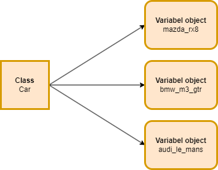
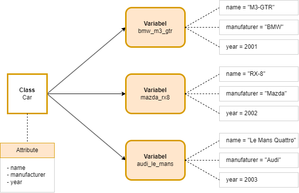

Python mendukung paradigma pemrograman berbasis objek (OOP) melalui implementasi Class dan Object API. Pada bab ini, kita akan mempelajari konsep dasar beserta penerapannya.

> Pembahasan OOP pada ebook ini lebih fokus pada pengaplikasiannya di Python. Jadi pembahasan teorinya tidak terlalu banyak.

## A.33.1. Pengenalan Class

Class adalah *blueprint* untuk membuat variabel, class bisa diartikan juga sebagai tipe data. Di Python, setiap data pasti memiliki tipe data yang tipe tersebut merupakan adalah class. Sebagai contoh:

- Data string `"noval"` tipe datanya adalah class `str`
- Data numerik `24` tipe datanya adalah class `int`
- Data floating point `3.1567` tipe datanya adalah class `float`
- ... dan lainnya

Selain menggunakan class-class yang tersedia di Python Standard Library, kita bisa membuat custom class via keyword `class`. Topik custom class ini merupakan inti pembahasan chapter ini.

Custom class (atau cukup class) digunakan untuk membuat variabel object. Cara termudah memahami hubungan antara class dan objek adalah melalui analogi berikut: dimisalkan ada sebuah class bernama `Car`, class tersebut kemudian digunakan untuk mendeklarasikan tiga buah variabel bernama `bmw_m3_gtr`, `mazda_rx8`, dan `audi_le_mans`. Ketiga object tipe datanya adalah class `Car`.



Deklarasi class dilakukan dengan menggunakan keyword `class` diikuti oleh nama class yang diinginkan. Lalu di dalam block class tersebut perlu dideklarasikan suatu fungsi dengan skema `__init__(self)` dengan isi body fungsi adalah deklarasi attribute. Contohnya:

```python
class Car:
    def __init__(self):
        self.name = ""
        self.manufacturer = ""
        self.year = 0
```

Pada contoh di atas, class `Car` memiliki tiga attribute: `name`, `manufacturer`, dan `year`. Nantinya, variabel objek yang dibuat dari class tersebut akan memiliki tiga atribut sesuai dengan yang dideklarasikan.

> Fungsi `__init__(self)` disebut dengan method konstruktor. Pembahasan detail mengenai konstruktor ada di chapter [Class ➜ Constructor](#)

### ◉ Deklarasi class tanpa attribute

Dengan menggunakan keyword `pass`, suatu class bisa dideklarasikan tanpa memiliki attribute. Contoh penerapannya:

```python
class Car:
    def __init__(self):
        pass
```

Atau dapat juga ditulis seperti ini:

```python
class Car:
    pass
```

> Pembahasan detail mengenai keyword `pass` ada di chapter [Function section Keyword pass](/basic/function#a225-keyword-pass)

## A.33.2. Naming convention class

Berdasarkan dokumentasi [PEP 8 – Style Guide for Python Code](https://peps.python.org/pep-0008/), disarankan untuk menulis nama class dalam bentuk TitleCase, contoh: `FavoriteFood`.

## A.33.3. Pembuatan Instance object

Object (atau instance object) adalah variabel yang dibuat dari class. Cara pembuatan object adalah dengan memanggil nama class diikuti oleh tanda kurung fungsi `()` (seperti pemanggilan fungsi). Statement tersebut mengembalikan nilai balik berupa object baru yang bertipe data sesuai dengan class yang digunakan.

> Ada banyak istilah lain yang merujuk pada variabel objek, seperti *instance*, *instance variable*, *instance object*, dan lainnya. Namun tidak usah bingung, karena semua istilah tersebut memiliki makna yang sama.

Contoh deklarasi class `Person` beserta pembuatan variabel object bernama `person1`:

```python
class Person:
    def __init__(self):
        self.first_name = ""
        self.last_name = ""

person1 = Person()
print(f"instance object: {person1}")
print(f"type: {type(person1)}")
```

Penjelasan:

- Class `Person` dideklarasikan dengan dua atribut, yaitu `first_name` dan `last_name`.
- Class `Person` dipanggil seperti pemanggilan fungsi (menggunakan sintaks `Person()`) dan menghasilkan variabel objek baru bertipe `Person`, yang kemudian ditampung dalam variabel `person1`.

Output program:


Dari output program, terlihat bahwa tipe data variabel `person1` adalah class `__main__.Person`. Syntax tersebut artinya adalah tipe data class `Person` yang deklarasinya ada di file `__main__` atau file entrypoint eksekusi program.

Contoh lainnya pembuatan instance object dari class class `Car`:

```python
class Car:
    def __init__(self):
        self.name = ""
        self.manufacturer = ""
        self.year = 0

car1 = Car()
car2 = Car()
car3 = Car()
```

## A.33.4. Instance Attribute

Salah satu property class adalah attribute. Attribute adalah variabel yang terasosiasi dengan class, jadi dalam pengaksesannya harus dilakukan melalui class dan/atau instance object.

Sebelumnya, kita telah membuat class bernama `Car` yang memiliki 3 attribute:

- `name` untuk menyimpan informasi nama/seri mobil
- `manufacturer` untuk menyimpan informasi manufaktur atau pembuat mobil
- `year` untuk menyimpan informasi tahun rilis mobil

Attribute sebenarnya ada 2 jenis, yaitu instance attribute dan class attribute. **Yang sedang kita pelajari di chapter ini adalah instance attribute.**

> Perbedaan mendetail antara instance attribute vs class attribute ada di chapter [Class ➜ Class Attribute & Method](#)

Cara deklarasi instance attribute mirip dengan deklarasi variabel, perbedaannya pada penulisannya diawali dengan `self.`. Selain itu deklarasinya harus berada di dalam body fungsi `__init__(self)`.

Untuk mengakses instance attribute, kita dapat melakukannya melalui variabel objek yang dibuat dari class dengan notasi pengaksesan: `<object>.<attribute>`.

Contoh:

```python
class Car:
    def __init__(self):
        self.name = ""
        self.manufacturer = ""
        self.year = 0

car1 = Car()
print(f"car1 name: {car1.name}")
print(f"car1 manufacturer: {car1.manufacturer}")
print(f"car1 year: {car1.year}")
```


Saat di-print, dapat dilihat bahwa semua nilai instance attribute milik `car1` sesuai dengan nilai default yang ditentukan saat deklarasi attribute dalam fungsi `__init__(self)`, yaitu: string kosong `""` untuk attribute `name` & `manufacturer`, dan `0` untuk attribute `year`.

Langkah berikutnya, mari buat tiga buah variabel object dari class `Car` dan isi instance attribute-nya dengan suatu nilai. Tiga variabel yang perlu dibuat adalah `bmw_m3_gtr`, `mazda_rx8`, dan `audi_le_mans`.



Bentuk penerapannya dalam kode Python kurang lebih seperti ini:

```python
car1 = Car()
car1.name = "M3 GTR"
car1.manufacturer = "BMW"
car1.year = 2001
print(f"Car name: {car1.manufacturer} {car1.name}\nYear released: {car1.year}\n")

car2 = Car()
car2.name = "RX-8"
car2.manufacturer = "Mazda"
car2.year = 2002
print(f"Car name: {car2.manufacturer} {car2.name}\nYear released: {car2.year}\n")

car3 = Car()
car3.name = "Le Mans Quattro"
car3.manufacturer = "Audi"
car3.year = 2003
print(f"Car name: {car3.manufacturer} {car3.name}\nYear released: {car3.year}\n")
```

Jalankan program untuk melihat outputnya:


> Class jika dilihat dari strukturnya memiliki kesamaan dengan dictionary. Class mempunyai attribute name dan value, sementara dictionary memiliki key dan value. 
>
> Perbedaan utama dari keduanya adalah pada dictionary key-nya bisa dikelola secara dinamis, sedangkan pada class nama attribute-nya adalah fixed.

## A.33.5. Pengecekan instance object

Fungsi `isinstance()` cukup berguna untuk mengecek apakah suatu instance object tipe datanya adalah class tertentu atau class yang meng-*inherit* class tertentu.

Misalnya, variabel `car1` di atas kita cek apakah tipe data nya adalah class `Car`. Cara penggunaannya cukup panggil fungsi `isinstance()` lalu sertakan variabel object yang ingin dicek sebagai argument pertama dan tipe data class sebagai argument ke-dua.

```python
car1 = Car()
car1.name = "M3 GTR"
car1.manufacturer = "BMW"
car1.year = 2001

if isinstance(car1, Car):
    print(f"car1 class is Car")
# output ➜ car1 class is Car
```

## A.33.6. Class turunan `object`

Setiap class yang ada di Python baik itu class bawaan Python Standard Library ataupun custom class, secara otomatis adalah turunan dari class bernama `object`.

Jadi, class `str`, `float`, custom class `Car` yang telah dibuat, dan lainnya, kesemua class-nya adalah turunan dari class `object`.

Silakan cek menggunakan fungsi `isinstance()` untuk membuktikannya:

```python
data1 = Car()
if isinstance(data1, Car):
    print(f"data1 class inherit from Car")
if isinstance(data1, object):
    print(f"data1 class inherit from object")

data2 = "Noval Agung"
if isinstance(data2, str):
    print(f"data2 class inherit from str")
if isinstance(data2, object):
    print(f"data2 class inherit from object")

# output ↓
#
# data1 class inherit from Car
# data1 class inherit from object
# data2 class inherit from str
# data2 class inherit from object
```

> Pembahasan detail mengenai class inheritance ada di chapter [OOP ➜ Class Inheritance](/basic/class-inheritance)

---

<div class="section-footnote">

## Catatan chapter 📑

### ◉ Source code praktik

<pre>
    <a href="https://github.com/novalagung/dasarpemrogramanpython-example/tree/master/class-object">
        github.com/novalagung/dasarpemrogramanpython-example/../class-object
    </a>
</pre>

### ◉ Chapter relevan lainnya

- [OOP ➜ Instance Method](/basic/instance-method)
- [OOP ➜ Constructor](/basic/class-constructor)
- [OOP ➜ Property Visibility](/basic/property-visibility)
- [OOP ➜ Instance Attribute & Class Attribute](/basic/instance-attribute-class-attribute)
- [OOP ➜ Class Method](/basic/class-method)
- [OOP ➜ Static Method](/basic/static-method)
- [OOP ➜ Class Inheritance](/basic/class-inheritance)
- [OOP ➜ Abstract Method](/basic/abstract-method)
- [OOP ➜ Data Class](/basic/dataclass)

### ◉ Referensi

- https://docs.python.org/3/tutorial/classes.html

</div>
