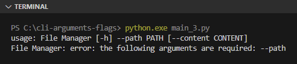

Chapter ini membahas tentang pengaksean CLI argument eksekusi program Python. Yang dimaksud dengan argument adalah apapun yang ditulis setelah command `python` (atau `python.exe` di Windows). Umumnya program yang dibuat untuk keperluan tooling ataupun utility lainnya banyak memanfaatkan *command line interface* arguments ini.

Python mengenal 2 jenis CLI arguments, yaitu raw arguments (atau cukup arguments) dan flags, keduanya dibahas di sini.

## A.50.1. CLI arguments `sys.argv`

Data CLI argument eksekusi program bisa diakses via `sys.argv`. Variabel `sys.argv` ini berisi data argument bertipe string tersimpan dalam list. 

> Dalam penggunaannya module `sys` harus di-import terlebih dahulu

Misalnya, pada command berikut ini, pengaksesan variabel `sys.argv` menghasilkan data `["main.py"]`, karena `main.py` merupakan CLI argument yang ditulis setelah command `python`/`python.exe`.

```bash
python main.py
```

Argument bisa saja ada banyak, misalnya pada kode berikut terdapat 3 argument, `main.py`, `sesuk`, dan `prei`. Penulisan banyak argument ditandai dengan pembatas karakter spasi.

```bash
python main.py sesuk prei
```

Mengenai command `python` sendiri, dia hanya membutuhkan informasi argument pertama saja untuk menentukan file mana yang akan dieksekusi. Argument ke-2, ke-3, dan seterusnya tidak dibutuhkan oleh command `python`, tetapi tetap bisa dipergunakan untuk keperluan lainnya.

Silakan coba tulis kode berikut kemudian run program-nya menggunakan command di bawahnya.

```python
import sys

if __name__ == "__main__":
    print(f"type: {type(sys.argv).__name__}")
    print(f"len:  {len(sys.argv)}")

    for arg in sys.argv:
        print(f" ➜  {arg}")
```

Command eksekusi program:

```bash
python.exe main_1.py
python.exe main_1.py hello python
python.exe main_1.py "hello python" 24562 😊 True
```

Output program:


Silakan lihat perbandingan antara command dengan output. Pada command ke-2, `hello` dan `python` merupakan dua argument berbeda, sedangkan pada command ke-3, `hello python` adalah satu argument karena penulisannya diapit tanda literal string (`"`).

Semua argument, baik itu angka, emoji, ataupun karakter unicode lainnya akan ditampung sebagai elemen list bertipe string di `sys.argv`.

### ◉ Best practice pengaksesan argument

`sys.argv` merupakan list, maka pengaksesan element tertentu yang index-nya diluar kapasitas adalah menghasilkan error. Karena alasan ini ada baiknya untuk berhati-hati dalam mengakses argument di index tertentu pada variabel tersebut, pastikan untuk menambahkan seleksi kondisi terlebih dahulu untuk mengecek apakah index dari element yang dicari masih dalam kapasitas.

Salah satu solusi aman bisa dengan membuat fungsi terpisah untuk pengaksesan argument, contohnya bisa dilihat pada kode berikut dimana jika argument yang dicari tidak ada, maka nilai `None` dikembalikan. Metode ini lebih efisien.

```python
import sys

def get_arg(index):
    if len(sys.argv) > index:
        return sys.argv[index]
    else:
        return None

if __name__ == "__main__":
    print(f"type: {type(sys.argv).__name__}")
    print(f"len:  {len(sys.argv)}")
    
    print(f"arg1: {get_arg(0)}")
    print(f"arg2: {get_arg(1)}")
    print(f"arg3: {get_arg(2)}")
    print(f"arg4: {get_arg(3)}")
    print(f"arg5: {get_arg(4)}")
```

Output program:


## A.50.2. CLI flags `argparse`

Flags adalah istilah untuk argument dengan label. Contohnya seperti `python main.py --name Noval` adalah contoh pengaplikasian flag, dengan label adalah `--name` berisi data string `Noval`.

Python menyediakan module `argparse` berisi banyak API untuk keperluan operasi flag argument.

Untuk menerapkan flag, sebuah object parser perlu dibuat menggunakan `argparse.ArgumentParser()`, dengan isi parameter adalah informasi program (seperti nama dan deskripsi). Kemudian dari object tersebut, didaftarkan beberapa flag argument (misalnya `--name`) beserta property-nya. Lalu di akhir, method `parse_args()` wajib ditulis dan pengaksesan nilai flag dilakukan dari object kembalian method tersebut.

Program di bawah ini berisi peneprapan flag argument untuk program sederhana yang kegunaannya untuk pembuatan file. Nama dan path file beserta isinya dikontrol via CLI flag.

```python
import argparse

def main():
    parser = argparse.ArgumentParser(
        prog='File Manager',
        description='Managing file easily'
    )

    parser.add_argument("--path", help="path of the file/folder", default="file.txt", required=True)
    parser.add_argument("--content", help="content of the file", default="")
    args = parser.parse_args()

    with open(args.path, 'a') as f:
        f.write(args.content)

if __name__ == "__main__":
    main()
```

Coba jalankan program di atas dengan perintah standar `python main.py`. Outpunya:



Error muncul, karena ada salah satu flag yang di-setting untuk wajib diisi, yaitu `--path`. Bisa dilihat pada statement `parser.add_argument("--path", ...)` di atas, disitu parameter `required` di-isi dengan `True`, menjadikan pemanggilan program tanpa flag ini memunculkan error.

Untuk melihat flag apa saja yang tersedia, gunakan flag `--help` atau `-h`. Dengan flag tersebut, informasi nama program dan flag yang tersedia dimunculkan.


Sekarang coba jalankan command dengan disertai isi flag `--path` dan `--content`. Program akan berjalan sesuai desain. File terbuat dengan isi sesuai nilai flag `--content`.

```bash
python main.py --path "./file.txt" --content "hello python"
cat file.txt
```


Kembali ke bagian deklarasi flag menggunakan `parser.add_argument()`, dalam pembuatannya ada beberapa konfigurasi yang bisa dimanfaatkan sesuai kebutuhan, diantaranya:

| Parameter | Keterangan |
| :- | :- |
| Positional param | Diisi dengan nama flag, umumnya menggunakan notasi `--nama` untuk flag dengan label kata atau frasa, dan `-n` saja untuk huruf. Keduanya juga bisa digunakan bersamaan, misalnya `parser.add_argument("--path", "-p", ...)` baru setelahnya diikuti keyword argument. |
| Keyword param `help` | Diisi dengan informasi keterangan flag. Nantinya muncul saat `--help` digunakan. |
| Keyword param `default` | Diisi dengan nilai default flag ketika tidak ditulis nilainya secara explicit. |
| Keyword&nbsp;param&nbsp;`required` | Penanda apakah flag wajib diisi atau opsional. Jika diisi `True` maka wajib untuk diisi dan memunculkan error jika tidak diisi |
| Keyword&nbsp;param&nbsp;`choices` | Jika diisi dengan nilai list, maka element list menjadi opsi pengisian flag. Jika saat pemanggilan flag diisi dengan nilai yang tidak ada di list maka error muncul. |

> Selain parameter di atas, ada juga beberapa lainnya. Selengkapnya bisa cek di halaman dokumentasi https://docs.python.org/3/library/argparse.html 

Ok, agar makin paham, mari praktek lagi dengan memodifikasi program sebelumnya menjadi seperti ini:

```python
def main():
    parser = argparse.ArgumentParser(
        prog='File Manager',
        description='Managing file easily'
    )

    parser.add_argument("--operation-mode", "-op", help="choose operation", choices=["write file", "list items"], required=True)
    parser.add_argument("--path", "-p", help="path of the file/folder", default=".", required=True)
    parser.add_argument("--content", "-c", help="content of the file", default="")
    args = parser.parse_args()

    if args.operation_mode == "write file":
        with open(args.path, 'a') as f:
            f.write(args.content)

    elif args.operation_mode == "list items":
        for f in glob.glob(f"{args.path}/**", recursive=True):
            print(f)

if __name__ == "__main__":
    main()
```

Perbedaan program terbaru dibanding sebelumnya:
- Flag baru ditambahkan bernama `--operation-mode` atau `-op`, flag ini yang wajib diisi nilai `write file` atau `list items`.
- Flag `--path` dibuatkan *shorthand*-nya yaitu `-p`.
- Flag `--content` dibuatkan *shorthand*-nya yaitu `-c`.
- Ketika flag `-op` bernilai `write file`, maka program melakukan penulisan konten dengan isi dan tujuan file sesuai dengan nilai flag saat eksekusi.
- Ketika flag `-op` bernilai `list items`, maka program menampilkan list files/folders pada path yang ditentukan via flag `--path`. 

O iya, perlu diketahui bahwa ketika flag labelnya adalah frasa dan menggunakan karakter `-` sebagai pembatas kata, maka pengaksesannya menggunakan pembatas `_`. Contohnya bisa dilihat pada flag `--operation-mode` yang pengaksesan nilainya dilakukan via `args.operation_mode`.

Jalankan program dengan 3 perintah berikut lalu lihat outputnya:

```python
python.exe main_4.py --help
python.exe main_4.py --op "write file" -p "./file.txt" -c "hello python"
python.exe main_4.py --op "list items" -p "./"
```

Output program:


---

<div class="section-footnote">

## Catatan chapter 📑

### ◉ Source code praktik

<pre>
    <a href="https://github.com/novalagung/dasarpemrogramanpython-example/tree/master/cli-arguments-flags">
        github.com/novalagung/dasarpemrogramanpython-example/../cli-arguments-flags
    </a>
</pre>

### ◉ Chapter relevan lainnya

- [File I/O](/basic/file)

### ◉ TBA

- Flag without value https://stackoverflow.com/questions/8259001/python-argparse-command-line-flags-without-arguments

### ◉ Referensi

- https://docs.python.org/3/library/argparse.html
- https://stackoverflow.com/questions/35603729/difference-between-single-dash-and-double-dash-in-argparse

</div>
