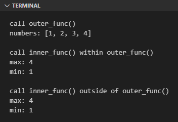

Closure adalah istilah umum dalam programming untuk deklarasi fungsi yang berada di dalam fungsi (*nested function*). Pada chapter ini kita akan mempelajari cara implementasinya.

## A.25.1. Pengenalan Closure

Di Python, fungsi bisa dideklarasikan di-dalam suatu fungsi. Penerapannya cukup berguna pada kasus dimana ada blok kode yang perlu di-eksekusi lebih dari satu kali tetapi eksekusinya hanya di dalam fungsi tertentu, atau eksekusinya setelah pemanggilan fungsi tertentu.

Permisalan ada fungsi `inner()` yang dideklarasikan di dalam fungsi `outer()`, maka:

- Fungsi `inner()` bisa diakses dari dalam fungsi `outer()`
- Fungsi `inner()` juga bisa diakses dari luar fungsi `outer()` asalkan fungsi `inner()` tersebut dijadikan sebagai nilai balik fungsi `outer()` (untuk kemudian ditampung ke dalam variabel lalu dieksekusi)

Program berikut berisi contoh praktis tentang fungsi `inner()` dan `outer()`. Silakan pelajari dan praktekan.

```python
def outer_func(numbers = []):
    print(f"numbers: {numbers}")

    def inner_func():
        print(f"max: {max(numbers)}")
        print(f"min: {min(numbers)}")

    print("call inner_func() within outer_func()")
    inner_func()

    return inner_func

print("call outer_func()")
f = outer_func([1, 2, 3, 4])

print("call inner_func() outside of outer_func()")
f()
```

Output program:



Program di atas jika di-breakdown sesuai urutan eksekusi statement-nya kurang lebih seperti ini:

- Tahap 1: eksekusi statement `print("call outer_func()")`
- Tahap 2: eksekusi statement `print(f"numbers: {numbers}")`
- Tahap 3: eksekusi statement `print("call inner_func() within outer_func()")`
- Tahap 4: eksekusi statement `inner_func()`
  - Tahap 4.A. eksekusi statement `print(f"max: {max(numbers)}")`
  - Tahap 4.B. eksekusi statement `print(f"min: {min(numbers)}")`
- Tahap 5: eksekusi statement `print("call inner_func() outside of outer_func()")`
- Tahap 6: eksekusi statement `inner_func()` via `f()` dari luar fungsi `outer_func()`
  - Tahap 6.A. eksekusi statement `print(f"max: {max(numbers)}")`
  - Tahap 6.B. eksekusi statement `print(f"min: {min(numbers)}")`

Jika di-*flatten* semua statement-nya maka programnya menjadi seperti ini:

```python
print("call outer_func()")
numbers = [1, 2, 3, 4]
print(f"numbers: {numbers}")

print("call inner_func() within outer_func()")
print(f"max: {max(numbers)}")
print(f"min: {min(numbers)}")

print("call inner_func() outside of outer_func()")
print(f"max: {max(numbers)}")
print(f"min: {min(numbers)}")
```

### ◉ Fungsi `min()` & `max()`

Kedua fungsi ini digunakan untuk menghitung agregasi data numerik.

- Fungsi `min()` untuk pencarian nilai minimum dari data list yang berisi elemen data numerik.<br />Contoh `min([3, 4, 1, 2, 3, 4])` menghasilkan data `1`.

- Fungsi `max()` untuk pencarian nilai maksimum dari data list yang berisi elemen data numerik.<br />Contoh `max([3, 4, 1, 2, 3, 4])` menghasilkan data `4`.

## A.25.2. Menampung fungsi dalam variabel

Pada contoh sebelumnya, fungsi `inner_func()` ditampung ke variabel bernama `f` via nilai balik pemanggilan fungsi `outer_func()`. Dari sini terlihat bahwa closure bisa disimpan ke variabel.

Tidak hanya closure, fungsi biasa-pun juga bisa disimpan dalam variabel, contohnya ada pada fungsi `print_all()` berikut yang disimpan pada variabel `display` untuk kemudian di-eksekusi.

```python
def print_all(message, *numbers, **others):
    print(f"message: {message}")
    print(f"numbers: {numbers}")
    print(f"others: {others}")

display = print_all
display("hello world", 1, 2, 3, 4, name="nokia 3310", discontinued=True, year_released=2000)
# output ↓
#
# message: hello world
# numbers: (1, 2, 3, 4)
# others: {'name': 'nokia 3310', 'discontinued': True, 'year_released': 2000}
```

## A.25.3. Fungsi sebagai argument parameter

Selain disimpan dalam variabel, fungsi/closure bisa juga dijadikan sebagai nilai argument suatu parameter fungsi. Metode seperti ini cukup sering digunakan terutama pada operasi data sequence atau agregasi data numerik.

Contoh penerapan fungsi/closure sebagai argument pemanggilan fungsi bisa dilihat pada kode berikut ini. Silakan coba dan pelajari, penjelasannya ada dibawah kode.

```python
def aggregate(message, numbers, f):
    res = f(numbers)
    print(f"{message} is {res}")

def sum(numbers):
    total = 0
    for n in numbers:
        total += n
    return total

def avg(numbers):
    total = 0
    for n in numbers:
        total += n
    return total / len(numbers)

aggregate("total", [24, 67, 22, 98, 3, 50], sum)
# output ➜ total is 264

aggregate("average", [24, 67, 22, 98, 3, 50], avg)
# output ➜ average is 44.0

aggregate("max number", [24, 67, 22, 98, 3, 50], max)
# output ➜ max number is 98

aggregate("min number", [24, 67, 22, 98, 3, 50], min)
# output ➜ min number is 3
```

Fungsi `aggregate()` dideklarasikan memiliki 3 buah parameter yaitu `message`, `numbers`, dan `f` dimana `f` adalah akan diisi dengan fungsi/closure. Di dalam fungsi `aggregate()`, fungsi `f` dipanggil dengan disisipkan argument yaitu `numbers` dalam pemanggilannya.

Ada juga fungsi `sum()` dideklarasikan dengan tugas untuk menghitung total dari data list numerik `numbers`. Dan fungsi `avg()` untuk nilai rata-rata dari data `numbers`.

Kemudian di bawahnya ada 4 buah statement pemanggilan fungsi `aggregate()`:

- Pemanggilan ke-1 adalah perhitungan nilai total `numbers`. Fungsi `sum` yang telah dideklarasikan sebelumnya dijadikan sebagai argument pemanggilan fungsi `aggregate()` untuk ditampung di parameter `f`.
- Pemanggilan ke-2 adalah perhitungan nilai rata-rata dimana fungsi `avg` yang telah dideklarasikan dijadikan sebagai argument pemanggilan fungsi `aggregate()`..
- Pemanggilan ke-3 adalah perhitungan nilai maksimum. Fungsi `max` yang merupakan fungsi bawaan Python digunakan sebagai argument pemanggilan fungsi `aggregate()`.
- Pemanggilan ke-1 adalah perhitungan nilai minimum. Fungsi `min` yang merupakan fungsi bawaan Python digunakan sebagai argument pemanggilan fungsi `aggregate()`.

Dari contoh terlihat bagaimana contoh penerapan closure sebagai nilai argument parameter fungsi. Fungsi atau closure bisa digunakan sebagai nilai argument, dengan catatan skema parameter-nya harus disesuaikan dengan kebutuhan.

Di dalam fungsi `aggregate()`, closure `f` diharapkan untuk memiliki parameter yang bisa menampung data list `numbers`. Selama fungsi/closure memenuhi kriteria ini maka penggunaannya tidak menghasilkan error.

---

<div class="section-footnote">

## Catatan chapter 📑

### ◉ Source code praktik

<pre>
    <a href="https://github.com/novalagung/dasarpemrogramanpython-example/tree/master/args-kwargs">
        github.com/novalagung/dasarpemrogramanpython-example/../args-kwargs
    </a>
</pre>

### ◉ Chapter relevan lainnya

- [Function](/basic/function)
- [Function ➜ Positional, Optional, Keyword Arguments](/basic/positional-optional-keyword-argument)
- [Function ➜ Args & Kwargs](/basic/args-kwargs)
- [Function ➜ Lambda](/basic/lambda)

### ◉ Referensi

- https://docs.python.org/3/library/stdtypes.html#functions

</div>
