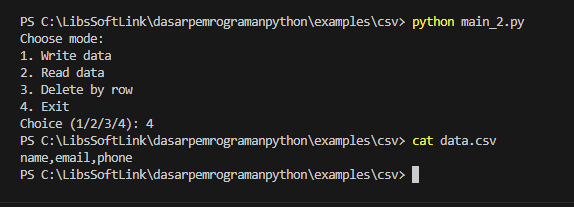
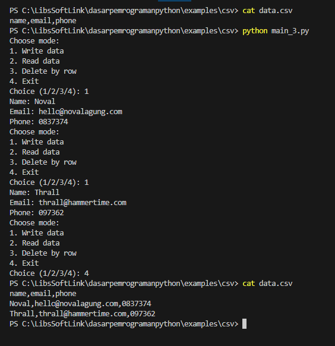
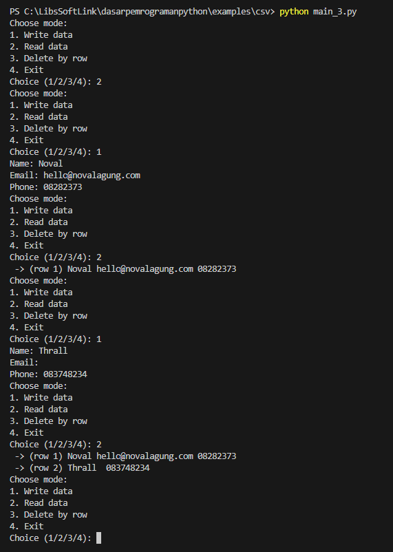
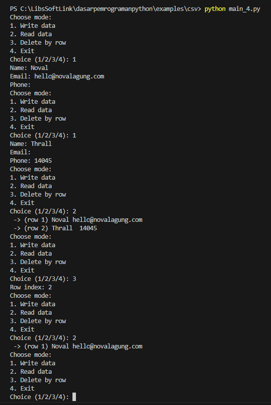

Pada chapter ini kita akan belajar tentang penggunaan Python untuk membaca dan mengelola data CSV.

:::info

CSV sendiri merupakan suatu format data yang sangat populer digunakan untuk menyimpan data berbasis tabular. Struktur isi CSV kurang lebih seperti ini:

```csv
name,email,phone
Noval,hello@novalagung.com,087877665
John Doe,john@doe.com,
Garrosh Hellscream,,098878212
```

Penjelasan singkat tentang CSV:
- Baris pertama umumnya berisi informasi header, atau nama kolom.
- Di contoh di atas, ada 3 buah header, yaitu `name`, `email`, dan `phone`.
- Tanda koma *default*-nya digunakan sebagai pembatas data dan kolom.
- Setiap baris data ditandai dengan *newline* atau baris baru. Umumnya data dimulai pada baris ke-2.
- Di setiap baris, data ditulis sesuai urutan header menggunakan pembatas tanda koma.
- Bisa saja ada data yang isinya tidak lengkap, misalnya di contoh data ke-2 tidak memiliki data `phone`, dan data ke-3 tidak memiliki data `email`.

:::

## A.51.1. Implementasi CSV di Python

Python menyediakan beberapa API untuk berinteraksi dengan data CSV, ada `csv.DictWriter()` dan `csv.writer()` untuk operasi tulis data, dan `csv.DictReader()` dan `csv.reader()` untuk operasi baca data.

Pembelajaran pada chapter ini dilakukan lewat pembuatan program sederhana yang mengakomodir operasi create, read, dan delete data.

Sebelum mulai, silakan siapkan project baru dengan isi sebuah file `main.py` berisi kode berikut:

```python
def control_flow():
    while True:
        print("Choose mode:")
        print("1. Write data")
        print("2. Read data")
        print("3. Delete by row")
        print("4. Exit")

        mode = input('Choice (1/2/3/4): ')
        if mode == '1':
            pass # to be replaced
        elif mode == '2':
            pass # to be replaced
        elif mode == '3':
            pass # to be replaced
        elif mode == '4':
            break
        else:
            print('Invalid mode')

def main():
    control_flow()

if __name__ == '__main__':
    main()
```

Program yang dibuat adalah aplikasi CLI interaktif, dimana user bisa berinteraksi dengan program sesuai pilihan mode. Ada 4 buah mode:

1. Insert data (ke file CSV)
2. Read data (dari file CSV)
3. Delete data berdasarkan index
4. Exit program

Selanjutnya, program dimodifikasi dengan penambahan implementasi untuk masing-masing mode.

## A.51.2. Insert data CSV

Sebuah file CSV akan dibuat dan difungsikan sebagai *database* untuk penyimpanan data yang di-insert via program. File CSV berisi 3 buah kolom data point:

- Name
- Email
- Phone

Pertama, buka file dimana kode ditulis, lalu tambahkan kode berikut di awal program:

```python
import csv

filename = 'data.csv'
fieldnames = ['name', 'email', 'phone']

def prepare_csv():
    with open(filename, 'w', newline='') as f:
        writer = csv.DictWriter(f, fieldnames=fieldnames)
        writer.writeheader()

# ...
```

Fungsi `prepare_csv()` bertugas untuk membuat file csv bernama `data.csv` dengan isi kosong. Di dalam fungsi tersebut proses berikut dilakukan:

- Fungsi `open()` membuka file `data.csv` dengan mode tulis (`w`). Disitu parameter opsional `newline` diisi dengan string kosong agar di akhir file tidak dituliskan baris baru.
- Fungsi `csv.DictWriter()` parameter pertama diisi object file, dan parameter `fieldnames` diisi informasi header dalam bentuk list.
- Method `writeheader()` milik object writer digunakan untuk menulis header ke file.

Sekarang fokus ke fungsi `main()`, panggil fungsi `prepare_csv()` yang telah dibuat. Kode fungsi `main()` setelah perubahan menjadi seperti ini:

```python
def main():
    prepare_csv()
    control_flow()
```

Coba jalankan program, lalu cek isi file `data.csv` untuk memastikan operasi penulisan header berjalan sesuai seharusnya.

Output program:



Selanjutnya, buat lagi fungsi baru bernama `write_data()`, gunanya untuk penulisan data `name`, `email`, dan `phone` ke file `data.csv`.

```python
def write_data(name, email, phone):
    with open(filename, 'a', newline='') as f:
        writer = csv.DictWriter(f, fieldnames=fieldnames)
        writer.writerow({
            'name': name,
            'email': email,
            'phone': phone
        })
```

Untuk menulis data CSV, cara awalnya kurang lebih sama, yaitu object file dibuat dulu menggunakan fungsi `open()` kemudian dimasukan ke `csv.DictWriter()`. Selain itu, ada beberapa perbedaan dibanding kode sebelumnya:

- Disini file dibuka menggunakan mode append (`a`). Hal ini agar header yang sudah ditulis di file tidak hilang.
- Method `writerow()` milik writer digunakan untuk pengisian data. Penggunaannya mengharuskan data untuk diformat dalam bentuk dictionary.

Data yang bisa dituliskan ke CSV adalah `int`, `float`, dan `str`. Jika ada tipe data lain yang perlu disimpan di CSV, harus dikonversi ke format yang kompatibel terlebih dahulu, misalnya `str`.

Selanjutnya, pada fungsi `control_flow()` pada seleksi kondisi `mode == 1` ganti statement `pass` dengan kode baru yang meminta 3 inputan dari user kemudian menggunakannya sebagai argument pemanggilan fungsi `write_data()`.

```python
def control_flow():
    while True:
        print("Choose mode:")
        print("1. Write data")
        print("2. Read data")
        print("3. Delete by row")
        print("4. Exit")

        mode = input('Choice (1/2/3/4): ')
        if mode == '1':
            name = input("Name: ")
            email = input("Email: ")
            phone = input("Phone: ")
            write_data(name, email, phone)
        elif mode == '2':
            pass # to be replaced
        elif mode == '3':
            pass # to be replaced
        elif mode == '4':
            break
        else:
            print('Invalid mode')
```

Jalankan program lalu coba test fungsionalitasnya dengan insert beberapa data. Bisa dilihat pada contoh eksekusi program berikut, file CSV berisi data sesuai operasi insert saat eksekusi program.



## A.51.3. Read data CSV

Operasi baca data dilakukan via fungsi `csv.DictReader()` dengan argument parameter adalah object file. Lewat object reader, gunakan fungsi `enumerate()` untuk membungkusnya lalu lakukan iterasi menggunakan keyword `for`. Lebih jelasnya silakan lihat kode `read_data()` berikut, dan tak lupa tambahkan ke program.

```python
def read_data():
    with open(filename, 'r') as csvfile:
        reader = csv.DictReader(csvfile)
        for index, row in enumerate(reader):
            print(" ->", f"(row {index + 1})", row['name'], row['email'], row['phone'])
```

Di fungsi `control_flow()` panggil fungsi `read_data()` pada block seleksi kondisi `mode == 2`.

```python
def control_flow():
    while True:
        print("Choose mode:")
        print("1. Write data")
        print("2. Read data")
        print("3. Delete by row")
        print("4. Exit")

        mode = input('Choice (1/2/3/4): ')
        if mode == '1':
            name = input("Name: ")
            email = input("Email: ")
            phone = input("Phone: ")
            write_data(name, email, phone)
        elif mode == '2':
            read_data()
        elif mode == '3':
            pass # to be replaced
        elif mode == '4':
            break
        else:
            print('Invalid mode')
```

Sekarang jalankan program untuk pengetesan.



Bisa dilihat isi data yang muncul via pemanggilan fungsi `read_data()` sesuai dengan data yang di-insert.

## A.51.3. Delete data CSV

Operasi delete data bisa dilakukan dengan menuliskan ulang isi file CSV tetapi meng-exclude data yang ingin dihapus. Kurang lebih kodenya seperti ini:

```python
def delete_data(row_index):
    with open(filename, 'r') as csvfile:
        reader = csv.DictReader(csvfile)
        rows = list(reader)

    with open(filename, 'w', newline='') as csvfile:
        writer = csv.DictWriter(csvfile, fieldnames=fieldnames)
        writer.writeheader()

        for index, row in enumerate(rows):
            if index != (row_index - 1):
                writer.writerow({
                    'name': row['name'],
                    'email': row['email'],
                    'phone': row['phone']
                })
```

File CSV dibaca dua kali:

- Pembacaan pertama adalah untuk pengambilan list data untuk disimpan ke variabel `rows`
- Pembacaan ke-2 adalah untuk penulisan ulang ulang header ke file CSV dan juga data terkecuali untuk baris data yang dihapus.

Setelah itu, panggil fungsi `delete_data()` di fungsi `control_flow()`:

```python
def control_flow():
    while True:
        print("Choose mode:")
        print("1. Write data")
        print("2. Read data")
        print("3. Delete by row")
        print("4. Exit")

        mode = input('Choice (1/2/3/4): ')
        if mode == '1':
            name = input("Name: ")
            email = input("Email: ")
            phone = input("Phone: ")
            write_data(name, email, phone)
        elif mode == '2':
            read_data()
        elif mode == '3':
            row_index = int(input("Row index: "))
            delete_data(row_index)
        elif mode == '4':
            break
        else:
            print('Invalid mode')
```

Jalankan ulang program, test fungsionalitas mode 1, 2, dan 3.



Kurang lebih seperti itu penerapan operasi CSV di Python. Silakan lanjut explore dan praktek dengan pembuatan program sejenis lainnya agar makin paham.

## A.51.4. `csv.writer()` dan `csv.reader()`

Selain menggunakan fungsi `csv.DictWriter()` dan `csv.DictReader()`, operasi baca tulis CSV bisa dilakukan menggunakan fungsi `csv.writer()` dan `csv.reader()`.

Caranya mirip namun ada perbedaan di bagian struktur data sewaktu menulis dan membaca data. Di 2 method sebelumnya, data perlu dibentuk dalam format dictionary. Sedangkan pada 2 fungsi ini, data ditulis dalam list.

Program berikut berisi fungsionalitas yang sama persis dengan program sebelumnya, namun menggunakan fungsi `csv.writer()` dan `csv.reader()`. Dari sini silakan pelajari perbedaannya.

```python
import csv

def prepare_csv():
    with open('data.csv', 'w', newline='') as f:
        writer = csv.writer(f)
        writer.writerow(['name', 'email', 'phone'])

def write_data(name, email, phone):
    with open('data.csv', 'a', newline='') as f:
        writer = csv.writer(f)
        writer.writerow([name, email, phone])

def read_data():
    with open('data.csv', 'r') as csvfile:
        reader = csv.reader(csvfile)
        for index, row in enumerate(reader):
            if index == 0:
                continue
            print(" ->", f"(row {index})", row[0], row[1], row[2])

def delete_data(row_index):
    with open('data.csv', 'r') as csvfile:
        reader = csv.reader(csvfile)
        rows = list(reader)

    with open('data.csv', 'w', newline='') as csvfile:
        writer = csv.writer(csvfile)
        for index, row in enumerate(rows):
            if index != row_index:
                writer.writerow([row[0], row[1], row[2]])

def control_flow():
    while True:
        print("Choose mode:")
        print("1. Write data")
        print("2. Read data")
        print("3. Delete by row")
        print("4. Exit")

        mode = input('Choice (1/2/3/4): ')
        if mode == '1':
            name = input("Name: ")
            email = input("Email: ")
            phone = input("Phone: ")
            write_data(name, email, phone)
        elif mode == '2':
            read_data()
        elif mode == '3':
            row_index = int(input("Row index: "))
            delete_data(row_index)
        elif mode == '4':
            break
        else:
            print('Invalid mode')

def main():
    prepare_csv()
    control_flow()

if __name__ == '__main__':
    main()
```

---

<div class="section-footnote">

## Catatan chapter 📑

### ◉ Source code praktik

<pre>
    <a href="https://github.com/novalagung/dasarpemrogramanpython-example/tree/master/csv">
        github.com/novalagung/dasarpemrogramanpython-example/../csv
    </a>
</pre>

### ◉ Chapter relevan lainnya

- [File I/O](/basic/file)

### ◉ Referensi

- https://docs.python.org/3/library/csv.html

</div>
