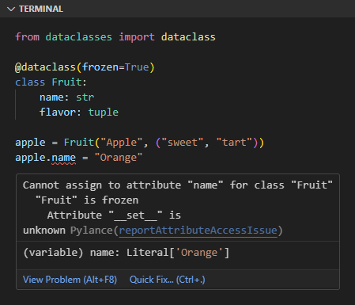

Data class adalah class yang didesain khusus untuk tujuan penyimpanan data.

Python menyediakan module bernama `dataclasses` dengan isi beberapa API untuk mempermudah pembuatan data class. Pada chapter ini kita akan mempelajarinya.

## A.43.1. Pengenalan Data Class

Di bawah ini dicontohkan class bernama `Planet` disiapkan untuk pembuatan data berisi informasi planet. Class ini memiliki 3 buah instance attribute, yaitu `name`, `diameter`, dan `natural_sattelites`. Deklarasi attribute ditulis dalam fungsi `__init__()`.

```python
class Planet:
    def __init__(self, name, diameter, natural_sattelites):
        self.name = name
        self.diameter = diameter
        self.natural_sattelites = natural_sattelites

planets = [
    Planet("Mercury", 4879, []),
    Planet(name="Venus", diameter=12104, natural_sattelites=[]),
    Planet(diameter=12742, name="Earth", natural_sattelites=["Moon"]),
]

for p in planets:
    print(f"{p.name} | {p.diameter} km | {len(p.natural_sattelites)} moons")

# output ↓
#
# Mercury | 4879 km | 0 moons
# Venus | 12104 km | 0 moons
# Earth | 12742 km | 1 moons
```

Contoh di atas menurut penulis cukup jelas dan mudah dipahami karena jika pembaca mengikuti pembahasan secara urut, maka sudah familiar dengan class, attributes, dan object. 

Tidak semua class dibuat untuk keperluan operasi terhadap data, ada yang didesain sebagai utilitas, wrapper, atau lainnya. Khusus untuk class yang memang disiapkan untuk pengelolahan data, penulisannya akan lebih praktis menggunakan decorator `@dataclass` milik module `dataclasses`.

Class `Planet` yang telah dibuat di atas, deklarasinya diubah menggunakan dataclass, hasilnya kurang lebih seperti ini:

```python
from dataclasses import dataclass

@dataclass
class Planet:
    name: str
    diameter: float
    natural_sattelites: list[str]

planets = [
    Planet("Mercury", 4879, []),
    Planet("Venus", 12104, []),
    Planet("Earth", 12742, ["Moon"]),
]

for p in planets:
    print(f"{p.name} | {p.diameter} km | {len(p.natural_sattelites)} moons")

# output ↓
#
# Mercury | 4879 km | 0 moons
# Venus | 12104 km | 0 moons
# Earth | 12742 km | 1 moons
```

Cukup tambahkan decorator `@dataclass` saat deklarasi class, lalu tulis attribute seperti penulisan class attribute, tak lupa tentukan tipe data tiap-tiap attribute. Dengan itu maka class otomatis menjadi data class, attribute-nya menjadi instance attribute dan bisa langsung diisi nilainya (via argument constructor) saat pembuatan object.

- Penulisan data class

    ```python
    from dataclasses import dataclass

    @dataclass
    class Planet:
        name: str
        diameter: float
        natural_sattelites: list[str]
    ```

- Penulisan class biasa

    ```python
    class Planet:
        def __init__(self, name, diameter, natural_sattelites):
            self.name = name
            self.diameter = diameter
            self.natural_sattelites = natural_sattelites
    ```

## A.43.2. Attribute mutability

Selayaknya seperti class biasa, instance attribute dataclass adalah *mutable* atau bisa diubah nilainya. Contoh penerapan:

```python
mars = Planet("Mars", 4, ["Phobos", "Deimos"])
mars.name = "Red Planet"
mars.diameter = 6779

print(f"{mars.name} | {mars.diameter} km | {len(mars.natural_sattelites)} moons")
# output ➜ Red Planet | 6779 km | 2 moons
```

## A.43.3. Instance method

Data class bisa memiliki instance method dengan penulisan deklarasi sama persis seperti deklarasi method pada umumnya. Contohnya bisa dilihat di bawah ini, dimana ada data class bernama `Country` berisi 3 buah instance attribute dan satu buah instance method bernama `info()`.

```python
@dataclass
class Country:
    name: str
    seasons: list
    number_of_populations: float
    
    def info(self) -> str:
        return f"{self.name} | {len(self.seasons)} seasons | {self.number_of_populations} million population"

countries = [
    Country("Indonesia", ["Rainy", "Dry"], 275.5),
    Country("Palestine", ["Winter", "Summer", "Autumn", "Spring"], 5.044),
    Country("Mongolia", ["Winter", "Summer", "Autumn", "Spring"], 3.398),
]

for c in countries:
    print(c.info())

# output ↓
#
# Indonesia | 2 seasons | 275.5 million population
# Palestine | 4 seasons | 5.044 million population
# Mongolia | 4 seasons | 3.398 million population
```

## A.43.4. Attribute default value

Attribute data class bisa ditentukan nilai defaultnya menggunakan operator assignment `=` (penulisannya seperti deklarasi variabel). Dengan memberikan nilai default pada attribute, menjadikan parameter konstruktor menjadi opsional. Contoh:

```python
@dataclass
class Country:
    name = "Indonesia"
    seasons = ["Rainy", "Dry"]
    number_of_populations = 275.5
    
    def info(self) -> str:
        return f"{self.name} | {len(self.seasons)} seasons | {self.number_of_populations} million population"

c = Country()
print(c.info())
# output ➜ Indonesia | 2 seasons | 275.5 million population
```

## A.43.5. Frozen attribute

Frozen data class adalah data class yang *immutable*, artinya setelah dideklarasikan maka tidak bisa diubah nilai attribute-nya. Cara meng-enable frozen attribute adalah dengan menambahkan `frozen=True` pada decorator `@dataclass`.

```python
from dataclasses import dataclass

@dataclass(frozen=True)
class Fruit:
    name: str
    flavor: tuple

apple = Fruit("Apple", ("sweet", "tart"))
apple.name = "Orange"
```

Kode di atas menghasilkan error karena semua attribute class `Fruit` immutable.



## A.43.6. Inheritance

Data class bisa diturunkan seperti umumnya class dengan cara penulisan masih sama. Contoh:

```python
from dataclasses import dataclass

@dataclass
class Animal:
    name: str

@dataclass
class Bird(Animal):
    can_fly: bool

cow = Animal(name="Cow")
print(cow.name)
# output ➜ Cow

chicken = Bird(name="Chicken", can_fly=False)
print(chicken.name, chicken.can_fly)
# output ➜ Chicken False
```

---

<div class="section-footnote">

## Catatan chapter 📑

### ◉ Source code praktik

<pre>
    <a href="https://github.com/novalagung/dasarpemrogramanpython-example/tree/master/dataclass">
        github.com/novalagung/dasarpemrogramanpython-example/../dataclass
    </a>
</pre>

### ◉ Chapter relevan lainnya

- [OOP ➜ Class & Object](/basic/class-object)
- [OOP ➜ Instance Method](/basic/instance-method)
- [OOP ➜ Constructor](/basic/class-constructor)
- [OOP ➜ Instance Attribute & Class Attribute](/basic/instance-attribute-class-attribute)
- [OOP ➜ Class Inheritance](/basic/class-inheritance)
- [Function ➜ Decorator](/basic/decorator)

### ◉ Referensi

- https://docs.python.org/3/library/dataclasses.html

</div>
