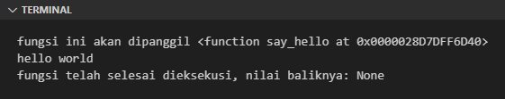
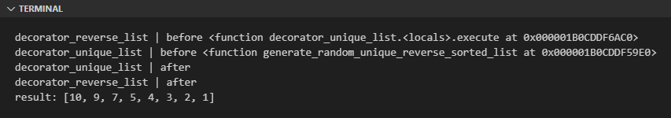

Chapter ini membahas tentang decorator, yaitu syntax yang penulisannya diawali dengan huruf `@` dituliskan tepat sebelum deklarasi fungsi atau method.

## A.40.1. Pengenalan decorator

Pada dua chapter sebelumnya ([OOP ➜ Class Method](/basic/class-method) dan [OOP ➜ Static Method](/basic/static-method)) kita telah mempelajari 2 buah decorator, yaitu `@classmethod` dan `@staticmethod`.

Decorator tersebut merupakan bawaan dari Python Standard Library, kita bisa langsung menggunakannya sesuai kebutuhan.

Setiap decorator memiliki tugas spesifik yang berbeda satu sama lain, misalnya:

- Decorator `@classmethod` digunakan untuk menandai suatu method adalah class method
- Decorator `@staticmethod` digunakan untuk menandai suatu method adalah static method

Selain dua decorator tersebut, ada juga beberapa lainnya yang nantinya akan dibahas ketika sudah masuk topik yang relevan dengan kegunaan masing-masing decorator.

Selain menggunakan decorator bawaan Python, kita juga bisa membuat custom decorator sendiri yang bisa kita desain sesuai kebutuhan. Pada chapter ini kita akan mempelajari caranya.

## A.40.2. Custom decorator

Decorator sebenarnya adalah sebuah fungsi, yang menerima parameter berupa fungsi, yang isinya juga mengembalikan fungsi/closure.

Agar lebih jelas, silakan lihat kode berikut. Terdapat sebuah fungsi bernama `inspeksi()` yang parameter dan nilai baliknya adalah fungsi. Fungsi `inspeksi()` ini dipergunakan sebagai decorator fungsi lain yaitu `say_hello()`.

```python
def inspeksi(func):
    def inner_func():
        return func()
    return inner_func

@inspeksi
def say_hello():
    print("hello world")

say_hello()
# output ➜ hello world
```

Bisa dilihat di kode, bahwa fungsi `inspeksi` bisa langsung digunakan sebagai decorator dengan cukup menambahkan karakter `@` sebagai prefix lalu dituliskan tepat sebelum deklarasi fungsi.

> Untuk nama closure tidak ada aturan yang mengikat harus dinamai apa. Pada contoh di atas closure fungsi `inspeksi()` penulis namai `inner_func()`.

Fungsi `say_hello()` ditempeli decorator `@inspeksi`, artinya pemanggilan fungsi tersebut adalah ekuivalen dengan statement ke-2 kode berikut:

```python
say_hello()
# output ➜ hello world

inspeksi(say_hello)()
# output ➜ hello world
```

Penerapan decorator `@inspeksi` membuat eksekusi fungsi yang ditempelinya menjadi terbungkus oleh fungsi `inspeksi()`.

Ok, sekarang kita breakdown lebih detail lagi tentang fungsi `inspeksi()` yang sudah dibuat. Kegunaan dari fungsi ini sebenarnya apa? Jawabannya adalah **tidak ada**, tidak ada gunanya sama sekali, karena ini hanyalah contoh versi sederhana tentang penerapan custom decorator.

Agar fungsi `inspeksi()` lebih berguna, mari kita tambahkan sesuatu. Tepat sebelum dan sesudah pemanggilan parameter closure `func` milik fungsi `inspeksi()`, tambahkan statement print.

```python
def inspeksi(func):
    def inner_func():
        print("fungsi ini akan dipanggil", func)
        res = func()
        print("fungsi telah selesai dieksekusi, nilai baliknya:", res)
        return res

    return inner_func

@inspeksi
def say_hello():
    print("hello world")

say_hello()
```

Jalankan program, outpunya kurang lebih seperti ini:



Bisa dilihat sekarang ada pesan muncul sebelum string `hello world` di-print. Hal ini karena kita telah menambahkan 2 statement print yang ditempatkan sebelum dan setelah eksekusi fungsi.

> Penulis akan cukup sering menggunakan istilah **fungsi decorator** pada chapter ini, dan istilah tersebut mengacu ke fungsi yang digunakan sebagai decorator (bukan mengacu ke fungsi yang ditempeli decorator).
>
> Pada contoh di atas, fungsi decorator yang dimaksud adalah fungsi `inspeksi()`.

Fungsi `say_hello()` tidak memiliki nilai balik, jadinya fungsi tersebut mengembalikan tipe data `None`. Bisa dilihat pada pesan ke-2 nilai balik pemanggilan `func()` disitu adalah `None`.

Jika diilustrasikan statement print-nya saja, program di atas mengeksekusi 3 statement ini:

```python
print("fungsi ini akan dipanggil", func)
print("hello world")
print("fungsi telah selesai dieksekusi, nilai baliknya:", res)
```

Sampai sini semoga cukup jelas. Selanjutnya kita akan praktek penerapan decorator untuk case yang tidak sesederhana contoh di atas, dengan harapan pemahaman pembaca mengenai topik decorator ini makin mantab.

## A.40.3. Contoh penerapan custom decorator

Pada praktek selanjutnya ini, kita akan membuat program yang memunculkan list berisi angka random. Kemudian dari list tersebut dibentuk sebuah list baru berisi elemen unik, lalu darinya dibuat list baru lagi yang isi elemen uniknya diurutkan secara *descending*.

### ◉ Tahap 1: Program awal

Pertama, tulis kode berikut kemudian jalankan:

```python
import random

def generate_random_list(length):
    r = []

    for _ in range(0, length):
        n = random.randint(0, 10)
        r.append(n)
    
    return r

def unique_list(data):
    s = set(data)
    r = list(s)
    return r

def reverse_list(data):
    data.sort(reverse=True)
    return data

data = generate_random_list(15)
print("data:", data)
# output ➜ data: [0, 0, 0, 8, 4, 9, 5, 7, 10, 7, 1, 8, 4, 10, 2]

unique_data = unique_list(data)
print("unique data:", unique_data)
# output ➜ unique data: [0, 1, 2, 4, 5, 7, 8, 9, 10]

reversed_data = reverse_list(unique_data)
print("reversed data:", reversed_data)
# output ➜ reversed data: [10, 9, 8, 7, 5, 4, 2, 1, 0]
```

O iya, karena disini module `random` digunakan untuk generate elemen list, bisa jadi hasil generate di lokal masing-masing adalah berbeda dengan angka yang muncul di tutorial ini.

### ◉ Tahap 2: Decorator unique & reverse

Selanjutnya, kita refactor fungsi `unique_list()` dan `reverse_list()` yang sudah di tulis menjadi decorator.

- Fungsi `unique_list()` diubah menjadi fungsi decorator bernama `decorator_unique_list()`

    ```python
    def decorator_unique_list(func):

        def execute(length):
            data = func(length)
            s = set(data)
            r = list(s)
            return r

        return execute
    ```

- Fungsi `reverse_list()` diubah menjadi fungsi decorator bernama `decorator_reverse_list()`

    ```python
    def decorator_reverse_list(func):

        def execute(length):
            data = func(length)
            data.sort(reverse=True)
            return data

        return execute
    ```

Bisa dilihat pada kedua decorator yang telah ditulis, kode utama masing-masing decorator dituliskan setelah statement `data = func(length)`. Variabel `data` disitu isinya adalah hasil pemanggilan method dimana decorator ditempelkan nantinya. Variabel tersebut kemudian diolah sesuai dengan kebutuhan.

- Decorator `decorator_unique_list()` menghasilkan data list berisi elemen unik
- Decorator `decorator_reverse_list()` menghasilkan data list berisi elemen dengan urutan terbalik

> Disini penulis menggunakan prefix `decorator_` pada nama fungsi untuk membedakan mana fungsi biasa dan mana fungsi decorator.

### ◉ Tahap 3: Decorator dipergunakan

Selanjutnya, dua buah fungsi baru dibuat yang masing-masing menggunakan decorator yang telah dipersiapkan:

- Fungsi `generate_random_unique_list()` ditempeli decorator `@decorator_unique_list`, membuat data nilai balik fungsi ini diteruskan ke proses pencarian list berisi elemen unik.

    ```python
    @decorator_unique_list
    def generate_random_unique_list(length):
        return generate_random_list(length)

    print(generate_random_unique_list(15))
    # output ➜ [0, 3, 4, 5, 6, 7, 8, 9, 10]
    ```

    Fungsi `generate_random_unique_list()` menghasilkan proses yang ekuivalen dengan kode berikut:

    ```python
    data = generate_random_list(length)
    res = unique_list(data)
    print(res)
    ```

- Fungsi `generate_random_reverse_sorted_list()` ditempeli decorator `@decorator_reverse_list`, membuat data nilai balik fungsi ini diteruskan ke proses perubahan pengurutan elemen menjadi terbalik.

    ```python
    @decorator_reverse_list
    def generate_random_reverse_sorted_list(length):
        return generate_random_list(length)

    print(generate_random_reverse_sorted_list(15))
    # output ➜ [10, 10, 10, 9, 8, 8, 8, 8, 8, 7, 4, 4, 2, 0, 0]
    ```

    Fungsi `generate_random_reverse_sorted_list()` menghasilkan proses yang ekuivalen dengan kode berikut:

    ```python
    data = generate_random_list(length)
    res = reverse_list(data)
    print(res)
    ```

## A.40.4. Chaining decorator

Chaining decorator adalah istilah untuk penerapan lebih dari satu decorator pada sebuah fungsi. Pada contoh di atas, fungsi ditempeli hanya satu decorator saja. Pada praktiknya, fungsi bisa saja menggunakan lebih dari 1 decorator.

Misalnya pada program berikut, kita buat fungsi baru yang menggunakan decorator `@decorator_unique_list` dan juga `@decorator_reverse_list`.

```python
def decorator_unique_list(func):

    def execute(length):
        print("decorator_unique_list | before", func)
        data = func(length)
        print("decorator_unique_list | after")
        s = set(data)
        r = list(s)
        return r

    return execute

def decorator_reverse_list(func):

    def execute(length):
        print("decorator_reverse_list | before", func)
        data = func(length)
        print("decorator_reverse_list | after")
        data.sort(reverse=True)
        return data

    return execute

@decorator_reverse_list
@decorator_unique_list
def generate_random_unique_reverse_sorted_list(length):
    return generate_random_list(length)

print("result:", generate_random_unique_reverse_sorted_list(15))
```

Output eksekusi program:



Bisa dilihat, data list yang dihasilkan adalah unik dan urutannya terbalik, menandakan dua decorator yang kita pasang ke fungsi `generate_random_unique_reverse_sorted_list()` bekerja dengan baik.

Pada chaining decorator, urutan eksekusi fungsi decorator adalah dari yang paling bawah kemudian ke atas. Ilustrasi eksekusi fungsi dan decorator pada contoh yang telah dipraktikan kurang lebih ekuivalen dengan kode di bawah ini:

```python
data = decorator_reverse_list(decorator_unique_list(generate_random_list(length)))
print(data)

# ... atau ...

data1 = generate_random_list(length)
data2 = decorator_unique_list(data1)
data3 = decorator_reverse_list(data2)
print(data3)
```

## A.40.5. **\*args** & **\*\*kwargs** pada decorator

Idealnya, sebuah decorator dibuat dengan desain parameter se-fleksibel mungkin, karena bisa saja decorator diterapkan pada fungsi dengan berbagai macam skema parameter.

Pada contoh yang telah dipraktekan, closure nilai balik fungsi decorator memiliki parameter yang sangat spesifik, yaitu `length`. Dari sini berarti decorator tersebut hanya bisa digunakan pada fungsi yang parameternya sesuai.

Ada tips atau *best practice* dalam mendesain fungsi decorator. Gunakan parameter **\*args** & **\*\*kwargs** pada deklarasi *inner function*, kemudian saat memanggil `func` lakukan operasi *unpacking*. Dengan ini parameter apapun yang disisipkan di fungsi yang ditempeli decorator, akan di-pass ke decorator sesuai dengan aslinya.

> Pembahasan detail mengenai teknik **unpacking** ada di chapter [Packing & Unpacking](/basic/pack-unpack-elements)

Source code final:

```python
import random

def generate_random_list(length):
    r = []

    for _ in range(0, length):
        n = random.randint(0, 10)
        r.append(n)
    
    return r

def decorator_unique_list(func):

    def execute(*args, **kwargs):
        data = func(*args, **kwargs)
        s = set(data)
        r = list(s)
        return r

    return execute

def decorator_reverse_list(func):

    def execute(*args, **kwargs):
        data = func(*args, **kwargs)
        data.sort(reverse=True)
        return data

    return execute

@decorator_reverse_list
@decorator_unique_list
def generate_random_unique_reverse_sorted_list(length):
    return generate_random_list(length)

print(generate_random_unique_reverse_sorted_list(15))
```

---

<div class="section-footnote">

## Catatan chapter 📑

### ◉ Source code praktik

<pre>
    <a href="https://github.com/novalagung/dasarpemrogramanpython-example/tree/master/decorator">
        github.com/novalagung/dasarpemrogramanpython-example/../decorator
    </a>
</pre>

### ◉ Chapter relevan lainnya

- [Function ➜ Positional, Optional, Keyword Arguments](/basic/positional-optional-keyword-argument)
- [OOP ➜ Class Method](/basic/class-method)
- [OOP ➜ Static Method](/basic/static-method)
- [OOP ➜ Abstract Method](/basic/abstract-method)
- [OOP ➜ Data Class](/basic/dataclass)

### ◉ Referensi

- https://peps.python.org/pep-0318/
- https://peps.python.org/pep-0448/
- https://python101.pythonlibrary.org/chapter25_decorators.html
- https://stackoverflow.com/questions/6392739/what-does-the-at-symbol-do-in-python

</div>
