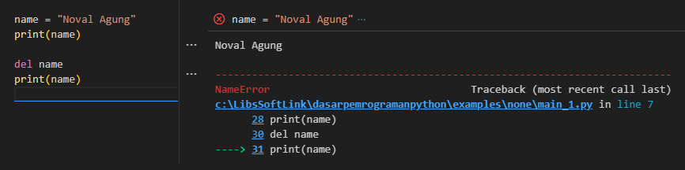

Pada sekian chapter yang lalu kita telah belajar tentang object [None](/basic/none), fungsinya untuk menandai variabel agar bernilai kosong.

Kali ini yang kita pelajari adalah keyword `del` untuk operasi delete object. Hasil penggunaan keyword `del` benar-benar menghapus variabel beserta isinya, jadi tidak hanya mengosongkan nilainya.

## A.55.1. Keyword `del`

Penggunaan `None` sebagai nilai suatu variabel menjadikan variabel tersebut tetap ada tapi nilainya berubah menjadi `None`. Jadi penggunaan `None` disini berguna untuk mengosongkan variabel tanpa menghapus variabel itu sendiri.

Bagaimana jika kita ingin benar-benar menghapus suatu variabel? Caranya menggunakan keyword `del`. Contoh penggunaannya bisa dilihat di bawah ini:

```python
name = "Noval Agung"
print(name)

del name
print(name)
```

Operasi print pertama memunculkan nilai variabel `name` tanpa kendala. Namun di statement print ke-2, variabel `name` tidak dikenal dan menghasilkan error karena variabel tersebut telah dihapus menggunakan keyword `del`.



Jadi keyword `del` ini benar-benar menghapus variabel ya.

Tak hanya ke variabel saja, keyword ini bisa digunakan untuk menghapus attribute, item list, class, fungsi, dan banyak lainnya!

### ◉ Delete list item

```python
obj = ["Noval", "Malang", "Chad"]
print(obj)
# output ➜ name: ['Noval', 'Malang', 'Chad']

del obj[1]
print(obj)
# output ➜ name: ['Noval', 'Chad']
```

### ◉ Delete dictionary item

```python
obj = {
    "name": "Noval",
    "city": "Malang",
    "gender": "Chad"
}
print(obj)
# output ➜ name: {'name': 'Noval', 'city': 'Malang', 'gender': 'Chad'}

del obj["city"]
print(obj)
# output ➜ name: {'name': 'Noval', 'gender': 'Chad'}

del obj["gender"]
print(obj)
# output ➜ name: {'gender': 'Chad'}
```

### ◉ Delete class/object property

Keyword `del` dalam penggunaannya terhadap property class/object membuat property tersebut menjadi tidak ada.

Pada contoh berikut statement delete dibungkus block `try` untuk menangkap error yang muncul karena mencoba mengakses property yang tidak terdaftar.

```python
class Person:
    def __init__(self, name, city, gender):
        self.name = name
        self.city = city
        self.gender = gender

p = Person("Noval", "Malang", "Chad")
print(p.name, p.city, p.gender)
# output ➜ Noval Malang Chad

try:
    del p.city
    print(p.name, p.city, p.gender)
    # raise exception ⬇️

except Exception as err:
    print(err)
    # output ➜ 'Person' object has no attribute 'city'
```

### ◉ Delete function

Tak hanya object, fungsi juga bisa dihapus.

```python
def say_hello():
    print("hello world")

say_hello()
# output ➜ hello world

try:
    del say_hello
    say_hello()
    # output ➜ name 'say_hello' is not defined

except Exception as err:
    print(err)
```

### ◉ Delete class

```python
class Person:
    def __init__(self, name, city, gender):
        self.name = name
        self.city = city
        self.gender = gender

p = Person("Noval", "Malang", "Chad")
print(p.name, p.city, p.gender)
# output ➜ Noval Malang Chad

try:
    del Person
    p = Person("Noval", "Malang", "Chad")
    # output ➜ name 'Person' is not defined

except Exception as err:
    print(err)
```

---

<div class="section-footnote">

## Catatan chapter 📑

### ◉ Source code praktik

<pre>
    <a href="https://github.com/novalagung/dasarpemrogramanpython-example/tree/master/del">
        github.com/novalagung/dasarpemrogramanpython-example/../del
    </a>
</pre>

### ◉ Chapter relevan lainnya

- [None](/basic/none)

### ◉ Referensi

- https://docs.python.org/3/tutorial/datastructures.html#the-del-statement
- https://docs.python.org/3/reference/simple_stmts.html#del

</div>
