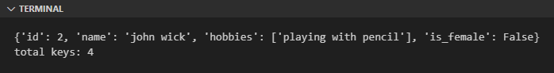
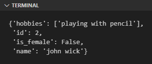
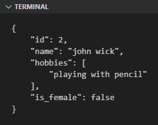
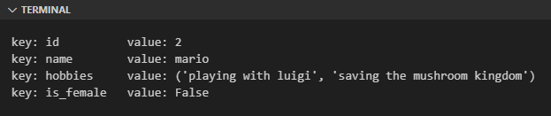

Pada chapter ini kita akan belajar salah satu tipe data *mapping* di Python, yaitu Dictionary.

## A.16.1. Pengenalan Dictionary

Dictionary atau `dict` adalah tipe data kolektif berbentuk **key-value**. Contoh penulisannya:

```python
profile = {
    "id": 2,
    "name": "john wick",
    "hobbies": ["playing with pencil"],
    "is_female": False,
}
```

Literal dictionary ditulis dengan menggunakan `{ }`, mirip seperti tipe data set, hanya saja bedanya pada tipe dictionary isinya berbentuk **key-value**.

> Pembahasan detail mengenai tipe data set ada di chapter [Set](/basic/set)

Ok, sekarang dari kode di atas, coba tambahkan kode berikut untuk melihat bagaimana data dictionary dimunculkan di layar console.

```python
print("data:", profile)
print("total keys:", len(profile))
```



Sedangkan untuk memunculkan nilai item tertentu berdasarkan key-nya, bisa dilakukan menggunakan notasi `dict["key"]`. Contoh:

```python
print("name:", profile["name"])
# output ➜ name: john wick

print("hobbies:", profile["hobbies"])
# output ➜ ['playing with pencil']
```

:::danger

Pengaksesan item menggunakan key yang tidak dikenali akan menghasilkan error.

Sebagai contoh, variabel `profile` di atas jika diakses item dengan key `umur` misalnya (`profile["umur"]`) hasilnya adalah error. 

:::

### ◉ Urutan item dictionary

Mulai dari Python version 3.7, item dictionary tersimpan secara urut. Artinya urutan item dictionary akan selalu sesuai dengan bagaimana inisialisasi awalnya.

### ◉ Pretty print dictionary

Ada tips agar data dictionary yang di-print di console muncul dengan tampilan yang lebih mudah dibaca, dua diantaranya:

- Menggunakan `pprint.pprint()`:

    Import terlebih dahulu module `pprint`, lalu gunakan fungsi `pprint()` untuk memunculkan data ke console.

    ```python
    import pprint
    pprint.pprint(profile)
    ```

    

- Menggunakan `json.dumps()`:

    Import terlebih dahulu module `json`, lalu gunakan fungsi `dumps()` untuk memformat dictionary menjadi bentuk string yang mudah dibaca, kemudian print menggunakan `print()`.

    Tentukan lebar *space indentation* sesuai selera (pada contoh di bawah ini di set nilainya `4` spasi).

    ```python
    import json
    print(json.dumps(profile, indent=4))
    ```

    

    > Lebih detailnya mengenai JSON dibahas di chapter [JSON](#)

## A.16.2. Inisialisasi dictionary

Pembuatan data dictionary bisa dilakukan menggunakan beberapa cara:

- Menggunakan `{ }`:

    ```python
    profile = {
        "id": 2,
        "name": "john wick",
        "hobbies": ["playing with pencil"],
        "is_female": False,
    }
    ```

- Menggunakan fungsi `dict()` dengan isi argument **key-value**:

    ```python
    profile = dict(
        set="id",
        name="john wick",
        hobbies=["playing with pencil"],
        is_female=False,
    )
    ```

- Menggunakan fungsi `dict()` dengan isi list tuple:

    ```python
    profile = dict([
        ('set', "id"),
        ('name', "john wick"),
        ('hobbies', ["playing with pencil"]),
        ('is_female', False)
    ])
    ```

Sedangkan untuk membuat dictionary tanpa item atau kosong, bisa cukup menggunakan `dict()` atau `{}`:

```python
profile = dict()
print(profile)
# output ➜ {}

profile = {}
print(profile)
# output ➜ {}
```

## A.16.3. Perulangan item dictionary

Gunakan keyword `for` dan `in` untuk mengiterasi data tiap key milik dictionary. Dari key tersebut kemduian akses value-nya.

```python
profile = {
    "id": 2,
    "name": "mario",
    "hobbies": ("playing with luigi", "saving the mushroom kingdom"),
    "is_female": False,
}

for key in profile:
    print("key:", key, "\t value:", profile[key])
```

> Karakter `\t` menghasilkan tab. Penggunaan karakter ini bisa membuat rapi tampilan output.

Program di atas ketika di run outputnya:



## A.16.4. Nested dictionary

Dictionary bercabang atau **nested dictionary** bisa dimanfaatkan untuk menyimpan data dengan struktur yang kompleks, misalnya dictionary yang salah satu value item-nya adalah list.

Penerapannya tak berbeda seperti inisialisasi dictionary umumnya, langsung tulis saja dictionary sebagai child dictionary. Contoh:

```python
profile = {
    "id": 2,
    "name": "mario",
    "hobbies": ("playing with luigi", "saving the mushroom kingdom"),
    "is_female": False,
    "affliations": [
        {
            "name": "luigi",
            "affliation": "brother"
        },
        {
            "name": "mushroom kingdom",
            "affliation": "protector"
        },
    ]
}

print("name:", profile["name"])
print("hobbies:", profile["hobbies"])
print("affliations:")

for item in profile["affliations"]:
    print("  ➜ %s (%s)" % (item["name"], item["affliation"]))

# output ↓
#
# name: mario
# hobbies: ('playing with luigi', 'saving the mushroom kingdom')
# affliations:
#   ➜ luigi (brother)
#   ➜ mushroom kingdom (protector)
```

Pada kode di atas, key `affliations` berisi list object dictionary.

Contoh cara mengakses value nested item dictionary:

```python
value = profile["affliations"][0]["name"], profile["affliations"][0]["affliation"]
print("  ➜ %s (%s)" % (value))
# output ➜ luigi (brother)

value = profile["affliations"][1]["name"], profile["affliations"][1]["affliation"]
print("  ➜ %s (%s)" % (value))
# output ➜ mushroom kingdom (protector)
```

## A.16.5. Dictionary mutability

Item dictionary adalah mutable, perubahan value item bisa dilakukan langsung menggunakan operator assignment `=`.

```python
profile = {
    "id": 2,
    "name": "mario",
    "hobbies": ("playing with luigi", "saving the mushroom kingdom"),
    "is_female": False,
    "affliations": [
        {
            "name": "luigi",
            "affliation": "brother"
        },
        {
            "name": "mushroom kingdom",
            "affliation": "protector"
        },
    ]
}

print(profile["affliations"][0]["name"])
# output ➜ luigi

profile["affliations"][0]["name"] = "luigi steven"

print(profile["affliations"][0]["name"])
# output ➜ luigi steven
```

## A.16.6. Operasi data dictionary

### ◉ Pengaksesan item

Pengaksesan item dilakukan lewat notasi `dict["key"]`, atau bisa dengan menggunakan method `get()`.

```python
profile = {
    "id": 2,
    "name": "mario",
    "hobbies": ("playing with luigi", "saving the mushroom kingdom"),
    "is_female": False,
}

print("id:", profile["id"])
# output ➜ id: 2

print("name:", profile.get("name"))
# output ➜ name: mario
```

### ◉ Mengubah isi dictionary

Cara mengubah value item dictionary adalah dengan mengaksesnya terlebih dahulu, kemudian diikuti operasi assignment.

```python
profile = {
    "id": 2,
    "name": "mario",
    "hobbies": ("playing with luigi", "saving the mushroom kingdom"),
    "is_female": False,
}
print("name:", profile["name"])
# output ➜ name: mario

profile["name"] = "mario mario"
print("name:", profile["name"])
# output ➜ name: mario mario
```

### ◉ Menambah item dictionary

Caranya adalah mirip seperti operasi pengubahan value item, perbedaannya ada pada key-nya. Key yang ditulis adalah key item baru yang ingin ditambahkan.

```python
profile = {
    "name": "mario",
}
print("len:", len(profile), "data:", profile)
# output ➜ len: 1 data: {'name': 'mario'}

profile["favourite_color"] = "red"
print("len:", len(profile), "data:", profile)
# output ➜ len: 2 data: {'name': 'mario', 'favourite_color': 'red'}
```

Selain cara tersebut, bisa juga dengan menggunakan method `update()`. Tulis key dan value baru yang ingin ditambahkan sebagai argument method `update()` dalam bentuk dictionary.

```python
profile.update({"race": "italian"})
print("len:", len(profile), "data:", profile)
# output ➜ len: 3 data: {'name': 'mario', 'favourite_color': 'red', 'race': 'italian'}
```

### ◉ Menghapus item dictionary

Method `pop()` digunakan untuk menghapus item dictionary berdasarkan key.

```python
profile.pop("hobbies")
print(profile)
```

Keyword `del` juga bisa difungsikan untuk operasi yang sama. Contoh:

```python
del profile["id"]
print(profile)
```

### ◉ Pengaksesan dictionary keys

Method `keys()` digunakan untuk mengakses semua keys dictionary, hasilnya adalah tipe data view objects `dict_keys`. Dari nilai tersebut bungkus menggunakan `list()` untuk mendapatkan nilainya dalam bentuk list.

```python
profile = {
    "id": 2,
    "name": "mario",
    "hobbies": ("playing with luigi", "saving the mushroom kingdom"),
    "is_female": False,
}

print(list(profile.keys()))
# output ➜ ['id', 'name', 'is_female']
```

### ◉ Pengaksesan dictionary values

Method `values()` digunakan untuk mengakses semua value dictionary, hasilnya adalah tipe data view objects `dict_values`. Gunakan fungsi `list()` untuk mengkonversinya ke bentuk list.

```python
profile = {
    "id": 2,
    "name": "mario",
    "hobbies": ("playing with luigi", "saving the mushroom kingdom"),
    "is_female": False,
}

print(list(profile.values()))
# output ➜ [2, 'mario', False]
```

### ◉ Method `items()` dictionary

Digunakan untuk mengakses semua item dictionary. Nilai baliknya bertipe view objects `dict_items` yang strukturnya cukup mirip seperti list berisi tuple.

Untuk mengkonversinya ke bentuk list, gunakan fungsi `list()`.

```python
profile = {
    "id": 2,
    "name": "mario",
    "hobbies": ("playing with luigi", "saving the mushroom kingdom"),
    "is_female": False,
}

print(list(profile.items()))
# output ➜ [('id', 2), ('name', 'mario'), ('is_female', False)]
```

### ◉ Copy dictionary

Method `copy()` digunakan untuk meng-*copy* dictionary, hasilnya data dictionary baru.

```python
p1 = {
    "id": 2,
    "name": "mario",
    "is_female": False,
}
print(p1)
# output ➜ {'id': 2, 'name': 'mario', 'is_female': False}

p2 = p1.copy()
print(p2)
# output ➜ {'id': 2, 'name': 'mario', 'is_female': False}
```

Pada contoh di atas, statement `p1.copy()` menghasilkan data baru dengan isi sama seperti isi `p1`, data tersebut kemudian ditampung oleh variabel `p2`.

> Operasi copy disini jenisnya adalah shallow copy.<br />
> Lebih detailya mengenai shallow copy vs deep copy dibahas pada chapter terpisah.

### ◉ Mengosongkan isi dictionary

Method `clear()` berguna untuk menghapus isi dictionary.

```python
profile = {
    "id": 2,
    "name": "mario",
    "is_female": False,
}
print("len:", len(profile), "data:", profile)
# output ➜ len: 3 data: {'id': 2, 'name': 'mario', 'is_female': False}

profile.clear()
print("len:", len(profile), "data:", profile)
# output ➜ len: 0 data: {}
```

---

<div class="section-footnote">

## Catatan chapter 📑

### ◉ Source code praktik

<pre>
    <a href="https://github.com/novalagung/dasarpemrogramanpython-example/tree/master/dictionary">
        github.com/novalagung/dasarpemrogramanpython-example/../dictionary
    </a>
</pre>

### ◉ Chapter relevan lainnya

- [OOP ➜ Class & Object](/basic/class-object)

### ◉ Referensi

- https://docs.python.org/3/library/stdtypes.html#mapping-types-dict

</div>
