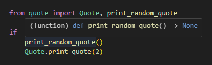
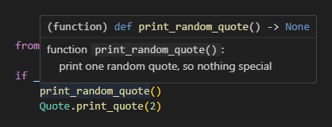
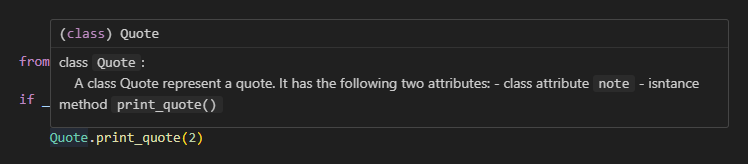
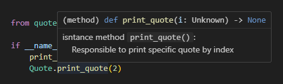
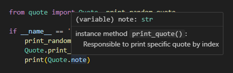
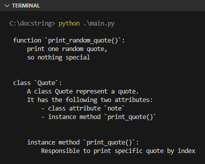

Pada chapter ini kita akan membahas tentang docstring beserta cara penerapan dan manfaatnya.

## A.48.1. Pengenalan docstring

Di pembelajaran awal yaitu pada chapter [Komentar](/basic/komentar), telah disinggung bahwa salah satu cara menulis komentar adalah menggunakan karakter `"""` dengan penulisan di awal dan akhir komentar. Contoh: `### ini komentar ###`.

Komentar yang ada di dalam karakter tersebut disebut docstring. DocString memiliki keistimewaan dibanding komentar biasa yang ditulis menggunakan karakter `#`.

Komentar docstring otomatis menempel pada unit dimana komentar ditulis. Misalnya ditulis tepat dibawah deklarasi fungsi bernama `print_random_quote()`, maka komentarnya menembel ke fungsi tersebut. Benefitnya, informasi komentar bisa muncul setidaknya di 2 tempat:

- Komentar bisa diakses menggunakan attribute `__doc__` yang menempel ke fungsi `print_random_quote()`.
- Komentar dimunculkan sewaktu fungsi tersebut di-hover (dengan catatan extension Python/Pylance ter-install di editor).

Perihal unit yang bisa ditempeli docstring bisa berupa fungsi, class, method, atau lainnya.

## A.48.2. Praktek penerapan docstring

Mari kita praktekan agar lebih jelas. Siapkan project sederhana dengan struktur seperti ini. Isinya hanya dua file saja:

- File `quote.py` berisi class `Quote`
- File `main.py` berisi kode penggunaan class `Quote`

<div style={{ width: '250px' }}>

```bash title="Project structure"
praktek-docstring/
│─── quote.py
└─── main.py
```

</div>

Tulis kode berikut di file `quote.py`:

```python title="File quote.py"
quotes = [
    "never let anyone live in your head rent free",
    "if others can do it, then why should I?",
    "\n".join([
        "I'm sick of following my dreams, man.",
        "I'm just going to ask where they're going and hook up with 'em later."
    ]),
]

from random import randint

# function `print_random_quote()`:
#     print one random quote,
#     so nothing special
def print_random_quote():

    i = randint(0, len(quotes)-1)
    print(quotes[i])

# class `Quote`:
#     A class Quote represent a quote.
#     It has the following two attributes:
#         - class attribute `note`
#         - instance method `print_quote()`
class Quote:
    note = "A class to represent quote"

    # instance method `print_quote()`:
    #     Responsible to print specific quote by index
    @classmethod
    def print_quote(cls, i):
        print(quotes[i])
```

Kemudian di file `main.py`, import unit-unit dari module `quote.py` lalu gunakan.

```python title="File main.py"
from quote import Quote, print_random_quote

if __name__ == '__main__':
    print_random_quote()
    # output ➜ <random quote appears here>

    Quote.print_quote(2)
    # output ➜ I'm just going to ask where they're going and hook up with 'em later.
```

Sampai sini penulis rasa cukup jelas.

Selanjutnya coba hover fungsi atau class yang di-import dari module `Quote.py` yang dipergunakan di `main.py`. Popup muncul tapi isinya hanya informasi deklarasi fungsi itu sendiri. Komentar yang telah ditulis tidak muncul di popup.



Ok, sekarang kita akan modifikasi komentar pada kode yang sudah ditulis dengan mengubahnya menjadi komentar docstring. Komentar hanya dianggap docstring ketika ditulis dengan diapit karakter `###` `###` dan penulisannya berada tepat dibawah unit yang ingin dikomentari.

### ◉ DocString pada class dan fungsi/method

Ubah isi `quote.py` menjadi seperti ini:

```python title="File quote.py"
quotes = [
    "never let anyone live in your head rent free",
    "if others can do it, then why should I?",
    "\n".join([
        "I'm sick of following my dreams, man.",
        "I'm just going to ask where they're going and hook up with 'em later."
    ]),
]

from random import randint

def print_random_quote():
    """
    function `print_random_quote()`:
        print one random quote,
        so nothing special
    """

    i = randint(0, len(quotes)-1)
    print(quotes[i])

class Quote:
    """
    class `Quote`:
        A class Quote represent a quote.
        It has the following two attributes:
            - class attribute `note`
            - instance method `print_quote()`
    """

    note = "A class to represent quote"

    @classmethod
    def print_quote(cls, i):
        """
        instance method `print_quote()`:
            Responsible to print specific quote by index
        """

        print(quotes[i])
```

Sekarang coba hover lagi, lihat isi popup-nya.

- Hover fungsi `print_random_quote()`

    

- Hover class `Quote`

    

- Hover class method `Quote.print_quote()`

    

Mantab bukan? DocString ini menjadi salah satu hal yang sangat membantu dalam pengembangan.

### ◉ DocString pada attribute dan variable

Untuk penerapan docstring pada attribute, caranya juga sama, yaitu dengan menuliskan komentar tepat dibawah attribute atau variabel dengan karakter `###` `###`.

```python title="File quote.py"
# ...

class Quote:
    """
    class `Quote`:
        A class Quote represent a quote.
        It has the following two attributes:
            - class attribute `note`
            - instance method `print_quote()`
    """

    note = "A class to represent quote"
    """
        instance method `print_quote()`:
            Responsible to print specific quote by index
    """ 

    @classmethod
    def print_quote(cls, i):
        """
        instance method `print_quote()`:
            Responsible to print specific quote by index
        """
        print(quotes[i])
```

Coba sekarang 
Output ketika di-hover:



## A.48.3. Special name ➜ class attribute `__note__`

Informasi docstring milik fungsi, method, dan class bisa diakses secara excplit menggunakan class attribute `__note__`. Jika mengacu ke kode yang sudah ditulis, maka pengaksesannya seperti ini:

```python
from quote import Quote, print_random_quote

if __name__ == '__main__':

    # menampilkan docstring fungsi `print_random_quote()`
    print(print_random_quote.__doc__)

    # menampilkan docstring class `Quote`
    print(Quote.__doc__)

    # menampilkan docstring class method `Quote.print_quote()`
    print(Quote.print_quote.__doc__)
```

Output program:



---

<div class="section-footnote">

## Catatan chapter 📑

### ◉ Source code praktik

<pre>
    <a href="https://github.com/novalagung/dasarpemrogramanpython-example/tree/master/docstring">
        github.com/novalagung/dasarpemrogramanpython-example/../docstring
    </a>
</pre>

### ◉ Chapter relevan lainnya

- [Komentar](/basic/komentar)

### ◉ Referensi

- https://peps.python.org/pep-0257/

</div>
