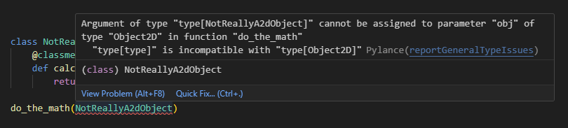

Pada chapter ini kita akan belajar salah satu konsep yang ada di bahasa pemrograman dinamis, yaitu **duck typing**, beserta perbandingannya dengan **structural typing**

## A.44.1. Duck typing

Istilah *duck typing* berasal dari kalimat *If it looks like a duck and quacks like a duck, it's a duck*.

Duck typing adalah konsep yang menjelaskan bahwa compiler/interpreter tidak perlu tau apakah suatu fungsi itu merupakan method, lambda, atau berasal dari class tertentu, atau apapun lainnya; selama fungsi tersebut saat diakses memenuhi kriteria (nama dan skema parameter-nya sama) maka fungsi dianggap valid secara logika.

Mari kita praktekan agar lebih jelas maksudnya apa. Pertama, siapkan sebuah fungsi bernama `do_the_math()`. Tugas fungsi ini sangat sederhana, yaitu menerima parameter `obj`, kemudian lewat variabel tersebut method `calculate_area()` diakses.

```python
def do_the_math(obj):
    area = obj.calculate_area()
    print(f"area of {type(obj).__name__}: {area}")
```

Selanjutnya adalah bagian terpenting dari pembelajaran di chapter ini, fungsi yang sudah dibuat akan di test menggunakan beberapa skenario.

### ◉ Skenario 1: Instance method

Buat class baru untuk operasi perhitungan luas segitiga. Operasi perhitungannya disiapkan di instance method bernama `calculate_area()`. Dari sini, object buatan class ini harusnya bisa dipergunakan sebagai argument fungsi `do_the_math()`.

```python
class Triangle:
    def __init__(self, b, h):
        self.b = b
        self.h = h

    def calculate_area(self):
        return 1/2 * self.b * self.h

obj1 = Triangle(4, 10)
do_the_math(obj1)
# output ➜ area of Triangle: 20.0
```

Hasilnya: OK ✅

### ◉ Skenario 2: Attribute berisi closure

Berikutnya, siapkan class baru lagi dengan attribute bernama `calculate_area`, lalu isi nilai attribute tersebut dengan closure. Disini dicontohkan closure-nya adalah fungsi `number_10()` yang tugasnya mengembalikan nilai numerik `10`.

```python
def number_10():
    return 10

class AreaOf2x10:
    def __init__(self) -> None:
        self.calculate_area = number_10

obj2 = AreaOf2x10()
do_the_math(obj2)
# output ➜ area of AreaOf2x10: 10
```

Hasilnya: OK ✅

Fungsi `do_the_math()` berjalan sesuai harapan tanpa melihat tipe data dan struktur dari argument-nya seperti apa. Selama class memiliki property bernama `calculate_area` dan bisa diakses dalam bentuk notasi fungsi, maka bukan masalah.

### ◉ Skenario 3: Attribute berisi lambda

Pada skenario ini, sebuah class bernama `AreaOfRandomInt` dibuat disertai dengan attribute bernama `calculate_area` yang berisi operasi perkalian angka random yang ditulis dalam syntax lambda.

```python
import random

class AreaOfRandomInt:
    def __init__(self) -> None:
        self.calculate_area = lambda : random.randint(0, 10) * 2

obj3 = AreaOfRandomInt()
do_the_math(obj3)
# output ➜ 16
```

Hasilnya: OK ✅

### ◉ Skenario 4: Class method

Bisa dibilang skenario ini yang paling unik. Buat sebuah class baru berisi class method `calculate_area()`. Lalu jadikan class tersebut sebagai argument pemanggilan fungsi `do_the_math()`. Jadi disini kita tidak menggunakan instance object sama sekali.

```python
class NotReallyA2dObject:
    @classmethod
    def calculate_area(cls):
        return "where is the number?"

do_the_math(NotReallyA2dObject)
# output ➜ where is the number?
```

Hasilnya: OK ✅

Fungsi `do_the_math()` tetap bisa menjalankan tugasnya dengan baik, bahkan untuk argument yang bukan instance object sekalipun. Selama argument memiliki fungsi `calculate_area()` maka semuanya aman terkendali.

## A.44.2. Structural typing

Structural typing bisa diibaratkan sebagai duck typing tapi versi yang lebih ketat. Structural typing mengharuskan suatu fungsi atau method untuk memilki spesifikasi yang sama persis sesuai yang dideklarasikan. Misalnya ada suatu object berisi method dengan hanya nama fungsi dan skema parameternya saja yang sama dibanding yang dibutuhkan, maka itu tidak cukup dan error pasti muncul.

Cara penerapan structural typing adalah dengan menentukan tipe data parameter secara *explicit*. Mari coba praktekan via kode berikut agar lebih jelas.

Pertama, siapkan sebuah class bernama `Object2D` yang memiliki abstract method `calculate_area()`. Lalu buat juga fungsi `do_the_math()` tapi kali ini argument nya bertipe data `Object2D`.

```python
from abc import ABC, abstractmethod

class Object2D(ABC):
    @abstractmethod
    def calculate_area(self):
        pass

def do_the_math(obj: Object2D):
    area = obj.calculate_area()
    print(f"area of {type(obj).__name__}: {area}")
```

Dari sini terlihat bahwa untuk bisa menggunakan fungsi `do_the_math()` data argument harus bertipe `Object2D` atau class turunannya. Inilah bagaimana structural typing diaplikasikan di Python.

Selanjutnya, buat class implementasinya, tak lupa panggil fungsi `do_the_math()`, dan isi argument-nya menggunakan instance object. Jalankan program, hasilnya tidak akan error, karena saat pemanggilan fungsi `do_the_math()` argument yang disisipkan tipe datanya sesuai spesifikasi, yaitu bertipe `Object2D` atau class turunannya. 

```python
class Triangle(Object2D):
    def __init__(self, b, h):
        self.b = b
        self.h = h

    def calculate_area(self):
        return 1/2 * self.b * self.h

class Circle(Object2D):
    def __init__(self, r):
        self.r = r

    def calculate_area(self):
        return 3.14 * self.r * self.r

class Square(Object2D):
    def __init__(self, s):
        self.s = s
    
    def calculate_area(self):
        return self.s * self.s

do_the_math(Triangle(4, 10))
# output ➜ area of Triangle: 20.0

do_the_math(Circle(20))
# output ➜ area of Circle: 1256.0

do_the_math(Square(6))
# output ➜ area of Square: 36
```

Selanjutnya, coba test fungsi `do_the_math()` menggunakan argument berisi data yang bukan bertipe `Object2D` dan juga bukan turunannya.

```python
class NotReallyA2dObject:
    @classmethod
    def calculate_area(cls):
        return "where is the number?"

do_the_math(NotReallyA2dObject)
```

Silakan cek di editor masing-masing, pada statement `do_the_math()` terlihat ada warning.



> Python merupakan bahasa pemrograman dinamis yang dukungan terhadap structural typing tidak terlalu bagus. Keterangan tidak valid pada gambar di atas hanyalah warning, tidak benar-benar error. Kode program sendiri tetap bisa dijalankan.

---

<div class="section-footnote">

## Catatan chapter 📑

### ◉ Source code praktik

<pre>
    <a href="https://github.com/novalagung/dasarpemrogramanpython-example/tree/master/duck-typing-vs-structural-typing">
        github.com/novalagung/dasarpemrogramanpython-example/../duck-typing-vs-structural-typing
    </a>
</pre>

### ◉ Chapter relevan lainnya

- [Tipe Data](/basic/tipe-data)
- [OOP ➜ Abstract Method](/basic/abstract-method)

### ◉ Referensi

- https://stackoverflow.com/questions/4205130/what-is-duck-typing
- https://docs.python.org/3/glossary.html#term-duck-typing

</div>
