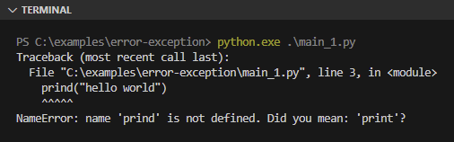
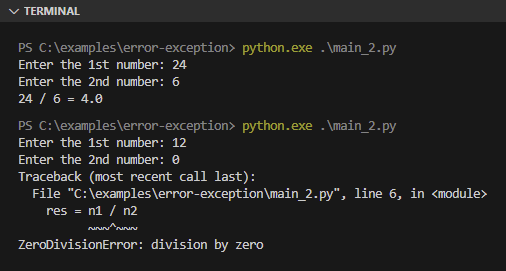
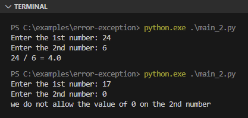
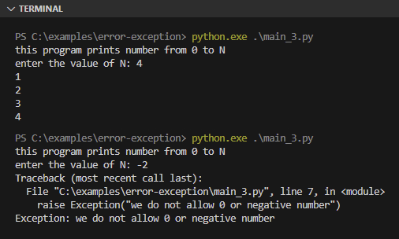
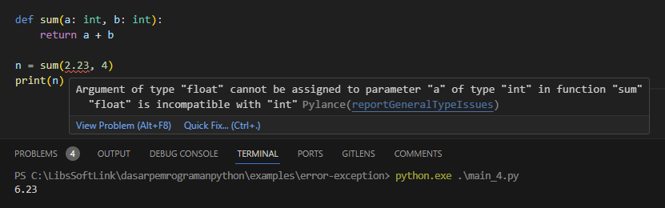

Secara teknis Python interpreter mengenal dua jenis error, yaitu *syntax error* dan *exception*. Sebenarnya ada lagi satu jenis error lainnya, yaitu yang munculnya hanya di level linter (di editor) namun tidak membuat eksekusi program menjadi gagal.

Pada chapter ini kita akan membahas tentang topik tersebut.

## A.46.1. Syntax error

Syntax error adalah salah satu jenis error yang ada di Python, yang jika muncul maka bisa dipastikan eksekusi program adalah gagal atau terhenti. Syntax error disebabkan oleh kesalahan penulisan.

Misalnya ada typo pada pemanggilan fungsi print yang tidak sengaja tertulis sebagai `prind()`, sedangkan di source code sendiri tidak ada fungsi lain yang dideklarasikan dengan nama itu, maka pada situasi seperti ini terjadi syntax error.

```python
prind("hello world")
```

Output program:



Satu-satunya solusi untuk mengatasi syntax error adalah dengan memperbaiki kode, memastikan semua penulisannya benar sesuai aturan di Python.

## A.46.2. Exception

Exception adalah jenis error yang muncul saat *runtime* (saat program dijalankan). Berbeda dengan syntax error yang munculnya saat proses eksekusi program (sebelum program benar-benar running).

Salah satu exception yang umumnya ada di bahasa pemrograman adalah **zero division error**. Error ini muncul ketika ada operasi aritmatika pembagian suatu bilangan numerik terhadap bilangan `0`.

Contoh kasus exception:

```python
n1 = int(input("Enter the 1st number: "))
n2 = int(input("Enter the 2nd number: "))

res = n1 / n2
print(f"{n1} / {n2} = {res}")
```

Output program:



Exception bisa diantisipasi dengan menambahkan validasi, misalnya untuk kasus di atas bisa dengan ditambahkan seleksi kondisi pengecekan nilai `n2`. Jika nilainya adalah `0`, maka program dihentikan dan pesan peringatan dimunculkan.

```python
n1 = int(input("Enter the 1st number: "))
n2 = int(input("Enter the 2nd number: "))

if n2 == 0:
    print("we do not allow the value of 0 on the 2nd number")
else:
    res = n1 / n2
    print(f"{n1} / {n2} = {res}")
```

Output program:



Alternatif solusi lainnya untuk mengatasi exception adalah dengan pengaplikasian kombinasi keyword `try` dan `catch`. Lebih detailnya akan dibahas di chapter berikutnya, di chapter [Exception Handling (try, catch, finally)](#). 

## A.46.3. Throw exception

Di atas kita belajar salah satu cara antisipasi exception, yaitu dengan penambahan validasi sesuai kebutuhan, jika kondisi berpotensi menghasilkan exception maka pesan custom error dimunculkan.

Selanjutnya, kita akan belajar cara untuk dengan sengaja membuat atau melempar exception (istilah umumnya *throwing exception*). Dengan melempar exception, program akan terhenti secara paksa.

Pada program berikut ini, sejumlah baris angka dimunculkan sesuai inputan. Jika inputannya `0` atau bilangan negatif maka exception dilempar, membuat program terhenti.

```python
print("this program prints number from 0 to N")
n = int(input("enter the value of N: "))

if n <= 0:
    raise Exception("we do not allow 0 or negative number")

for d in range(0, n):
    print(d + 1)
```

Outputnya:



Cara membuat exception adalah dengan menggunakan keyword `raise` diikuti dengan pemanggilan class `Exception()` yang argument-nya diisi dengan custom error.

Pada contoh di atas, exception dimunculkan dengan pesan error `we do not allow 0 or negative number`. 

## A.46.4. Linter error / warning

Linter adalah suatu program utilisa yang berguna untuk melakukan pengecekan kualitas kode saat pengembangan (penulisan kode). Linter akan memunculkan error atau warning jika ditemukan pada beberapa bagian kode yang ditulis adalah kurang baik.

Di Python, jika pembaca menggunakan VSCode editor dan sudah meng-install extension Python, linter akan otomatis bekerja saat menulis kode.

Linter error adalah warning yang muncul di editor saat kode tidak sesuai baik secara *syntactic* maupun secara *semantic*. Error yang muncul karena alasan semantik tidak akan membuat program terhenti atau gagal running. Program tetap bisa jalan normal saat di-run.

Salah satu contoh linter error adalah ketika ada suatu fungsi yang saat pemanggilannya diisi oleh tipe data dengan tipe yang tidak sesuai dibading dengan yang sudah dideklarasikan. Pada situasi seperti ini error muncul di editor, ada highlight merah di situ.



Meskipun tidak membuat program terhenti saat running, ada baiknya untuk selalu menulis kode dengan baik dan benar sesuai aturan.

---

<div class="section-footnote">

## Catatan chapter 📑

### ◉ Source code praktik

<pre>
    <a href="https://github.com/novalagung/dasarpemrogramanpython-example/tree/master/error-exception">
        github.com/novalagung/dasarpemrogramanpython-example/../error-exception
    </a>
</pre>

### ◉ Chapter relevan lainnya

- [Exception Handling ➜ try, except, else, finally](/basic/exception-handling-try-except-else-finally)

### ◉ Referensi

- https://docs.python.org/3/tutorial/errors.html

</div>
