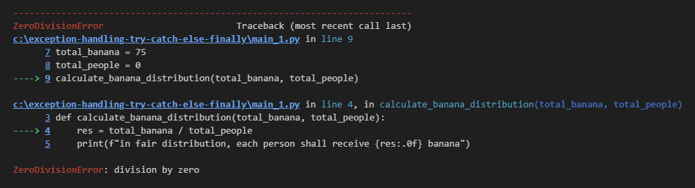
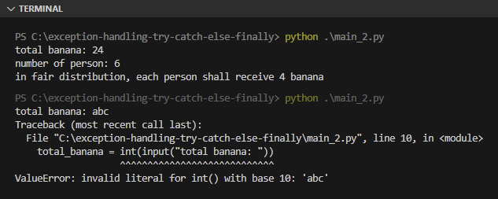
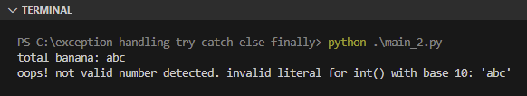

Chapter ini membahas tentang penanganan exception via keyword `try`, `except`, `else`, dan `finally`. Metode exception handler ini sangat efektif karena tidak membutuhkan validasi error secara manual satu per satu menggunakan seleksi kondisi.

> Pembahasan tentang apa itu exception sendiri ada di chapter [Error & Exception](/basic/error-exception)

## A.47.1. Keyword `try` & `except`

Kita mulai pembelajaran dengan sebuah kode sederhana untuk menghitung pembagian pisang ke warga. Hasil operasi pembagian tersebut kemudian di-print.

```python
def calculate_banana_distribution(total_banana, total_people):
    res = total_banana / total_people
    print(f"in fair distribution, each person shall receive {res:.0f} banana")

total_banana = 75
total_people = 3
calculate_banana_distribution(total_banana, total_people)
# output ➜ in fair distribution, each person shall receive 25 banana
```

Sekilas tidak ada yang aneh dari kode di atas, kode akan berjalan normal ketika di-run.

Sekarang coba set nilai `total_people` menjadi `0` kemudian re-run. Pasti muncul exception karena ada operasi pembagian numerik terhadap nilai `0`.



Salah satu solusi penyelesaian error di atas bisa dengan penambahan seleksi kondisi. Alternatif solusi lainnya adalah dengan mengaplikasikan kombinasi keyword `try` dan `except`. Caranya:

- Tempatkan statement (yang berpotensi memunculkan exception) ke dalam block `try`
- Tambahkan block `except` dimana isinya adalah hanlder ketika exception muncul

Contoh penerapan:

```python
try:
    print("1st calculation")
    calculate_banana_distribution(75, 5)

    print("2nd calculation")
    calculate_banana_distribution(25, 0)

    print("3rd calculation")
    calculate_banana_distribution(15, 2)

except:
    print("oops! unable to distribute banana because there is no person available")
```

Output program:


Cara kerja `try` dan `except` adalah Python akan mencoba untuk mengeksekusi statement dalam block `try` terlebih dahulu. Kemudian jika ada exception, maka program dihentikan dan block `except` dijalankan.

Kurang lebih alur eksekusi program di atas adalah seperti ini:

1. Statement pemanggilan `calculate_banana_distribution()` pertama tidak menghasilkan exception. Hasilnya normal.
1. Statement pemanggilan yang ke-2 menghasilkan exception.
    1. Kemudian eksekusi statement dalam block `try` dihentikan secara paksa.
    1. Kemudian block `except` dieksekusi.
1. Statement `calculate_banana_distribution()` ke-3 tidak akan dijalankan.

Bisa dilihat di output, pesan `oops! unable to distribute banana because there is no person available` muncul, menandai akhir eksekusi block `try` & `except`.

Terkait penempatan block `try` & `except` sendiri bisa di bagian dimana fungsi dipanggil, atau di dalam fungsi itu sendiri. Contoh:

```python
def calculate_banana_distribution(total_banana, total_people):
    try:
        res = total_banana / total_people
        print(f"in fair distribution, each person shall receive {res:.0f} banana")
    except:
        print("oops! unable to distribute banana because there is no person available")

print("1st calculation")
calculate_banana_distribution(75, 5)

print("2nd calculation")
calculate_banana_distribution(25, 0)

print("3rd calculation")
calculate_banana_distribution(15, 2)
```

Kode di atas menghasilkan output yang berbeda dibanding sebelumnya. Karena exception handler-nya ada di dalam fungsi `calculate_banana_distribution()`, maka eksekusi `try` & `catch` hanya terhenti di dalam fungsi tersebut saja. Di bagian pemanggilan fungsi sendiri, eksekusinya tetap berlanjut. Efeknya statement pemanggilan fungsi `calculate_banana_distribution()` ke-3 tetap berjalan.

Output program:


Silakan gunakan block `try` & `except` sesuai kebutuhan, tempatkan di bagian kode yang memang dirasa paling pas.

## A.47.2. Explicit exception handler

Suatu exception bisa ditangkap secara spesifik dengan menuliskan varian exception-nya setelah keyword `except`. Contoh penerapannya bisa di lihat pada kode berikut, dimana exception `ZeroDivisionError` perlu ditangkap ketika muncul.

```python
try:
    total_banana = int(input("total banana: "))
    total_people = int(input("number of person: "))
    res = total_banana / total_people
    print(f"in fair distribution, each person shall receive {res:.0f} banana")
except ZeroDivisionError:
    print("oops! unable to distribute banana because there is no person available")
```

Kode akan di-test dengan dijalankan dua kali dengan skenario berikut:

- Eksekusi ke-1: nilai pembagi di-set `6`
- Eksekusi ke-2: salah satu inputan di-set huruf, efeknya muncul exception `ValueError`

Output program:



Bisa dilihat di eksekusi pertama, block exception handler berjalan sesuai ekspektasi. Namun pada eksekusi ke-2 ketika inputan diisi dengan huruf, ada exception baru muncul dan tidak tertangkap. Hal ini karena di kode ditentukan secara eksplisit hanya exception `ZeroDivisionError` yang ditangkap.

Untuk menangkap exception lain caranya bisa dengan menambahkan block `except` baru. Pada kode berikut ada 2 exception yang akan ditangkap, yang keduanya memunculkan pesan berbeda.

```python
try:
    total_banana = int(input("total banana: "))
    total_people = int(input("number of person: "))
    res = total_banana / total_people
    print(f"in fair distribution, each person shall receive {res:.0f} banana")
except ValueError:
    print("oops! not valid number detected")
except ZeroDivisionError:
    print("oops! unable to distribute banana because there is no person available")
```

Output program:


Sampai sini semoga cukup jelas.

### ◉ Menangkap banyak exception sekaligus

Bagaimana jika 2 exception yang ditangkap didesain untuk memunculkan pesan sama? Maka gunakan notasi penulisan berikut. Tulis saja exceptions yang dingin di tangkap sebagai element tuple.

```python
try:
    total_banana = int(input("total banana: "))
    total_people = int(input("number of person: "))
    res = total_banana / total_people
    print(f"in fair distribution, each person shall receive {res:.0f} banana")
except (ValueError, ZeroDivisionError):
    print("oops! something wrong")
```

Pada kode di atas, ketika exception `ValueError` atau `ZeroDivisionError` muncul, maka pesan `oops! something wrong` ditampilkan.

### ◉ Menangkap semua exception

Jika exception yang ingin ditangkap adalah semua varian exception, maka cukup tulis `except:` saja, atau gunakan class `except Exception:` disitu. Contoh:

- Menggunakan `except:`

    ```python
    try:
        total_banana = int(input("total banana: "))
        total_people = int(input("number of person: "))
        res = total_banana / total_people
        print(f"in fair distribution, each person shall receive {res:.0f} banana")
    except:
        print("oops! something wrong")
    ```

- Menggunakan `except Exception:`

    ```python
    try:
        total_banana = int(input("total banana: "))
        total_people = int(input("number of person: "))
        res = total_banana / total_people
        print(f"in fair distribution, each person shall receive {res:.0f} banana")
    except Exception:
        print("oops! something wrong")
    ```

Tipe data `Exception` sendiri merupakan class bawaan Python Standard Library yang dimana di-inherit oleh semua varian exception. Contohnya seperti `ValueError` dan `ZeroDivisionError` keduanya merupakan sub class dari class `Exception`.

### ◉ Memunculkan pesan exception

Biasanya dalam penangkapan exception, pesan exception aslinya juga perlu dimunculkan mungkin untuk keperluan debugging. Hal seperti ini bisa dilakukan dengan menambahkan keyword `as` setelah statement `except` kemudian diikuti variabel penampung data exception.

Penulisannya bisa dilihat di kode berikut:

```python
try:
    total_banana = int(input("total banana: "))
    total_people = int(input("number of person: "))
    res = total_banana / total_people
    print(f"in fair distribution, each person shall receive {res:.0f} banana")
except ValueError as err:
    print(f"oops! not valid number detected. {err}")
except ZeroDivisionError as err:
    print(f"oops! unable to distribute banana because there is no person available. {err}")
except Exception as err:
    print(f"oops! something wrong. {err}")
```

Kode di atas akan menangkap 3 macam exception:

- Ketika ada `ValueError`, maka dimunculkan pesan `oops! not valid number detected` diikut dengan pesan error aslinya bawaan exception `ValueError`.
- Ketika ada `ZeroDivisionError`, maka dimunculkan pesan `oops! unable to distribute banana because there is no person available` diikut dengan pesan error aslinya bawaan exception `ZeroDivisionError`.
- Ketika ada exception apapun itu (selain dua di atas), maka dimunculkan pesan `oops! something wrong` diikut dengan pesan error aslinya bawaan exception.



Bisa dilihat pada gambar di atas, error bawaan exception dimunculkan juga setelah custom message yang kita buat.

### ◉ Alternatif penulisan exception

Dalam operasi penangkapan lebih dari 1 varian exception, penulisannya bisa cukup dalam satu block `except` saja tetapi didalamnya perlu ada seleksi kondisi untuk mengecek spesifik exception yang muncul yang mana. Contoh:

```python
try:
    total_banana = int(input("total banana: "))
    total_people = int(input("number of person: "))
    res = total_banana / total_people
    print(f"in fair distribution, each person shall receive {res:.0f} banana")

except Exception as err:
    if err == ValueError:
        print(f"oops! not valid number detected. {err}")
    elif err == ZeroDivisionError:
        print(f"oops! unable to distribute banana because there is no person available. {err}")
    else:
        print(f"oops! something wrong. {err}")
```

## A.47.3. Keyword `try`, `except` & `else`

Keyword `else` bisa dikombinasikan dengan `try` dan `except`. Block `else` tersebut hanya akan dieksekusi ketika tidak terjadi exception.

Pada praktek yang sudah ditulis, statement `print(f"in fair distribution...")` yang merupakan output kalkulasi, ideal untuk ditulis pada block `else` karena statement tersebut hanya muncul ketika tidak ada exception.

Kode sebelumnya jika di-refactor jadi seperti ini:

```python
try:
    total_banana = int(input("total banana: "))
    total_people = int(input("number of person: "))
    res = total_banana / total_people
except ValueError as err:
    print(f"oops! not valid number detected. {err}")
except ZeroDivisionError as err:
    print(f"oops! unable to distribute banana because there is no person available. {err}")
except Exception as err:
    print(f"oops! something wrong. {err}")
else:
    print(f"in fair distribution, each person shall receive {res:.0f} banana")
```

Penjelasan alur program di atas:

1. Program diawali dengan eksekusi statement dalam block `try`
1. Jika terjadi exception `ValueError`, maka dimunculkan pesan error
1. Jika terjadi exception `ZeroDivisionError`, maka dimunculkan pesan error
1. Jika terjadi exception lainnya, maka dimunculkan pesan error
1. Jika tidak terjadi exception sama sekali, maka block `else` dijalankan

Block `else` mengenali semua variabel yang dideklarasikan di block `try`. Oleh karena itu variabel `res` bisa langsung di-print di block tersebut.

## A.47.4. Keyword `try`, `except` & `finally`

Keyword `finally` adalah keyword yang berguna untuk menandai bahwa eksekusi suatu block `try` & `except` telah selesai. Block `finally` hanya dieksekusi ketika deretan block selesai, tanpa mengecek apakah ada exception atau tidak.

Sebagai contoh, kode sebelumnya dimodifikasi lagi menjadi seperti ini:

```python
try:
    total_banana = int(input("total banana: "))
    total_people = int(input("number of person: "))
    res = total_banana / total_people
    print(f"in fair distribution, each person shall receive {res:.0f} banana")
except ValueError as err:
    print(f"oops! not valid number detected. {err}")
except ZeroDivisionError as err:
    print(f"oops! unable to distribute banana because there is no person available. {err}")
except Exception as err:
    print(f"oops! something wrong. {err}")
finally:
    print(f"program completed")
```

Penjelasan alur program di atas:

1. Program diawali dengan eksekusi statement dalam block `try`
1. Jika terjadi exception `ValueError`, maka dimunculkan pesan error
1. Jika terjadi exception `ZeroDivisionError`, maka dimunculkan pesan error
1. Jika terjadi exception lainnya, maka dimunculkan pesan error
1. Setelah program selesai, entah itu ada exception atau tidak, pesan `program completed` di-print


## A.47.5. Keyword `try`, `except`, `else` & `finally`

Bentuk sempurna dari exception handler adalah kombinasi dari 4 keyword yang telah dipelajari (`try`, `except`, `else` & `finally`).

- Block `try` untuk eksekusi statement
- Block `except` untuk menangkap exception
- Block `else` untuk kebutuhan ketika tidak ada exception
- Block `finally` untuk menandai bahwa eksekusi block exception handler telah selesai

Contoh program dengan penerapan 4 keyword ini:

```python
try:
    total_banana = int(input("total banana: "))
    total_people = int(input("number of person: "))
    res = total_banana / total_people
except ValueError as err:
    print(f"oops! not valid number detected. {err}")
except ZeroDivisionError as err:
    print(f"oops! unable to distribute banana because there is no person available. {err}")
except Exception as err:
    print(f"oops! something wrong. {err}")
else:
    print(f"in fair distribution, each person shall receive {res:.0f} banana")
finally:
    print(f"program completed")
```

Penjelasan alur program di atas:

1. Program diawali dengan eksekusi statement dalam block `try`
1. Jika terjadi exception `ValueError`, maka dimunculkan pesan error
1. Jika terjadi exception `ZeroDivisionError`, maka dimunculkan pesan error
1. Jika terjadi exception lainnya, maka dimunculkan pesan error
1. Jika tidak terjadi exception sama sekali, maka block `else` dijalankan
1. Setelah program selesai, entah itu ada exception atau tidak, pesan `program completed` di-print

---

<div class="section-footnote">

## Catatan chapter 📑

### ◉ Source code praktik

<pre>
    <a href="https://github.com/novalagung/dasarpemrogramanpython-example/tree/master/exception-handling-try-except-else-finally">
        github.com/novalagung/dasarpemrogramanpython-example/../exception-handling-try-except-else-finally
    </a>
</pre>

### ◉ Chapter relevan lainnya

- [Error & Exception](/basic/error-exception)

### ◉ TBA

- catch custom exception

### ◉ Referensi

- https://docs.python.org/3/library/exceptions.html
- https://docs.python.org/3/tutorial/errors.html

</div>
