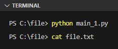
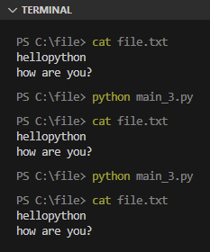
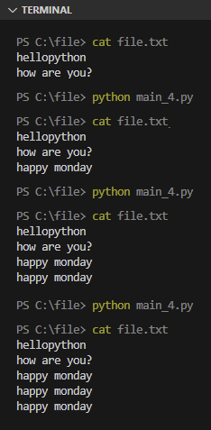
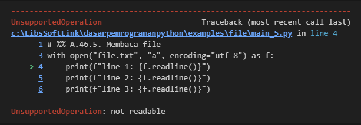
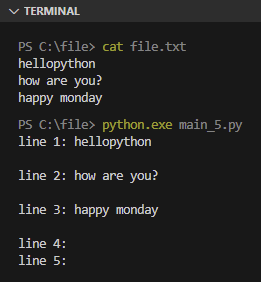
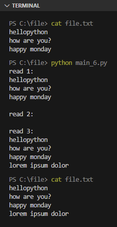

Pada chapter ini kita akan belajar tentang pengolahan file dan folder, dan beberapa hal relevan lainnya yang masih berhubungan dengan manajemen file & folder.

## A.49.1. Membuka stream file

Di Python, hampir semua operasi file diawali dengan pemanggilan fungsi `open()`, dan diakhiri pemanggilan method `close()` (milik object yang dikembalikan oleh fungsi `open()`).

Fungsi `open()` dalam penggunannya membutuhkan pengisian beberapa parameter:

- Parameter ke-1: nama file.
- Parameter ke-2: mode I/O, ada beberapa mode operasi file, diantaranya:
    - `w` untuk mode tulis dengan posisi kursor ada di baris paling awal. Jadi operasi penulisan bisa menimpa konten yang sudah ada. Selain itu, mode ini membuat isi file otomatis menjadi kosong saat fungsi `open()` dipanggil.
    - `a` untuk mode *append*, yaitu mode tulis dengan posisi kursor sudah di baris paling akhir. Jadi penambahan konten tidak akan menimpa konten sebelumnya, tapi ditambahkan di akhir.
    - `r` untuk mode baca.
- Ada juga parameter opsional lainnya, salah satunya `encoding` yang umum diisi dengan nilai `utf-8`.

Bentuk paling sederhana penerapan operasi buka file:

```python
f = open("/path/to/file/file.txt", "w", encoding="utf-8")

# ...

f.close()
```

Kode di atas akan membuka stream I/O file bernama `file.txt`. Jika file tujuan belum ada, maka otomatis dibuatkan oleh Python. Dari object kembalian fungsi `open()` nantinya kita bisa lakukan banyak jenis operasi seperti membaca isi file, menulis, menghapus, dan lainnya.

> Untuk pengguna Windows, tulis saja path-nya dengan karakter `\` ter-escape.<br />Contoh: `C:\\Users\\novalagung\\Desktop\\file.txt"` 

Silakan tulis kode di atas, lalu ganti path-nya dengan current path (atau bisa gunakan `.`), kemudian run programnya. Hasil eksekusi program adalah pembuatan sebuah file baru bernama `file.txt` yang isinya kosong.



Mode `w` digunakan disitu, artinya file dibuka dengan mode tulis. Salah satu efek dari penggunaan mode `w` adalah ketika file dibuka isinya pasti dikosongkan terlebih dahulu.

File yang dibuka, wajib untuk selalu ditutup di akhir. Karena membiarkan file tetap terbuka beresiko membuat isi file rusak ketika ada lebih dari 1 pengakses yang melakukan operasi terhadap file tersebut secara bersamaan.

Untuk mengecek apakah file sedang terbuka stream-nya, bisa dengan melihat nilai attribute `closed`.

```python
f = open("file.txt", "w", encoding="utf-8")
print("file is closed:", f.closed)
# output ➜ file is closed: False

# ...

f.close()
print("file is closed:", f.closed)
# output ➜ file is closed: True
```

## A.49.2. Keyword `with`

Ada cara yang lebih efisien dalam operasi buka file agar file otomatis ter-close setelah digunakan, yaitu dengan menggunakan keyword `with` diikuti statement `open()` lalu syntax `as nama_variabel`. Kurang lebih seperti ini penulisannya:

```python
with open("file.txt", "w", encoding="utf-8") as f:
    print("file is closed:", f.closed)
    # output ➜ file is closed: False
    # ...

print("file is closed:", f.closed)
# output ➜ file is closed: True
```

## A.49.3. Menulis file

Operasi penulisan konten ke file dilakukan via method `write()` milik object file. Contoh penerapannya bisa dilihat pada kode berikut, dimana ada method `write()` digunakan 3x untuk menulis karakter string.

```python
with open("file.txt", "w", encoding="utf-8") as f:
    f.write("hello")
    f.write("python\n")
    f.write("how are you?\n")
```

Output program:



Program di-run 3x dan isinya tetap sama (tidak menumpuk), ini karena setiap kali statement `open()` dijalankan dengan mode `w`, file akan dikosongkan terlebih dahulu.

## A.49.4. Append konten ke file

Gunakan mode `a` untuk append konten ke file yang isinya bisa saja tidak kosong (agar isi konten tidak ditimpa).

Coba jalankan kode berikut terahdap file `file.txt` yang sebelumnya sudah dibuat. Saat program di-run kondisi file sudah terisi dan tidak dikosongkan terlebih dahulu. Dengan mengeksekusi `write()` disitu maka isi konten akan bertambah terus setiap kali program di-run.

```python
with open("file.txt", "a", encoding="utf-8") as f:
    f.write("happy monday\n")
```

Output program:



Bisa dilihat, setiap kali program dieksekusi konten `happy monday\n` bertambah terus.

## A.49.5. Membaca file

Method `readline()` dan `read()` milik object file, keduanya digunakan untuk membaca isi file.

- Method `readline()` akan membaca isi file baris per baris. Pembacaan dimulai dari baris paling atas dan proses pembacaan terjadi setiap kali method `readline()` dipanggil. Ketika method ini mengembalikan string kosong, bisa jadi menandakan semua baris konten file sudah terbaca.

    Disini penulis gunakan kata *bisa jadi* karena ada kasus dimana pada beberapa baris bisa saja memang isinya sengaja kosong.

- Method `read()` akan membaca seluruh isi file. Pemanggilan method ini untuk kedua kalinya pasti mengembalikan string kosong, menandakan semua baris konten file sudah terbaca.

Mari praktekan penggunaan 2 method di atas. Pertama isi file `file.txt` secara manual dengan konten berikut:

```python
hellopython
how are you?
happy monday
```

Kemudian baca isinya per baris menggunakan kode berikut:

```python
with open("file.txt", "a", encoding="utf-8") as f:
    print(f"line 1: {f.readline()}")
    print(f"line 2: {f.readline()}")
    print(f"line 3: {f.readline()}")
    print(f"line 4: {f.readline()}")
    print(f"line 5: {f.readline()}")
```

Output program:



Malah error? Kok bisa? Error ini disebabkan karena kita menggunakan mode `a` yang mode tersebut hanya valid untuk operasi append. Kita perlu mengubah mode menjadi `r` untuk operasi pembacaan file.

```python
with open("file.txt", "r", encoding="utf-8") as f:
    print(f"line 1: {f.readline()}")
    print(f"line 2: {f.readline()}")
    print(f"line 3: {f.readline()}")
    print(f"line 4: {f.readline()}")
    print(f"line 5: {f.readline()}")
```

Output program:



Bisa dilihat method `readline()` mengembalikan data per baris dari atas ke bawah dengan jumlah sesuai dengan berapa kali baris method tersebut dipanggil.

Dalam penerapannya, dianjurkan untuk menggunakan method ini dalam perulangan kemudian ditambahkan pengecekan isi konten untuk menandai bahwa konten sudah terbaca semua. Contohnya seperti ini:

```python
with open("file.txt", "r", encoding="utf-8") as f:
    i = 0
    while True:
        line = f.readline()
        if not line:
            break
        print(f"line {i}: {line}")
        i += 1
```

Kode di atas bisa disederhanakan lagi dengan cara langsung mengiterasi object file-nya. Jadi variabel `f` digunakan secara langsung pada statement perulangan. Hal ini bisa dilakukan karena tipe data kembalian fungsi `open()` adalah `TextIOWrapper` dan tipe ini termasuk tipe data yang *iteratable*.

```python
with open("file.txt", "r", encoding="utf-8") as f:
    i = 1
    for line in f:
        print(f"line {i}: {line}")
        i += 1
```

> Lebih detailnya mengenai tipe data iteratable dibahas pada chapter [Iterator](#)

Kode yang sudah cukup ringkas di atas bisa disederhanakan lagi dengan cara membungkus tipe data `f` dalam fungsi `enumerate()`. Fungsi ini membuat suatu object yang iteratable menjadi memiliki index di setiap element-nya.

```python
with open("file.txt", "r", encoding="utf-8") as f:
    for i, line in enumerate(f):
        print(f"line {i+1}: {line}")
```

Jika goal dari program adalah hanya membaca isi file secara menyeluruh, sebenarnya lebih praktis lagi menggunakan method `read()`.

```python
with open("file.txt", "r", encoding="utf-8") as f:
    print(f.read())
```

## A.49.6. Membaca dan menulis dalam 1 sesi

Di awal chapter telah dijelaskan tentang kegunaan mode `w`, `a`, dan `r`. Lalu bagaimana jika ada kebutuhan untuk membaca dan menulis file dalam satu sesi? Jawabannya adalah dengan menambahkan tanda `+` pada mode (jadinya `w+`, `a+`, atau `r+`).

Sebagai contoh, pada program berikut, mode `r+` digunakan. O iya, proses pembacaan file dilakukan 2x ya, penjelasan disertakan dibawahnya.

```python
with open("file.txt", "r+", encoding="utf-8") as f:
    print(f"read:\n{f.read()}")
    f.write("lorem ipsum dolor\n")
    print(f"read:\n{f.read()}")

with open("file.txt", "r+", encoding="utf-8") as f:
    print(f"read:\n{f.read()}")
```

Output program:



Bisa dilihat di program, block `with` pertama yang berisi operasi baca dan juga tulis tidak menghasilkan error. Namun ada yang aneh, yaitu tepat setelah `lorem ipsum dolor\n` ditulis ke file, proses baca menghasilkan string kosong. Tapi ketika file dibaca lagi menggunakan block `with` baru, isinya sesuai harapan. Jawabannya adalah karena **pergerakan cursor**.

Flow program di atas kurang lebih seperti ini:

1. Cursor awal pembacaan file ada di baris paling awal, karena mode `r+` digunakan.
1. Setelah method `read()` dipanggil, cursor berada di posisi paling akhir.
1. Kemudian `lorem ipsum dolor\n` ditulis ke file, maka text tersebut ada di baris baru di akhir file.
1. Lalu ketika method `read()` dibaca lagi, isinya kosong, karena cursor posisinya sudah ada di baris akhir file.
1. Kemudian ketika file dibaca ulang menggunakan fungsi `open()` dengan block `with` baru, cursor kembali aktif di baris paling awal.
1. Lalu file dibaca, maka seluruh isi konten yang beru dikembalikan.

Mode `w+`, `a+`, dan `r+` kesemuanya bisa digunakan untuk baca dan tulis dalam 1 sesi, dengan perbedaan ada di posisi kursornya aktif dimana. Jika pembaca tertarik untuk mempelajarinya lebih detail, silakan baca diskusi di StackOverflow berikut:

https://stackoverflow.com/questions/1466000/difference-between-modes-a-a-w-w-and-r-in-built-in-open-function/30566011#30566011

## A.49.7. Mengosongkan isi file

Cara mengosongkan file bisa dilakukan dengan mudah menggunakan mode `w`. Baca file menggunakan mode tersebut kemudian langsung `close()` saja. Boleh menggunakan keyword `with` atau bisa langsung sebaris statement. Contoh penerapannya bisa dilihat di kode berikut. 3 block statement di situ semuanya ekuivalen, membuat isi file menjadi kosong.

```python
with open("file.txt", "w", encoding="utf-8") as f:
    pass

with open("file.txt", "w", encoding="utf-8"):
    pass

open("file.txt", "w", encoding="utf-8").close()
```

Opsi lainnya adalah menggunakan method `truncate()`.

```python
with open("file.txt", "w", encoding="utf-8") as f:
    f.truncate()
```

## A.49.8. Menghapus file atau folder

API `os.remove()` digunakan untuk menghapus file, sedangkan `os.rmdir()` untuk menghapus folder. Contoh penerapan:

- Menghapus file:

    ```python
    import os

    os.remove("/path/to/something/file.txt")
    ```

- Menghapus folder:

    ```python
    import os

    os.rmdir("/path/to/something")
    ```

    Untuk path berbasis windows, pastikan karakter `\` ditulis dengan cara di-escape (ditulis `\\`).

    ```python
    import os

    os.rmdir("C:\\LibsSoftLink\\dasarpemrogramanpython\\examples")
    ```

## A.49.9. Mengecek apakah file atau folder ada

API `os.path.isfile()` digunakan untuk mengecek apakah suatu file ada.

```python
import os.path

if os.path.isfile("/path/to/something/file.txt"):
    print("file.txt is exists")
else:
    print("file.txt is not exists")
```

Untuk pengecekan terhadap folder, gunakan `os.path.exists()`. Fungsi ini bisa digunakan baik untuk pengecekan file ataupun folder.

```python
if os.path.exists("/path/to/something"):
    print("something is exists")
else:
    print("something is not exists")
```

Untuk path berbasis windows, pastikan karakter `\` ditulis dengan cara di-escape (ditulis `\\`).

```python
if os.path.exists("C:\\LibsSoftLink\\dasarpemrogramanpython\\examples\\file.txt"):
    print("file.txt is exists")
else:
    print("file.txt is not exists")
```

## A.49.10. Membuat folder baru

API `os.makedirs()` digunakan untuk membuat folder baru.

```python
import os

os.makedirs("/path/to/somefolder")
```

Untuk path berbasis windows, pastikan karakter `\` ditulis dengan cara di-escape (ditulis `\\`).

```python
import os

os.makedirs("C:\\LibsSoftLink\\dasarpemrogramanpython\\examples")
```

## A.49.11. Menampilkan isi folder

- Menggunakan `os.listdir()`:

    ```python
    import os

    path_location = "C:\\LibsSoftLink\\dasarpemrogramanpython\\examples\\file"
    for f in os.listdir(path_location):
        print(f)
    ```

- Menggunakan `os.walk()`:

    ```python
    import os

    path_location = "C:\\LibsSoftLink\\dasarpemrogramanpython\\examples\\file"
    for (dirpath, dirnames, filenames) in os.walk(path_location):
        print(dirpath, dirnames, filenames)
    ```

    Penjelasan:

    - Variabel `dirpath` berisi current
    - Variabel `dirnames` berisi folder yang berada dalam current folder
    - Variabel `filenames` berisi file yang berada dalam current folder


- Menggunakan `glob.glob()`:

    API `glob.glob()` ini didesain untuk pencarian. Jadi pada penerapannya perlu ditambahi kondisi *wildcard* pencarian. Misalnya, dengan menambahkan `**` di akhir path, maka pencarian dilakukan terhadap semua jenis file dan folder.

    ```python
    import glob

    path_location = "C:\\LibsSoftLink\\dasarpemrogramanpython\\examples\\file"
    for f in glob.glob(f"{path_location}\\**", recursive=True):
        print(f)
    ```

---

<div class="section-footnote">

## Catatan chapter 📑

### ◉ Source code praktik

<pre>
    <a href="https://github.com/novalagung/dasarpemrogramanpython-example/tree/master/file">
        github.com/novalagung/dasarpemrogramanpython-example/../file
    </a>
</pre>

### ◉ Chapter relevan lainnya

- [File/Data Format ➜ CSV](/basic/csv)
- [File/Data Format ➜ JSON](/basic/json)

### ◉ TBA

- Pathlib https://docs.python.org/3/library/pathlib.html
- Search pattern

### ◉ Referensi

- https://docs.python.org/3/tutorial/inputoutput.html#reading-and-writing-files
- https://stackoverflow.com/questions/1466000/difference-between-modes-a-a-w-w-and-r-in-built-in-open-function/30566011#30566011
- https://builtin.com/data-science/python-list-files-in-directory

</div>


