Perulangan atau *loop* merupakan teknik untuk mengulang-ulang eksekusi suatu blok kode, atau mengiterasi elemen milik tipe data kolektif (contohnya: list). Chapter ini membahas tentang penerapannya di Python.

## A.9.1. Keyword `for` dan fungsi `range()`

Perulangan di Python bisa dibuat menggunakan kombinasi keyword `for` dan fungsi `range()`.

- Keyword `for` adalah keyword untuk perulangan, dalam penerapannya diikuti dengan keyword `in`.
- Fungsi `range()` digunakan untuk membuat object *range*, yang umumnya dipakai sebagai kontrol perulangan.

Agar lebih jelas, silakan perhatikan dan test kode berikut:

```python
for i in range(5):
    print("index:", i)
```

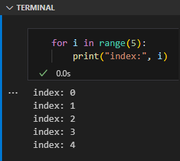

Penjelasan:

- Statement `print("index:", i)` muncul 5 kali, karena perulangan dilakukan dengan kontrol `range(5)` dimana statement tersebut menghasilkan object *range* dengan isi deret angka sejumlah `5` dimulai dari angka `0` hingga `4`.

- Statement `for i in range(5):` adalah contoh penulisan perulangan menggunakan `for` dan `range()`. Variabel `i` berisi nilai *counter* setiap iterasi, yang pada konteks ini adalah angka `0` hingga `4`.

- Statement `print("index:", i)` wajib ditulis menjorok ke kanan karena merupakan isi dari blok perulangan `for i in range(5):`.

### ◉ Fungsi `list()`

Fungsi `range()` menghasilkan object *sequence*, yaitu jenis data yang strukturnya mirip seperti list (tapi bukan list) yang kegunaan utamanya adalah untuk kontrol perulangan.

Object *sequence* bisa dikonversi bentuk list dengan cara dibungkus menggunakan fungsi `list()`.

```python
r = range(5)
print("r:", list(r))
```

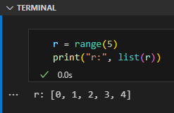

> - Pembahasan detail mengenai list ada di chapter [List](/basic/list)
> - Pembahasan detail mengenai *type conversion* ada di chapter [Konversi Tipe Data](#)

## A.9.2. Penerapan fungsi `range()`

Statement `range(n)` menghasilkan data *range* sejumlah `n` yang isinya dimulai dari angka `0`. Syntax `range(n)` adalah bentuk paling sederhana penerapan fungsi ini.

Selain `range(n)` ada juga beberapa cara penulisan lainnya:

- Menggunakan `range(start, stop)`. Hasilnya data *range* dimulai dari `start` dan hingga `stop - 1`. Sebagai contoh, `range(1, 4)` menghasilkan data range `[1, 2, 3]`.

- Menggunakan `range(start, stop, step)`. Hasilnya data *range* dimulai dari `start` dan hingga `stop - 1`, dengan nilai *increment* sejumlah `step`. Sebagai contoh, `range(1, 10, 3)` menghasilkan data range `[1, 4, 7]`.

Agar lebih jelas, silakan perhatikan kode berikut. Ke-3 perulangan ini ekuivalen, menghasilkan output yang sama.

<table class="custom-table">
<tr>
<td>

```python
for i in range(3):
    print("index:", i)
```

</td>
<td>


```python
for i in range(0, 3):
    print("index:", i)
```

</td>
<td>

```python
for i in range(0, 3, 1):
    print("index:", i)
```

</td>
</tr>
<tr>
<td>

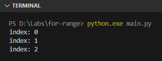

</td>
<td>


</td>
<td>


</td>
</tr>
</table>

Tambahan contoh penerapan `for` dan `range()`:

<table class="custom-table top">
<tr>
<td>

```python
for i in range(2, 10, 2):
    print("index:", i)
```

</td>
<td>

```python
for i in range(5, -5, -1):
    print("index:", i)
```

</td>
</tr>
<tr>
<td>

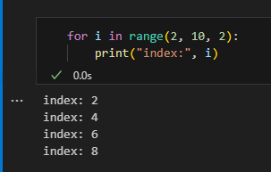

</td>
<td>

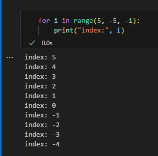

</td>
</tr>
</table>

## A.9.3. Iterasi element data kolektif

Perulangan menggunakan `for` bisa dilakukan pada beberapa jenis tipe data (seperti list, string, tuple, dan lainnya) caranya dengan langsung menuliskan saja variabel atau data tersebut pada statement `for`. 

> Tipe data yang bisa digunakan pada keyword `for` bisasa disebut dengan tipe iterator. Lebih detailnya dibahas pada chapter [Iterator](#).

Contoh penerapannya bisa dilihat di bawah ini:

### ◉ Iterasi data list

```python
messages = ["morning", "afternoon", "evening"]
for m in messages:
    print(m)
```

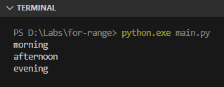

### ◉ Iterasi data tuple

```python
numbers = ("twenty four", 24)
for n in numbers:
    print(n)
```

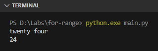

### ◉ Iterasi data string

Penggunaan keyword `for` pada tipe data string akan mengiterasi setiap karakter yang ada di string.

```python
for char in "hello python":
    print(char)
```

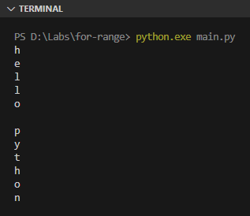

### ◉ Iterasi data dictionary

Penggunaan keyword `for` pada tipe data `dict` (atau dictionary) akan mengiterasi *key*-nya. Dari *key* tersebut *value* bisa diambil dengan mudah menggunakan notasi `dict[key]`.

```python
bio = {
    "name": "toyota camry",
    "year": 1993,
}

for key in bio:
    print("key:", key, "value:", bio[key])
```

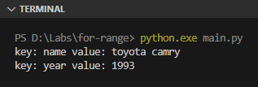

### ◉ Iterasi data set

```python
numbers = {"twenty four", 24}
for n in numbers:
    print(n)
```

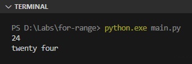

## A.9.4. Perulangan bercabang / *nested* `for`

Cara penerapan *nested loop* adalah cukup dengan menuliskan statement `for` sebagai isi dari statement `for` atasnya. Contoh:

```python
max = int(input("jumlah bintang: "))

for i in range(max):
    for j in range(0, max - i):
        print("*", end=" ")
    print()
```

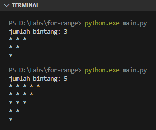

### ◉ Parameter opsional `end` pada fungsi `print()`

Fungsi `print()` memiliki parameter opsional bernama `end`, kegunaannya untuk mengubah karakter akhir yang muncul setelah data string di-*print*. *Default* nilai paramter `end` ini adalah `\n` atau karakter baris baru, itulah kenapa setiap selesai print pasti ada baris baru.

Statement `print("*", end=" ")` akan menghasilkan pesan `* ` yang di-akhiri dengan karakter spasi karena nilai parameter `end` di-set dengan nilai karakter spasi (atau ` `).

> Pembahasan detail mengenai fungsi dan parameter opsional ada di chapter berikut:
>
> - [Function](/basic/function)
> - [Function ➜ Positional, Optional, Keyword Arguments](/basic/positional-optional-keyword-argument)

### ◉ Fungsi `print()` tanpa parameter

Pemanggilan fungsi `print()` argument/parameter menghasilkan baris baru.

---

<div class="section-footnote">

## Catatan chapter 📑

### ◉ Source code praktik

<pre>
    <a href="https://github.com/novalagung/dasarpemrogramanpython-example/tree/master/for-range">
        github.com/novalagung/dasarpemrogramanpython-example/../for-range
    </a>
</pre>

### ◉ Chapter relevan lainnya

- [List](/basic/list)
- [String](/basic/string)
- [Function](/basic/function)

### ◉ Referensi

- https://docs.python.org/3/library/functions.html#func-range
- https://docs.python.org/3/library/functions.html#print
- https://python-reference.readthedocs.io/en/latest/docs/functions/range.html

</div>
