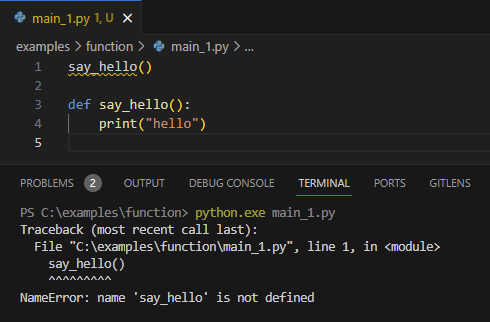
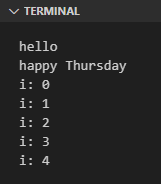

Penerapan fungsi di Python cukup mudah dan pada chapter ini kita akan memulai untuk mempelajarinya.

O iya, chapter ini merupakan chapter pembuka pembahasan topik fungsi. Ada banyak hal yang perlu dipelajari, oleh karena itu penulis memutuskan untuk memecah chapter menjadi beberapa bagian.

## A.22.1. Pengenalan Fungsi

Function atau fungsi adalah kode program yang terisolasi dalam satu blok kode, yang bisa dipanggil sewaktu-waktu. Fungsi memiliki beberapa atribut seperti nama fungsi, isi fungsi, parameter/argument, dan nilai balik.

Pembuatan fungsi dilakukan dengan keyword `def` diikuti dengan nama fungsi, lali di bawahnya ditulis body/isi fungsi. Sebagai contoh pada kode berikut fungsi `say_hello()` dideklarasikan dengan isi adalah sebuah statement yang menampilkan text `hello`.

```python
def say_hello():
    print("hello")
```

Setelah di deklarasikan, fungsi bisa dipanggil berkali-kali. Misalnya pada contoh berikut fungsi `say_hello()` dipanggil 3x.

```python
def say_hello():
    print("hello")

say_hello()
say_hello()
say_hello()
```

Output program sewaktu di-run:


Suatu fungsi hanya bisa diakses atau dipanggil setelah fungsi tersebut dideklarasikan (statement pemanggilan fungsi harus dibawah statement deklarasi fungsi). Jika fungsi dipaksa digunakan sebelum dideklarasikan hasilnya error.



Pada contoh di atas, selain `say_hello()` sebenarnya ada satu buah fungsi lagi yang digunakan pada contoh, yaitu `print()`. Fungsi `print()` dideklarasikan dalam Python Standard Library (stdlib). Sewaktu program dijalankan fungsi-fungsi dalam stdlib otomatis ter-*import* dan bisa digunakan.

> Lebih detailnya mengenai Python Standard Library dibahas pada chapter Python Standard Library

Untuk tambahan latihan, buat satu fungsi lagi, lalu isi dengan banyak statement. Misalnya:

```python
def print_something():
    print("hello")
    
    today = "Thursday"
    print(f"happy {today}")

    for i in range(5):
        print(f"i: {i}")

print_something()
```

Output program:



Penulisan isi fungsi (statement-statement dalam fungsi) harus disertai dengan *indentation* yang benar. Isi statement posisinya tidak boleh sejejar dengan blok deklarasi fungsi (secara vertikal). Isi fungsi harus lebih menjorok ke kanan.

Sebagai contoh, penulisan statement berikut adalah tidak valid dan menghasilkan error sewaktu di-run:

```python
def print_something():
print("hello")

today = "Thursday"
print(f"happy {today}")

for i in range(5):
    print(f"i: {i}")
```

## A.22.2. Parameter dan argument fungsi

Fungsi bisa memiliki parameter. Dengan adanya parameter, suatu nilai bisa di-sisipkan ke dalam fungsi secara dinamis saat pemanggilannya.

Parameter sendiri merupakan istilah untuk variabel yang menempel pada fungsi, yang mengharuskan kita untuk menyisipkan nilai pada parameter tersebut saat pemanggilan fungsi.

Contoh:

```python
def calculate_circle_area(r):
    area = 3.14 * (r ** 2)
    print("area of circle:", area)

calculate_circle_area(788)
# output ➜ area of circle: 1949764.1600000001
```

Penjelasan:

- Fungsi `calculate_circle_area()` dideklarasikan memiliki parameter bernama `r`.
- Notasi penulisan parameter fungsi ada diantara penulisan kurung `()` milik blok deklarasi fungsi.
- Tugas fungsi `calculate_circle_area()` adalah menghitung luas lingkaran dengan nilai jari-jari didapat dari parameter `r`. Nilai luas lingkaran kemudian di-print.
- Setelah blok deklarasi fungsi, ada statement pemanggilan fungsi `calculate_circle_area()`. Nilai numerik `788` digunakan sebagai argument parameter `r` pemanggilan fungsi tersebut.

:::info

Catatan:

- Parameter adalah istilah untuk variabel yang menempel di fungsi.
- Argument adalah isitilah untuk nilai yang disisipkan saat pemanggilan fungsi (yang ditampung oleh parameter).

Dewasa ini, kedua istilah tersebut dimaknai sama, jadi tidak usah bingung.

:::

Parameter *by default* bisa menerima segala jenis tipe data. Untuk memaksa suatu parameter agar hanya bisa menerima data tertentu, maka tulis tipe data yang diinginkan dengan notasi penulisan sama seperti deklarasi variabel.

Perhatikan contoh berikut agar lebih jelas. Fungsi `calculate_circle_area()` di atas di-*refactor* menjadi fungsi dengan 2 parameter yaitu `message` bertipe string dan `r` bertipe `int`.

```python
def calculate_circle_area(message: str, r: int):
    area = 3.14 * (r ** 2)
    print(message, area)

calculate_circle_area("area of circle:", 788)
```

Fungsi bisa tidak memiliki parameter, satu parameter, atau bisa lebih dari satu, tidak ada batasan.

> Python memiliki **args** dan **kwargs**, pembahasan detailnya ada di chapter [Function ➜ Args & Kwargs](/basic/args-kwargs)

O iya, argument fungsi bisa dituliskan secara horizontal maupun vertikal. Misalnya:

- Penulisan argument secara horizontal

    ```python
    calculate_circle_area("area of circle:", 788)
    ```

- Penulisan argument secara vertikal

    ```python
    calculate_circle_area(
        "area of circle:",
        788
    )
    ```

Penulisan argument secara vertikal umumnya cukup berguna pada situasi dimana fungsi yang dipanggil memiliki cukup banyak parameter yang harus diisi.

## A.22.3. Naming convention fungsi & parameter

Mengacu ke dokumentasi [PEP 8 – Style Guide for Python Code](https://peps.python.org/pep-0008/), nama fungsi dianjurkan untuk ditulis menggunakan [`snake_case`](https://en.wikipedia.org/wiki/Snake_case).

```python
def say_hello():
    print("hello")
```

Sedangkan aturan penulisan nama parameter/argument adalah sama seperti nama variabel, yaitu menggunakan [`snake_case`](https://en.wikipedia.org/wiki/Snake_case) juga. Misalnya:

```python
def say_hello(the_message):
    print(the_message)
```

## A.22.4. Nilai balik fungsi (*return value*)

Fungsi bisa memiliki *return value* atau nilai balik. Data apapun bisa dijadikan sebagai nilai balik fungsi, caranya dengan dengan memanfaatkan keyword `return`, tulis keyword tersebut di dalam isi fungsi diikuti dengan data yang ingin dikembalikan.

Mari coba praktekan, coba jalankan kode berikut:

```python
def calculate_circle_area(r: int):
    area = 3.14 * (r ** 2)
    return area

def calculate_circle_circumference(r: int):
    return 2 * 3.14 * r

area = calculate_circle_area(788)
print(f"area: {area:.2f}")
# output ➜ area: 1949764.16

circumference = calculate_circle_circumference(788)
print(f"circumference: {circumference:.2f}")
# output ➜ circumference: 4948.64
```

Penjelasan:

- Notasi penulisan parameter fungsi ada dalam kurung `()` milik blok deklarasi fungsi.

- Fungsi `calculate_circle_area()` dideklarasikan memiliki parameter bernama `r`.
    - Tugas fungsi ini adalah menghitung luas lingkaran dengan nilai jari-jari didapat dari parameter `r`. Hasil perhitungan disimpan di variabel `area`.
    - Di akhir isi fungsi, nilai variabel `area` dikembalikan menggunakan keyword `return`.

- Fungsi `calculate_circle_circumference()` mirip seperti fungsi sebelumnya, hanya saja fungsi ini memiliki tugas yang berbeda yaitu untuk menghitung keliling lingkaran.
    - Fungsi ini melakukan perhitungan `2 * 3.14 * r` kemudian hasilnya dijadikan nilai balik.

- Setelah blok deklarasi fungsi, ada statement pemanggilan fungsi `calculate_circle_area()`. Nilai `788` digunakan sebagai argument parameter `r` pemanggilan fungsi tersebut.

- Kemudian ada lagi statement pemanggilan fungsi `calculate_circle_circumference()`. Nilai `788` digunakan sebagai argument parameter `r` pemanggilan fungsi tersebut.

- Nilai balik kedua pemanggilan fungsi di atas masing-masing di-print.

O iya, fungsi yang didalamnya tidak memiliki statement `return` sebenarnya juga mengembalikan nilai balik, yaitu `None`.

> Pembahasan detail mengenai tipe data `None` ada di chapter [None](/basic/none)

## A.22.5. Tipe data nilai balik fungsi (*return type*)

Python mendukung *type hinting* yaitu penentuan tipe data nilai balik fungsi yang ditulis secara eksplisit. Penerapannya bisa dilihat pada kode berikut dimana fungsi `calculate_circle_area()` dan `calculate_circle_circumference()` tipe data nilai baliknya ditulis secara jelas.

```python
def calculate_circle_area(r: int) -> float:
    area = 3.14 * (r ** 2)
    return area

def calculate_circle_circumference(r: int) -> float:
    return 2 * 3.14 * r

area = calculate_circle_area(788)
print(f"area: {area:.2f}")
# output ➜ area: 1949764.16

circumference = calculate_circle_circumference(788)
print(f"circumference: {circumference:.2f}")
# output ➜ circumference: 4948.64
```

Notasi penulisan *type hinting* adalah dengan menuliskan tanda `->` setelah deklarasi fungsi diikuti dengan tipe datanya.

```python
def <function_name>() -> <data_type>:
    return <data>
```

Penerapan *type hinting* mewajibkan fungsi untuk selalu memiliki nilai balik berupa data bertipe sesuai.

Jika nilai balik tipe datanya berbeda dengan yang ditulis di deklarasi fungsi, warning akan muncul.


Khusus untuk tipe data nilai balik `None` tidak wajib diikuti statement `return`. Contoh:

- Fungsi dengan return type `None` diikuti statement `return`:

    ```python
    def say_hello() -> None:
        print("hello world")
        return None
    ```

- Fungsi dengan return type `None` tanpa diikuti statement `return`:

    ```python
    def say_hello() -> None:
        print("hello world")
    ```

- Fungsi dengan tanpa return type maupun return statement:

    ```python
    def say_hello():
        print("hello world")
    ```

## A.22.6. Keyword `pass`

Keyword `pass` secara fungsional umumnya tidak terlalu berguna, kecuali untuk beberapa situasi. Misalnya untuk dipergunakan sebagai isi pada fungsi yang masih belum selesai dikerjakan. Daripada fungsi isinya kosong dan akan menghasilkan error kalau di-run, lebih baik diisi `pass`.

Sebagai contoh, penulis berencana membuat fungsi bernama `transpose_matrix()`, namun fungsi tersebut tidak akan di-*coding* sekarang karena suatu alasan. Jadi yang penulis lakukan adalah mendeklarasikan fungsi tersebut, kemudian diisi hanya statement `pass`.

```python
# need to complete sometime later
def transpose_matrix(matrix):
    pass
```

Dari blok kode di atas, nantinya engineer akan tau bahwa fungsi tersebut akan dibuat tapi belum selesai pengerjaannya.

---

<div class="section-footnote">

## Catatan chapter 📑

### ◉ Source code praktik

<pre>
    <a href="https://github.com/novalagung/dasarpemrogramanpython-example/tree/master/function">
        github.com/novalagung/dasarpemrogramanpython-example/../function
    </a>
</pre>

### ◉ Chapter relevan lainnya

- [Function ➜ Positional, Optional, Keyword Arguments](/basic/positional-optional-keyword-argument)
- [Function ➜ Args & Kwargs](/basic/args-kwargs)
- [Function ➜ Closure](/basic/closure)
- [Function ➜ Lambda](/basic/lambda)

### ◉ Referensi

- https://docs.python.org/3/tutorial/controlflow.html#defining-functions
- https://peps.python.org/pep-3102/
- https://peps.python.org/pep-0484/

</div>
