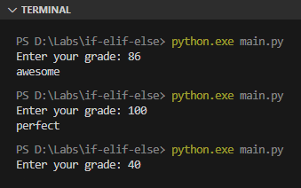
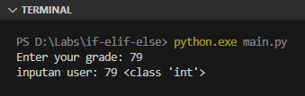
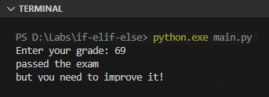

Seleksi kondisi adalah suatu blok kode yang dieksekusi hanya ketika kriteria yang ditentukan terpenuhi. Teknik seleksi kondisi banyak digunakan untuk kontrol alur program.

Python mengenal beberapa keyword seleksi kondisi, dan pada chapter ini akan kita pelajari.

## A.8.1. Keyword `if`

`if` adalah keyword seleksi kondisi di Python. Cara penerapan keyword ini sangat mudah, cukup tulis saja `if` diikuti dengan kondisi berupa nilai `bool` atau statement operasi logika, lalu dibawahnya ditulis blok kode yang ingin dieksekusi ketika kondisi tersebut terpenuhi. Contoh:

```python
grade = 100

if grade == 100:
    print("perfect")

if grade == 90:
    print("ok")
    print("keep working hard!")
```


Bisa dilihat di output, hanya pesan `perfect` yang muncul karena kondisi `grade == 100` adalah yang terpenuhi. Sedangkan statement `print("ok")` tidak tereksekusi karena nilai variabel `grade` bukanlah `90`.

### ◉ *Block indentation*

Di python, suatu blok kondisi ditandai dengan *indentation* atau spasi, yang menjadikan kode semakin menjorok ke kanan.

Sebagai contoh, 2 blok kode `print` berikut merupakan isi dari seleksi kondisi `if grade == 90`.

```python
if grade == 90:
    print("ok")
    print("keep working hard!")
```

> Sesuai aturan [PEP 8 – Style Guide for Python Code](https://peps.python.org/pep-0008/#indentation), *indentation* di Python menggunakan 4 karakter spasi dan bukan karakter tab.

## A.8.2. Keyword `elif`

`elif` (kependekan dari **else if**) digunakan untuk menambahkan blok seleksi kondisi baru, untuk mengantisipasi blok `if` yang tidak terpenuhi.

Dalam penerapannya, suatu blok seleksi kondisi harus diawali dengan `if`. Keyword `elif` hanya bisa dipergunakan pada kondisi setelahnya yang masih satu rantai (masih satu *chain*). Contoh:

```python
str_input = input('Enter your grade: ')
grade = int(str_input)

if grade == 100:
    print("perfect")
elif grade >= 85:
    print("awesome")
elif grade >= 65:
    print("passed the exam")
```

Jalankan program di atas, kemudian inputkan suatu nilai numerik lalu tekan enter.



Kode di atas menghasilkan:

- Ketika nilai inputan adalah `86`, muncul pesan `awesome` karena blok seleksi kondisi yang terpenuhi adalah `elif grade >= 85`.
- Ketika nilai inputan adalah `100`, muncul pesan `perfect` karena blok seleksi kondisi yang terpenuhi adalah `grade == 100`.
- Ketika nilai inputan adalah `40`, tidak muncul pesan karena semua blok seleksi kondisi tidak terpenuhi.

### ◉ Fungsi *input()*

Fungsi input digunakan untuk menampilkan suatu pesan text (yang disisipkan saat fungsi dipanggil) dan mengembalikan nilai inputan user dalam bentuk string.

Agar makin jelas, silakan praktikan kode berikut:

```python
str_input = input('Enter your grade: ')
print("inputan user:", str_input, type(str_input))
```


Kode di atas menghasilkan:

1. Text `Enter your grade :` muncul, kemudian kursor akan berhenti disitu.
1. User perlu menuliskan sesuatu kemudian menekan tombol enter agar eksekusi program berlanjut.
1. Inputan dari user kemudian menjadi nilai balik fungsi `input()` (yang pada contoh di atas ditampung oleh variabel `input_str`).
1. Nilai inputan user di print menggunakan statement `print("inputan user:", str_input)`.

### ◉ Fungsi `type()`

Fungsi `type()` digunakan untuk melihat informasi tipe data dari suatu nilai atau variabel. Fungsi ini mengembalikan string dalam format `<class 'tipe_data'>`.

### ◉ *Type conversion* / konversi tipe data

Konversi tipe data string ke `int` dilakukan menggunakan fungsi `int()`. Dengan menggunakan fungsi tersebut, data string yang disisipkan pada parameter, tipe datanya berubah menjadi `int`.

Sebagai contoh, bisa dilihat pada program berikut ini, hasil statement `type(grade)` adalah `<class 'int'>` yang menunjukan bahwa tipe datanya adalah `int`.

```python
str_input = input('Enter your grade: ')
grade = int(str_input)
print("inputan user:", grade, type(grade))
```



> Pembahasan detail mengenai *type conversion* ada di chapter [Konversi Tipe Data](#)

## A.8.3. Keyword `else`

`else` digunakan sebagai blok seleksi kondisi penutup ketika blok `if` dan/atau `elif` dalam satu *chain* tidak ada yang terpenuhi. Contoh:

```python
str_input = input('Enter your grade: ')
grade = int(str_input)

if grade == 100:
    print("perfect")
elif grade >= 85:
    print("awesome")
elif grade >= 65:
    print("passed the exam")
else:
    print("below the passing grade")
```

## A.8.4. Seleksi kondisi bercabang / *nested*

Seleksi kondisi bisa saja berada di dalam suatu blok seleksi kondisi. Teknik ini biasa disebut dengan seleksi kondisi bercabang atau bersarang.

Di Python, cara penerapannya cukup dengan menuliskan blok seleksi kondisi tersebut. Gunakan *indentation* yang lebih ke kanan untuk seleksi kondisi terdalam.

```python
str_input = input('Enter your grade: ')
grade = int(str_input)

if grade == 100:
    print("perfect")

elif grade >= 85:
    print("awesome")

elif grade >= 65:
    print("passed the exam")

    if grade <= 70:
        print("but you need to improve it!")
    else:
        print("with ok grade")

else:
    print("below the passing grade")
```



> Pada kode di atas, pada seleksi kondisi terluar, di bawah blok `if` dan `elif` sengaja penulis tulis di baris baru agar lebih mudah untuk dibaca. Hal seperti ini diperbolehkan.

## A.8.5. Seleksi kondisi dengan operasi logika

Keyword `and`, `or`, dan `not` bisa digunakan dalam seleksi kondisi. Contohnya:

```python
grade = int(input('Enter your current grade: '))
prev_grade = int(input('Enter your previous grade: '))

if grade >= 90 and prev_grade >= 65:
    print("awesome")
if grade >= 90 and prev_grade < 65:
    print("awesome. you definitely working hard, right?")
elif grade >= 65:
    print("passed the exam")
else:
    print("below the passing grade")

if (grade >= 65 and not prev_grade >= 65) or (not grade >= 65 and prev_grade >= 65):
    print("at least you passed one exam. good job!")
```

## A.8.6. Seleksi kondisi sebaris & *ternary*

Silakan perhatikan kode sederhana berikut, isinya adalah seleksi kondisi sederhana pengecekan nilai `grade >= 65` atau tidak.

```python
if grade >= 65:
    print("passed the exam")
else:
    print("below the passing grade")
```

Kode di atas bisa dituliskan dalam bentuk alternatif penulisan kode lainnya:

### ◉ *One-line* / sebaris

```python
if grade >= 65: print("passed the exam")
if grade < 65: print("below the passing grade")
```

Metode penulisan sebaris ini cocok diterapkan pada situasi dimana seleksi kondisi hanya memiliki 1 kondisi saja.

### ◉ *Ternary*

```python
print("passed the exam") if grade >= 65 else print("below the passing grade")
```

Metode penulisan *ternary* umum diterapkan pada blok kode seleksi kondisi yang memiliki 2 kondisi (`True` dan `False`).

### ◉ *Ternary* dengan nilai balik

```python
message = "passed the exam" if grade >= 65 else "below the passing grade"
print(message)
```

Metode penulisan ini sebenarnya adalah sama seperti penerapan ternary sebelumnya, perbedaannya: pada metode ini setiap kondisi menghasilkan nilai balik yang umumnya ditampung oleh variabel. Pada contoh di atas, nilai balik ditampung variabel `message`.

## A.8.7. Pattern matching

Selain keyword `if`, Python menyediakan keyword lain yaitu `match` dan `case` yang kegunaannya adalah untuk pattern matching. Pattern matching sendiri merupakan teknik seleksi kondisi yang cukup advance, mendukung banyak variasi pencocokan pola.

Lebih detailnya mengenai pattern matching ada di chapter [Pattern Matching ➜ match](/basic/pattern-matching)

---

<div class="section-footnote">

## Catatan chapter 📑

### ◉ Source code praktik

<pre>
    <a href="https://github.com/novalagung/dasarpemrogramanpython-example/tree/master/if-elif-else">
        github.com/novalagung/dasarpemrogramanpython-example/../if-elif-else
    </a>
</pre>

### ◉ Referensi

- https://docs.python.org/3/tutorial/controlflow.html

</div>
