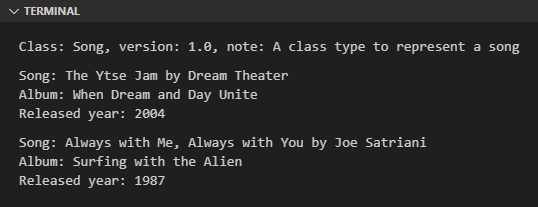

Pada chapter ini, kita akan belajar lebih dalam tentang attribute suatu class, jenis-jenisnya, dan penerapannya.

## A.37.1. Attributes

Attribute merupakan salah satu property class selain method. Python mengenal dua jenis attribute yaitu instance attribute (yang sudah kita bahas di beberapa chapter sebelumnya) dan class attribute.

### ◉ Instance attribute

Instance attribute adalah variabel yang terasosiasi dengan instance object, jadi pengaksesannya harus lewat object. Contoh penerapan instance attribute:

```python
class Pencil:

    def __init__(self):
        self.note = "A class type to represent a book"

pencil1 = Pencil()
print(f"Object pencil1 note: {pencil1.note}")
# output ➜ Object pencil1 note: A class type to represent a book
```

Pada contoh di atas, variabel `note` merupakan instance attribute milik class `Pencil`. Ciri khas attribute bisa dilihat dari tempat deklarasinya, yaitu di dalam konstruktor dan menempel pada variabel `self`.

> Instance attribute terkadang disebut dengan **data attribute** atau **instance variable**. Ketiga istilah tersebut merepresentasikan maksud yang sama.

### ◉ Class attribute

Class attribute adalah variabel yang terasosiasi dengan class yang pengaksesanya bisa langsung dari class atau bisa juga via object (seperti pengaksesan instance attribute). Contoh penerapan class attribute:

```python
class Book:
    note = "A class type to represent a book"

print(f"Class Book note: {Book.note}")
# output ➜ Class Book note: A class type to represent a book
```

Berbeda dibanding contoh sebelumnya, kali ini variabel `note` dideklarasikan langsung di bawah blok `class` (tidak di dalam konstruktor) dan tidak ditempelkan ke variabel `self`. Cara deklarasi class attribute bisa dibilang sama seperti deklarasi variabel bisa.

Class attribute bisa diakses langsung dari class contohnya seperti pada kode di atas, selain itu bisa juga diakses lewat instance object. Contoh:

```python
class Book:
    note = "A class type to represent a book"

print(f"Class Book note: {Book.note}")
# output ➜ Class Book note: A class type to represent a book

book1 = Book()
print(f"Object book1 note: {book1.note}")
# output ➜ Object book1 note: A class type to represent a book
```

> Class attribute terkadang disebut dengan **class variable**. Kedua istilah tersebut merepresentasikan maksud yang sama.

### ◉ Kombinasi instance attribute & class attribute

Instance attribute dan class attribute keduanya bisa digunakan secara bersamaan dalam satu class yang sama. Penerapannya cukup umum, misalnya pada kasus dimana ada class yang memiliki 2 kategori attribute. Misalnya pada class `Song` berikut, ada attribute yang berasosiasi langsung dengan class yaitu `note` & `version`; dan ada juga attribute lainnya yang berasosiasi dengan instance object.

```python
class Song:
    note = "A class type to represent a song"
    version = 1.0
    
    def __init__(self, name = "", artist = "", album = "", released_year = 2000):
        self.name = name
        self.artist = artist
        self.album = album
        self.released_year = released_year

    def info(self):
        print(f"Song: {self.name} by {self.artist}")
        print(f"Album: {self.album}")
        print(f"Released year: {self.released_year}")

songs = [
    Song(
        name="The Ytse Jam",
        artist="Dream Theater",
        album="When Dream and Day Unite",
        released_year=2004
    ),
    Song(
        name="Always with Me, Always with You",
        artist="Joe Satriani",
        album="Surfing with the Alien",
        released_year=1987
    ),
]

print(f"Class: Song, version: {Song.version}, note: {Song.note}")

for s in songs:
    s.info()
```

Output program:



Class attribute biasanya diterapkan untuk menyimpan data yang sifatnya global dan tidak terpaut ke object, contohnya seperti attribute `note` dan `version` pada class `Song` di atas.

Berbeda dengan instance attribute yang digunakan untuk menyimpan data spesifik per object. Bisa dilihat di contoh ada list berisi 2 element yang dibuat dari class `Song`. Masing-masing instance object tersebut data attribute-nya berbeda satu sama lain.

## A.37.2. Attribute lookup

Saat suatu instance attribute diakses dari instance object, yang terjadi di balik layar adalah Python melakukan *lookup* (atau pengecekan) terhadap attribute dengan urutan sebagai berikut:

1. Jika instance attribute ditemukan, maka Python mengembalikan value instance attribute.
1. Jika instance attribute yang dicari tidak ditemukan, maka Python mengembalikan value class attribute.
1. Jika class attribute yang dicari tidak ditemukan, maka error.

Dari kondisi lookup di atas bisa disimpulkan bahwa sewaktu pengaksesan instance attribute, Python selalu memprioritaskan data yang ada di instance attribute dibanding property lainnya.

Lalu bagaiamana jika misalnya ada class yang miliki class attribute dan juga instance attribute yang namanya sama persis? Jawabannya: Python tetap memprioritaskan nilai instance attribute.

Contoh bisa dilihat pada kode berikut:

```python
class Person:
    name = "A person"
    
    def __init__(self, name):
        self.name = name

person1 = Person("Noval Agung Prayogo")
print(f"Object person1 name: {person1.name}")
# output ➜ Object person1 name: Noval Agung Prayogo

print(f"Class Person name: {Person.name}")
# output ➜ Class Person name: A person
```

Variabel `person1` ketika diakses attribute `name`-nya, yang dikembalikan adalah nilai instance attribute, meskipun sebenarnya class `Person` juga memiliki class attribute dengan nama yang sama.

## A.37.3. Attribute mutability

### ◉ Perubahan nilai instance attribute

Instance attribute datanya adalah menempel ke instance object. Jadinya, setiap object bisa saja memiliki attribute dengan value berbeda satu sama lain.

Dimisalkan ada satu variabel object yang nilai attribute-nya diubah, maka efek perubahan hanya terjadi di variabel tersebut saja, tidak berefek ke variabel lain. Agar lebih jelas silakan lihat contoh berikut:

```python
class Pencil:

    def __init__(self):
        self.note = "A class type to represent a pencil"

pencil1 = Pencil()
pencil1.note = "A pencil"
pencil2 = Pencil()

print(f"Object pencil1 note: {pencil1.note}")
# output ➜ Object pencil1 note: A pencil

print(f"Object pencil2 note: {pencil2.note}")
# output ➜ Object pencil2 note: A class type to represent a pencil
```

### ◉ Perubahan nilai class attribute dari instance object

Bagaimana jika attribute yang diubah adalah class attribute, dan perubahan dilakukan lewat instance object? Jawabannya: nilai baru hasil operasi assignment tersebut akan ditampung sebagai nilai instance attribute dan efeknya hanya ada pada object saja (tidak berefek ke class). Contoh:

```python
class Book:
    note = "A class type to represent a book"

book1 = Book()
book2 = Book()
book2.note = "A book"

print(f"Class Book note: {Book.note}")
# output ➜ Class Book note: A class type to represent a book

print(f"Object book1 note: {book1.note}")
# output ➜ Object book2 note: A class type to represent a book

print(f"Object book2 note: {book2.note}")
# output ➜ Object book1 note: A book

print(f"Class Book note: {Book.note}")
# output ➜ Class Book note: A class type to represent a book
```

Bisa dilihat pada bagian statement `book2.note = "A book"` efek peruabahannya hanya pada instance object-nya (`book2`). Class attribute `Book.note` nilainya tetap.

### ◉ Perubahan nilai class attribute secara langsung

Beda lagi untuk kasus dimana attribute yang diubah nilainya adalah class attribute dengan perubahan dilakukan secara langsung dari class-nya. Perubahan tersebut akan berefek ke semua object dan class itu sendiri.

Sebagai contoh, pada kode berikut, object `book1` dan `book2` dibuat dari class `Book`. Kemudian class attribute `Book.note` diubah nilainya, efeknya: class attribute dalam `book1` dan `book2` juga ikut berubah.

```python
class Book:
    note = "A class type to represent a book"

book1 = Book()
book2 = Book()

Book.note = "A book"

print(f"Class Book note: {Book.note}")
# output ➜ Class Book note: A book

print(f"Object book1 note: {book1.note}")
# output ➜ Object book1 note: A book

print(f"Object book2 note: {book2.note}")
# output ➜ Object book2 note: A book
```

---

<div class="section-footnote">

## Catatan chapter 📑

### ◉ Source code praktik

<pre>
    <a href="https://github.com/novalagung/dasarpemrogramanpython-example/tree/master/instance-attribute-class-attribute">
        github.com/novalagung/dasarpemrogramanpython-example/../instance-attribute-class-attribute
    </a>
</pre>

### ◉ Chapter relevan lainnya

- [OOP ➜ Class & Object](/basic/class-object)
- [OOP ➜ Property Visibility](/basic/property-visibility)

### ◉ TBA

- list-type attribute behaviour on class attribute vs instance attribute

### ◉ Referensi

- https://docs.python.org/3/tutorial/classes.html

</div>
