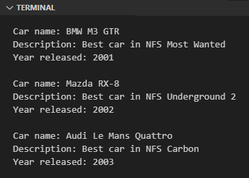
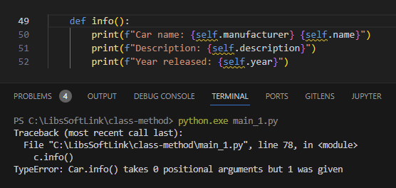
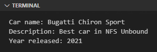

Jika attribute adalah variabel yang berasosiasi dengan class, maka method adalah fungsi yang berasosiasi dengan class.

Python mengenal 3 jenis method yaitu instance method, class method, dan static method. Chapter ini fokus ke pembahasan tentang instance method saja.

> - Pembahasan detail mengenai class method ada di chapter [OOP ➜ Class Method](/basic/class-method)
> - Pembahasan detail mengenai static method ada di chapter [OOP ➜ Static Method](/basic/static-method)

## A.34.1. Pengenalan Instance Method

Instance method memiliki beberapa karakteristik jika dilihat dari syntax-nya:

1. Deklarasinya di dalam block class
1. Parameter pertamanya adalah `self`
1. Method diakses menggunakan notasi `<object>.<method>()`

Dalam praktik kali ini, kita akan melanjutkan praktek class `Car` yang telah dibuat di chapter sebelumnya.

Ok, pertama-tama siapkan deklarasi class `Car` dengan 4 buah property yaitu `name`, `manufacturer`, `year`, dan `description`. Kemudian dari class tersebut, buat 3 buah instance object baru, lalu print data attribute tiap variabel.

```python
class Car:
    def __init__(self):
        self.name = ""
        self.manufacturer = ""
        self.year = 0
        self.description = ""

all_cars = []

car1 = Car()
car1.name = "M3 GTR"
car1.manufacturer = "BMW"
car1.year = 2001
car1.description = "Best car in NFS Most Wanted"
all_cars.append(car1)

car2 = Car()
car2.name = "RX-8"
car2.manufacturer = "Mazda"
car2.year = 2002
car2.description = "Best car in NFS Underground 2"
all_cars.append(car2)

car3 = Car()
car3.name = "Le Mans Quattro"
car3.manufacturer = "Audi"
car3.year = 2003
car3.description = "Best car in NFS Carbon"
all_cars.append(car3)

for c in all_cars:
    print(f"Car name: {c.manufacturer} {c.name}")
    print(f"Description: {c.description}")
    print(f"Year released: {c.year}")
    print()
```

Output program:



Setelah itu, modifikasi class `Car` dengan menambahkan instance method baru bernama `info()`. Melalui method ini, value attribute di-print.

```python
class Car:
    def __init__(self):
        self.name = ""
        self.manufacturer = ""
        self.year = 0
        self.description = ""
    
    def info(self):
        print(f"Car name: {self.manufacturer} {self.name}")
        print(f"Description: {self.description}")
        print(f"Year released: {self.year}")
```

Pada bagian blok kode perulangan, ganti tiga baris statement print dengan pemanggilan method `info()`.

- Before:

    ```python
    for c in all_cars:
        print(f"Car name: {c.manufacturer} {c.name}")
        print(f"Description: {c.description}")
        print(f"Year released: {c.year}")
        print()
    ```

- After:

    ```python
    for c in all_cars:
        c.info()
        print()
    ```

Jalankan program dan lihat outputnya, pasti sama persis dengan program sebelumnya.

## A.34.2. Variabel `self`

Salah satu aturan pada instance method adalah fungsi harus memiliki parameter pertama bernama `self`. Parameter tersebut wajib ada saat deklarasi, dan tidak boleh diisi argument saat pemanggilan. Jika dipaksa diisi dengan argument, maka pasti muncul error.


> Parameter `self` bisa disebut dengan parameter *implicit* atau implisit karena kita tidak berinteraksi secara langsung saat pengisian nilai. Nilai `self` otomatis terisi saat pemanggilan instance method via instance object.

Dimisalkan lagi, parameter `self` tidak ditulis saat deklarasi instance method, hasilnya juga error.



Parameter `self` merupakan variabel yang merepresentasikan suatu object atau instance. Melalui variabel ini, kita dapat mengakses instance attribute maupun instance method (selama property tersebut masih dalam satu class).

Pada contoh sebelumnya, terlihat bagaimana aplikasi dari variabel `self` untuk mengakses attribute:

```python
class Car:
    def __init__(self):
        self.name = ""
        self.manufacturer = ""
        self.year = 0
        self.description = ""

    def info(self):
        print(f"Car name: {self.manufacturer} {self.name}")
        print(f"Description: {self.description}")
        print(f"Year released: {self.year}")
```

Selain untuk mengakses nilainya, dari variabel `self` suatu attribute juga dapat diubah nilainya, sebagaimana pada contoh berikut nilai attribute `year` dan `description` diubah melalui pemanggilan instance method `set_details()`.

Karena instance method wajib dideklarasikan dengan parameter pertama `self`, maka parameter untuk menampung data `year` dan `description` ditulis sebagai parameter setelahnya.

```python
class Car:
    def __init__(self):
        self.name = ""
        self.manufacturer = ""
        self.year = 0
        self.description = ""

    def info(self):
        print(f"Car name: {self.manufacturer} {self.name}")
        print(f"Description: {self.description}")
        print(f"Year released: {self.year}")

    def set_details(self, year, description):
        self.year = year
        self.description = description
```

Setelah itu, ubah statement pengisian nilai `year` dan `description` menggunakan method `set_details()` seperti ini:

```python
all_cars = []

car1 = Car()
car1.name = "M3 GTR"
car1.manufacturer = "BMW"
car1.set_details(2001, "Best car in NFS Most Wanted")
all_cars.append(car1)

car2 = Car()
car2.name = "RX-8"
car2.manufacturer = "Mazda"
car2.set_details(2002, "Best car in NFS Underground 2")
all_cars.append(car2)

car3 = Car()
car3.name = "Le Mans Quattro"
car3.manufacturer = "Audi"
car3.set_details(2003, "Best car in NFS Carbon")
all_cars.append(car3)

for c in all_cars:
    c.info()
    print()
```

Pada pemanggilan method `set_details()` object `car1`:

- Argument `2001` ditampung oleh parameter `year`
- Argument `Best car in NFS Most Wanted` ditampung oleh parameter `description`.

## A.34.3. Naming convention method & param

Mengacu pada dokumentasi [PEP 8 – Style Guide for Python Code](https://peps.python.org/pep-0008/), nama method dianjurkan untuk ditulis menggunakan snake_case (seperti fungsi). Contohnya bisa dilihat pada method `get_name()` berikut:

```python
class FavoriteFood:
    def __init__(self):
        self.name = ""

    def print_name(self):
        print(self.name)

    def get_name(self) -> str:
        return self.name
```

Sedangkan aturan penulisan nama parameter/argument adalah sama seperti nama variabel, yaitu menggunakan snake_case juga. Misalnya:

```python
class FavoriteFood:
    def __init__(self):
        self.name = ""

    def print_name(self):
        print(self.name)

    def get_name(self) -> str:
        return self.name

    def set_name(self, name):
        self.name = name
```

## A.34.4. Pengaksesan instance method dari class

Sebenarnya ada dua cara untuk mengakses instance method:

1. Lewat instance object, contohnya seperti kode `car1.set_details()` yang telah dipraktekan.
2. Lewat class dengan ketentuan dalam pemanggilan methodnya, parameter pertama harus diisi dengan instance object.

Silakan perhatikan kode berikut agar lebih jelas mengenai cara ke-2.

```python
class FavoriteFood:
    def __init__(self):
        self.name = ""

    def print_name(self):
        print(self.name)

    def get_name(self) -> str:
        return self.name

    def set_name(self, name):
        self.name = name

food1 = FavoriteFood()
food1.set_name("Pizza")
food1.print_name()
print(food1.get_name())

FavoriteFood.set_name(food1, "Burger")
FavoriteFood.print_name(food1)
print(food1.get_name())
```

Pada kode di atas, `food1` merupakan instance object dari class `FavoriteFood`. Lewat object tersebut 3 buah method ini dipanggil: `set_name()`, `print_name()`, dan `get_name()`.

Kemudian dibawahnya lagi, method `set_name()` dan `print_name()` dipanggil ulang namun dengan syntax yang berbeda. Method dipanggil dari class dan argument parameter parameter pertamanya diisi instance object `food1`.

Penulisan pemanggilan method dari class seperti itu adalah diperbolehkan dan ekuivalen dengan pemanggilan instance method via instance object. Perbedaannya:

- Pada pengaksesan instance method via instance object, parameter `self` tidak perlu diisi.
- Pada pengaksesan instance method via class, parameter `self` harus selalu diisi dengan instance object.

Agar makin jelas, silakan lihat tabel berikut. Contoh di kolom pertama adalah ekuivalen dengan contoh di kolom ke 2.

<table class="no-content-background">
    <thead>
        <tr>
            <th class="aligh-left">Via instance object</th>
            <th class="aligh-left">Via class</th>
        </tr>
    </thead>
    <tbody>
        <tr>
<td>

```python
food1.set_name("Pizza")
```

</td>
<td>

```python
FavoriteFood.set_name(food1, "Pizza")
```

</td>
        </tr>
        <tr>
<td>

```python
food1.print_name()
```

</td>
<td>

```python
FavoriteFood.print_name(food1)
```

</td>
        </tr>
        <tr>
<td>

```python
food1.get_name()
```

</td>
<td>

```python
FavoriteFood.get_name(food1)
```

</td>
        </tr>
    </tbody>
</table>

## A.34.5. Pengaksesan method dari method lain

Lewat variabel `self` tidak hanya instance attribute yang dapat diakses, melainkan semua jenis property (termasuk instance method). Pada contoh berikut, di dalam method `info()` terdapat statement pemanggilan method yaitu `get_name()`.

Instance method `get_name()` mengembalikan data string berisi kombinasi attribute `manufacturer` dan `name`.

```python
class Car:
    def __init__(self):
        self.name = ""
        self.manufacturer = ""
        self.year = 2023
        self.description = ""
    
    def set_details(self, year, description):
        self.year = year
        self.description = description

    def get_name(self):
        return f"{self.manufacturer} {self.name}"

    def info(self):
        print(f"Car name: {self.get_name()}")
        print(f"Description: {self.description}")
        print(f"Year released: {self.year}")
```

## A.34.6. Argument method: positional, optional, keyword arg

Aturan-aturan dalam deklarasi parameter dan pengisian argument fungsi juga berlaku pada method, diantaranya:

- Parameter method yang memiliki default value:

    ```python
    class Car:

        # ...

        def set_details(self, year = 2002, description = ""):
            self.year = year
            self.description = description

        # ...
    ```

- Positional argument:

    ```python
    car1 = Car()
    car1.name = "M3 GTR"
    car1.manufacturer = "BMW"
    car1.set_details(2001, "Best car in NFS Most Wanted")
    ```

- Optional argument:

    ```python
    car2 = Car()
    car2.name = "RX-8"
    car2.manufacturer = "Mazda"
    car2.set_details(description="Best car in NFS Underground 2")
    ```

- Keyword argument:

    ```python
    car3 = Car()
    car3.name = "Le Mans Quattro"
    car3.manufacturer = "Audi"
    car3.set_details(description="Best car in NFS Carbon", year=2003)
    ```

## A.34.7. Argument method: args & kwargs

Sama seperti fungsi, method juga bisa berisi parameter **args** maupun **kwargs**.

Contoh penerapan **kwargs** pada method bisa dilihat di program berikut. Modifikasi program di atas, pada method `set_details()` ubah isinya menjadi seperti ini:

```python
class Car:

    # ...

    def set_details(self, **param):
        for key in param:
            if key == "name":
                self.name = param[key]
            if key == "manufacturer":
                self.manufacturer = param[key]
            if key == "year":
                self.year = param[key]
            if key == "description":
                self.description = param[key]

    # ...
```

Melalui parameter **\*\*param**, kita dapat menentukan attribute mana yang akan diisi nilainya secara dinamis. Sekarang panggil methodnya lalu isi sesuai kebutuhan, misalnya: 

```python
car4 = Car()
car4.set_details(name="Chiron Sport", manufacturer="Bugatti")
car4.set_details(year=2021)
car4.set_details(description="Best car in NFS Unbound")
car4.info()
```

Output program:



---

<div class="section-footnote">

## Catatan chapter 📑

### ◉ Source code praktik

<pre>
    <a href="https://github.com/novalagung/dasarpemrogramanpython-example/tree/master/instance-method">
        github.com/novalagung/dasarpemrogramanpython-example/../instance-method
    </a>
</pre>

### ◉ Chapter relevan lainnya

- [OOP ➜ Class & Object](/basic/class-object)
- [OOP ➜ Constructor](/basic/class-constructor)
- [OOP ➜ Class Method](/basic/class-method)
- [OOP ➜ Static Method](/basic/static-method)
- [OOP ➜ Abstract Method](/basic/abstract-method)
- [OOP ➜ Data Class](/basic/dataclass)

### ◉ TBA

- method & lambda
- method & closure

### ◉ Referensi

- https://docs.python.org/3/tutorial/classes.html

</div>
