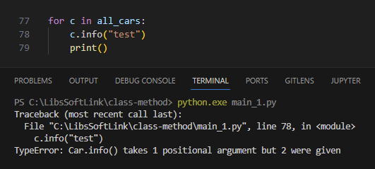

Jika attribute adalah variabel yang berasosiasi dengan class, maka method adalah fungsi yang berasosiasi dengan class. Pada chapter ini kita akan membahas tentang method.

> Method sebenarnya ada 2 jenis: yaitu instance method dan class method

## A.31.1. Penerapan Method

Method memiliki beberapa karakteristik, yaitu:

1. Deklarasinya di dalam block class
1. Parameter pertama adalah `self`
1. Method diakses menggunakan notasi `<object>.<method>()`

Pada praktek kali ini, kita akan melanjutkan class yang telah dibuat di chapter sebelumnya, yaitu `Car`.

Pertama-tama siapkan deklarasi class `Car` dengan 4 buah property yaitu `name`, `manufacturer`, `year`, dan `description`. Kemudian dari class `Car` buat 3 buah instance object, lalu print datanya (nilai attribute-nya).

```python
class Car:
    def __init__(self):
        self.name = ""
        self.manufacturer = ""
        self.year = 0
        self.description = ""

all_cars = []

car1 = Car()
car1.name = "M3 GTR"
car1.manufacturer = "BMW"
car1.year = 2001
car1.description = "Best car in NFS Most Wanted"
all_cars.append(car1)

car2 = Car()
car2.name = "RX-8"
car2.manufacturer = "Mazda"
car2.year = 2002
car2.description = "Best car in NFS Underground 2"
all_cars.append(car2)

car3 = Car()
car3.name = "Le Mans Quattro"
car3.manufacturer = "Audi"
car3.year = 2003
car3.description = "Best car in NFS Carbon"
all_cars.append(car3)

for c in all_cars:
    print(f"Car name: {c.manufacturer} {c.name}")
    print(f"Description: {c.description}")
    print(f"Year released: {c.year}")
    print()
```

Output program:


Setelah itu, modifikasi class `Car` dengan menambahkan method baru bernama `info()`. Lewat method ini value attribute di-print.

```python
class Car:
    def __init__(self):
        self.name = ""
        self.manufacturer = ""
        self.year = 0
        self.description = ""
    
    def info(self):
        print(f"Car name: {self.manufacturer} {self.name}")
        print(f"Description: {self.description}")
        print(f"Year released: {self.year}")
```

Pada bagian blok kode perulangan, ganti 3 baris statement print dengan pemanggilan method `info()`.

- Before:

    ```python
    for c in all_cars:
        print(f"Car name: {c.manufacturer} {c.name}")
        print(f"Description: {c.description}")
        print(f"Year released: {c.year}")
        print()
    ```

- After:

    ```python
    for c in all_cars:
        c.info()
        print()
    ```

Jalankan program dan lihat outpunya, pasti sama persis dengan program sebelumnya.

## A.31.2. Variabel `self`

Salah satu aturan pada method adalah fungsi harus memiliki parameter pertama bernama `self`. Parameter tersebut wajib ada saat deklarasi, dan tidak boleh diisi argument saat pemanggilan. Jika dipaksa diisi dengan argument, maka error:



Dimisalkan lagi, parameter `self` tidak ditulis saat deklarasi method, hasilnya juga error.


Parameter `self` merupakan variabel yang merepresentasikan suatu object atau instance. Lewat variabel ini kita bisa mengakses attribute maupun method selama property tersebut masih dalam satu class.

Pada contoh sebelumnya terlihat bagaimana aplikasi dari variabel `self` untuk mengakses attribute:

```python
class Car:
    def __init__(self):
        self.name = ""
        self.manufacturer = ""
        self.year = 0
        self.description = ""

    def info(self):
        print(f"Car name: {self.manufacturer} {self.name}")
        print(f"Description: {self.description}")
        print(f"Year released: {self.year}")
```

Selain untuk mengakses nilainya, dari variabel `self` suatu attribute juga bisa diubah nilainya, sebagaimana pada contoh berikut nilai attribute `year` dan `description` diubah lewat method baru bernama `set_details()`.

Karena method wajib mengisi parameter pertama dengan `self`, maka parameter untuk menampung data `year` dan `description` ditulis setelahnya.

```python
class Car:
    def __init__(self):
        self.name = ""
        self.manufacturer = ""
        self.year = 0
        self.description = ""

    def info(self):
        print(f"Car name: {self.manufacturer} {self.name}")
        print(f"Description: {self.description}")
        print(f"Year released: {self.year}")

    def set_details(self, year, description):
        self.year = year
        self.description = description
```

Setelah itu, ubah statement pengisian nilai `year` dan `description` menggunakan method `set_details()` seperti ini:

```python
all_cars = []

car1 = Car()
car1.name = "M3 GTR"
car1.manufacturer = "BMW"
car1.set_details(2001, "Best car in NFS Most Wanted")
all_cars.append(car1)

car2 = Car()
car2.name = "RX-8"
car2.manufacturer = "Mazda"
car2.set_details(2002, "Best car in NFS Underground 2")
all_cars.append(car2)

car3 = Car()
car3.name = "Le Mans Quattro"
car3.manufacturer = "Audi"
car3.set_details(2003, "Best car in NFS Carbon")
all_cars.append(car3)

for c in all_cars:
    c.info()
    print()
```

Pada pemanggilan method `set_details()` object `car1`:

- Argument `2001` ditampung oleh parameter `year`
- Argument `Best car in NFS Most Wanted` ditampung oleh parameter `description`.

## A.31.3. Naming convention method & param

Mengacu ke dokumentasi [PEP 8 – Style Guide for Python Code](https://peps.python.org/pep-0008/), nama method dianjurkan untuk ditulis menggunakan snake_case (seperti fungsi). Contohnya bisa dilihat pada method `get_name()` berikut:

```python
class FavoriteFood:
    def __init__(self):
        self.name = ""

    def get_name(self):
        print(self.name)
```

Sedangkan aturan penulisan nama parameter/argument adalah sama seperti nama variabel, yaitu menggunakan snake_case juga. Misalnya:

```python
class FavoriteFood:
    def __init__(self):
        self.name = ""

    def get_name(self):
        print(self.name)

    def set_name(self, name):
        self.name = name
```

## A.31.4. Pengaksesan method dari method lain

Lewat variabel `self` tidak hanya attribute yang bisa diakses, melainkan semua property-nya termasuk method. Pada contoh berikut, di dalam method `info()` ada statement pemanggilan method lain yaitu `get_name()`.

Method `get_name()` sendiri bertugas mengembalikan data string berisi kombinasi attribute `manufacturer` dan `name`.

```python
class Car:
    def __init__(self):
        self.name = ""
        self.manufacturer = ""
        self.year = 2023
        self.description = ""
    
    def set_details(self, year, description):
        self.year = year
        self.description = description

    def get_name(self):
        return f"{self.manufacturer} {self.name}"

    def info(self):
        print(f"Car name: {self.get_name()}")
        print(f"Description: {self.description}")
        print(f"Year released: {self.year}")
```

## A.31.5. Argument method: positional, optional, keyword arg

Aturan-aturan dalam deklarasi parameter dan pengisian argument fungsi juga berlaku pada method, diantaranya:

- Parameter method yang memiliki default value:

    ```python
    class Car:

        # ...

        def set_details(self, year = 2002, description = ""):
            self.year = year
            self.description = description

        # ...
    ```

- Positional argument:

    ```python
    car1 = Car()
    car1.name = "M3 GTR"
    car1.manufacturer = "BMW"
    car1.set_details(2001, "Best car in NFS Most Wanted")
    ```

- Optional argument:

    ```python
    car2 = Car()
    car2.name = "RX-8"
    car2.manufacturer = "Mazda"
    car2.set_details(description="Best car in NFS Underground 2")
    ```

- Keyword argument:

    ```python
    car3 = Car()
    car3.name = "Le Mans Quattro"
    car3.manufacturer = "Audi"
    car3.set_details(description="Best car in NFS Carbon", year=2003)
    ```

## A.31.6. Argument method: **args** & **kwargs**

Selayaknya seperti fungsi, method juga bisa berisi parameter args maupun kwargs.

Contoh penerapan **kwargs** pada method bisa dilihat di program berikut. Modifikasi program di atas, pada method `set_details()` ubah isinya menjadi seperti ini:

```python
class Car:

    # ...

    def set_details(self, **param):
        for key in param:
            if key == "name":
                self.name = param[key]
            if key == "manufacturer":
                self.manufacturer = param[key]
            if key == "year":
                self.year = param[key]
            if key == "description":
                self.description = param[key]

    # ...
```

Via parameter **\*\*param** kita bisa menentukan attribute mana yang akan diisi nilainya secara dinamis. Sekarang panggil methodnya lalu isi sesuai kebutuhan, misalnya: 

```python
car4 = Car()
car4.set_details(name="Chiron Sport", manufacturer="Bugatti")
car4.set_details(year=2021)
car4.set_details(description="Best car in NFS Unbound")
car4.info()
```

Output program:


---

<div class="section-footnote">

## Catatan chapter 📑

### ◉ Source code praktik

<pre>
    <a href="https://github.com/novalagung/dasarpemrogramanpython-example/tree/master/instance-method">
        github.com/novalagung/dasarpemrogramanpython-example/../instance-method
    </a>
</pre>

### ◉ Chapter relevan lainnya

- [OOP ➜ Class & Object](/basic/class-object)
- [OOP ➜ Constructor](#)
- [OOP ➜ Class Attribute & Method](#)
- [OOP ➜ Inheritance](#)

### ◉ TBA

- method & lambda
- method & closure

### ◉ Referensi

- https://docs.python.org/3/tutorial/classes.html

</div>
