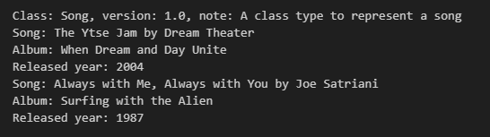

Pada chapter ini kita akan belajar tentang perbedaan antara instance property dan class property.

## A.34.1. Instance attribute vs class attribute

Attribute merupakan salah satu property class selain method. Python mengenal dua jenis attribute:

### ◉ Instance attribute

Instance attribute adalah variabel yang terasosiasi dengan instance object yang dimana pengaksesannya harus lewat object.

Contoh instance attribute:

```python
class Pencil:

    def __init__(self):
        self.note = "A class type to represent a book"

pencil1 = Pencil()
print(f"Object pencil1 note: {pencil1.note}")
# output ➜ Object pencil1 note: A class type to represent a book
```

Variabel `note` di atas merupakan instance attribute milik class `Pencil`. Ciri khas attribute bisa dilihat dari deklarasinya yang berada di dalam konstruktor. 

### ◉ Class attribute

Yaitu variabel yang terasosiasi dengan class dimana pengaksesanya bisa langsung dari class dan bisa juga lewat object.

Contoh class attribute:

```python
class Book:
    note = "A class type to represent a book"

print(f"Class Book note: {Book.note}")
# output ➜ Class Book note: A class type to represent a book
```

Berbeda dibanding contoh sebelumnya, kali ini variabel `note` dideklarasikan langsung di bawah blok `class` dan tidak di dalam konstruktor. Ini adalah ciri khas dari class attribute.

Class attribute bisa diakses langsung dari class, misalnya `Book.note`, atau bisa juga diakses lewat instance object, contoh: 

```python
class Book:
    note = "A class type to represent a book"

print(f"Class Book note: {Book.note}")
# output ➜ Class Book note: A class type to represent a book

book1 = Book()
print(f"Object book1 note: {book1.note}")
# output ➜ Object book1 note: A class type to represent a book
```

### ◉ Kombinasi instance attribute & class attribute

Instance attribute dan classs attribute keduanya bisa digunakan secara bersamaan dalam satu class. Penerapannya cukup umum, misalnya pada kasus diaman ada class yang memiliki 2 kategori attribute misalnya pada class `Song` berikut ada attribute yang berasosiasi langsung dengan class yaitu `note` dan `version` dan attribute lainnya yang berasosiasi dengan instance object.

```python
class Song:
    note = "A class type to represent a song"
    version = 1.0
    
    def __init__(self, name = "", artist = "", album = "", released_year = 2000):
        self.name = name
        self.artist = artist
        self.album = album
        self.released_year = released_year

    def info(self):
        print(f"Song: {self.name} by {self.artist}")
        print(f"Album: {self.album}")
        print(f"Released year: {self.released_year}")

songs = [
    Song(
        name="The Ytse Jam",
        artist="Dream Theater",
        album="When Dream and Day Unite",
        released_year=2004
    ),
    Song(
        name="Always with Me, Always with You",
        artist="Joe Satriani",
        album="Surfing with the Alien",
        released_year=1987
    ),
]

print(f"Class: Song, version: {Song.version}, note: {Song.note}")

for s in songs:
    s.info()
```

Output program:



Class attribute umum digunakan untuk menyimpan data yang sifatnya global, tidak terpaut object, contohnya seperti attribute `note` dan `version` pada class `Song` di atas.

Berbeda dengan instance attribute yang digunakan untuk menyimpan data object. Bisa dilihat di contoh ada list berisi 2 element yang dibuat dari class `Song`. Masing-masing instance object tersebut data attribute-nya berbeda satu sama lain.

## A.34.2. Attribute lookup

Saat suatu instance attribtue diakses dari instance object, yang terjadi di balik layar adalah Python melakukan *lookup* atau pengecekan attribute dengan urutan sebagai berikut:

1. Jika instance attribute ditemukan, maka Python mengembalikan value instance attribute.
1. Jika instance attribute yang dicari tidak ada, maka Python mengembalikan value class attribute.
1. Jika class attribute yang dicari tidak ada, maka error.

Dari kondisi lookup di atas bisa disimpulkan bahwa sewaktu pengaksesan instance attribute, Python selalu memprioritaskan data yang ada di instance attribute dibanding yang lain.

Lalu bagaiamana jika misalnya ada class yang miliki class attribute dan juga instance attribute yang keduanya namanya sama persis? Jawabannya, Python tetap memprioritaskan nilai instance attribute.

Contoh bisa dilihat pada kode berikut:

```python
class Person:
    name = "A person"
    
    def __init__(self, name):
        self.name = name

person1 = Person("Noval Agung Prayogo")
print(f"Object person1 name: {person1.name}")
# output ➜ Object person1 name: Noval Agung Prayogo

print(f"Class Person name: {Person.name}")
# output ➜ Class Person name: A person
```

Variabel `person1` ketika diakses attribute `name`-nya, yang dikembalikan adalah nilai instance attribute, meskipun sebenarnya class `Person` juga memiliki class attribute dengan nama yang sama.

## A.34.3. Attribute mutability

### ◉ Perubahan nilai instance attribute

Instance attribute datanya adalah menempel ke instance object. Jadinya setiap object bisa saja isi attribute-nya berbeda satu sama lain.

Misalnya ada satu variabel object yang nilai attribute-nya diubah, maka efek perubahan hanya terjadi di variabel tersebut saja, tidak ada efek ke variabel lain. Contoh:

```python
class Pencil:

    def __init__(self):
        self.note = "A class type to represent a book"

pencil1 = Pencil()
pencil1.note = "A pencil"
pencil2 = Pencil()

print(f"Object pencil1 note: {pencil1.note}")
# output ➜ Object pencil1 note: A pencil

print(f"Object pencil2 note: {pencil2.note}")
# output ➜ Object pencil2 note: A class type to represent a book
```

### ◉ Perubahan nilai class attribute dari instance object

Bagaimana jika attribute yang diubah adalah class attribute, dan perubahan dilakukan lewat instance object? Jawabannya adalah, nilai baru tersebut akan ditampung sebagai nilai instance attribute dan efeknya hanya pada instance object saja, tidak ada efek ke class. Contoh:

```python
class Book:
    note = "A class type to represent a book"

book1 = Book()
book2 = Book()
book2.note = "A book"

print(f"Class Book note: {Book.note}")
# output ➜ Class Book note: A class type to represent a book

print(f"Object book1 note: {book1.note}")
# output ➜ Object book2 note: A class type to represent a book

print(f"Object book2 note: {book2.note}")
# output ➜ Object book1 note: A book

print(f"Class Book note: {Book.note}")
# output ➜ Class Book note: A class type to represent a book
```

Bisa dilihat di contoh bahwa statement `book2.note = "A book"` efek peruabahannya hanya pada instance object-nya (`book2`). Class attribute `note` nilainya tetap.

### ◉ Perubahan nilai class attribute secara langsung

```python
class Book:
    note = "A class type to represent a book"

book1 = Book()
book2 = Book()

Book.note = "A book"

print(f"Class Book note: {Book.note}")
# output ➜ Class Book note: A book

print(f"Object book1 note: {book1.note}")
# output ➜ Object book1 note: A book

print(f"Object book2 note: {book2.note}")
# output ➜ Object book2 note: A book
```


<!-- Perbedaan antara instance attribute vs class attribute

- Instance attribute / Instance variable ➜ variabel yang menempel ke variabel object yang datanya terisolasi pada object tersebut.
- Class attribute / Class variable ➜ variabel yang menempel ke class yang datanya bersifat global.

### ◉ Attribute lookup

Di Python, suatu class bisa saja memiliki class attribute dan instance attribute dengan nama sama persis. Pada kasus seperti ini, ketika value attribute diakses, maka:

1. Python mengembalikan value instance attribute.
1. Jika instance attribute yang dicari tidak ada, maka Python mengembalikan value class attribute.
1. Jika class attribute yang dicari tidak ada, maka error.

### ◉ Private attribute

Di Python, suatu class bisa saja memiliki class attribute dan instance attribute dengan nama sama persis. Pada kasus seperti ini, ketika value attribute diakses, maka:

1. Python mengembalikan value instance attribute.
1. Jika instance attribute yang dicari tidak ada, maka Python mengembalikan value class attribute.
1. Jika class attribute yang dicari tidak ada, maka error. -->
