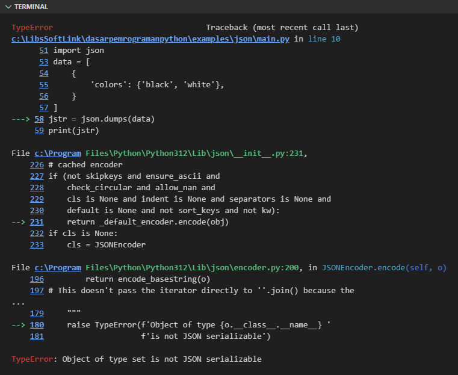

Pada chapter ini kita akan belajar tentang penerapan tipe data JSON di Python.

:::info

JSON atau JavaScript Object Notation adalah format data yang sangat populer digunakan dalam pembuatan aplikasi. Strukturnya sederhana dan mudah dipahami.

Contoh data JSON:

```json
{
    "glossary": {
        "title": "example glossary",
		"GlossDiv": {
            "title": "S",
			"GlossList": {
                "GlossEntry": {
                    "ID": "SGML",
					"SortAs": "SGML",
					"GlossTerm": "Standard Generalized Markup Language",
					"Acronym": "SGML",
					"Abbrev": "ISO 8879:1986",
					"GlossDef": {
                        "para": "A meta-markup language, used to create markup languages such as DocBook.",
						"GlossSeeAlso": ["GML", "XML"]
                    },
					"GlossSee": "markup"
                }
            }
        }
    }
}
```

Data JSON bisa tersimpan di file berekstensi `.json` atau bisa juga tersimpan di variabel sebagai data string. Contoh:

```python
jstr1 = '{ "id": 2, "name": "Noval Agung Prayogo" }'

jstr2 = """
[{
    "id": 2,
    "name": "Noval Agung Prayogo"
}]
"""
```

:::

## A.52.1. Implementasi JSON di Python

Operasi JSON di Python umumnya dilakukan terhadap data yang tersimpan di variabel/memory atau data yang tersimpan di file, dengan memanfaatkan module `json` (baawan Python Standard Library) untuk proses decode maupun encode data json.

- Operasi pembacaan data JSON dari file, isi file harus dibaca terlebih dahulu secara menyeluruh, kemudian barulah di-decode ke bentuk dictionary atau slice atau lainnya (sesuai kebutuhan).

- Sedangkan operasi penulisan data JSON ke file bisa, caranya dengan menulis langsung data json dalam bentuk string ke file.

JSON (yang basisnya adalah JavaScript) memiliki kompatibilitas yang cukup bagus dengan tipe data yang tersedia di Python. Lebih jelasnya silakan lihat tabel kompatibilitas tipe data berikut:

| Python data type | JSON data type |
| :-: | :-: |
| int | number |
| float | float |
| str | string |
| bool | boolean |
| list | array |
| tuple | array |
| dict | object |

### ◉ Encode data Python ke JSON string

Operasi konversi data ke bentuk JSON string dilakukan menggunakan `json.dumps()`, tersedia di Python Standard Library.

Selama data object yang akan di-encode berisi tipe yang di-support sesuai tabel di atas, maka operasi encode ke JSON string berjalan sukses. Sedangkan jika object berisi tipe yang tidak di-support, maka harus dikonversi ke salah satu tipe data yang kompatibel terlebih dahulu (misalnya `str`) sebelum di-encode menggunakan `json.dumps()`. 

Contoh operasi encode data `dict` dengan isi item `str` dan `list`:

```python
import json

data = {
    'name': 'Maiev Shadowsong',
    'affliations': ['Warden', 'Alliance']
}
jstr = json.dumps(data)
print(jstr)
# output ➜ {"name": "Maiev Shadowsong", "affliations": ["Warden", "Alliance"]}
```

Contoh data lain dengan struktur list berisi elemen dictionary:

```python
import json

data = [
    {
        'faction': 'Horde',
        'color': 'red',
        'founding_members': [
            'Orc',
            'Undead',
            'Tauren',
            'Troll',
            'Blood Elf',
            'Goblin'
        ],
        'total_members': 13,
        'active': True,
    },
    {
        'faction': 'Alliance',
        'color': 'blue',
        'founding_members': [
            'Human',
            'Dwarf',
            'Night Elf',
            'Gnome',
            'Draenei',
            'Worgen'
        ],
        'total_members': 13,
        'active': True,
    }
]
jstr = json.dumps(data, indent=4)
print(jstr)
```

> Pada contoh di atas, JSON string di-format dengan indent sebanyak 4. Nilai inded bisa dikonfigurasi via parameter opsional `indent`.

Untuk data dengan isi adalah tipe data yang tidak kompatibel dengan operasi JSON di Python, penggunaannya pada `json.dumps()` menghasilkan error. Contohnya pada kode berikut ada tipe data `set` disitu.

```python
import json

data = [
    {
        'colors': {'black', 'white'},
    }
]
jstr = json.dumps(data)
print(jstr)
```

Output program:



### ◉ Decode JSON string ke data Python

Proses decode data JSON string ke tipe data Python dilakukan menggunakan fungsi `json.loads()`. Fungsi ini mengembalikan data sesuai dengan struktur JSON string-nya (misalnya: JSON string berisi array object, maka data kembalian fungsi `json.loads()` adalah slice berisi dictionary).

```python
import json

jstr1 = '{ "name": "Maiev Shadowsong", "affliations": ["Warden", "Alliance"], "age": 10000, "active": true }'
data1 = json.loads(jstr1)

print(f"type: {type(data1).__name__}")
# output ➜ type: dict

for key in data1:
    print(f"{key}: {data1[key]}")
# output ↓
# 
# name: Maiev Shadowsong
# affliations: ['Warden', 'Alliance']
# age: 10000
# active: True
```

Contoh lain operasi decode data JSON string berisi array object:

```python
jstr2 = """
[{
    "name": "Maiev Shadowsong",
    "affliations": ["Warden", "Alliance"],
    "age": 10000
}, {
    "name": "Illidan Stormrage",
    "affliations": ["Illidari", "Armies of Legionfall"],
    "age": 15000
}]
"""
data2 = json.loads(jstr2)

print(f"type: {type(data2).__name__}")
# output ➜ type: list

for row in data2:
    print(f"-> name: {row["name"]}, afflications: {row["affliations"]}, age: {row["age"]}")
# output ↓
# 
# -> name: Maiev Shadowsong, afflications: ['Warden', 'Alliance'], age: 10000
# -> name: Illidan Stormrage, afflications: ['Illidari', 'Armies of Legionfall'], age: 15000
```

### ◉ Menulis data JSON ke file

Penulisan data JSON ke file sangat mudah, dilakukan menggunakan teknik penulisan standar file (kombinasi keyword `with`, fungsi `open()` dan method `write()` milik object file) dengan syarat: data yang akan ditulis ke file harus berbentuk string.

- Contoh penulisan data JSON string ke JSON file:

    ```python
    jstr = """
    [{
        "name": "Maiev Shadowsong",
        "affliations": ["Warden", "Alliance"],
        "age": 10000
    }, {
        "name": "Illidan Stormrage",
        "affliations": ["Illidari", "Armies of Legionfall"],
        "age": 15000
    }]
    """

    with open('data.json', 'w') as f:
        f.write(jstr)
    ```

    Outcome program: file `data.json` terbuat dengan isi adalah JSON string yang ada di variabel `jstr`.

- Penulisan data Python ke JSON file dilakukan dengan mengkonversi data ke JSON string terlebih dahulu, kemudian barulah ditulis ke file. Contoh:

    ```python
    import json

    data = {
        'name': 'Maiev Shadowsong',
        'affliations': ['Warden', 'Alliance']
    }
    jstr = json.dumps(data)

    with open('data.json', 'w') as f:
        f.write(jstr)
    ```

    Outcome program: file `data.json` terbuat dengan isi adalah JSON string hasil proses encoding `json.dumps()` terhadap data diu variabel `data`.

### ◉ Membaca JSON file

Operasi baca JSON file dilakukan dengan membaca file seperti biasa lalu di-decode menggunakan fungsi `json.loads()`.

Contoh penerapannya bisa dilihat pada program di bawah ini. Sebelumnya, pastikan untuk menyediakan sebuah file JSON untuk keperluan testing dengan nama `data.json`. Isi file tersebut dengan data JSON string berikut:

```json
{"name": "Maiev Shadowsong", "affliations": ["Warden", "Alliance"]}
```

Lalu tulis kode berikut kemudian run:

```python
import json

data = []
with open('data.json', 'r') as f:
    data = json.loads(f.read())

for key in data:
    print(f"{key}: {data[key]}")
# output ↓
# 
# name: Maiev Shadowsong
# affliations: ['Warden', 'Alliance']
```

---

<div class="section-footnote">

## Catatan chapter 📑

### ◉ Source code praktik

<pre>
    <a href="https://github.com/novalagung/dasarpemrogramanpython-example/tree/master/json">
        github.com/novalagung/dasarpemrogramanpython-example/../json
    </a>
</pre>

### ◉ Chapter relevan lainnya

- [File I/O](/basic/file)

### ◉ Referensi

- https://docs.python.org/3/library/csv.html

</div>
