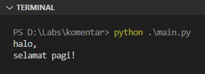

Komentar adalah sebuah statement yang tidak akan dijalankan oleh interpreter. Biasanya digunakan untuk menambahkan keterangan atau men-disable statements agar tidak dieksekusi saat run program.

Python mengenal dua jenis komentar, yaitu komentar satu baris dan multi-baris.

## A.3.1. Komentar satu baris

Karakter `#` digunakan untuk menuliskan komentar, contoh:

```python
# ini adalah komentar
print("halo,")
print("selamat pagi!") # ini juga komentar

# println("statement ini tidak akan dipanggil")
```

Jika di-run, outputnya:



Bisa dilihat statement yang diawali dengan tanda `#` tidak dieksekusi.

## A.3.2. Komentar multi-baris

Komentar multi-baris bisa diterapkan melalui dua cara:

### ◉ Komentar menggunakan `#` dituliskan

```python
# ini adalah komentar
# ini juga komentar
# komentar baris ke-3
```

### ◉ Komentar menggunakan `"""` atau `'''`

Karakter `"""` atau `'''` sebenarnya digunakan untuk membuat *multiline string* atau string banyak baris. Selain itu, bisa juga dipergunakan sebagai penanda komentar multi baris. Contoh penerapannya:

```python
"""
ini adalah komentar
ini juga komentar
komentar baris ke-3
"""
```

Atau bisa juga ditulis seperti ini untuk komentar satu baris:

```python
"""ini adalah komentar"""
```

> - Pembahasan detail mengenai string ada di chapter [String](/basic/string)
> - Pembahasan detail mengenai DocString ada di chapter [DocString](/basic/docstring)

---

<div class="section-footnote">

## Catatan chapter 📑

### ◉ Source code praktik

<pre>
    <a href="https://github.com/novalagung/dasarpemrogramanpython-example/tree/master/komentar">
        github.com/novalagung/dasarpemrogramanpython-example/../komentar
    </a>
</pre>

### ◉ Chapter relevan lainnya

- [String](/basic/string)

### ◉ Referensi

- https://docs.python-guide.org/writing/documentation/

</div>
