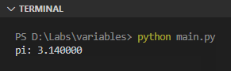

Konstanta (atau nilai konstan) adalah sebuah variabel yang nilainya dideklarasikan di awal dan tidak bisa diubah setelahnya.

Pada chapter ini kita akan mempelajari tentang penerapan Konstanta di Python.

## A.5.1. Konstanta di Python

Deklarasi konstanta di Python dilakukan menggunakan bantuan tipe *class* bernama `typing.Final`.

Untuk menggunakannya, `typing.Final` perlu di-import terlebih dahulu menggunakan keyword `from` dan `import`.

```python
from typing import Final

PI: Final = 3.14
print("pi: %f" % (PI))
```



### ◉ Module import

Keyword `import` digunakan untuk meng-import sesuatu, sedangkan keyword `from` digunakan untuk menentukan dari module mana sesuatu tersebut akan di-import.

> Pembahasan detail mengenai `import` dan `from` ada di chapter [Modules](/basic/modules)

Statement `from typing import Final` artinya adalah meng-import tipe `Final` dari module `typing` yang dimana module ini merupakan bagian dari Python standard library (stdlib).

> Pembahasan detail mengenai Python standard library (stdlib) ada di chapter [Python standard library (stdlib)](#)

## A.5.2. Tipe *class* `typing.Final`

Tipe `Final` digunakan untuk menandai suatu variabel adalah tidak bisa diubah nilainya (konstanta). Cara penerapan `Final` bisa dengan dituliskan tipe data konstanta-nya secara eksplisit, atau boleh tidak ditentukan (tipe akan diidentifikasi oleh interpreter berdasarkan tipe data nilainya).

```python
# tipe konstanta PI tidak ditentukan secara explisit,
# melainkan didapat dari tipe data nilai
PI: Final = 3.14

# tipe konstanta TOTAL_MONTH ditentukan secara explisit yaitu `int`
TOTAL_MONTH: Final[int] = 12
```

> Pembahasan detail mengenai tipe data ada di chapter [Tipe Data](/basic/tipe-data)

## A.5.3. *Naming convention* konstanta

Mengacu ke dokumentasi [PEP 8 – Style Guide for Python Code](https://peps.python.org/pep-0008/), nama konstanta harus dituliskan dalam huruf besar (UPPER_CASE).

---

<div class="section-footnote">

## Catatan chapter 📑

### ◉ Source code praktik

<pre>
    <a href="https://github.com/novalagung/dasarpemrogramanpython-example/tree/master/konstanta">
        github.com/novalagung/dasarpemrogramanpython-example/../konstanta
    </a>
</pre>

### ◉ Chapter relevan lainnya

- [Variabel](/basic/variabel)
- [Tipe Data](/basic/tipe-data)
- [Modules](/basic/modules)
- [Python standard library (stdlib)](#)

### ◉ Referensi

- https://docs.python.org/3/library/typing.html#typing.Final
- https://peps.python.org/pep-0008/

</div>
