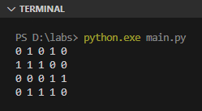
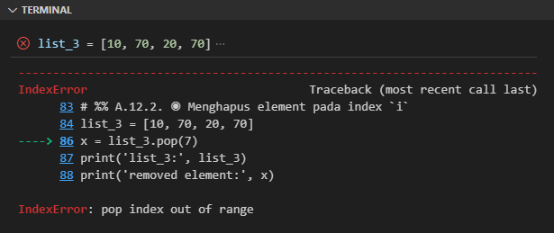

List adalah tipe data kolektif yang disimpan secara urut dan bisa diubah nilainya (istilah lainnya adalah tipe data *sequence*).

Pada bahasa pemrograman umumnya ada tipe data **array**. List di Python ini memiliki banyak kemiripan dengan array, bedanya list bisa berisi data dengan berbagai macam tipe data, jadi tidak harus sejenis tipe datanya.

Pada chapter ini kita akan belajar lebih detail mengenai list dan pengoperasiannya.

## A.12.1. Pengenalan list

Deklarasi variabel dan data list adalah menggunakan *literal* list dengan notasi penulisan seperti berikut:

```python
# contoh list
list_1 = [10, 70, 20]

# list dengan deklarasi element secara vertikal 
list_2 = [
    'ab',
    'cd',
    'hi',
    'ca'
]

# list dengan element berisi bermacam-macam tipe data
list_3 = [3.14, 'hello python', True, False]

# list kosong
list_4 = []
```

Data dalam list biasa disebut dengan **element**. Setiap elemen disimpan dalam list secara urut dengan penanda urutan yang disebut **index**.
Niali index dimulai dari angka `0`.

Sebagai contoh, pada variabel `list_1` di atas:

- Element index ke-`0` adalah data `10`
- Element index ke-`1` adalah data `70`
- Element index ke-`2` adalah data `20`

## A.12.2. Perulangan list

List adalah salah satu tipe data yang dapat digunakan langsung pada perulangan `for`. Contoh:

```python
list_1 = [10, 70, 20]

for e in list_1:
    print("elem:", e)
```

Selain itu, perulangan list bisa juga dilakukan menggunakan index, contohnya seperti berikut:

```python
list_1 = [10, 70, 20]
for i in range(0, len(list_1)):
    print("index:", i, "elem:", list_1[i])
```

Fungsi `len()` digunakan untuk menghitung jumlah element list. Dengan mengkombinasikan nilai balik fungsi ini dan fungsi `range()` bisa terbentuk data range dengan lebar sama dengan lebar list.

### ◉ Fungsi `enumerate()`

Fungsi `enumerate()` digunakan untuk membuat data sequence menjadi data enumerasi, yang jika dimasukan ke perulangan di setiap iterasinya bisa kita akses index beserta element-nya.

```python
list_1 = [10, 70, 20]

for i, v in enumerate(list_1):
    print("index:", i, "elem:", v)
```

## A.12.3. Nested list

Penulisan nested list cukup mudah, contohnya bisa dilihat pada program matrix berikut:

```python
matrix = [
    [0, 1, 0, 1, 0],
    [1, 1, 1, 0, 0],
    [0, 0, 0, 1, 1],
    [0, 1, 1, 1, 0],
]

for row in matrix:
    for cel in row:
        print(cel, end=" ")
    print()
```



## A.12.4. Fungsi `list()`

### ◉ Konversi range ke list

Data range (hasil pemanggilan fungsi `range()`) bisa dikonversi ke bentuk list menggunakan fungsi `list()`. Cara ini cukup efisien untuk pembuatan data list yang memiliki *pattern* atau pola. Sebagai contoh:

- List dimulai angka `0` hingga `9`:

    ```python
    range_1 = range(0, 10)
    list_1 = list(range_1)
    print(list_1)
    # output ➜ [0, 1, 2, 3, 4, 5, 6, 7, 8, 9]
    ```

- List dimulai angka `1` hingga `21` dengan penambahan `3`:

    ```python
    range_2 = range(0, 22, 3)
    list_2 = list(range_2)
    print(list_2)
    # output ➜ [0, 3, 6, 9, 12, 15, 18, 21]
    ```

- List dimulai angka `100` hingga `0` dengan pengurangan `-10`:

    ```python
    range_3 = range(100, 0, -10)
    list_3 = list(range_3)
    print(list_3)
    # output ➜ [100, 90, 80, 70, 60, 50, 40, 30, 20, 10]
    ```

> Selain metode ini, ada juga cara lainnya untuk membuat list, yaitu menggunakan metode *list comprehension*, yang akan dibahas pada chapter berikutnya, yaitu [List Comprehension](/basic/list-comprehension)

### ◉ Konversi string ke list

Selain untuk konversi data range ke list, fungsi `list()` bisa digunakan untuk konversi data string ke list, dengan hasil adalah setiap karakter string menjadi element list.

```python
alphabets = list('abcdefgh')
print(alphabets)
# output ➜ ['a', 'b', 'c', 'd', 'e', 'f', 'g', 'h']
```

### ◉ Konversi tuple ke list

Tipe data tuple bisa diubah bentuknya menjadi list dengan menggunakan fungsi `list()`. Contoh penerapannya:

```python
tuple_1 = (1, 2, 3, 4)
numbers = list(tuple_1)
print(numbers)
# output ➜ [1, 2, 3, 4]
```

> Pembahasan detail mengenai tuple ada di chapter [Tuple](/basic/tuple)

## A.12.5. Operasi pada list

### ◉ Mengakses element via index

Nilai elemen list bisa diakses menggunakan notasi `list[index]`. Contoh:

```python
list_1 = [10, 70, 20]

elem_1st = list_1[0]
elem_2nd = list_1[1]
elem_3rd = list_1[2]

print(elem_1st, elem_2nd, elem_3rd)
# output ➜ [10, 70, 20]
```

:::danger

Pengaksesan elemen menggunakan index di-luar kapasitas data akan menghasilkan error.

Sebagai contoh, data `list_1` di atas jika diakses index ke-3-nya misalnya (`list_1[3]`) hasilnya adalah error. 

:::

### ◉ Mengecek apakah element ada

Kombinasi keyword `if` dan `in` bisa digunakan untuk mengidentifikasi apakah suatu element merupakan bagian dari list atau tidak. Contoh penerapannya:

```python
list_1 = [10, 70, 20]
n = 70

if n in list_1:
    print(n, "is exists")
else:
    print(n, "is NOT exists")

# output ➜ 70 is exists
```

### ◉ *Slicing* list

Slicing adalah metode pengaksesan list menggunakan notasi slice. Notasi ini mirip seperti array, namun mengembalikan data bertipe tetap slice.

Contoh pengaplikasian metode slicing bisa dilihat pada kode berikut. Variabel `list_2` diakses element-nya mulai index `1` hingga sebelum `3`:   

```python
list_2 = ['ab', 'cd', 'hi', 'ca']
print('list_2:', list_2)
# output ➜ list2: ['ab', 'cd', 'hi', 'ca']

slice_1 = list_2[1:3]
print('slice_1:', slice_1)
# output ➜ slice_1: ['cd', 'hi']
```

> Pembahasan detail mengenai slice ada di chapter [Slice](/basic/slice)

### ◉ Mengubah nilai element

Cara mengubah nilai element list dengan cara mengakses nilai element menggunakan index, kemudian diikuti operator assignment `=` dan nilai baru.

```python
list_2 = ['ab', 'cd', 'hi', 'ca']
print('before:', list_2)
# output ➜ before: ['ab', 'cd', 'hi', 'ca']

list_2[1] = 'zk'
list_2[2] = 'sa'
print('after: ', list_2)
# output ➜ after: ['ab', 'zk', 'sa', 'ca']
```

### ◉ Append element

Operasi *append* atau menambahkan element baru setelah index terakhir, bisa menggunakan 2 cara:

- via method `append()`:

    ```python
    list_1 = [10, 70, 20]
    print('before: ', list_1)
    # output ➜ before: [10, 70, 20]

    list_1.append(88)
    list_1.append(87)
    print('after: ', list_1)
    # output ➜ after : [10, 70, 20, 88, 87]
    ```

- via slicing:

    ```python
    list_1 = [10, 70, 20]
    print('before: ', list_1)
    # output ➜ before: [10, 70, 20]

    list_1[len(list_1):] = [88, 87]
    print('after: ', list_1)
    # output ➜ after : [10, 70, 20, 88, 87]
    ```

> Pembahasan detail mengenai method ada 4 chapter berikut:
>
> - [OOP ➜ Instance Method](/basic/instance-method)
> - [OOP ➜ Class Method](/basic/class-method)
> - [OOP ➜ Static Method](/basic/static-method)
> - [OOP ➜ Abstract Method](/basic/abstract-method)

### ◉ *Extend/concat/union* element

Operasi *extend* (atau *concat* atau *union*) adalah operasi penggabungan dua data list. Ada beberapa metode yang tersedia, diantaranya:

- via method `extend()`:

    ```python
    list_1 = [10, 70, 20]
    list_2 = [88, 77]
    list_1.extend(list_2)
    print(list_1)
    # output ➜ [10, 70, 20, 88, 87]
    ```

- via slicing:

    ```python
    list_1 = [10, 70, 20]
    list_2 = [88, 77]
    list_1[len(list_1):] = list_2
    print(list_1)
    # output ➜ [10, 70, 20, 88, 87]
    ```

- via operator `+`:

    ```python
    list_1 = [10, 70, 20]
    list_2 = [88, 77]
    list_3 = list_1 + list_2
    print(list_3)
    # output ➜ [10, 70, 20, 88, 87]
    ```

    Metode extend menggunakan operator `+` mengharuskan hasil operasi untuk ditampung ke variabel.

### ◉ Menyisipkan element pada index `i`

Method `insert()` digunakan untuk menyisipkan element baru pada posisi index tertentu (misalnya index `i`). Hasil operasi ini membuat semua element setelah index tersebut posisinya bergeser ke kanan.

Pada penggunaannya, para parameter pertama diisi dengan posisi index, dan parameter ke-2 diisi nilai.

```python
list_3 = [10, 70, 20, 70]

list_3.insert(0, 15)
print(list_3)
# output ➜ [15, 10, 70, 20, 70]

list_3.insert(2, 25)
print(list_3)
# output ➜ [15, 10, 25, 70, 20, 70]
```

- Variabel `list_3` awalnya berisi `[10, 70, 20, 70]`
- Ditambahkan angka `15` pada index `0`, hasilnya nilai `list_3` sekarang adalah `[15, 10, 70, 20, 70]`
- Ditambahkan lagi, angka `25` pada index `2`, hasilnya nilai `list_3` sekarang adalah `[15, 10, 25, 70, 20, 70]`

### ◉ Menghapus element

Method `remove()` digunakan untuk menghapus element. Isi parameter fungsi dengan element yang ingin di hapus.

Jika element yang ingin dihapus ditemukan ada lebih dari 1, maka yang dihapus hanya yang pertama (sesuai urutan index).

```python
list_3 = [10, 70, 20, 70]

list_3.remove(70)
print(list_3)
# output ➜ [10, 20, 70]

list_3.remove(70)
print(list_3)
# output ➜ [10, 20]
```

### ◉ Menghapus element pada index `i`

Method `pop()` berfungsi untuk menghapus element pada index tertentu. Jika tidak ada index yang ditentukan, maka data element terakhir yang dihapus.

Method `pop()` mengembalikan data element yang berhasil dihapus.

```python
list_3 = [10, 70, 20, 70]

x = list_3.pop(2)
print('list_3:', list_3)
# output ➜ list_3: [10, 70, 70]
print('removed element:', x)
# output ➜ removed element: 20

x = list_3.pop()
print('list_3:', list_3)
# output ➜ list_3: [10, 70]
print('removed element:', x)
# output ➜ removed element: 70
```

Jika index `i` yang ingin dihapus tidak diketemukan, maka error `IndexError` muncul.

```python
list_3 = [10, 70, 20, 70]
x = list_3.pop(7)
```



> - Lebih detailnya mengenai error dibahas pada chapter [Error](#)

Selain menggunakan method `pop()`, keyword `del` bisa difungsikan untuk hal yang sama, yaitu menghapus elemen tertentu. Contoh penerapannya:

```python
list_3 = [10, 70, 20, 70]
print('len:', len(list_3), "data:", list_3)

del list_3[1]
print('len:', len(list_3), "data:", list_3)
```

### ◉ Menghapus element pada range index

Python memiliki keyword `del` yang berguna untuk menghapus suatu data. Dengan menggabungkan keyword ini dan operasi slicing, kita bisa menghapus element dalam range tertentu dengan cukup mudah.

Contoh, menghapus element pada index `1` hingga sebelum `3`:

```python
list_3 = [10, 70, 20, 70]

del list_3[1:3]
print(list_3)
# output ➜ [10, 70]
```

### ◉ Menghitung jumlah element

Fungsi `len()` digunakan untuk menghitung jumlah element.

```python
list_3 = [10, 70, 20, 70]
total = len(list_3)
print(total)
# output ➜ 4
```

Selain fungsi `len()`, ada juga method `count()` milik method slice yang kegunaannya memiliki kemiripan. Perbedaannya, method `count()` melakukan operasi pencarian sekaligus menghitung jumlah element yang ditemukan.

Agar lebih jelas, silakan lihat kode berikut:

```python
list_3 = [10, 70, 20, 70]
count = list_3.count(70)
print('jumlah element dengan data `70`:', count)
# output ➜ jumlah element dengan data `70`: 2
```

### ◉ Mencari index element list

Untuk mencari index menggunakan nilai element, gunakan method `index()` milik list. Contoh bisa dilihat berikut, data `cd` ada dalam list pada index `1`.

```python
list_2 = ['ab', 'cd', 'hi', 'ca']

idx_1st = list_2.index('cd')
print('idx_1st: ', idx_1st)
# output ➜ idx_1st: 1
```

Jika data element yang dicari tidak ada, maka akan muncul error `ValueError`:

```python
idx_2nd = list_2.index('kk')
print('idx_2nd: ', idx_2nd)
```


### ◉ Mengosongkan list

Ada dua cara untuk mengosongkan list:

- via method `clear()`:

    ```python
    list_1 = [10, 70, 20]
    list_1.clear()
    print(list_1)
    # output ➜ []
    ```

- Menimpanya dengan `[]`:

    ```python
    list_1 = [10, 70, 20]
    list_1 = []
    print(list_1)
    # output ➜ []
    ```

- Menggunakan keyword `del` dan slicing:

    ```python
    list_1 = [10, 70, 20]
    del list_1[:]
    print(list_1)
    # output ➜ []
    ```

### ◉ Membalik urutan element list

Method `reverse()` digunakan untuk membalik posisi element pada list.

```python
list_1 = [10, 70, 20]
list_1.reverse()
print(list_1)
# output ➜ [20, 70, 10]
```

### ◉ *Copy* list

Ada 2 cara untuk menduplikasi list, menggunakan method `copy()` dan teknik slicing.

- Menggunakan method `copy()`:

    ```python
    list_1 = [10, 70, 20]
    list_2 = list_1.copy()
    print(list_1)
    # output ➜ [10, 70, 20]
    print(list_2)
    # output ➜ [10, 70, 20]
    ```

- Kombinasi operasi assignment dan slicing:

    ```python
    list_1 = [10, 70, 20]
    list_2 = list_1[:]
    print(list_1)
    # output ➜ [10, 70, 20]
    print(list_2)
    # output ➜ [10, 70, 20]
    ```

> Operasi copy disini jenisnya adalah shallow copy.<br />
> Lebih detailya mengenai shallow copy vs deep copy dibahas pada chapter terpisah.

### ◉ Sorting

Mengurutkan data list bisa dilakukan menggunakan *default sorter* milik Python, yaitu method `sort()`.

```python
list_1 = [10, 70, 20]
list_1.sort()
print(list_1)
# output ➜ [10, 20, 70]

list_2 = ['z', 'h', 'c']
list_2.sort()
print(list_2)
# output ➜ ['c', 'h', 'z']
```


Method ini sebenarnya menyediakan kapasitas sorting yang cukup advance, caranya dengan cara menambahkan closure/lambda pada argument method ini.

> Pembahasan detail mengenai closure ada di chapter [Function ➜ Closure](/basic/closure)
> Pembahasan detail mengenai lambda ada di chapter [Function ➜ Lambda](/basic/lambda)

---

<div class="section-footnote">

## Catatan chapter 📑

### ◉ Source code praktik

<pre>
    <a href="https://github.com/novalagung/dasarpemrogramanpython-example/tree/master/list">
        github.com/novalagung/dasarpemrogramanpython-example/../list
    </a>
</pre>

### ◉ Chapter relevan lainnya

- [Perulangan ➜ for & range](/basic/for-range)
- [List Comprehension](/basic/list-comprehension)
- [Slice](/basic/slice)
- [Function ➜ Closure](/basic/closure)
- [Function ➜ Lambda](/basic/lambda)

### ◉ Referensi

- https://docs.python.org/3/tutorial/datastructures.html
- https://docs.python.org/3/library/stdtypes.html#typesseq

</div>
