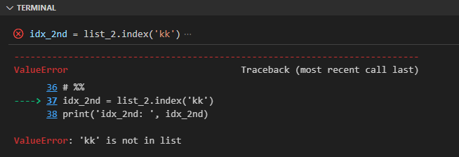
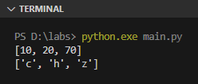

List adalah tipe data kolektif yang disimpan secara urut dan bisa diubah nilainya.

Pada bahasa pemrograman umumnya ada tipe data **array**. List di Python ini memiliki banyak kemiripan dengan array, bedanya list bisa berisi data dengan berbagai macam tipe data, jadi tidak harus sejenis tipe datanya.

Pada chapter ini kita akan belajar lebih detail mengenai list dan pengoperasiannya.

## A.12.1. Penerapan list

Deklarasi variabel dan data list adalah menggunakan *literal* list dengan notasi penulisan seperti berikut:

```python
list_1 = [10, 70, 20]

list_2 = [
    'ab',
    'cd',
    'hi',
    'ca'
]

list_3 = [3.14, 'hello python', True, False]
```

Data dalam list biasa disebut dengan **element**. Setiap elemen disimpan dalam list secara urut dengan penanda urutan yang disebut **index**.
Niali index dimulai dari angka `0`.

Sebagai contoh, pada variabel `list_1` di atas:

- Element index ke-`0` adalah data `10`
- Element index ke-`1` adalah data `70`
- Element index ke-`2` adalah data `20`

## A.12.2. Perulangan data list

List adalah salah satu tipe data yang dapat digunakan langsung pada perulangan `for`. Contoh:

```python
list_1 = [10, 70, 20]

for e in list_1:
    print("elem:", e)
```

Selain itu, perulangan list bisa juga dilakukan menggunakan index, contohnya seperti berikut:

```python
list_1 = [10, 70, 20]
for i in range(0, len(list_1)):
    print("index:", i, "elem:", list_1[i])
```

Fungsi `len()` digunakan untuk menghitung jumlah element list. Dengan mengkombinasikan nilai balik fungsi ini dan fungsi `range()` bisa terbentuk data range dengan lebar sama dengan lebar list.

> Lebih detailnya mengenai fungsi `len()` dibahas setelah ini

## A.12.3. Operasi pada list

### ◉ Mengakses element via index

Nilai elemen list bisa diakses menggunakan notasi `list[index]`. Contoh:

```python
list_1 = [10, 70, 20]

elem_1st = list_1[0]
elem_2nd = list_1[1]
elem_3rd = list_1[2]

print(elem_1st, elem_2nd, elem_3rd)
# output → [10, 70, 20]
```

### ◉ *Slicing* list

Slicing adalah metode pengaksesan list menggunakan notasi slice. Notasi ini mirip seperti array, namun mengembalikan data bertipe tetap slice.

Contoh pengaplikasian metode slicing bisa dilihat pada kode berikut. Variabel `list_2` diakses element-nya mulai index `1` hingga sebelum `3`:   

```python
list_2 = ['ab', 'cd', 'hi', 'ca']
print('list_2:', list_2)
# output → list2: ['ab', 'cd', 'hi', 'ca']

slice_1 = list_2[1:3]
print('slice_1:', slice_1)
# output → slice_1: ['cd', 'hi']
```

> Lebih detailnya mengenai slice dibahas pada chapter [Slice](#)

### ◉ Mengubah nilai element

Cara mengubah nilai element list dengan cara mengakses nilai element menggunakan index, kemudian diikuti operator assignment `=` dan nilai baru.

```python
list_2 = ['ab', 'cd', 'hi', 'ca']
print('before:', list_2)
# output → before: ['ab', 'cd', 'hi', 'ca']

list_2[1] = 'zk'
list_2[2] = 'sa'
print('after: ', list_2)
# output → after: ['ab', 'zk', 'sa', 'ca']
```

### ◉ Append element

Operasi *append* atau menambahkan element baru setelah index terakhir, bisa menggunakan 2 cara:

- via method `append()`:

    ```python
    list_1 = [10, 70, 20]
    print('before: ', list_1)
    # output → before: [10, 70, 20]

    list_1.append(88)
    list_1.append(87)
    print('after: ', list_1)
    # output → after : [10, 70, 20, 88, 87]
    ```

- via slicing:

    ```python
    list_1 = [10, 70, 20]
    print('before: ', list_1)
    # output → before: [10, 70, 20]

    list_1[len(list_1):] = [88, 87]
    print('after: ', list_1)
    # output → after : [10, 70, 20, 88, 87]
    ```

> - Lebih detailnya mengenai method dibahas pada chapter [Method](x)

### ◉ Extend/concat element

Operasi *extend* (atau *concat*) mirip seperti append, perbedaannya ada pada data baru yang akan ditambahkan yang harus bertipe data list juga.

- via method `extend()`:

    ```python
    list_1 = [10, 70, 20]
    list_2 = [88, 77]
    list_1.extend(list_2)
    print(list_1)
    # output → [10, 70, 20, 88, 87]
    ```

- via slicing:

    ```python
    list_1 = [10, 70, 20]
    list_2 = [88, 77]
    list_1[len(list_1):] = list_2
    print(list_1)
    # output → [10, 70, 20, 88, 87]
    ```

- via operator `+`:

    ```python
    list_1 = [10, 70, 20]
    list_2 = [88, 77]
    list_3 = list_1 + list_2
    print(list_3)
    # output → [10, 70, 20, 88, 87]
    ```

    Metode extend menggunakan operator `+` mengharuskan hasil operasi untuk ditampung ke variabel.

### ◉ Menyisipkan element pada index `i`

Method `insert()` digunakan untuk menyisipkan element baru pada posisi index tertentu (misalnya index `i`). Hasil operasi ini membuat semua element setelah index tersebut posisinya bergeser ke kanan.

Pada penggunaannya, para parameter pertama diisi dengan posisi index, dan parameter ke-2 diisi nilai.

```python
list_3 = [10, 70, 20, 70]

list_3.insert(0, 15)
print(list_3)
# output → [15, 10, 70, 20, 70]

list_3.insert(2, 25)
print(list_3)
# output → [15, 10, 25, 70, 20, 70]
```

- Variabel `list_3` awalnya berisi `[10, 70, 20, 70]`
- Ditambahkan angka `15` pada index `0`, hasilnya nilai `list_3` sekarang adalah `[15, 10, 70, 20, 70]`
- Ditambahkan lagi, angka `25` pada index `2`, hasilnya nilai `list_3` sekarang adalah `[15, 10, 25, 70, 20, 70]`

### ◉ Menghapus element

Method `remove()` digunakan untuk menghapus element. Isi parameter fungsi dengan element yang ingin di hapus.

Jika element yang ingin dihapus ditemukan ada lebih dari 1, maka yang dihapus hanya yang pertama (sesuai urutan index).

```python
list_3 = [10, 70, 20, 70]

list_3.remove(70)
print(list_3)
# output → [10, 20, 70]

list_3.remove(70)
print(list_3)
# output → [10, 20]
```

### ◉ Menghapus element pada index `i`

Method `pop()` berfungsi untuk menghapus element pada index tertentu. Jika tidak ada index yang ditentukan, maka data element terakhir yang dihapus.

Method `pop()` mengembalikan data element yang berhasil dihapus.

```python
list_3 = [10, 70, 20, 70]

x = list_3.pop(2)
print('list_3:', list_3)
# output → list_3: [10, 70, 70]
print('removed element:', x)
# output → removed element: 20

x = list_3.pop()
print('list_3:', list_3)
# output → list_3: [10, 70]
print('removed element:', x)
# output → removed element: 70
```

Jika index `i` yang ingin dihapus tidak diketemukan, maka error `IndexError` muncul.

```python
list_3 = [10, 70, 20, 70]
x = list_3.pop(7)
```


> - Lebih detailnya mengenai error dibahas pada chapter [Error](x)

### ◉ Menghapus element pada range index

Python memiliki keyword `del` yang berguna untuk menghapus suatu data. Dengan menggabungkan keyword ini dan operasi slicing, kita bisa menghapus element dalam range tertentu dengan cukup mudah.

Contoh, menghapus element pada index `1` hingga sebelum `3`:

```python
list_3 = [10, 70, 20, 70]

del list_3[1:3]
print(list_3)
# output → [10, 70]
```

### ◉ Menghitung jumlah element

Fungsi `len()` digunakan untuk menghitung jumlah element.

```python
list_3 = [10, 70, 20, 70]
total = len(list_3)
print(total)
# output → 4
```

Selain fungsi `len()`, ada juga method `count()` milik method slice yang kegunaannya memiliki kemiripan. Perbedaannya, method `count()` melakukan operasi pencarian sekaligus menghitung jumlah element yang ditemukan.

Agar lebih jelas, silakan lihat kode berikut:

```python
list_3 = [10, 70, 20, 70]
count = list_3.count(70)
print('jumlah element dengan data `70`:', count)
# output → jumlah element dengan data `70`: 2
```

### ◉ Mencari index element list

Untuk mencari index menggunakan nilai element, gunakan method `index()` milik list. Contoh bisa dilihat berikut, data `cd` ada dalam list pada index `1`.

```python
list_2 = ['ab', 'cd', 'hi', 'ca']

idx_1st = list_2.index('cd')
print('idx_1st: ', idx_1st)
# output → idx_1st: 1
```

Jika data element yang dicari tidak ada, maka akan muncul error `ValueError`:

```python
idx_2nd = list_2.index('kk')
print('idx_2nd: ', idx_2nd)
```



### ◉ Mengosongkan list

Ada dua cara untuk mengosongkan list:

- via method `clear()`:

    ```python
    list_1 = [10, 70, 20]
    list_1.clear()
    print(list_1)
    # output → []
    ```

- Menimpanya dengan `[]`:

    ```python
    list_1 = [10, 70, 20]
    list_1 = []
    print(list_1)
    # output → []
    ```

- Menggunakan keyword `del` dan slicing:

    ```python
    list_1 = [10, 70, 20]
    del list_1[:]
    print(list_1)
    # output → []
    ```

### ◉ Membalik urutan element list

Method `reverse()` digunakan untuk membalik posisi element pada list.

```python
list_1 = [10, 70, 20]
list_1.reverse()
print(list_1)
# output → [20, 70, 10]
```

### ◉ *Cloning*/duplikasi list

Ada 2 cara untuk menduplikasi list:

- Menggunakan method `copy()`:

    ```python
    list_1 = [10, 70, 20]
    list_2 = list_1.copy()
    print(list_1)
    # output → [10, 70, 20]
    print(list_2)
    # output → [10, 70, 20]
    ```

- Kombinasi operasi assignment dan slicing:

    ```python
    list_1 = [10, 70, 20]
    list_2 = list_1[:]
    print(list_1)
    # output → [10, 70, 20]
    print(list_2)
    # output → [10, 70, 20]
    ```

### ◉ Sorting

Mengurutkan data list bisa dilakukan menggunakan *default sorter* milik Python, yaitu method `sort()`.

```python
list_1 = [10, 70, 20]
list_1.sort()
print(list_1)
# output → [10, 20, 70]

list_2 = ['z', 'h', 'c']
list_2.sort()
print(list_2)
# output → ['c', 'h', 'z']
```



Method ini sebenarnya menyidakan kapasitas sorting yang cukup advance, caranya dengan cara menambahkan closure/lambda pada argument method ini.

> Lebih detailnya mengenai closure/lambda dibahas pada chapter [Closure/Lambda](#)

## A.12.4. Nested list

Penulisan nested list cukup mudah, contohnya bisa dilihat pada program matrix berikut:

```python
matrix = [
    [0, 1, 0, 1, 0],
    [1, 1, 1, 0, 0],
    [0, 0, 0, 1, 1],
    [0, 1, 1, 1, 0],
]

for row in matrix:
    for cel in row:
        print(cel, end=" ")
    print()
```


---

<div class="section-footnote">

## Catatan chapter 📑

### ◉ Source code praktik

<pre>
    <a href="https://github.com/novalagung/dasarpemrogramanpython-example/tree/master/list">
        github.com/novalagung/dasarpemrogramanpython-example/../list
    </a>
</pre>

### ◉ Chapter relevan lainnya

- [List Comprehension](/basic/list-comprehension)
- [Perulangan → for, range](/basic/for-range)
- [Slice](#)
- [Closure/lambda](#)

### ◉ Referensi

- https://docs.python.org/3/tutorial/datastructures.html

</div>
