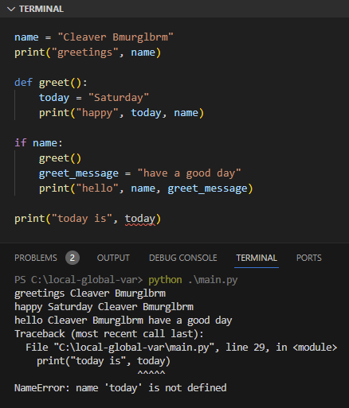
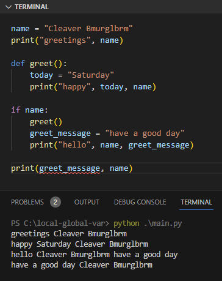

Pada chapter ini kita akan membahas tentang variable scope, yaitu kapan suatu variabel valid dan bisa digunakan di dalam block serta beberapa fungsi yang masih relevan dengan topik variabel scope.

## A.29.1. Local vs. global variable

Global variable adalah variabel yang dideklarasikan di root (tidak di dalam suatu block fungsi). Sedangkan local variable adalah yang dideklarasikan di dalam suatu block dan hanya valid di block tersebut saja.

Contoh, sebuah file program Python bernama `main.py` di isi dengan kode berikut:

```python title="File main.py"
name = "Cleaver Bmurglbrm"
print("greetings", name)

def greet():
    today = "Saturday"
    print("happy", today, name)

if name:
    greet()
    greet_message = "have a good day"
    print("hello", name, greet_message)

# output ↓
# 
# greetings Cleaver Bmurglbrm
# happy Saturday Cleaver Bmurglbrm
# hello Cleaver Bmurglbrm have a good day
```

Variabel `name` disitu merupakan variabel global. Variabel jenis ini bisa diakses dari block manapun. Di contoh, variabel `name` diakses di dalam block fungsi `greet()` dan di block seleksi kondisi `if name:`.

Berbeda dengan variabel `today` yang tempat deklarasinya ada di block fungsi `greet()`, membuatnya hanya valid untuk digunakan di block itu saja. Variabel `today` dikategorikan sebagai variabel local dengan scope adalah block fungsi `greet()`.

Selain itu ada juga variabel lain bernama `greet_message` yang dideklarasikan di block seleksi kondisi `if name:`.

Sekarang coba akses variabel `today` dari luar block, hasilnya pasti error. Keterangan errornya: variabel `today` tidak dikenali.



Bagaimana jika variabel `greet_message` diakses dari luar block seleksi kondisi, apakah juga error? Jawabannya, tidak!



Di editor terlihat variabel `greet_message` digaris-bawahi merah, menandakan ada error namun hanya di level linter saja. Error tersebut tidak membuat eksekusi program menjadi gagal.

Sampai sini bisa ditarik kesimpulan bahwa variabel global bisa diakses dari mana saja, sedangkan variabel local bisa diakses di dalam block dimana ia dideklarasikan. Pengaksesan variabel local diluar block-nya memiliki efek samping berikut:

- Jika variabel local dideklarasikan di dalam block fungsi/lambda/closure, maka pengaksesannya dari luar block menghasilkan error.
- Jika variabel local dideklarasikan di block seleksi kondisi atau lainnya, maka pengaksesaannya dari luar block diperbolehkan dan tidak membuat eksekusi program menjadi error. Namun warning atau error di level linter muncul.

## A.29.2. Local dan global variable dengan nama sama

Katakanlah ada variabel global dan variabel local yang namanya sama persis, di situasi seperti ini maka nilai variabel local pada block-nya adalah sesuai dengan saat deklarasinya dalam block. Di luar block, variabel tersebut nilainya kembali berisi nilai variabel global.

Agar lebih jelas coba praktekan kode berikut:

```python
name = "Cleaver Bmurglbrm"

def greet():
    name = "Keymaster Urmgrgl"
    print("hello", name)

greet()
print("greetings", name)

# output ↓
# 
# hello Keymaster Urmgrgl
# greetings Cleaver Bmurglbrm
```

Bisa dilihat dari output bahwa variabel `name` nilainya adalah `Keymaster Urmgrgl`, sesuai dengan isi variabel saat deklarasi di block fungsi `greet()`. Namun di luar block fungsi, nilainya kembali menjadi `Cleaver Bmurglbrm`.

Dari sini bisa diambil kesimpulan bahwa di luar block, perubahan nilai variabel local tidak berefek ke variabel global, meskipun namanya sama persis.

## A.29.3. Keyword `global`

Untuk mengubah nilai suatu variabel global dari block, maka perlu adanya penggunaan keyword `global`. Keyword ini menandai variabel dalam block bahwa reference yang digunakan adalah variabel global. Efeknya, perubahan nilai pada variabel juga berpengaruh ke variabel global.

Contoh penerapan:

```python
name = "Cleaver Bmurglbrm"

def greet():
    global name
    name = "Keymaster Urmgrgl"
    print("hello", name)

greet()
print("greetings", name)

# output ↓
# 
# hello Keymaster Urmgrgl
# greetings Keymaster Urmgrgl
```

Cara penggunaan keyword `global` adalah dengan cukup menuliskannya di dalam block kemudian diikuti nama variabel. Dari output terlihat bahwa di luar block fungsi `greet()` nilai variabel `name` berubah.

## A.29.4. Fungsi `globals()`

Fungsi `globals()` mengembalikan informasi semua variabel global yang bisa diakses dari tempat dimana fungsi dipanggil. Nilai balik berbentuk dictionary dengan `key` adalah nama variabel dan `value` adalah nilai variabel.

Contoh penerapannya bisa dilihat pada kode berikut. Ada variabel bernama `my_var` yang nilainya diakses via nilai balik pemanggilan fungsi `globals()`

```python
my_var = 12

def task_one():
    all_global_vars = globals()
    print(all_global_vars['my_var'])

task_one()
# output ➜ 12
```

## A.29.5. Fungsi `locals()`

Fungsi `locals()` mengembalikan informasi variabel yang dideklarasikan di block dimana fungsi tersebut dipanggil dengan nilai balik berbentuk dictionary.

Pada contoh berikut, variabel `my_var` dideklarasikan di luar block fungsi `task_two()`, sedangkan `another_var` didalamnya.

Di dalam  `task_two()`, variabel `another_var` bisa diakses via nilai balik fungsi `locals()` karena masih satu block. Tidak seperti `my_var`, pengaksesannya via nilai balik fungsi `locals()` akan menghasilkan error karena variabel tersebut tidak dikenali.

```python
my_var = 12

def task_two():
    another_var = "Hello Python"

    all_locals_vars = locals()
    print(all_locals_vars['another_var'])

    try:
        print(all_locals_vars['my_var'])
    except Exception as err:
        print(f'error {err}')

task_two()
# output ↓
# 
# Hello Python
# error 'my_var'
```

Di contoh, ditambahkan block `try except` untuk menangkap error yang muncul saat statement `all_locals_vars['my_var']` dieksekusi.

---

<div class="section-footnote">

## Catatan chapter 📑

### ◉ Source code praktik

<pre>
    <a href="https://github.com/novalagung/dasarpemrogramanpython-example/tree/master/local-global-var">
        github.com/novalagung/dasarpemrogramanpython-example/../local-global-var
    </a>
</pre>

### ◉ TBA

- Variabel global pada module

### ◉ Referensi

- https://docs.python.org/3/faq/programming.html
- https://docs.python.org/3/library/functions.html#locals
- https://docs.python.org/3/library/functions.html#globals

</div>
