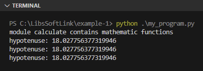

Pada chapter ini kita akan belajar tentang konsep module beserta penerapannya di Python.

Module di Python merupakan istilah untuk file yang berisi kode-kode python seperti deklarasi variabel, fungsi, class, dan lainnya yang kode tersebut terisolasi sesuai dengan tugasnya, misalnya:

- Module `numbers` berisi fungsi-fungsi untuk keperluan operasi angka
- Module `random` yang isinya kode untuk generate data random

Dengan adanya module kode menjadi lebih modular, rapi, dan mudah dikelola.

## A.27.1. Penerapan module

Pembuatan module di Python sangat mudah karena cukup dilakukan dengan membuat file, dan nama file yang dipilih akan menjadi nama module. Misalnya, file `calculate.py` adalah module dengan nama `calculate`.

Module bisa di-import di module lain, atau digunakan sebagai entrypoint eksekusi program. Misalnya pada banyak praktek di chapter sebelumnya, command `python.exe main.py` sering digunakan. Command tersebut menjadikan module `main` (file `main.py`) sebagai entrypoint eksekusi program.

Ok, sekarang mari kita coba praktekan penerapan module sebagai dependency (module yang di-import di module lain).

Buat program baru dengan isi kode di bawah ini. File `my_program.py` kita fungsikan sebagai entrypoint program, sedangkan module `calculate` sebagai dependency yang di-import di `my_program`.

<div style={{ width: '250px' }}>

```bash title="Project structure"
belajar-module
│─── calculate.py
└─── my_program.py
```

</div>

Selanjutnya tulis isi kode file `calculate`:

```python title="File calculate.py"
note = "module calculate contains mathematic functions"

def calc_hypotenuse(a, b):
    return sqrt(pow(a) + pow(b))

def pow(n, p = 2):
    return n ** p

def sqrt(x):
    n = 1
    for _ in range(10):
        n = (n + x/n) * 0.5
    return n
```

Module `calculate` berisi 1 buah variabel dan 3 buah fungsi:

- Variabel `note` berisi string
- Fungsi `calc_hypotenuse()` untuk menghitung nilai hipotenusa dari `a` dan `b`
- Fungsi `pow()` untuk meperingkas operasi pangkat
- Fungsi `sqrt()` untuk mencari akar kuadrat

Kesemua unit di atas di-import ke `my_program` untuk kemudian digunakan dalam perhitungan pencarian nilai hipotenusa.

```python title="File my_program.py"
a = 10
b = 15

import calculate

print(calculate.note)

res = calculate.calc_hypotenuse(a, b)
print("hypotenuse:", res)

res = calculate.sqrt(a**2 + b**2)
print("hypotenuse:", res)

res = calculate.sqrt(calculate.pow(a) + calculate.pow(b))
print("hypotenuse:", res)
```

Coba jalankan program menggunakan command berikut agar module `my_program` menjadi entrypoint eksekusi program.

```python
python my_program.py
```

Output:



Bisa dilihat pada kode yang sudah dipraktekan bagaimana mudahnya implementasi module di Python. 

Keyword `import` digunakan untuk meng-import suatu module atau class. Pada contoh di atas module `calculate` di-import ke `my_program.py` untuk kemudian digunakan fungsi-fungsinya.

- Pengaksesan variabel/konstanta dari suatu module menggunakan notasi `<module>.<variable/constant>`, contohnya `calcualte.note`.
- Sedangkan pengaksesan fungsi menggunakan notasi `<module>.<function>()`, contohnya seperti `calculate.calc_hypotenuse()`, `calculate.sqrt()`, dan `calculate.pow()`.

## A.27.2. Keyword `from` dan `import`

Ada dua bentuk penerapan keyword import, yang pertama adalah untuk meng-import module, contohya seperti pada praktek di atas (`import calculate`); Atau bisa juga dikombinasikan dengan keyword `from` untuk meng-import langsung fungsi yang ingin digunakan, contoh:

```python title="File my_program.py"
a = 10
b = 15

from calculate import note
from calculate import calc_hypotenuse
from calculate import sqrt

print(note)

res = calc_hypotenuse(a, b)
print("hypotenuse:", res)

res = sqrt(a**2 + b**2)
print("hypotenuse:", res)

res = sqrt(pow(a, 2) + pow(b, 2))
print("hypotenuse:", res)
```

Dua versi berbeda `my_program.py` di atas adalah ekuivalen, keduanya melakukan operasi yang sama persis dan menghasilkan output yang sama pula.

Perbedaannya pada contoh ke-2, variabel `note`, fungsi `calc_hypotenuse()` dan `sqrt()` di-import secara langsung menggunakan statement `from calculate import <function>`.

Untuk penulisannya bisa dituliskan satu per satu statement import-nya, atau bisa cukup sebaris saja (ini berlaku untuk import fungsi-fungsi yang bersumber dari module yang sama).

```python
from calculate import note
from calculate import calc_hypotenuse
from calculate import sqrt

# vs

from calculate import note, calc_hypotenuse, sqrt
```

### ◉ Fungsi `pow()`

Fungsi `pow()` merupakan salah satu fungsi bawaan Python Standard Library, jadi bisa digunakan secara langsung tanpa harus meng-import apapun.

Penggunaannya sangat mudah, langsung tulis saja `pow(a, b)` dimana hasilnya adalah operasi matematika `a pangkat b`.

Pada kode di atas, fungsi `pow()` milik module `calculate` tidak di-import agar tidak meng-override atau menimpa fungsi `pow()` bawaan Python.

## A.27.3. Statement `from <module> import *`

Statement `from <module> import *` digunakan untuk meng-import semua unit yang ada dalam module `<module>`. Contoh penerapannya:

```python title="File my_program.py"
a = 10
b = 15

from calculate import *

print(note)

res = calc_hypotenuse(a, b)
print("hypotenuse:", res)

res = sqrt(a**2 + b**2)
print("hypotenuse:", res)

res = sqrt(pow(a, 2) + pow(b, 2))
print("hypotenuse:", res)
```

## A.27.4. Keyword `as`

Module maupun fungsi bisa di-import dengan diberi nama alias. Biasanya teknik ini digunakan pada situasi dimana module yang di-import namanya cukup panjang, maka digunakan alias agar lebih pendek. Pembuatan alias sendiri dilakukan via keyword `as`.

Penerapannya bisa dilihat pada contoh berikut:

```python title="File my_program.py"
a = 10
b = 15

import calculate as calc
from calculate import calc_hypotenuse as hptns, sqrt

print(calc.note)

res = hptns(a, b)
print("hypotenuse:", res)

res = sqrt(a**2 + b**2)
print("hypotenuse:", res)

res = sqrt(calc.pow(a) + calc.pow(b))
print("hypotenuse:", res)
```

Penjelasan:

- Statement `import calculate as calc` meng-import module `calculate` dengan alias `calc`. Nantinya fungsi-fungsi dalam module tersebut bisa diakses via `calc.<function>()`.

- Statement `from calculate import calc_hypotenuse as hptns, sqrt` meng-import:

    - Fungsi `calc_hypotenuse()` dari module `calculate` dengan alias `hptns()`.
    - Fungsi `sqrt()` dari module `calculate`.

## A.27.4. Urutan pencarian module

Ketika suatu module di-import, Python akan melakukan pencarian file module di beberapa tempat secara berurutan:

1. Pertama, Python akan mencari module di folder yang sama dimana statement `import` digunakan.
2. Jika pencarian pertama tidak menemukan hasil, maka Python lanjut mencari file module ke folder dimana environment variable `PYTHONPATH` di-set.
3. Jika pencarian kedua juga tidak menemukan hasil, Python melanjutkan pencarian di folder dimana Python di-install.
4. Jika pencarian ketiga juga tidak sukses (file module tidak ditemukan), maka eksekusi program menghasilkan error.

## A.27.5. File module dalam folder

Bagaiaman jika suatu file module (misalnya `calculate.py`) berada di dalam suatu folder (subfolder), apakah cara import-nya sama? Sebenarnya sama namun ada sedikit. Kita akan bahas pada chapter selanjutnya, yaitu [Packages](/basic/packages).

---

<div class="section-footnote">

## Catatan chapter 📑

### ◉ Source code praktik

<pre>
    <a href="https://github.com/novalagung/dasarpemrogramanpython-example/tree/master/modules">
        github.com/novalagung/dasarpemrogramanpython-example/../modules
    </a>
</pre>

### ◉ Chapter relevan lainnya

- [Packages](/basic/packages)
- [Special names](/basic/special-names)

### ◉ Referensi

- https://docs.python.org/3/tutorial/modules.html

</div>
