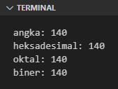
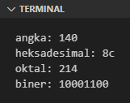
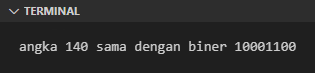
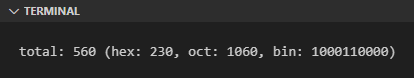
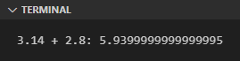

Sedikit mengulang tentang pembahasan chapter [Tipe Data ➜ numerik](/basic/tipe-data#a61-tipe-data-numerik), telah dijelaskan bahwa Python mengenal 3 jenis tipe data numerik, yaitu `int`, `float`, dan `complex`.

Pada chapter ini kita akan belajar lebih dalam tentang ketiganya.

## A.19.1. Integer

Bilangan bulat direpresentasikan oleh tipe data `int` (kependekan dari *integer*). Cara deklarasi nilai bertipe data ini adalah menggunakan literal integer dimana angka ditulis langsung. Contoh:

```python
angka1 = 24
angka2 = 13
total = angka1 + angka2
print(f"angka: {total}")
# output ➜ angka: 37
```

:::info

Ada yang unik dengan deklarasi bilangan bulat di Python. Diperbolehkan untuk menambahkan karakter underscore (`_`) di sela-sela angka. Misalnya:

```
angka3 = 100_2_345_123

print(f"angka3: {angka3}")
# output ➜ angka3: 1002345123
```

Variabel `angka3` di atas nilainya adalah sama dengan literal `1002345123`.

:::

Literal integer *default*-nya adalah berbasis 10, contohnya seperti `24` dan `13` di atas keduanya adalah berbasis 10. Dan umumnya bahasa pemrograman lain juga sama.

## A.19.2. Hexadecimal, Octal, Binary

Selain basis 10, bilangan bulat bisa dituliskan menggunakan basis lain, misalnya heksadesimal/oktal/biner, caranya dengan memanfaatkan *prefix* atau suatu awalan saat penulisan literalnya.

- Prefix literal untuk hexadesimal: `0x`
- Prefix literal untuk oktal: `0o`
- Prefix literal untuk biner: `0b`

```python
angka = 140
angka_heksadesimal = 0x8c
angka_oktal = 0o214
angka_biner = 0b10001100

print(f"angka: {angka}")
# output ➜ angka: 140

print(f"heksadesimal: {angka_heksadesimal}")
# output ➜ heksadesimal: 140

print(f"oktal: {angka_oktal}")
# output ➜ oktal: 140

print(f"biner: {angka_biner}")
# output ➜ biner: 140
```

Nilai numerik (tanpa melihat basis deklarasinya) ketika di-print pasti dimunculkan dalam basis 10. Python otomatis meng-handle proses konversi antar basisnya. Pembuktiannya bisa dilihat pada output program di atas.



Dari perbandingan source code dan output, terlihat bahwa angka `8c` heksadesimal adalah sama dengan `214` oktal dan `10001100` biner.

Sedangkan untuk memunculkan angka-angka tersebut sesuai basisnya caranya adalah dengan menggunakan metode string formatting, dengan menambahkan suffix dalam penulisan variabel. Contoh:

```python
angka = 140
angka_heksadesimal = 0x8c
angka_oktal = 0o214
angka_biner = 0b10001100

print(f"angka: {angka:d}")
# output ➜ angka: 140

print(f"heksadesimal: {angka_heksadesimal:x}")
# output ➜ heksadesimal: 8c

print(f"oktal: {angka_oktal:o}")
# output ➜ oktal: 214

print(f"biner: {angka_biner:b}")
# output ➜ biner: 10001100
```

Output program:



Perbedaan lengkap tentang prefix dan suffix tiap basis bilangan bisa dicek pada tabel berikut:

<table class="no-content-background">
    <thead>
        <tr>
            <th rowspan="2">Nama</th>
            <th class="align-center" rowspan="2">Basis</th>
            <th class="align-center" colspan="2">Deklarasi</th>
            <th class="align-center" colspan="2">String formatting</th>
        </tr>
        <tr>
            <th class="align-center"><i>Prefix</i></th>
            <th>Contoh</th>
            <th class="align-center"><i>Suffix</i></th>
            <th>Contoh</th>
        </tr>
    </thead>
    <tbody>
        <tr>
            <td><i>Decimal</i></td>
            <td class="align-center">10</td>
            <td class="align-center">-</td>
<td>

```
angka1 = 24
angka2 = 13
```

</td>
            <td class="align-center"><code>d</code> atau<br />tanpa suffix</td>
<td>

```
print(f"angka1: {angka1}")
print(f"angka2: {angka2:d}")
```

</td>
        </tr>
        <tr>
            <td><i>Hexadecimal</i></td>
            <td class="align-center">16</td>
            <td class="align-center"><code>0x</code></td>
<td>

```
hex1 = 0x8c
hex2 = 0xff00c0
```

</td>
            <td class="align-center"><code>x</code></td>
<td>

```
print(f"hex1: {hex1:x}")
print(f"hex2: {hex2:x}")
```

</td>
        </tr>
        <tr>
            <td><i>Octal</i></td>
            <td class="align-center">8</td>
            <td class="align-center"><code>0o</code></td>
<td>

```
oct1 = 0o214
oct2 = 0o605
```

</td>
            <td class="align-center"><code>o</code></td>
<td>

```
print(f"oct1: {oct1:o}")
print(f"oct2: {oct2:o}")
```

</td>
        </tr>
        <tr>
            <td><i>Binary</i></td>
            <td class="align-center">2</td>
            <td class="align-center"><code>0b</code></td>
<td>

```
bin1 = 0b1010
bin2 = 0b110
```

</td>
            <td class="align-center"><code>b</code></td>
<td>

```
print(f"bin1: {bin1:b}")
print(f"bin2: {bin2:b}")
```

</td>
        </tr>
    </tbody>
</table>

> Lebih detailnya mengenai string formatting dibahas pada chapter [String Formatting](/basic/string.md#a173-string-formatting)

### ◉ Operasi perbandingan antar basis

Nilai bilangan integer meskipun dideklarasikan dengan basis biner, heksadesimal, atau oktal, nilai tersebut disimpan di variabel oleh Python dalam satu tipe data, yaitu `int`. Dari sifat tersebut, maka operasi logika perbandingan bisa dilakukan tanpa melihat basis numerik-nya, karena kesemuanya pasti bertipe `int`.

```python
angka = 140
angka_biner = 0b10001100

if angka == angka_biner:
    print(f"angka {angka} sama dengan biner {angka_biner:b}")
# output ➜ angka 140 sama dengan biner 10001100
```

Output program:



### ◉ Print nilai numerik dalam basis tertentu menggunakan suffix

Angka numerik bisa di-print dalam basis apapun tanpa melihat deklarasinya menggunakan basis apa. Contohnya bisa dilihat pada program berikut, nilai oktal `214` di-print dalam 4 basis berbeda dengan memanfaatkan suffix tiap-tiap basis.

```python
angka_oktal = 0o214

print(f"angka: {angka_oktal:d}")
# output ➜ angka 140

print(f"heksadesimal: {angka_oktal:x}")
# output ➜ heksadesimal: 8c

print(f"oktal: {angka_oktal:o}")
# output ➜ oktal: 214

print(f"biner: {angka_oktal:b}")
# output ➜ biner: 10001100
```

### ◉ Operasi aritmatika antar basis

Operasi aritmatika, apapun itu, juga bisa dilakukan antar basis. Contoh:

```python
angka = 140
angka_heksadesimal = 0x8c
angka_oktal = 0o214
angka_biner = 0b10001100

total = angka + angka_heksadesimal + angka_oktal + angka_biner
print(f"total: {total} (hex: {total:x}, oct: {total:o}, bin: {total:b})")
```

Output program:



### ◉ Print nilai numerik dalam basis tertentu menggunakan fungsi

- Fungsi `oct()` digunakan untuk memunculkan nilai numerik dalam basis oktal dalam tipe data string.

```python
int1 = oct(140)
print(f"int1: {int1}")
# output ➜ int1: 0o214

int2 = oct(0x8c)
print(f"int2: {int2}")
# output ➜ int2: 0o214
```

- Fungsi `hex()` digunakan untuk memunculkan nilai numerik dalam basis heksadesimal dalam tipe data string.

```python
int3 = hex(140)
print(f"int3: {int3}")
# output ➜ int3: 0x8c

int4 = hex(0b10001100)
print(f"int4: {int4}")
# output ➜ int4: 0x8c
```

- Fungsi `bin()` digunakan untuk memunculkan nilai numerik dalam basis biner dalam tipe data string.

```python
int5 = bin(140)
print(f"int5: {int5}")
# output ➜ int5: 0b10001100

int6 = bin(0o214)
print(f"int6: {int6}")
# output ➜ int6: 0b10001100
```

### ◉ Fungsi `int()`

Fungsi `int()` digunakan untuk mengkonversi data string berisi angka numerik berbasis apapun (selama basisnya 0 hingga 36) ke tipe data integer.

```python
int1 = int("0b10001100", base=2)
print(f"int1: {int1}")
# output ➜ int1: 140

int2 = int("0x8c", base=16)
print(f"int2: {int2}")
# output ➜ int2: 140
```

## A.19.3. Floating point (*float*)

Bilangan *float* adalah bilangan yang memiliki angka dibelakang koma (atau titik untuk sistem angka luar negeri), misalnya angka `3.14` (yang di negara kita biasa ditulis dengan `3,14`).

> Umumnya bilangan ini dikenal dengan nama **bilangan desimal**. Namun penulis tidak menggunakan istilah ini karena kata *desimal* pada chapter ini tidak selalu berarti bilangan dengan nilai dibelakang koma.
>
> Penulis memilih menggunakan istilah bilangan *float*.

Untuk mendeklarasikan bilangan float, langsung saja tulis angka yang diinginkan dengan penanda dibelakang koma adalah tanda titik. Misalnya:

```python
angka_float = 3.141592653589
print(f"angka float: {angka_float}")
# output ➜ angka float: 3.141592653589
```

Khusus untuk bilangan float yang nilai belakang komanya adalah `0` bisa dituliskan dengan tanpa menuliskan angka `0`-nya. Contoh: 

```python
angka_float = 3.
print(f"angka float: {angka_float}")
# output ➜ angka float: 3.0
```

### ◉ Pembulatan / *rounding*

Pembulatan nilai di belakang koma dilakukan menggunakan fungsi `round()`. Panggil fungsi tersebut, sisipkan data float yang ingin dibulatkan sebagai argument pertama fungsi dan jumlah digit belakang koma sebagai argument ke-dua.

```python
pi = 3.141592653589

n1 = round(pi, 2)
print(f"n1: {n1}")
# output ➜ n1: 3.14

n2 = round(pi, 5)
print(f"n2: {n2}")
# output ➜ n2: 3.14159
```

Selain fungsi `round()` ada juga 2 fungsi milik module `math` yang cukup berguna untuk keperluan pembulatan ke-bawah atau ke-atas.

- Pembulatan ke-bawah.

    ```python
    import math

    n3 = math.floor(pi)
    print(f"n3: {n3}")
    # output ➜ n3: 3
    ```

- Pembulatan ke-atas

    ```python
    import math

    n4 = math.ceil(pi)
    print(f"n4: {n4}")
    # output ➜ n4: 4
    ```

Kedua fungsi di atas menghasilkan nilai balik bertipe `int`, tidak seperti fungsi `round()` yang mengembalikan nilai float.

### ◉ Pembulatan float dengan string formatting

Fungsi `round()`, `math.floor()`, dan `math.ceil()` menerima data float sebagai argument pemanggilan fungsi dan mengembalikan nilai baru setelah dibulatkan.

Jika pembulatan hanya diperlukan saat printing saja, lebih efektif menggunakan metode string formatting. Caranya, tulis variabel dalam string formatting lalu tambahkan suffix `:.{n}f` dimana `n` diisi dengan jumlah digit belakang koma. Sebagai contoh, suffix `:.2f` menghasilkan string berisi data float dengan 2 digit dibelakang koma.

Contoh versi lebih lengkap:

```python
angka_float = -3.141592653589

print(f"angka float: {angka_float:.2f}")
# output ➜ angka float: -3.14

print(f"angka float: {angka_float:.3f}")
# output ➜ angka float: -3.142

print(f"angka float: {angka_float:.4f}")
# output ➜ angka float: -3.1416
```

### ◉ Karakteristik *floating point*

Hampir di semua bahasa pemrograman yang ada, tipe data float (atau sejenisnya) memiliki satu sifat unik dimana angka belakang koma tidak tersimpan secara pasti informasinya digitnya.

Agar lebih jelas, silakan run program berikut:

```python
n = 3.14 + 2.8
print(f"3.14 + 2.8: {n}")
```



Ajaib bukan? Operasi aritmatika `3.14 + 2.8` menghasilkan output `5.9399999999999995`.

Namun tidak usah khawatir, ini bukan error. Di belakang layar, komputer memang selalu menyimpan informasi angka belakang koma float secara tidak pasti (tidak *fixed*).

Untuk menampilkan angka fixed-nya, gunakan suffix `:f`. Contoh:

```python
n = 3.14 + 2.8

print(f"3.14 + 2.8: {n:f}")
# output ➜ 3.14 + 2.8: 5.940000
```

Manfaatkan suffix `:{n}f` untuk menampilkan jumlah digit belakang koma (`n`) sesuai keinginan. Misalnya:

```python
n = 3.14 + 2.8
print(f"3.14 + 2.8: {n:.2f}")
# output ➜ 3.14 + 2.8: 5.94
```

> Lebih detailnya mengenai string formatting dibahas pada chapter [String Formatting](/basic/string)

### ◉ Konversi tipe data via fungsi `float()`

Fungsi `float()` digunakan untuk mengkonversi suatu nilai menjadi float.

```python
number = 278885
float_num1 = float(number)
print(f"float_num1: {float_num1}")
# output ➜ float_num1: 278885.0
```

Fungsi ini cukup berguna untuk dipergunakan dalam kebutuhan konversi tipe data, misalnya dari string ke float.

```python
text = '278885.666'
float_num2 = float(text)
print(f"float_num2: {float_num2}")
# output ➜ float_num: 278885.666
```

### ◉ Notasi float *exponential*

Deklarasi nilai float bisa ditulis menggunakan literal float dengan notasi exponsensial, yaitu `{f}e{n}` atau `{f}e+{n}` dimana literal tersebut menghasilkan angka `f * (10 ^ n)`.

Agar lebih jelas, langsung ke praktek saja.

```python
float1 = 2e0
print(f"float1: {float1}")
# output ➜ float1: 2.0

float2 = 577e2
print(f"float2: {float2}")
# output ➜ float2: 57700.0

float3 = 68277e+6
print(f"float3: {float3}")
# output ➜ float3: 68277000000.0
```

Penjelasan:

- Notasi `2e0` artinya adalah `2.0 * (10 ^ 0)`. Nilai tersebut ekuivalen dengan `2.0`
- Notasi `577e2` artinya adalah `577.0 * (10 ^ 2)`. Nilai tersebut ekuivalen dengan `57700.0`
- Notasi `68277e+6` artinya adalah `68277.0 * (10 ^ 6)`. Nilai tersebut ekuivalen dengan `68277000000.0`

Nilai `n` setelah huruf `e` jika diisi dengan nilai negatif menghasilkan output dengan formula `f / (10 ^ n)`. Contoh:

```python
float4 = 6e-3
print(f"float4: {float4}")
# output ➜ float4: 0.006
```

## A.19.4. Bilangan *complex*

Bilangan *complex* adalah bilangan yang isinya merupakan kombinasi bilangan real dan bilangan imajiner, contohnya seperti `120+3j`.

Informasi bilangan real pada *complex number* bisa dimunculkan menggunakan property `real` sedangkan informasi bilangan imajinernya menggunakan property `imag`. Contoh:

```python
angka_complex = 120+3j
print(f"angka complex: {angka_complex}")
# output ➜ angka complex: (120+3j)

r = angka_complex.real
print(f"angka real: {r}")
# output ➜ angka real: 120.0

i = angka_complex.imag
print(f"angka imajiner: {i}")
# output ➜ angka imajiner: 3.0
```

### ◉ Fungsi `complex()`

Fungsi `complex()` adalah digunakan sebagai alternatif cara membuat bilangan kompleks.

Sebagai contoh, bilangan `120+3j` jika dituliskan menggunakan fungsi `complex()` maka penulisannya seperti berikut:

```python
angka_complex = complex(120, 3)
print(f"angka complex: {angka_complex}")
# output ➜ angka complex: (120+3j)
```

### ◉ Operasi aritmatika bilangan *complex*

Seperti wajarnya suatu bilangan, nilai *complex* bisa dimasukan dalam operasi matematika standar, misalnya:

```python
cmp1 = 120-2j
cmp2 = -19+4j

res = cmp1 + cmp2
print(f"angka complex: {res}")
# output ➜ angka complex: (101+2j)

res = cmp1 + cmp2 + 23
print(f"angka complex: {res}")
# output ➜ angka complex: (124+2j)

res = (cmp1 + cmp2 + 23) / 0.5
print(f"angka complex: {res}")
# output ➜ angka complex: (248+4j)
```

Penjelasan:

- Operasi antar bilangan kompleks akan melakukan perhitungan terhadap bilangan real dan juga bilangan imajinernya.
- Operasi antara bilangan kompleks vs. bilangan real, menghasilkan dua operasi aritmatika:
  - Menghitung bilangan real bilangan complex vs bilangan real
  - Dan juga menghitung bilangan imajiner vs bilangan real

---

<div class="section-footnote">

## Catatan chapter 📑

### ◉ Source code praktik

<pre>
    <a href="https://github.com/novalagung/dasarpemrogramanpython-example/tree/master/number-bilangan">
        github.com/novalagung/dasarpemrogramanpython-example/../number-bilangan
    </a>
</pre>

### ◉ Chapter relevan lainnya

- [Variabel](/basic/variabel)
- [Tipe Data](/basic/tipe-data)
- [String ➜ formatting](/basic/string#a173-string-formatting)

### ◉ TBA

- nan
- inf

### ◉ Referensi

- https://pythondev.readthedocs.io/numbers.html
- https://note.nkmk.me/en/python-nan-usage/
- https://note.nkmk.me/en/python-inf-usage/

</div>
