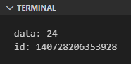
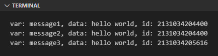
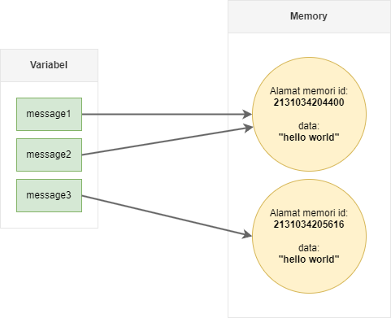
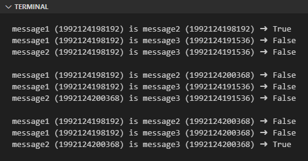
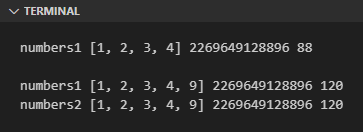
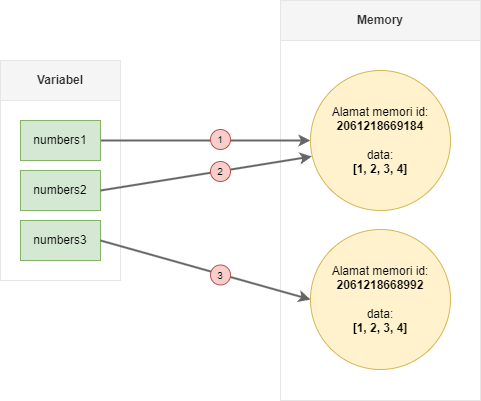
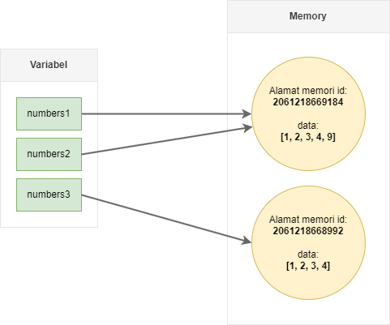

Pada chapter ini kita akan belajar tentang beberapa hal yang berhubungan dengan object/data dan reference, diantaranya:

- Apa itu *identifier* data (object ID)
- Bagaimana Python mengelola data
- Apa yang terjadi sewaktu data di-*assign* ke variabel lain
- Dan juga peran ID dalam data reference dan operasi slicing

## A.21.1. Object ID

Di Python, semua object atau data memiliki identifier, yaitu angka unik yang merepresentasikan data tersebut. Sebagai contoh, pada kode berikut nilai numerik `24` tersimpan pada variabel `number`, ID nya adalah `140728206353928`.

```python
number = 24

print("data:", number)
# output ➜ data: 24

identifier = id(number)
print("id:", identifier)
# output ➜ id: 140728206353928
```

Output program di atas jika di-run:



Object ID dialokasikan oleh Python saat program dijalankan, dan nilainya bisa saja berbeda setiap eksekusi program.

### ◉ Fungsi `id()`

Fungsi `id()` digunakan untuk melihat ID suatu data. Cara penggunaannya cukup mudah, tulis fungsi lalu sisipkan data yang ingin dicek ID-nya sebagai parameter pemanggilan fungsi.

## A.21.2. *Reference* / alamat memori data

Perlu diketahui bahwa Identifier merupakan metadata informasi yang menempel pada data atau object, **bukan menempel ke variabel**. Data yang sama jika di-assign ke banyak variabel, maka pengecekan ID pada semua variabel tersebut mengembalikan ID yang sama.

> *Reference* pada konteks programming artinya adalah referensi suatu data ke alamat memori.

Coba pelajari kode berikut. Variabel `message1` berisi string `hello world`. String tersebut kemudian di-assign ke `message2`. Selain itu ada juga variabel `message3` berisi string yang sama persis tapi dari deklarasi literal berbeda.

```python
message1 = "hello world"
message2 = message1
message3 = "hello world"

print(f": message1, id: {message1}, data: {id(message1)}")
# output ➜ var: message1, data: hello world, id: 2131034204400

print(f": message2, id: {message2}, data: {id(message2)}")
# output ➜ var: message2, data: hello world, id: 2131034204400

print(f": message3, id: {message3}, data: {id(message3)}")
# output ➜ var: message3, data: hello world, id: 2131034205616
```

Jalankan program, lalu perhatikan `id`-nya:



Penjelasan program:

- Ketiga variabel di atas berisi data string yang sama persis, yaitu `hello world`.

- Identifier data string pada variabel `message1` dan `message2` adalah sama. Hal ini wajar karena memang variabel `message2` mendapatkan data dari `message1`. Yang terjadi di belakang layar, kedua variabel tersebut menampung nilai yang tersimpan di alamat memori yang sama (*reference*-nya sama).

- Identifier data string pada variabel `message3` adalah berbeda dibandingkan `message1` maupun `message2`, hal ini karena meskipun isi string ketiga variabel sama, dua diantaranya adalah tersimpan di alamat memory yang berbeda.

Ilustrasi dalam bentuk grafiknya kurang lebih seperti ini:



Variabel hanya merupakan media untuk pengaksesan data. Data sendiri tersimpan-nya adalah di memory. Sangat mungkin ada situasi dimana satu data direpresentasikan oleh lebih dari 1 variabel. Contohnya seperti `message1` dan `message2`.

## A.21.3. Operasi logika via keyword `is`

Kita sudah cukup sering menggunakan operator `==` dan operator logika lainnya untuk membandingkan dua buah nilai. Dalam penerapannya, operator-operator tersebut akan membandingkan isi data, **bukan identifier**-nya.

Pada kode berikut ini, 3 variabel yang telah dibuat sebelumnya digunakan pada statement perbandingan.

```python
message1 = "hello world"
message2 = message1
message3 = "hello world"

print(f"message1 ({id(message1)}) == message2 ({id(message2)}) ➡️ {message1 == message2}")
# output ➜ message1 (2131034204400) == message2 (2131034204400) ➡️ True

print(f"message1 ({id(message1)}) == message3 ({id(message3)}) ➡️ {message1 == message3}")
# output ➜ message1 (2131034204400) == message3 (2131034205616) ➡️ True

print(f"message2 ({id(message2)}) == message3 ({id(message3)}) ➡️ {message2 == message3}")
# output ➜ message2 (2131034204400) == message3 (2131034205616) ➡️ True
```

Hasil dari ke-3 statement perbandingan adalah `True`, karena memang isi data-nya adalah sama, yaitu string `hello world`.

Selanjutnya coba bandingkan dengan satement operator perbandingan menggunakan keyword `is`. Keyword `is` akan melakukan pengecekan apakah identifier suatu data adalah sama dengan yang dibandingkan (yang di-cek adalah identifier-nya, bukan isi datanya).

```python
message1 = "hello world"
message2 = message1
message3 = "hello world"

print(f"message1 ({id(message1)}) is message2 ({id(message2)}) ➡️ {message1 is message2}")
# output ➜ message1 (2131034204400) is message2 (2131034204400) ➡️ True

print(f"message1 ({id(message1)}) is message3 ({id(message3)}) ➡️ {message1 is message3}")
# output ➜ message1 (2131034204400) is message3 (2131034205616) ➡️ False

print(f"message2 ({id(message2)}) is message3 ({id(message3)}) ➡️ {message2 is message3}")
# output ➜ message2 (2131034204400) is message3 (2131034205616) ➡️ False
```

Hasilnya:

- Statement `message1 is message2` menghasilkan `True` karena kedua variabel tersebut merepresentasikan satu data yang sama (tersimpan di alamat memory yang sama).
- Statement perbandingan lainnya menghasilkan `False` karena identifier data adalah berbeda meskipun isi data adalah sama.

### ◉ Lebih dalam mengenai korelasi operasi assignment dan object ID

Mari kita modifikasi lagi kode sebelumnya agar lebih terlihat jelas efek dari opeasi assignment ke object ID.

Pada kode berikut, kita coba tampilkan hasil operasi perbandingan menggunakan keyword `is`. Kemudian nilai variabel `message2` diubah dan dibandingkan ulang. Setelah itu, nilai `message3` diubah untuk diisi dengan nilai dari `message2`.

```python
message1 = "hello world"
message2 = message1
message3 = "hello world"

print(f"message1 ({id(message1)}) is message2 ({id(message2)}) ➜ {message1 is message2}")
print(f"message1 ({id(message1)}) is message3 ({id(message3)}) ➜ {message1 is message3}")
print(f"message2 ({id(message2)}) is message3 ({id(message3)}) ➜ {message2 is message3}")

message2 = "hello world"

print(f"message1 ({id(message1)}) is message2 ({id(message2)}) ➜ {message1 is message2}")
print(f"message1 ({id(message1)}) is message3 ({id(message3)}) ➜ {message1 is message3}")
print(f"message2 ({id(message2)}) is message3 ({id(message3)}) ➜ {message2 is message3}")

message3 = message2

print(f"message1 ({id(message1)}) is message2 ({id(message2)}) ➜ {message1 is message2}")
print(f"message1 ({id(message1)}) is message3 ({id(message3)}) ➜ {message1 is message3}")
print(f"message2 ({id(message2)}) is message3 ({id(message3)}) ➜ {message2 is message3}")
```

Output program:



Bisa dilihat, pada bagian akhir, statement `message2 is message3` menghasilkan nilai `True` karena pada baris tersebut isi data `message3` sudah diganti dengan data dari `message2`, menjadikan kedua variabel menampung satu data yang sama, dan tersimpan di alamat memory yang sama.

Ilustrasi perubahan data pada program di atas dalam bentuk grafik bisa dilihat pada penjelasan berikut:

- Fase 1:

    ```python
    message1 = "hello world"    # statement 1
    message2 = message1         # statement 2
    message3 = "hello world"    # statement 3
    ```

    


- Fase 2:

    ```python
    message1 = "hello world"    # statement 1
    message2 = message1         # statement 2
    message3 = "hello world"    # statement 3

    message2 = "hello world"    # statement 4
    ```

    

- Fase 3:

    ```python
    message1 = "hello world"    # statement 1
    message2 = message1         # statement 2
    message3 = "hello world"    # statement 3

    message2 = "hello world"    # statement 4

    message3 = message2         # statement 5
    ```

    

## A.21.4. Reference data sequence

Data sequence (entah itu list, string, ataupun lainnya) kalau dilihat dari segi manajemen memory-nya adalah berbeda dibandingkan dengan bagaimana data dalam array di-manage di bahasa lain.

List di Python tersimpan pada satu alamat memory. Tidak seperti slice/array pada bahasa Go (misalnya), yang setiap element-nya merupakan *reference*.

Perhatikan kode berikut, variabel `numbers1` berikut di-assign ke variabel bernama `numbers2`, maka identifier kedua variabel adalah sama karena mengarah ke satu data yang sama.

```python
numbers1 = [1, 2, 3, 4]
print("numbers1", id(numbers1), numbers1)
# output ➜ numbers1 2269649131136 [1, 2, 3, 4]

numbers2 = numbers1
print("numbers1", id(numbers1), numbers1)
# output ➜ numbers1 2269649131136 [1, 2, 3, 4]

print("numbers2", id(numbers2), numbers2)
# output ➜ numbers2 2269649131136 [1, 2, 3, 4]
```

Perlu diingat bahwa data sequence bukan data *atomic* seperti `int` yang isinya sangat spesifik, yaitu nilai numerik. Data sequence merupakan data kolektif dengan isi banyak element. Data sequence isi-isi element-nya bisa dimutasi atau diubah tanpa men-*trigger* alokasi alamat memory baru (identifier-nya adalah tetap).

Sebagai contoh, pada program berikut, variabel `numbers1` dan `numbers2` reference-nya adalah sama. Apa yang akan terjadi ketika ada penambahan element baru di salah satu variabel?

```python
import sys

numbers1 = [1, 2, 3, 4]
print("numbers1", numbers1, id(numbers1), sys.getsizeof(numbers1))

numbers2 = numbers1
numbers2.append(9)

print("numbers1", numbers1, id(numbers1), sys.getsizeof(numbers1))
print("numbers2", numbers1, id(numbers2), sys.getsizeof(numbers2))
```

Output program:



Dari output eksekusi program terlihat bahwa data `numbers1` ikut berubah setelah `numbers2` diubah lewat penambahan element baru (via method `append()`). perubahan di kedua variabel terjadi karena memang keduanya merepresentasikan satu data yang sama, reference-nya adalah sama.

Terlihat juga ID kedua variabel juga tetap meskipun setelah isi element-nya di-ubah.

### ◉ Fungsi `sys.getsizeof()`

Fungsi `getsizeof()` tersedia dalam module `sys`, kegunaannya untuk melihat ukuran data dalam *byte*.

## A.21.5. Reference pada data hasil slicing

Bagaimana dengan slicing, apakah ada efeknya ke object ID dan *reference* data? Yap, ada. Coba saja test program berikut:

```python
numbers1 = [1, 2, 3, 4]
numbers2 = numbers1
numbers3 = numbers1[:]

print("numbers1", numbers1, id(numbers1)) # statement 1
print("numbers2", numbers2, id(numbers2)) # statement 2
print("numbers3", numbers3, id(numbers3)) # statement 3

numbers2.append(9)

print("numbers1", numbers1, id(numbers1)) # statement 4
print("numbers2", numbers2, id(numbers2)) # statement 5
print("numbers3", numbers3, id(numbers3)) # statement 6
```

Kemudian lihat hasilnya:


Penjelasan:

- Ketika suatu data sequence di assign dari satu variabel ke variabel lain, maka keduanya memiliki reference yang sama.
- Namun, jika assignment tersebut merupakan hasil operasi slice, maka data hasil slicing merupakan data baru yang tersimpan di alamat memory baru. Jadi ID-nya sudah pasti berbeda.

Ilustrasi yang terjadi pada saat `statement 1, 2, 3` dieksekusi:



Lalu setelah angka `9` di-append ke `numbers2`:



## A.21.6. Catatan tambahan tentang object ID

Ada hal unik/spesial yang berhubungan dengan object ID yang wajib untuk diketahui, diantaranya:

### ◉ Object ID data numerik

Python meng-*cache* informasi data numerik integer `-5` hingga `256`, karena alasan ini terkadang ID suatu data numerik integer adalah sama (meskipun tidak selalu).

```python
n1 = 12
n2 = 12

print(f"id n1: {id(n1)}, id n2: {id(n2)}")
# output ➜ id n1: 140728206353544, id n2: 140728206353544

print(f"n1 == n2: {n1 == n2}")
# output ➜ n1 == n2: True

print(f"n1 is n2: {n1 is n2}")
# output ➜ n1 is n2: True
```

### ◉ Object ID data string

Python meng-*cache* informasi data string `a` hingga `Z`, karena alasan ini terkadang ID suatu data string adalah sama (meskipun tidak selalu).

```python
str1 = 'Indonesia'
str2 = "Indonesia"

print(f"id str1: {id(str1)}, id str2: {id(str2)}")
# output ➜ id str1: 133983722110320, id str2: 133983722110320

print(f"str1 == str2: {str1 == str2}")
# output ➜ str1 == str2: True

print(f"str1 is str2: {str1 is str2}")
# output ➜ str1 is str2: True
```

---

<div class="section-footnote">

## Catatan chapter 📑

### ◉ Source code praktik

<pre>
    <a href="https://github.com/novalagung/dasarpemrogramanpython-example/tree/master/object-id-reference">
        github.com/novalagung/dasarpemrogramanpython-example/../object-id-reference
    </a>
</pre>

### ◉ Chapter relevan lainnya

- [Slice](/basic/slice)

### ◉ TBA

- Hashable

### ◉ Referensi

- https://stackoverflow.com/questions/45335809/python-pass-by-reference-and-slice-assignment
- https://stackoverflow.com/a/15172182/1467988

</div>
