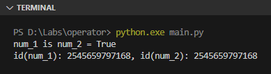
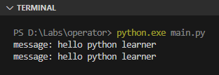

Operator adalah suatu karakter yang memiliki kegunaan khusus contohnya seperti `+` untuk operasi aritmatika tambah, dan `and` untuk operasi logika **AND**.

Pada chapter ini kita akan mempelajari macam-macam operator yang ada di Python.

## A.7.1. Operator aritmatika

| Operator | Keterangan | Contoh |
| :-: | :- | :- |
| `+` | operasi tambah | `num = 2 + 2` ➜ hasilnya `num` nilainya `4` |
| unary `+` | penanda nilai positif | `num = +2` ➜ hasilnya `num` nilainya `2` |
| `-` | operasi pengurangan | `num = 3 - 2` ➜ hasilnya `num` nilainya `1` |
| unary `-` | penanda nilai negatif | `num = -2` ➜ hasilnya `num` nilainya `-2` |
| `*` | operasi perkalian | `num = 3 * 3` ➜ hasilnya `num` nilainya `9` |
| `/` | operasi pembagian | `num = 8 / 2` ➜ hasilnya `num` nilainya `4` |
| `//` | operasi bagi dengan hasil dibulatkan ke bawah | `num = 10 // 3` ➜ hasilnya `num` nilainya `3` |
| `%` | operasi modulo (pencarian sisa hasil bagi) | `num = 7 % 4` ➜ hasilnya `num` nilainya `3` |
| `**` | operasi pangkat | `num = 3 ** 2` ➜ hasilnya `num` nilainya `9` |

## A.7.2. Operator *assignment*

Operator assignment adalah `=`, digunakan untuk operasi assignment (penugasan nilai atau penentuan nilai), sekaligus untuk deklarasi variabel jika variabel tersebut sebelumnya belum terdeklarasi. Contoh:

```python
# deklarasi variabel num_1
num_1 = 12

# deklarasi variabel num_2
num_2 = 24

# nilai baru ditugaskan ke variabel num_2
num_2 = 12

# deklarasi variabel num_3 dengan isi nilai hasil operasi aritmatika `num_1 + num_2`
num_3 = num_1 + num_2

print(num_3)
# output ➜ 24
```

## A.7.3. Operator perbandingan

Operator perbandingan pasti menghasilkan nilai kebenaran `bool` dengan kemungkinannya hanya dua nilai, yaitu benar (`True`) atau salah (`False`).

Python mengenal operasi perbandingan standar yang umumnya juga dipakai di bahasa lain.

| Operator | Keterangan | Contoh |
| :-: | :- | :- |
| `==` | apakah kiri sama dengan kanan | `res = 4 == 5` ➜ hasilnya `res` nilainya `False` |
| `!=` | apakah kiri tidak sama dengan kanan | `res = 4 != 5` ➜ hasilnya `res` nilainya `True` |
| `>` | apakah kiri lebih besar dibanding kanan | `res = 4 > 5` ➜ hasilnya `res` nilainya `False` |
| `<` | apakah kiri lebih kecil dibanding kanan | `res = 4 < 5` ➜ hasilnya `res` nilainya `True` |
| `>=` | apakah kiri lebih besar atau sama dengan kanan | `res = 5 >= 5` ➜ hasilnya `res` nilainya `True` |
| `<=` | apakah kiri lebih kecil atau sama dengan kanan | `res = 4 <= 5` ➜ hasilnya `res` nilainya `False` |

## A.7.4. Operator logika

| Operator | Keterangan | Contoh |
| :-: | :- | :- |
| `and` | operasi logika **AND** | `res = (4 == 5) and (2 != 3)` ➜ hasilnya `res` nilainya `False` |
| `or` | operasi logika **OR** | `res = (4 == 5) or (2 != 3)` ➜ hasilnya `res` nilainya `True` |
| `not` atau `!` | operasi logika **negasi** (atau **NOT**) | `res = not (2 == 3)` ➜ hasilnya `res` nilainya `True`<br />`res = !(2 == 3)` ➜ hasilnya `res` nilainya `True` |

## A.7.5. Operator bitwise

| Operator | Keterangan | Contoh |
| :-: | :- | :- |
| `&` | operasi bitwise **AND** | `x & y = 0 (0000 0000)` |
| <code>\|</code> | operasi bitwise **OR** | <code>x \| y = 14 (0000 1110)</code> |
| `~` | operasi bitwise **NOT** | `~x = -11 (1111 0101)` |
| `^` | operasi bitwise **XOR** | `x ^ y = 14 (0000 1110)` |
| `>>` | operasi bitwise **right shift** | `x >> 2 = 2 (0000 0010)` |
| `<<` | operasi bitwise **left shift** | `x << 2 = 40 (0010 1000)` |

## A.7.6. Operator *identity* (`is`)

Operator `is` memiliki kemiripan dengan operator logika `==`, perbedaannya pada operator `is` yang dibandingkan bukan nilai, melainkan identitas atau ID-nya.

Bisa saja ada 2 variabel bernilai sama tapi identitasnya berbeda. Contoh:

```python
num_1 = 100001
num_2 = 100001

res = num_1 is num_2
print("num_1 is num_2 =", res)
print("id(num_1): %s, id(num_2): %s" % (id(num_1), id(num_2)))
```



> Di Python ada *special case* yang perlu kita ketahui perihal penerapan operator `is` untuk operasi perbandingan identitas khusus tipe data numerik. Pembahasan detailnya ada di chapter [Object ID & Reference](/basic/object-id-reference).


:::info

Pengecekan nilai kosong (atau `None`) dianjurkan untuk selalu dilakukan menggunakan operator `is`, dan menghindari penggunaan operator `==`.

Hal ini karena operator `is` membandingkan identitas data dan identitas data `None` selalu valid. Sedangkan operator `==` perbandingannya dilakukan dengan via special method `__eq__()` yang default method tersebut bisa di-override isinya.
 
> Lebih jelasnya penggunaan operator `is` terhadap `None` di bahas di chapter [None](https://dasarpemrogramanpython.novalagung.com/basic/none)

:::

### ◉ Fungsi `print()` tanpa string formatting

Statement `print("num_1 is not num_2 =", res)` adalah salah satu cara untuk printing data tanpa menggunakan string formatting (seperti `%s`).

Yang terjadi pada statement tersebut adalah, semua nilai argument pemanggilan fungsi `print()` akan digabung dengan delimiter karakter spasi (` `) kemudian ditampilkan ke layar console.

Agar lebih jelas, silakan perhatikan statement berikut, keduanya adalah menghasilkan output yang sama.

```python
print("message: %s %s %s" % ("hello", "python", "learner"))
print("message:", "hello", "python", "learner")
```



### ◉ Fungsi `id()`

Digunakan untuk mengambil nilai identitas atau ID suatu data. Contoh penerapannya sangat mudah, cukup panggil fungsi `id()` kemudian tulis data yang ingin diambil ID-nya sebagai argument pemanggilan fungsi tersebut.

```python
data_1 = "hello world"
id_data_1 = id(data_1)

print("data_1:", data_1)
# output ➜ data_1: hello world

print("id_data_1:", id_data_1)
# output ➜ id_data_1: 19441xxxxxxxx
```

Nilai kembalian fungsi `id()` bertipe numerik.

> Pembahasan detail mengenai fungsi `id()` ada di chapter [Object ID & Reference](/basic/object-id-reference)

## A.7.7. Operator *membership* (`in`)

Operator `in` digunakan untuk mengecek apakah suatu nilai merupakan bagian dari data kolektif atau tidak.

Operator ini bisa dipergunakan pada semua tipe data kolektif seperti dictionary, set, tuple, dan list. Selain itu, operator `in` juga bisa digunakan pada string untuk pengecekan substring

```python
sample_list = [2, 3, 4]
is_3_exists = 3 in sample_list
print(is_3_exists)
# output ➜ True

sample_tuple = ("hello", "python")
is_hello_exists = "hello" in sample_tuple
print(is_hello_exists)
# output ➜ True

sample_dict = { "nama": "noval", "age": 12 }
is_key_nama_exists = "nama" in sample_dict
print(is_key_nama_exists)
# output ➜ True

sample_set = { "sesuk", "preiiii" }
is_prei = "preiiii" in sample_set
print(is_prei)
# output ➜ True

text = 'Hello world'
is_substring_exists = 'orl' in text
print(is_substring_exists)
# output ➜ True
```

> Operator `in` jika diterapkan pada tipe dictionary, yang di-check adalah key-nya bukan value-nya.

---

<div class="section-footnote">

## Catatan chapter 📑

### ◉ Source code praktik

<pre>
    <a href="https://github.com/novalagung/dasarpemrogramanpython-example/tree/master/operator">
        github.com/novalagung/dasarpemrogramanpython-example/../operator
    </a>
</pre>

### ◉ Chapter relevan lainnya

- [Variabel](/basic/variabel)
- [Tipe Data](/basic/tipe-data)
- [String ➜ formatting](/basic/string#a173-string-formatting)

### ◉ TBA

- Operator `@` for matrix multiplication

### ◉ Referensi

- https://realpython.com/python-operators-expressions/
- https://www.programiz.com/python-programming/operators
- https://stackoverflow.com/a/15172182/1467988

</div>
