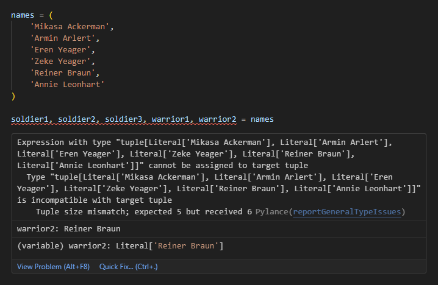

Python mengenal teknik packing dan unpacking, dimana teknik ini umum diterapkan sesuai kebutuhan pada beberapa jenis tipe data kolektif seperti tuple, list, set, dan dictionary. Pada chapter ini kita akan mempelajari cara penggunaannya, beserta peran penggunaan tanda `*` dan `**` pada operasi packing dan unpacking.

## A.32.1. Unpacking element tuple, list, set

Unpacking (yang dalam Bahasa Indonesia berarti bongkar muatan) adalah teknik pendistribusian elemen tipe data kolektif ke banyak variabel.

Distribusinya sendiri bisa *1 on 1* yang berarti setiap elemen ditampung 1 variabel, atau hanya beberapa elemen saja yang didistribusikan ke variabel baru, sisanya tetap ditampung dalam bentuk data kolektif.

### ◉ Unpack 1 element = 1 variable

Pada program berikut ada sebuah tuple bernama `names` yang setiap element-nya perlu untuk didistribusikan ke variabel independen. Karena ada 6 buah elemen dalam tuple tersebut, maka perlu disiapkan 6 buah variabel untuk menampung data masing-masing element.

```python
names = (
    'Mikasa Ackerman',
    'Armin Arlert',
    'Eren Yeager',
    'Zeke Yeager',
    'Reiner Braun',
    'Annie Leonhart'
)

soldier1, soldier2, soldier3, warrior1, warrior2, warrior3 = names

print(soldier1) # output ➜ Mikasa Ackerman
print(soldier2) # output ➜ Armin Arlert
print(soldier3) # output ➜ Eren Yeager
print(warrior1) # output ➜ Zeke Yeager
print(warrior2) # output ➜ Reiner Braun
print(warrior3) # output ➜ Annie Leonhart
```

Jika jumlah variabel penampung tidak sama dengan jumlah element data kolektif, misalnya jumlah variabel lebih sedikit, maka error pasti muncul saat eksekusi program.



### ◉ Unpack hanya `N` elements pertama

Ada alternatif cara lain untuk kasus lainnya dimana element yang perlu ditampung ke variabel baru hanya beberapa element pertama saja. Misalnya, dari 6 element tuple, hanya 3 yang perlu disimpan ke variabel baru. Hal seperti ini bisa dilakukan dengan konsekuensi: sisa element lainnya ditampung dalam bentuk kolektif di satu variabel lain.

Contoh penerapannya bisa dilihat di kode berikut. Tuple yang sama, 3 element pertamanya saja yang ditampung ke variabel baru. Untuk element sisanya, tetap harus ditampung juga tapi cukup di 1 variabel saja, tersimpan dalam tiple data `list`.

> Variabel penampung sisa element selalu dalam bentuk `list` meskipun sumber datanya bertipe data lain.

```python
names = (
    'Mikasa Ackerman',
    'Armin Arlert',
    'Eren Yeager',
    'Zeke Yeager',
    'Reiner Braun',
    'Annie Leonhart'
)

soldier1, soldier2, deceiver1, *warriors = names

print(soldier1)  # output ➜ Mikasa Ackerman
print(soldier2)  # output ➜ Armin Arlert
print(deceiver1) # output ➜ Eren Yeager
print(warriors)  # output ➜ ['Zeke Yeager', 'Reiner Braun', 'Annie Leonhart']
```

Bisa dilihat dari output, bahwa 3 element pertama berhasil ditampung di 3 variabel baru. Sisanya tetap disimpan ke variabel lain yang pada contoh di atas adalah variabel `warriors`.

Penulisan variabel penampung sisa element diawali dengan karakter `*` dan pasti tipe datanya adalah list.

> Penulisan karakter `*` di awal variabel ini wajib. Jika tidak ditulis, maka Python menganggap ada 4 buah variabel mencoba menampung element tuple.
>
> Jika diterapkan pada kasus di atas, statement tersebut pasti menghasilkan error, karena data `names` berisi 6 element.

Katakanlah data element yang dibutuhkan hanya 3 pertama, sisanya bisa dibuang, maka bisa gunakan variabel `_` sebagai tempat pembuangan element yang tidak terpakai.

```python
soldier1, soldier2, deceiver1, *_ = names

print(soldier1)  # output ➜ Mikasa Ackerman
print(soldier2)  # output ➜ Armin Arlert
print(deceiver1) # output ➜ Eren Yeager
```

### ◉ Unpack hanya `N` elements terakhir

teknik ini mirip seperti sebelumnya, perbedaannya: variabel penampung element berada di sebelah kanan dan sisa element ditampung di variabel paling kiri. 

Jadi variabel bertanda `*` harus ditulis di paling kiri.

Pada contoh berikut, element yang sama disimpan namun dalam bentuk tipe data berbeda, yaitu set.

```python
names = {
    'Mikasa Ackerman',
    'Armin Arlert',
    'Eren Yeager',
    'Zeke Yeager',
    'Reiner Braun',
    'Annie Leonhart'
}

*soldiers, deceiver1, deceiver2, warrior1, warrior2 = names

print(soldiers)  # output ➜ ['Mikasa Ackerman', 'Armin Arlert']
print(deceiver1) # output ➜ Eren Yeager
print(deceiver2) # output ➜ Zeke Yeager
print(warrior1)  # output ➜ Reiner Braun
print(warrior2)  # output ➜ Annie Leonhart
```

Variabel penampung sisa element (yaitu `soldiers`) tipe datanya `list`.

### ◉ Unpack hanya `N` elements pertama dan terakhir

Bagaimana jika elements yang di-unpack adalah yang posisinya ada di samping? Bisa juga, caranya dengan menampung sisanya di tengah.

Pada contoh berikut, ada sebuah list yang 2 element pertamanya ditampung ke variabel independen, 2 terakhir juga ditampung ke variabel independen, dan sisanya (yang posisinya di tengah) ditampung ke variabel lain.

Tanda `*` dituliskan pada variabel yang ditengah dengan penulisan bebas di posisi mana saja, asalkan tidak di awal dan tidak di akhir. Python secara cerdas tahu element mana yang dianggap sisa dengan melihat statementnya.

```python
names = [
    'Mikasa Ackerman',
    'Armin Arlert',
    'Eren Yeager',
    'Zeke Yeager',
    'Reiner Braun',
    'Annie Leonhart'
]

soldier1, soldier2, *deceivers, warrior1, warrior2 = names

print(soldier1)  # output ➜ Mikasa Ackerman
print(soldier2)  # output ➜ Armin Arlert
print(deceivers) # output ➜ ['Eren Yeager', 'Zeke Yeager']
print(warrior1)  # output ➜ Reiner Braun
print(warrior2)  # output ➜ Annie Leonhart
```

## A.32.2. Packing element tuple, list, set

Packing element adalah operasi pemuatan banyak data ke sebuah data kolektif. Cara penerapannya sangat mudah, cukup tulis saja variabel yang ingin di-pack sebagai element data kolektif. Untuk tipenya bisa berupa tuple, list, maupun set.

```python
soldier1 = 'Mikasa Ackerman'
soldier2 = 'Armin Arlert'
soldier3 = 'Eren Yeager'
warrior1 = 'Zeke Yeager'
warrior2 = 'Reiner Braun'
warrior3 = 'Annie Leonhart'

tuple1 = (soldier1, soldier2, soldier3, warrior1, warrior2, warrior3)
print(tuple1)
# output ↓
#
# ('Mikasa Ackerman',
#  'Armin Arlert',
#  'Eren Yeager',
#  'Zeke Yeager',
#  'Reiner Braun',
#  'Annie Leonhart')

list1 = [soldier1, soldier2, soldier3, warrior1, warrior2, warrior3]
print(list1)
# output ↓
#
# ['Mikasa Ackerman',
#  'Armin Arlert',
#  'Eren Yeager',
#  'Zeke Yeager',
#  'Reiner Braun',
#  'Annie Leonhart']

set1 = {soldier1, soldier2, soldier3, warrior1, warrior2, warrior3}
print(set1)
# output ↓
#
# {'Mikasa Ackerman',
#  'Eren Yeager',
#  'Reiner Braun',
#  'Armin Arlert',
#  'Annie Leonhart',
#  'Zeke Yeager'}
```

> Perlu diingat, bahwa tipe data set tidak menjamin elemennya tersimpan secara urut. Jadinya sewaktu diakses atau di-print bisa saja urutan elemen berubah.
>
> Pembahasan detail mengenai set ada di chapter [Set](/basic/set)

### ◉ Prepend element

Operasi prepend bisa dilakukan dengan mudah menggunakan syntax `(newElement, *oldData)`. Contohnya pada kode berikut, tuple `names` ditambahi element baru dengan posisi di awal.

```python
names = [
    'Mikasa Ackerman',
    'Armin Arlert',
    'Eren Yeager',
    'Zeke Yeager',
    'Reiner Braun',
    'Annie Leonhart'
]

names = ('Jean Kirstein', *names)
print(names)
# output ↓
# 
# ('Jean Kirstein',
#  'Mikasa Ackerman',
#  'Armin Arlert',
#  'Eren Yeager',
#  'Zeke Yeager',
#  'Reiner Braun',
#  'Annie Leonhart')
```

Operasi `('Jean Kirstein', *names)` menghasilkan data tuple karena disitu literal tuple digunakan (`( )`). Selain tuple, operasi ini bisa didesain untuk ditampung ke tipe data kolektif lainnya, misalnya `list` dan `set`.

```python
names = ('Jean Kirstein', *names)
print(f"type: {type(names).__name__}")
# output ➜ type: tuple

names2 = ['Jean Kirstein', *names]
print(f"type: {type(names2).__name__}")
# output ➜ type: list

names3 = {'Jean Kirstein', *names}
print(f"type: {type(names3).__name__}")
# output ➜ type: set
```

### ◉ Append element

Append adalah operasi penambahan element baru di posisi akhir data. Penulisan syntax-nya mirip seperti prepend element namun dituliskan terbalik, seperti ini `(*oldData, newElement)`.

```python
names = [
    'Mikasa Ackerman',
    'Armin Arlert',
    'Eren Yeager',
    'Zeke Yeager',
    'Reiner Braun',
    'Annie Leonhart'
]

names = ('Jean Kirstein', *names)
print(names)
# output ↓
# 
# ('Jean Kirstein',
#  'Mikasa Ackerman',
#  'Armin Arlert',
#  'Eren Yeager',
#  'Zeke Yeager',
#  'Reiner Braun',
#  'Annie Leonhart')

names = (*names, 'Connie Springer')
print(names)
# output ↓
# 
# ('Jean Kirstein',
#  'Mikasa Ackerman',
#  'Armin Arlert',
#  'Eren Yeager',
#  'Zeke Yeager',
#  'Reiner Braun',
#  'Annie Leonhart',
#  'Connie Springer')
```

### ◉ Append dan prepend element bersamaan

Operasi append dan prepend bisa dilakukan secara bersamaan. 

```python
names = [
    'Mikasa Ackerman',
    'Armin Arlert',
    'Eren Yeager',
    'Zeke Yeager',
    'Reiner Braun',
    'Annie Leonhart'
]

names = ('Jean Kirstein', *names)
print(names)
# output ↓
# 
# ('Jean Kirstein',
#  'Mikasa Ackerman',
#  'Armin Arlert',
#  'Eren Yeager',
#  'Zeke Yeager',
#  'Reiner Braun',
#  'Annie Leonhart')

names = [*names, 'Connie Springer']
print(names)
# output ↓
# 
# ['Jean Kirstein',
#  'Mikasa Ackerman',
#  'Armin Arlert',
#  'Eren Yeager',
#  'Zeke Yeager',
#  'Reiner Braun',
#  'Annie Leonhart',
#  'Connie Springer']

names = {'Levi Ackerman', *names, 'Hange Zoë'}
print(names)
# output ↓
# 
# {'Armin Arlert',
#  'Connie Springer',
#  'Mikasa Ackerman',
#  'Levi Ackerman',
#  'Zeke Yeager',
#  'Reiner Braun',
#  'Jean Kirstein',
#  'Eren Yeager',
#  'Hange Zoë',
#  'Annie Leonhart'}
```

> Perlu diingat, bahwa tipe data set tidak menjamin elemennya tersimpan secara urut. Jadinya sewaktu diakses atau di-print bisa saja urutan elemen berubah.
>
> Pembahasan detail mengenai set ada di chapter [Set](/basic/set)

## A.32.3. Pemanfaatan teknik unpacking pada argument parameter

Tenik unpacking umum dimanfaatkan pada penyisipan data argument parameter pemanggilan fungsi/method. Contoh aplikasinya bisa dilihat pada kode berikut, dimana ada fungsi bernama `show_biography()` yang akan dipanggil beberapa kali dengan cara pemanggilan berbeda satu sama lain.

```python
def show_biography(id, name, occupation, gender):
    print(f"id: {id}")
    print(f"name: {name}")
    print(f"occupation: {occupation}")
    print(f"gender: {gender}")
```

- Pemanggilan ke-1: Argument parameter disisipkan menggunakan cara normal.

    ```python
    id = 'U0001'
    name = 'Mikasa Ackerman'
    occupation = 'Paradise Survey Corps'
    gender = 'female'
    show_biography(id, name, occupation, gender)
    ```

- Pemanggilan ke-2: Argument pertama diisi secara normal, sedangkan parameter kedua dan seterusnya disisipkan menggunakan metode unpacking.

    ```python
    user2_id = 'U0002'
    user2_data = ('Annie Leonhart', 'Marley Warrior', 'female')
    show_biography(user2_id, *user2_data)
    ```

- Pemanggilan ke-3: metode unpacking juga digunakan tetapi untuk argument ke-1 hingga ke-3 (sesuai dengan jumlah element `user3_data`).

    ```python
    user3_data = ('U0003', 'Levi Ackerman', 'Paradise Survey Corps')
    show_biography(*user3_data, 'male')
    ```

- Pemanggilan ke-4: Metode unpacking digunakan pada penyisipan argument parameter ke-2 dan ke-3 saja.

    ```python
    user4_data = ('Hange Zoë', 'Paradise Survey Corps')
    show_biography('U0004', *user4_data, 'male')
    ```

## A.32.4. Packing-unpacking item dictionary

### ◉ Operasi unpack pada dictionary

Operasi unpack pada tipe data dictionary mengembalikan hanya nilai key-nya saja dalam bentuk `list`. Nilai value-nya tidak ikut didistribusikan. 

```python
user_id, *user_data = data
print(f"user_id: {user_id}")
print(f"user_data: {user_data}")
# output ↓
# 
# user_id: id
# user_data: ['name', 'occupation', 'gender']

*user_data, gender = data
print(f"user_data: {user_data}")
print(f"gender: {gender}")
# output ↓
# 
# user_data: ['id', 'name', 'occupation']
# gender: gender

user_id, *user_data, gender = data
print(f"user_id: {user_id}")
print(f"user_data: {user_data}")
print(f"gender: {gender}")
# output ↓
# 
# user_id: id
# user_data: ['name', 'occupation']
# gender: gender
```

### ◉ Operasi append & prepend pada dictionary

Di atas telah dicontohkan kalau tanda `*` bisa digunakan untuk menampung sisa pendistribusian keys dictionary (ingat, hanya keys-nya saja!), maka berarti tidak bisa digunakan untuk operasi append dan prepend dictionary.

Cara append/prepend dictionary adalah dengan memanfaatkan tanda `**`. Contoh penerapannya bisa dilihat pada kode berikut:

```python
data = {
    'name': 'Mikasa Ackerman',
}
print(data)
# output ➜ { 'name': 'Mikasa Ackerman' }

data = {
    **data,
    'occupation': 'Paradise Survey Corps',
}
print(data)
# output ➜ { 'name': 'Mikasa Ackerman', 'occupation': 'Paradise Survey Corps' }

data = {
    'id': 'U0001',
    **data,
    'gender': 'female',
}
print(data)
# output ↓
# 
# {
#   'id': 'U0001',
#   'name': 'Mikasa Ackerman',
#   'occupation': 'Paradise Survey Corps',
#   'gender': 'female'
# }
```

### ◉ Pemanfaatan teknik unpacking dictionary pada argument parameter

Tanda `**` bisa digunakan untuk operasi unpack dictionary sebagai argument pemanggilan fungsi. Key dictionary menjadi nama parameter, dan value dictionary menjadi nilai argument parameter.

Teknik ini bisa dilakukan dengan ketentuan nama parameter fungsi adalah sama dengan key dictionary.

```python
def show_biography(id, name, occupation, gender):
    print(f"id: {id}")
    print(f"name: {name}")
    print(f"occupation: {occupation}")
    print(f"gender: {gender}")

data1 = {
    'id': 'U0001',
    'gender': 'female',
    'name': 'Mikasa Ackerman',
    'occupation': 'Paradise Survey Corps',
}
show_biography(**data1)
# output ↓
# 
# id: U0001
# name: Mikasa Ackerman
# occupation: Paradise Survey Corps
# gender: female

data2 = {
    'gender': 'female',
    'name': 'Mikasa Ackerman',
    'occupation': 'Paradise Survey Corps',
}
show_biography('U0002', **data2)
# output ↓
# 
# id: U0002
# name: Mikasa Ackerman
# occupation: Paradise Survey Corps
# gender: female
```

---

<div class="section-footnote">

## Catatan chapter 📑

### ◉ Source code praktik

<pre>
    <a href="https://github.com/novalagung/dasarpemrogramanpython-example/tree/master/pack-unpack-elements">
        github.com/novalagung/dasarpemrogramanpython-example/../pack-unpack-elements
    </a>
</pre>

### ◉ Chapter relevan lainnya

- [List](/basic/list)
- [Tuple](/basic/tuple)
- [Set](/basic/set)

### ◉ Referensi

- https://peps.python.org/pep-0448/

</div>
