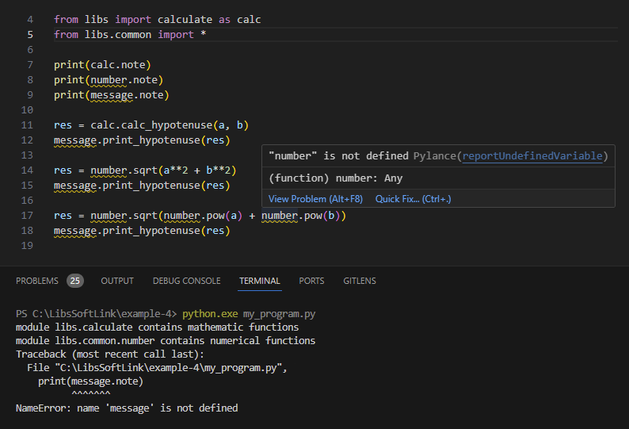

Package adalah cara Python mengelola module agar bisa diakses menggunakan notasi pengaksesan module (contoh seperti `calculate.calc_hypotenuse()`). Pada chapter ini kita akan mempelajarinya.

## A.28.1. Penerapan Packages

Mari kita mulai dengan sedikit mengulang pembahasan chapter sebelumnya. Module di Python direpresentasikan oleh file (nama file adalah nama module). Cara mengakses isi module adalah dengan meng-import nya terlebih dahulu.

Package adalah cara mengolah module dengan menempatkannya dalam suatu folder. Sederhananya: **module adalah file, dan package adalah folder**.

Agar lebih jelas, mari kita praktekan. Buat project baru dengan struktur seperti berikut:

<div style={{ width: '250px' }}>

```bash title="Project structure"
belajar-package/
│─── libs/
|    │─── calculate.py
|    └─── common/
|         │─── message.py
|         └─── number.py
└─── my_program.py
```

</div>

Program yang dibuat masih sama seperti pada praktek sebelumnya. Perbedaannya, fungsi `sqrt()` dan `pow()` ditempatkan dalam path `libs/common/number.py` dan ada fungsi baru yang akan dibuat di `libs/common/message.py`.

```python title="File: libs/common/number.py"
note = "module libs.common.number contains numerical functions"

def pow(n, p = 2):
    return n ** p

def sqrt(x):
    n = 1
    for _ in range(10):
        n = (n + x/n) * 0.5
    return n
```

```python title="File: libs/common/message.py"
note = "module libs.common.message contains messaging/printing functions"

def print_hypotenuse(v):
    print("hypotenuse:", v)
```

Setelah itu, isi file `calculate.py` dengan deklarasi variabel `note` dan fungsi `calc_hypotenuse()`.

```python title="File: libs/calculate.py"
import libs.common.number

note = "module libs.calculate contains mathematic functions"

def calc_hypotenuse(a, b):
    return libs.common.number.sqrt(libs.common.number.pow(a) + libs.common.number.pow(b))
```

Terakhir, pada file `my_program.py` yang merupakan entrypoint eksekusi program, import module `libs/common/number.py`, `libs/common/message.py`, dan `libs/calculate.py` di sana lalu gunakan fungsi yang telah dideklarasikan di masing-masing module. Contoh:

```python title="File: my_program.py"
a = 10
b = 15

import libs.calculate
import libs.common.number
import libs.common.message

print(libs.calculate.note)
print(libs.common.number.note)
print(libs.common.message.note)

res = libs.calculate.calc_hypotenuse(a, b)
libs.common.message.print_hypotenuse(res)

res = libs.common.number.sqrt(a**2 + b**2)
libs.common.message.print_hypotenuse(res)

res = libs.common.number.sqrt(libs.common.number.pow(a) + libs.common.number.pow(b))
libs.common.message.print_hypotenuse(res)
```

Bisa dilihat bagaimana peran package dalam operasi import module dan pengaksesan unit dalam module. 

- Module yang berada dalam package di import menggunakan notasi `<package>.<module>`. Contoh:
    - `import libs.calculate` di file `my_program.py`

- Jika ada package di dalam package, maka ditulis semua subfoldernya, seperti: `<package>.<package>.<module>`. Contoh:
    - `import libs.common.number` di file `libs/calculate.py`
    - `import libs.common.number` di file `my_program.py`
    - `import libs.common.message` di file `my_program.py`

- Pengaksesan unit dalam module diwajibkan dengan ditulis *namespace* nya secara utuh, jadi nama package juga ditulis. Contohnya bisa dilihat pada beberapa statement seperti:
    - `libs.common.number.sqrt()` di file `libs/calculate.py`
    - `libs.common.number.pow()` di file `libs/calculate.py`
    - `libs.calculate.calc_hypotenuse()` di file `my_program.py`
    - `libs.common.message.print_hypotenuse()` di file `my_program.py`

Ok, selanjutnya coba jalankan program dan lihat hasilnya:


## A.28.2. *Naming convention* package

Mengacu ke dokumentasi [PEP 8 – Style Guide for Python Code](https://peps.python.org/pep-0008/), nama package dianjurkan untuk ditulis dalam huruf kecil (lowercase). Penggunaan karakter underscode kurang dianjurkan.

## A.28.3. Metode import module package

Seperti halnya module biasa, module dalam package bisa di-import lewat beberapa cara, diantaranya:

### ◉ Alias module via keyword `as`

Ada baiknya module diberi nama alias yang lebih pendek agar tidak merepotkan penulisan pengaksesan unit didalamnya. Gunakan keyword `as` untuk memberi nama alias module. Contoh:

```python title="File: libs/calculate.py"
import libs.common.number as num

note = "module libs.calculate contains mathematic functions"

def calc_hypotenuse(a, b):
    return num.sqrt(num.pow(a) + num.pow(b))
```

```python title="File: my_program.py"
a = 10
b = 15

import libs.calculate as calc
import libs.common.number as num
import libs.common.message as msg

print(calc.note)
print(num.note)
print(msg.note)

res = calc.calc_hypotenuse(a, b)
msg.print_hypotenuse(res)

res = num.sqrt(a**2 + b**2)
msg.print_hypotenuse(res)

res = num.sqrt(num.pow(a) + num.pow(b))
msg.print_hypotenuse(res)
```

Dengan pemberian alias, tidak perlu lagi menulis namespace secara penuh. Package tidak perlu dituliskan saat pengaksesan unit didalam module.

```python
import libs.common.number
print(libs.common.number.note)

# vs

import libs.common.number as num
print(num.note)
```

### ◉ Import package via `from` & `import`

Kombinasi keyword `from` dan `import` bisa digunakan dengan ketentuan setelah keyword `from` yang ditulis adalah namespace package, lalu diikuti oleh keyword `import` dan nama module. Contoh:

```python title="File: libs/calculate.py"
from libs.common import number

note = "module libs.calculate contains mathematic functions"

def calc_hypotenuse(a, b):
    return number.sqrt(number.pow(a) + number.pow(b))
```

```python title="File: my_program.py"
a = 10
b = 15

from libs import calculate as calc
from libs.common import number, message

print(calc.note)
print(number.note)
print(message.note)

res = calc.calc_hypotenuse(a, b)
message.print_hypotenuse(res)

res = number.sqrt(a**2 + b**2)
message.print_hypotenuse(res)

res = number.sqrt(number.pow(a) + number.pow(b))
message.print_hypotenuse(res)
```

### ◉ Penggunaan `import *`

Ada beberapa hal yang perlu diketahui dalam penggunaan `import *` untuk import module dalam package. Sebelum masuk ke pembahasan, silakan coba terlebih dahulu kode berikut. Buka `my_program.py` lalu ubah statement import menjadi seperti ini:

```python
from libs import calculate as calc
from libs.common import *
```

Hasilnya adalah error:



## A.28.4. File `__init__.py`

Melanjutkan pembahasan sebelumnya dimana `import *` menghasilkan error, hal ini terjadi karena di Python, package tidak bisa secara cerdas mendeteksi module apa saja yang bisa direpresentasikan dengan `*` saat import.

Untuk mengatasi error di atas, tambahkan file bernama `___init___.py` di setiap package atau folder. Dengan ini maka struktur file program menjadi seperti ini:

<div style={{ width: '250px' }}>

```bash title="Project structure"
belajar-package/
│─── libs/
|    │─── __init__.py
|    │─── calculate.py
|    └─── common/
|         │─── __init__.py
|         │─── message.py
|         └─── number.py
└─── my_program.py
```

</div>

Lalu pada setiap file `__init__.py` tambahkan variabel `__all__` dengan nilai adalah nama module yang ada di dalam folder tersebut.

```python title="File: libs/common/__init__.py"
__all__ = ["message", "number"]
```

```python title="File: libs/__init__.py"
__all__ = ["calculate"]
```

Setelah itu, modules di atas bisa digunakan pada `import *`. Coba test dengan mengaplikasikannya:

```python title="File: my_program.py"
a = 10
b = 15

from libs import *
from libs.common import *

print(calculate.note)
print(number.note)
print(message.note)

res = calculate.calc_hypotenuse(a, b)
message.print_hypotenuse(res)

res = number.sqrt(a**2 + b**2)
message.print_hypotenuse(res)

res = number.sqrt(number.pow(a) + number.pow(b))
message.print_hypotenuse(res)
```

### ◉ Best practice file `__init__.py`

Sesuai penjelasan di [dokumentasi Package](https://docs.python.org/3/tutorial/modules.html#standard-modules), dianjurkan untuk selalu membuat file `__init__.py` di setiap package untuk menghindari masalah saat pencarian module.

Meskipun tidak ada statement `import *`, tetap dianjurkan membuat file tersebut. Isinya biarkan kosong saja tidak apa-apa.

### ◉ Special name `__all__`

Variabel yang diawali dan diakhir karakter double underscore seperti `__all__` disebut dengan variabel **special name**. Kita akan bahas pada chapter berikutnya, yaitu [Special Names](/basic/special-names).

---

<div class="section-footnote">

## Catatan chapter 📑

### ◉ Source code praktik

<pre>
    <a href="https://github.com/novalagung/dasarpemrogramanpython-example/tree/master/packages">
        github.com/novalagung/dasarpemrogramanpython-example/../packages
    </a>
</pre>

### ◉ Chapter relevan lainnya

- [Modules](/basic/modules)
- [Special names](/basic/special-names)

### ◉ Referensi

- https://docs.python.org/3/tutorial/modules.html#packages

</div>
