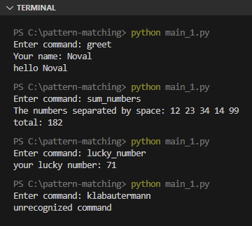
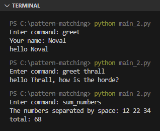
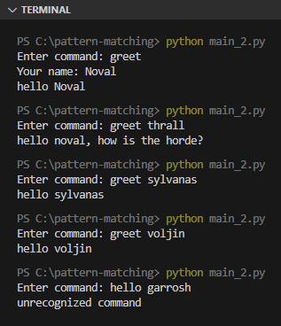
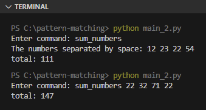
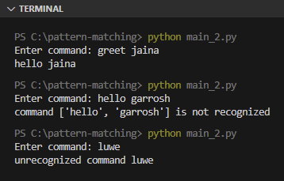
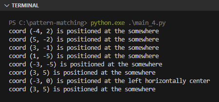
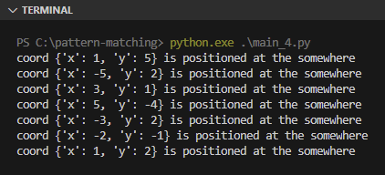
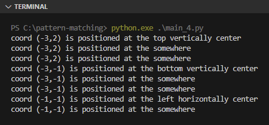

Pada chapter ini, kita akan membahas tentang teknik seleksi kondisi pencocokan pola di Python yang cukup advance untuk mengenali banyak variasi pola, yaitu structural pattern matching.

## A.45.1. Pengenalan pattern matching

Pattern matching merupakan teknik pencocokan pola menggunakan kombinasi keyword `match` dan `case`. Penggunaan dasarnya mirip seperti seleksi kondisi menggunakan keyword `if`.

Silakan lihat 2 kode berikut untuk mengetahui perbedaan syntax-nya:

- Kode seleksi kondisi:

    ```python
    command = input("Enter command: ")

    if command == "greet":
        name = input("Your name: ")
        print("hello", name)

    elif command == "find sum of numbers":
        numbers = input("The numbers separated by space: ")
        total = 0
        for str in numbers.split(' '):
            total = total + int(str)
        print("total:", total)

    elif command == "lucky number":
        import random
        n = random.randint(0, 100)
        print("your lucky number:", n)

    else:
        print("unrecognized command")
    ```

- Kode yang sama dengan penerapan pattern matching:

    ```python
    command = input("Enter command: ")

    match command:

        case "greet":
            name = input("Your name: ")
            print("hello", name)

        case "sum_numbers":
            numbers = input("The numbers separated by space: ")
            total = 0
            for str in numbers.split(' '):
                total = total + int(str)
            print("total:", total)

        case "lucky_number":
            import random
            n = random.randint(0, 100)
            print("your lucky number:", n)
        
        case _:
            print("unrecognized command")
    ```

Kode diatas ketika di-run akan meminta sebuah inputan ke user untuk kemudian disimpan di variabel `command`. Dari inputan tersebut kemudian dilakukan sebuah proses sesuai command yang dipilih:

- Jika command adalah `greet`, maka program meminta inputan lagi untuk disimpan di variabel `nama`. Lalu output `hello {nama}` ditampilkan ke layar.
- Jika command adalah `sum_numbers`, inputan angka dengan pembatas karakter spasi harus diisi, kemudian totalnya dimunculkan ke layar.
- Jika command adalah `lucky_number`, maka sebuah angka random ditampilkan.
- Jika command adalah selain 3 pilihan diatas, pesan `unrecognized command` muncul.

Test run program:



Pada penerapannya, keyword `match` ditulis diikuti oleh suatu data yang ingin dicek nilainya, kemudian di dalam block ditentukan kondisi atau pola pencocokan via keyword `case`.

Gunakan kondisi `case _:` untuk menangkap kondisi yang tidak terpenuhi (seperti `else` pada seleksi kondisi `if`). Kondisi yang selalu terpenuhi ini biasa disebut dengan *wildcard*, yang idealnya ditulis di paling akhir.

## A.45.2. Pencocokan pola data sequence

Kode yang telah dipraktekan kita akan refactor, dimodifikasi agar inputan bisa menerima command sekaligus argument (ditandai dengan karakter spasi).

Inputan `command` yang sebelumnya string, kini di-split menggunakan karakter spasi, menghasilkan data list. Data list tersebut dicek menggunakan keyword `match`.

Pada kode berikut, program didesain untuk menerima 3 jenis command:

- Command `greet`, tugasnya masih sama seperti pada program sebelumnya.
- Command `greet thrall`, memunculkan pesan ke `Thrall`
- Command `sum_numbers`, tugasnya masih sama seperti pada program sebelumnya.

Source code:

```python
command = input("Enter command: ")
inputs = command.split(' ')

match inputs:

    case ["greet"]:
        name = input("Your name: ")
        print("hello", name)

    case ["greet", "thrall"]:
        print("hello Thrall, how is the horde?")

    case ["sum_numbers"]:
        numbers = input("The numbers separated by space: ")
        total = 0
        for str in numbers.split(' '):
            total = total + int(str)
        print("total:", total)

    case _:
        print("unrecognized command")
```

Output program:



Dengan teknik pattern matching, Python bisa mengenali pola list secara cerdas. Kondisi seperti: <u>*ketika lebar list adalah x dengan element adalah y*</u> bisa diterapkan via teknik ini.

### ◉ Pencocokan sebagian pola

Pencocokan juga bisa dilakukan dengan kondisi sebagian saja, misalnya, <u>*jika data adalah list dengan index pertama berisi `greet`*</u>. Dengan pola seperti ini, nilai element lainnya bisa ditampung dalam suatu variabel.

Contoh penerapannya bisa dilihat di kode berikut:

```python
command = input("Enter command: ")

match command.split(' '):

    case ["greet"]:
        name = input("Your name: ")
        print("hello", name)

    case ["greet", "thrall"]:
        print("hello noval, how is the horde?")

    case ["greet", name]:
        print("hello", name)

    case _:
        print("unrecognized command")
```

Output program:



Terlihat di output inputan `greet sylvanas` dan `greet voljin` cocok dengan pola `case ["greet", name]`.

### ◉ Pencocokan pola `*args`

Teknik pattern matching mendukung pola dimana pencocokan dilakukan untuk sebagian pola dan sisanya disimpan di satu variabel saja, misalnya `*args`. Ini merupakan kombinasi penerapan patern matching dan teknik packing data sequence.

Pada kode berikut, ada 2 buah kondisi pola `sum_numbers`, yang pertama ketika inputan hanya `sum_numbers` saja, dan yang kedua ketika inputan `sum_numbers` diikuti oleh data lain (yang nilainya diharapkan berbentuk numerik karena akan dihitung totalnya).

```python
command = input("Enter command: ")

match command.split(' '):

    case ["greet"]:
        name = input("Your name: ")
        print("hello", name)

    case ["greet", "thrall"]:
        print("hello noval, how is the horde?")

    case ["greet", name]:
        print("hello", name)

    case ["sum_numbers"]:
        numbers = input("The numbers separated by space: ")
        total = 0
        for str in numbers.split(' '):
            total = total + int(str)
        print("total:", total)

    case ["sum_numbers", *args]:
        total = 0
        for str in args:
            total = total + int(str)
        print("total:", total)
    
    case _:
        print("unrecognized command")
```

Output program:



Penjelasan eksekusi program:

- Eksekusi ke-1: inputan adalah `sum_numbers`, cocok dengan kondisi `case ["sum_numbers"]`.
- Eksekusi ke-2: inputan adalah `sum_numbers 22 32 71 22`, cocok dengan kondisi `case ["sum_numbers", *args]`. Nilai numerik disitu disimpan pada variabel `*args`.

> - Lebih detailnya mengenai `*args` dibahas pada chapter [Function ➜ Args & Kwargs](/basic/args-kwargs)
> - Lebih detailnya mengenai teknik packing dibahas pada chapter [Pack Unpack ➜ Tuple, List, Set, Dict](/basic/pack-unpack-elements)

### ◉ Pencocokan pola wildcard

Kondisi `case _` bisa difungsikan sebagai `else` pada pattern matching. Semua kondisi yang tidak terpenuhi masuk ke block tersebut. Alternatif lainnya adalah menggunakan `case namaVariabel`.

Pada kode berikut dua buah kondisi baru ditambahkan:

- Kondisi `case [other]`, akan cocok jika inputan adalah list dengan lebar 1 item.

    Contoh inputan yang memenuhi kriteria ini: `hello`, `makan`, `kesedihan`, dan kata-kata tanpa spasi lainnya. Hal ini karena inputan di-split menggunakan spasi (` `) dengan hasil pasti berupa list dengan lebar 1 elemen. Isi dari variabel `other` adalah inputan string.

- Kondisi `case other`, cocok dengan pola inputan apapun. Semua inputan ditampung di variabel `other` dalam bentuk list.

```python
command = input("Enter command: ")

match command.split(' '):

    case ["greet"]:
        name = input("Your name: ")
        print("hello", name)

    case ["greet", "thrall"]:
        print("hello noval, how is the horde?")

    case ["greet", name]:
        print("hello", name)

    case ["sum_numbers"]:
        numbers = input("The numbers separated by space: ")
        total = 0
        for str in numbers.split(' '):
            total = total + int(str)
        print("total:", total)

    case ["sum_numbers", *args]:
        total = 0
        for str in args:
            total = total + int(str)
        print("total:", total)

    case [other]:
        print(f"unrecognized command {other}")

    case other:
        print(f"command {other} is not recognized")
```

Output program:



## A.45.3. Pencocokan pola + seleksi kondisi

### ◉ Pencocokan pola + logika OR

Kondisi `or` bisa digunakan pada 1 block `case`, caranya dengan menuliskan inputan diapit tanda `()` dan didalam kondisi ditulis menggunakan pembatas karakter pipe `|`.

Pada kode berikut, ada 3 buah kondisi baru ditambahkan:

- Kondisi `case ["greet", name, ("morning" | "afternoon" | "evening") as t]`

    Hanya akan terpenuhi jika inputan pertama adalah `greet` dan inputan ke-3 adalah `morning` atau `afternoon` atau `evening`. Inputan ke-3 ditampung ke variabel bernama `t` (syntax `as` digunakan disitu).

- Kondisi `case ["greet", name] | ["hello", name]`

    Hanya akan terpenuhi jika inputan adalah 2 kata dan kata pertama adalah `greet` atau `hello`.

- Kondisi `case ([other] | other) as o`

    Hanya akan terpenuhi jika inputan adalah list dengan lebar 1 element atau inputan selain yang dikenali oleh kondisi-kondisi sebelumnya (wildcard).

    Catatan: kondisi ini redundan, harusnya `case other:` saja sudah cukup untuk difungsikan sebagai `else`. Namun pada contoh ini tetap ditulis hanya untuk menunjukan format penulisan kondisi pola dengan logika OR.

Source code setelah dimodifikasi:

```python
command = input("Enter command: ")

match command.split(' '):

    case ["greet"]:
        name = input("Your name: ")
        print("hello", name)

    case ["greet", "thrall"]:
        print("hello noval, how is the horde?")

    case ["greet", name, ("morning" | "afternoon" | "evening") as t]:
        print("hello", name, "good", t)

    case ["greet", name] | ["hello", name]:
        print("hello", name)

    case ([other] | other) as o:
        print(f"command {o} is not recognized")
```

### ◉ Pencocokan pola + keyword `if`

Keyword `if` boleh dituliskan setelah kondisi `case`. Penambahannya menjadikan pencocokan pola diikuti oleh seleksi kondisi.

Pada kode berikut, kondisi `case ["greet", name] if name == "thrall"` ditambahkan. Kondisi tersebut hanya akan terpenuhi jika:

- Inputan berisi 2 buah kata dengan pembatas spasi
- Kata pertama adalah `greet`
- Kata kedua adalah `thrall` (pengecekannya via seleksi kondisi `if`)

Source code:

```python
command = input("Enter command: ")

match command.split(' '):

    case ["greet"]:
        name = input("Your name: ")
        print("hello", name)

    case ["greet", name] if name == "thrall":
        print("hello noval, how is the horde?")

    case ["greet", name, ("morning" | "afternoon" | "evening") as t]:
        print("hello", name, "good", t)

    case other:
        print(f"command {other} is not recognized")
```

## A.45.4. Pencocokan pola tipe data lainnya

Tidak hanya tipe data string dan list saja yang bisa digunakan pada pattern matching, melainkan banyak sekali tipe data lainnya juga bisa digunakan. Termasuk diantaranya adalah tipe data sequence seperti `tuple` dan `dictionary`, dan juga tipe data dari custom class.

Pada contoh berikut, ada 3 buah program dibuat yang kesemuanya berisi flow dan pattern matching yang sama persis. Perbedaannya:

- Pada program pertama, `tuple` digunakan pada pattern matching
- Program ke-2 menggunakan tipe data `dict`
- Data custom class digunakan pada program ke-3

Di dalam program, data list dibuat berisi element bertipe `tuple` atau `dict` atau object class yang menyimpan data koordinat `x` dan `y`.

Pattern matching digunakan pada setiap elemen list untuk dicek posisi `x` dan `y`-nya, apakah di tengah, di kanan, di atas, atau di posisi lainnya.

### ◉ Pencocokan pola data tuple

Source code:

```python
import random

def coords_generator(n = 5):
    coords = []
    for _ in range(0, n):
        coords.append((random.randint(-5, 5), random.randint(-5, 5)))
    return coords

data = coords_generator(8)
for c in data:
    match c:
        case (0, 0):
            print(f"coord {c} is positioned at the center")
        case (x, 0) if x < 0:
            print(f"coord {c} is positioned at the left horizontally center")
        case (x, 0) if x > 0:
            print(f"coord {c} is positioned at the right horizontally center")
        case (0, y) if y < 0:
            print(f"coord {c} is positioned at the bottom vertically center")
        case (0, y) if y > 0:
            print(f"coord {c} is positioned at the top vertically center")
        case (-5, 5) | (-5, -5) | (5, -5) | (5, 5):
            print(f"coord {c} is positioned at certain corner")
        case other:
            print(f"coord {other} is positioned at the somewhere")
```

Output program:



### ◉ Pencocokan pola data dictionary

Source code:

```python
import random

def coords_generator(n = 5):
    coords = []
    for _ in range(0, n):
        coords.append({
            "x": random.randint(-5, 5),
            "y": random.randint(-5, 5)
        })
    return coords

data = coords_generator(8)
for c in data:
    match c:
        case {"x": 0, "y": 0}:
            print(f"coord {c} is positioned at the center")
        case {"x": x, "y": 0} if x < 0:
            print(f"coord {c} is positioned at the left horizontally center")
        case {"x": x, "y": 0} if x > 0:
            print(f"coord {c} is positioned at the right horizontally center")
        case {"x": 0, "y": y} if y < 0:
            print(f"coord {c} is positioned at the bottom vertically center")
        case {"x": 0, "y": y} if y > 0:
            print(f"coord {c} is positioned at the top vertically center")
        case {"x": -5, "y": 5} | {"x": -5, "y": -5} | {"x": 5, "y": -5} | {"x": 5, "y": 5}:
            print(f"coord {c} is positioned at certain corner")
        case other:
            print(f"coord {other} is positioned at the somewhere")
```

Output program:



### ◉ Pencocokan pola data object class

Source code:

```python
class Point:
    def __init__(self, x, y):
        self.x = x
        self.y = y
    def info(self):
        return f"({x},{y})"

import random

def coords_generator(n = 5):
    coords = []
    for _ in range(0, n):
        coords.append(Point(random.randint(-5, 5), random.randint(-5, 5)))
    return coords

data = coords_generator(8)
for c in data:
    match c:
        case Point(x=0, y=0):
            print(f"coord {c.info()} is positioned at the center")
        case Point(x=x, y=0) if x < 0:
            print(f"coord {c.info()} is positioned at the left horizontally center")
        case Point(x=x, y=0) if x > 0:
            print(f"coord {c.info()} is positioned at the right horizontally center")
        case Point(x=0, y=y) if y < 0:
            print(f"coord {c.info()} is positioned at the bottom vertically center")
        case Point(x=0, y=y) if y > 0:
            print(f"coord {c.info()} is positioned at the top vertically center")
        case Point(x=-5, y=5) | Point(x=-5, y=-5) | Point(x=5, y=-5) | Point(x=5, y=5):
            print(f"coord {c.info()} is positioned at certain corner")
        case other:
            print(f"coord {other.info()} is positioned at the somewhere")
```

Output program:




---

<div class="section-footnote">

## Catatan chapter 📑

### ◉ Source code praktik

<pre>
    <a href="https://github.com/novalagung/dasarpemrogramanpython-example/tree/master/pattern-matching">
        github.com/novalagung/dasarpemrogramanpython-example/../pattern-matching
    </a>
</pre>

### ◉ Chapter relevan lainnya

- [Seleksi kondisi ➜ if, elif, else](/basic/if-elif-else)

### ◉ Referensi

- https://peps.python.org/pep-0622/
- https://peps.python.org/pep-0636/

</div>
