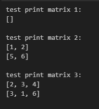
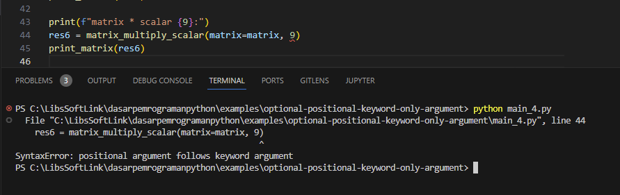

Pada chapter ini kita akan belajar tentang apa itu positional argument, optional argument, dan keyword arguments, serta bagaimana penerapannya di Python.

## A.23.1. Positional argument

Positional argument adalah istilah untuk urutan parameter/argument fungsi. Pengisian argument saat pemanggilan fungsi harus urut sesuai dengan deklarasi parameternya.

Silakan perhatikan kode berikut:

```python
def create_sorcerer(name, age, race, era):
    return {
        "name": name,
        "age": age,
        "race": race,
        "era": era,
    }

obj1 = create_sorcerer("Sukuna", 1000, "incarnation", "heian")
print(obj1)
# output ➜ {'name': 'Sukuna', 'age': 1000, 'race': 'incarnation', 'era': 'heian'}

obj2 = create_sorcerer("Kenjaku", 1000, "human", "1000+ year ago")
print(obj2)
# output ➜ {'name': 'Kenjaku', 'age': 1000, 'race': 'human', 'era': '1000+ year ago'}

obj3 = create_sorcerer("Hajime Kashimo", 400, "human", "400 year ago")
print(obj3)
# output ➜ {'name': 'Hajime Kashimo', 'age': 400, 'race': 'human', 'era': '400 year ago'}
```

Coba lakukan sedikit experiment dengan mengubah urutan pengisian data contohnya seperti ini. Hasilnya: program tidak error, namun data yang dihasilkan adalah tidak sesuai harapan.

```python
obj4 = create_sorcerer("400 year ago", 400, "human", "Hajime Kashimo")
print(obj3)
# output ➜ {'name': '400 year ago', 'age': 400, 'race': 'human', 'era': 'Hajime Kashimo'}
```

Saat pemanggilan fungsi dengan argument, pastikan untuk selalu menyisipkan argument sesuai dengan parameter yang dideklarasikan. Gunakan penamaan parameter yang sesuai agar lebih mudah untuk mengetahui parameter harus diisi dengan data apa.

## A.23.2. Keyword argument

*Keyword argument* atau *named argument* adalah metode pengisian argument pemanggilan fungsi disertai nama parameter yang ditulis secara jelas (*eksplisit*).

Pada kode berikut dibuat 3 buah statement pemanggilan fungsi `create_sorcerer()`. Ketiganya memiliki perbedaan satu sama lain pada bagian bagaimana argument disisipkan ke fungsi.

```python
obj5 = create_sorcerer("Sukuna", 1000, "incarnation", "heian")
print(obj5)
# output ➜ {'name': 'Sukuna', 'age': 1000, 'race': 'incarnation', 'era': 'heian'}

obj6 = create_sorcerer(name="Kenjaku", age=1000, race="human", era="1000+ year ago")
print(obj6)
# output ➜ {'name': 'Kenjaku', 'age': 1000, 'race': 'human', 'era': '1000+ year ago'}

obj7 = create_sorcerer("Hajime Kashimo", 400, race="human", era="400 year ago")
print(obj7)
# output ➜ {'name': 'Hajime Kashimo', 'age': 400, 'race': 'human', 'era': '400 year ago'}
```

Penjelasan:

- Pada statement `obj5`, fungsi dipanggil dengan nilai argument disisipkan seperti biasa.
- Pada statement `obj6`, fungsi dipanggil dengan nilai argument disisipkan disertai nama parameter.
- Pada statement `obj7`, argument pertama dan ke-2 ditulis tanpa nama parameter, sedangkan argument ke-3 dan ke-4 ditulis disertai nama parameternya.

Kombinasi penulisan argument seperti pada statement `obj7` adalah diperbolehkan, dengan catatan: untuk argument yang tidak disertai nama parameter harus diletakkan di kiri sebelum penulisan argument parameter lainnya yang mengadopsi metode *keyword argument*.

Salah satu benefit dari penerapan *keyword argument*: pada argument pemanggilan fungsi yang disertai nama parameter, urutan penulisan argument boleh di-ubah. Contohnya seperti ini:

```python
obj8 = create_sorcerer(era="1000+ year ago", age=1000, name="Kenjaku", race="human")
print(obj8)
# output ➜ {'name': 'Kenjaku', 'age': 1000, 'race': 'human', 'era': '1000+ year ago'}

obj9 = create_sorcerer("Hajime Kashimo", 400, era="400 year ago", race="human")
print(obj9)
# output ➜ {'name': 'Hajime Kashimo', 'age': 400, 'race': 'human', 'era': '400 year ago'}
```

Pada statement `obj8` semua argument pemanggilan fungsi ditulis menggunakan metode *keyword argument* dan urutannya diubah total. Sewaktu di-print, hasilnya tetap valid. Sedangkan pada statement `obj9`, hanya argument parameter `era` dan `race` yang ditulis menggunakan metode *keyword argument* dengan urutan diubah. Sisalnya (yaitu `name` dan `age`) ditulis menggunakan metode *positional argument* secara urut.

Kesimpulannya:

- Penulisan argument pemanggilan fungsi *by default* harus urut (sesuai dengan aturan *positional argument*), dengan pengecualian jika argument ditulis menggunakan *keyword argument* maka boleh diubah urutannya.

- Jika suatu pemanggilan fungsi pada bagian penulisan argument-nya menerapkan kombinasi *positional argument* dan *keyword argument* maka untuk argument yang ditulis tanpa keyword harus berada di bagian kiri dan dituliskan secara urut.

## A.23.3. Optional argument

Suatu parameter bisa ditentukan nilai *default*-nya saat deklarasi fungsi. Efeknya, saat pemanggilan fungsi diperbolehkan untuk tidak mengisi nilai argument karena nilai *default* sudah ditentukan.

Sebagai contoh, pada fungsi `print_matrix()` berikut, parameter `matrix` di-set nilai *default*-nya adalah list kosong `[]`. Fungsi `print_matrix()` dipanggil 2x, pemanggilan pertama dengan tanpa argument, dan yang kedua dengan argument matrix `[[1, 2], [5, 6]]`.

```python
def print_matrix(matrix=[]):
    if len(matrix) == 0:
        print("[]")

    for el in matrix:
        print(el)

print("test print matrix 1:")
print_matrix()

print("test print matrix 2:")
print_matrix([
    [1, 2],
    [5, 6],
])

print("test print matrix 3:")
print_matrix(matrix=[
    [2, 3, 4],
    [3, 1, 6],
])
```

Silakan run program di atas, dan perhatikan outpunya. Error tidak muncul saat eksekusi statement `print_matrix()` pertama yang padahal tidak ada data yang disisipkan saat pemanggilan fungsi. Hal ini karena fungsi tersebut pada parameter `matrix` sudah ada nilai *default*-nya.



## A.23.4. Kombinasi positional argument, keyword argument, dan optional argument

Parameter fungsi bisa berisi nilai default (seperti pada contoh sebelumnya) atau tidak, atau bisa juga kombinasi keduanya.

Kode program berikut adalah contoh pengaplikasiannya. Fungsi `matrix_multiply_scalar()` memiliki 2 buah parameter yaitu `matrix` yang tidak memiliki *default value* dan `scalar` yang *default value*-nya adalah `1`.

```python
def matrix_multiply_scalar(matrix, scalar = 1):
    res = []
    for row in matrix:
        res.append([cell * scalar for cell in row])

    return res

def print_matrix(matrix = []):
    if len(matrix) == 0:
        print("[]")

    for el in matrix:
        print(el)

matrix = [
    [1, 2, 3, 4],
    [5, 6, 7, 8],
    [9, 10, 11, 12],
]

print(f"matrix * scalar {1}:")
res1 = matrix_multiply_scalar(matrix)
print_matrix(res1)
# output ↓
#
# matrix * scalar 1:
# [1, 2, 3, 4]
# [5, 6, 7, 8]
# [9, 10, 11, 12]

print(f"matrix * scalar {3}:")
res2 = matrix_multiply_scalar(matrix, 3)
print_matrix(res2)
# output ↓
#
# matrix * scalar 3:
# [3, 6, 9, 12]
# [15, 18, 21, 24]
# [27, 30, 33, 36]

print(f"matrix * scalar {2}:")
res3 = matrix_multiply_scalar(matrix, scalar=2)
print_matrix(res3)
# output ↓
#
# matrix * scalar 2:
# [2, 4, 6, 8]
# [10, 12, 14, 16]
# [18, 20, 22, 24]

print(f"matrix * scalar {4}:")
res4 = matrix_multiply_scalar(matrix=matrix, scalar=4)
print_matrix(res4)
# output ↓
#
# matrix * scalar 4:
# [2, 4, 6, 8]
# [10, 12, 14, 16]
# [18, 20, 22, 24]

print(f"matrix * scalar {7}:")
res5 = matrix_multiply_scalar(scalar=7, matrix=matrix)
# output ↓
#
# print_matrix(res5)
# matrix * scalar 7:
# [2, 4, 6, 8]
# [10, 12, 14, 16]
# [18, 20, 22, 24]
```

Pada kode di atas fungsi `matrix_multiply_scalar()` dipanggil beberapa kali:

- Pemanggilan ke-1: nilai parameter `scalar` tidak diisi, efeknya maka *default value* digunakan.
- Pemanggilan ke-2: nilai parameter `scalar` ditentukan adalah `3`.
- Pemanggilan ke-3: nilai parameter `scalar` ditentukan adalah `2` menggunakan metode *keyword argument* diterapkan.
- Pemanggilan ke-4: nilai parameter `matrix` dan `scalar` dituliskan menggunakan metode *keyword argument* diterapkan.
- Pemanggilan ke-5: nilai parameter `matrix` dan `scalar` dituliskan menggunakan metode *keyword argument* diterapkan dengan posisi penulisan argument diubah.

Argument pemanggilan fungsi yang ditulis menggunakan metode *keyword argument* harus selalu diposisikan di sebelah kanan, setelah penulisan argument yang menggunakan metode *positional argument*. Jika dipaksa ditulis terbalik, maka menghasilkan error. Contohnya seperti pada gambar berikut:



---

<div class="section-footnote">

## Catatan chapter 📑

### ◉ Source code praktik

<pre>
    <a href="https://github.com/novalagung/dasarpemrogramanpython-example/tree/master/positional-optional-keyword-argument">
        github.com/novalagung/dasarpemrogramanpython-example/../positional-optional-keyword-argument
    </a>
</pre>

### ◉ Chapter relevan lainnya

- [Function](/basic/function)
- [Function ➜ Args & Kwargs](/basic/args-kwargs)
- [Function ➜ Closure](/basic/closure)
- [Function ➜ Lambda](/basic/lambda)

### ◉ Referensi

- https://docs.python.org/3/tutorial/controlflow.html#defining-functions

</div>
