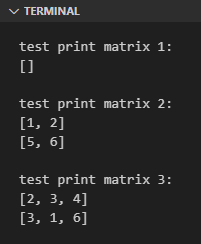
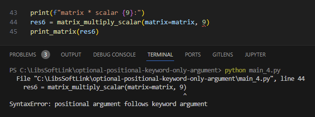

Pada chapter ini kita akan belajar tentang apa itu positional argument, optional argument, dan keyword arguments, serta bagaimana penerapannya di Python.

## A.23.1. Positional argument

Positional argument adalah istilah untuk urutan parameter/argument fungsi, efeknya dalam pemanggilan fungsi, pengisian argument harus sesuai urutan.

Sebagai contoh perhatikan kode berikut.

```python
def create_sorcerer(name, age, race, era):
    return {
        "name": name,
        "age": age,
        "race": race,
        "era": era,
    }

obj1 = create_sorcerer("Sukuna", 1000, "incarnation", "heian")
print(obj1)
# output ➜ {'name': 'Sukuna', 'age': 1000, 'race': 'incarnation', 'era': 'heian'}

obj2 = create_sorcerer("Kenjaku", 1000, "human", "1000+ year ago")
print(obj2)
# output ➜ {'name': 'Kenjaku', 'age': 1000, 'race': 'human', 'era': '1000+ year ago'}

obj3 = create_sorcerer("Hajime Kashimo", 400, "human", "400 year ago")
print(obj3)
# output ➜ {'name': 'Hajime Kashimo', 'age': 400, 'race': 'human', 'era': '400 year ago'}
```

Coba kita lakukan sedikit experiment dengan mengubah urutan pengisian data contohnya seperti berikut. Efeknya, program tidak akan error, namun data yang dihasilkan salah.

```python
obj4 = create_sorcerer("400 year ago", 400, "human", "Hajime Kashimo")
print(obj3)
# output ➜ {'name': '400 year ago', 'age': 400, 'race': 'human', 'era': 'Hajime Kashimo'}
```

Dari sini bisa diambil kesimpulan bahwa urutan deklarasi argument fungsi sangat penting.

## A.23.2. Keyword argument

*Keyword argument* atau *named argument* adalah metode penulisan nama parameter secara jelas/eksplisit saat menyisipkan argument fungsi. Lebih jelasnya silakan pelajari kode berikut:

```python
obj5 = create_sorcerer("Sukuna", 1000, "incarnation", "heian")
print(obj5)
# output ➜ {'name': 'Sukuna', 'age': 1000, 'race': 'incarnation', 'era': 'heian'}

obj6 = create_sorcerer(name="Kenjaku", age=1000, race="human", era="1000+ year ago")
print(obj6)
# output ➜ {'name': 'Kenjaku', 'age': 1000, 'race': 'human', 'era': '1000+ year ago'}

obj7 = create_sorcerer("Hajime Kashimo", 400, race="human", era="400 year ago")
print(obj7)
# output ➜ {'name': 'Hajime Kashimo', 'age': 400, 'race': 'human', 'era': '400 year ago'}
```

Penjelasan:

- Pada statement `obj5`, fungsi dipanggil dengan disisipkan nilai argument seperti biasa.

- Pada statement `obj6`, fungsi dipanggil dengan disisipkan nilai argument dengan nama parameter juga di-tulis secara eksplisit.

- Pada statement `obj7`, argument pertama dan ke-2 ditulis tanpa nama parameter, sedangkan argument ke-3 dan ke-4 ditulis nama parameternya.

- Kombinasi penulisan argument seperti pada statement `obj7` adalah diperbolehkan, dengan catatan parameter yang tidak ditulis nama-nya harus diletakkan di kiri sebelum penulisan argument parameter lainnya yang mengadopsi metode *keyword argument*.

Salah satu benefit dari penerapan *keyword argument* adalah, pada argument pemanggilan fungsi untuk parameter yang ditulis namanya, urutannya boleh diubah. Sebagai contoh

```python
obj8 = create_sorcerer(era="1000+ year ago", age=1000, name="Kenjaku", race="human")
print(obj8)
# output ➜ {'name': 'Kenjaku', 'age': 1000, 'race': 'human', 'era': '1000+ year ago'}

obj9 = create_sorcerer("Hajime Kashimo", 400, era="400 year ago", race="human")
print(obj9)
# output ➜ {'name': 'Hajime Kashimo', 'age': 400, 'race': 'human', 'era': '400 year ago'}
```

Penjelasan:

- Pada statement `obj8` semua argument ditulis menggunakan metode *keyword argument* dan urutannya diubah total. Sewaktu di-print, hasilnya tetap valid.

- Pada statement `obj9`, hanya argument parameter `era` dan `race` yang ditulis menggunakan metode *keyword argument* dan urutannya diubah.

- Untuk argument pemanggilan fungsi yang disisipkan menggunakan metode normal, penulisannya harus urut sesuai aturan *positional argument*.

## A.23.3. Optional argument

Suatu parameter bisa ditentukan nilai *default*-nya saat deklarasi fungsi dengan efek samping positif: saat pemanggilan fungsi diperbolehkan untuk tidak mengisi nilai argument.

Sebagai contoh, pada fungsi `print_matrix()` berikut, parameter `matrix` ditentukan nilai *default*-nya adalah slice kosong `[]`.

Fungsi ini dipanggil 2x, pemanggilan pertama dengan tanpa argument, dan yang kedua dengan argument matrix `[[1, 2], [5, 6]]`.

```python
def print_matrix(matrix=[]):
    if len(matrix) == 0:
        print("[]")

    for el in matrix:
        print(el)

print("test print matrix 1:")
print_matrix()

print("test print matrix 2:")
print_matrix([
    [1, 2],
    [5, 6],
])

print("test print matrix 3:")
print_matrix(matrix=[
    [2, 3, 4],
    [3, 1, 6],
])
```

Bisa dilihat error tidak muncul saat eksekusi statement `print_matrix()` pertama yang padahal tidak ada data yang disisipkan saat pemanggilan fungsi.



## A.23.4. Kombinasi positional argument, keyword argument, dan optional argument (WIPPPP)

Parameter fungsi bisa berisi nilai default (seperti contoh sebelumnya) atau tidak, atau bisa juga kombinasi keduanya untuk fungsi yang memiliki jumlah parameter lebih dari 1.

Kode program berikut adalah contoh pengaplikasiannya. Fungsi `matrix_multiply_scalar()` memiliki 2 buah parameter, `matrix` yang tidak memiliki *default value* dan `scalar` yang *default value*-nya adalah nilai `1`.

```python
def matrix_multiply_scalar(matrix, scalar = 1):
    res = []
    for row in matrix:
        res.append([cell * scalar for cell in row])

    return res

def print_matrix(matrix = []):
    if len(matrix) == 0:
        print("[]")

    for el in matrix:
        print(el)

matrix = [
    [1, 2, 3, 4],
    [5, 6, 7, 8],
    [9, 10, 11, 12],
]

print(f"matrix * scalar {1}:")
res1 = matrix_multiply_scalar(matrix)
print_matrix(res1)

print(f"matrix * scalar {3}:")
res2 = matrix_multiply_scalar(matrix, 3)
print_matrix(res2)

print(f"matrix * scalar {2}:")
res3 = matrix_multiply_scalar(matrix, scalar=2)
print_matrix(res3)

print(f"matrix * scalar {4}:")
res4 = matrix_multiply_scalar(matrix=matrix, scalar=4)
print_matrix(res4)

print(f"matrix * scalar {7}:")
res5 = matrix_multiply_scalar(scalar=7, matrix=matrix)
print_matrix(res5)
```

Fungsi `matrix_multiply_scalar()` dipanggil beberapa kali:

- Pemanggilan pertama: nilai parameter `scalar` tidak diisi, efeknya maka nilai default adalah digunakan.
- Pemanggilan ke-2: nilai parameter `scalar` ditentukan adalah `3`.
- Pemanggilan ke-3: nilai parameter `scalar` ditentukan adalah `2` menggunakan metode *keyword argument* diterapkan.
- Pemanggilan ke-4: nilai parameter `matrix` dan `scalar` dituliskan menggunakan metode *keyword argument* diterapkan.
- Pemanggilan ke-5: nilai parameter `matrix` dan `scalar` dituliskan menggunakan metode *keyword argument* diterapkan dengan posisi penulisan argument diubah.

Aturan penerapan kombinasi positional argument dan optional aasdasdasdasdrgument


