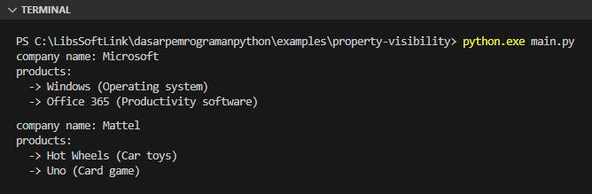
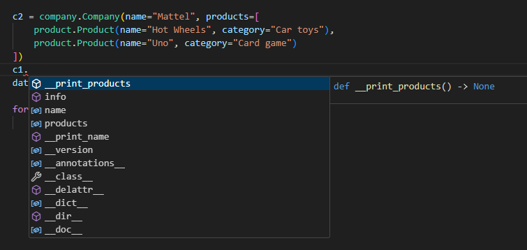

Visibility atau privacy dalam konteks OOP merujuk pada penentuan apakah property (baik itu attribute atau method) dapat diakses secara public atau hanya bisa diakses dari dalam class (private).

Di bab ini, kita akan membahas implementasinya di Python.

## A.36.1. Pengenalan visibility/privacy

Python, dari segi API kode yang tersedia, sebenarnya tidak secara eksplisit mendukung implementasi visibility property instance class. Semua attribute dan method secara default bersifat public di Python.

> Property public berarti property tersebut dapat diakses melalui instance object atau dari luar block `class`.

Meskipun demikian, ada beberapa praktik umum untuk menandai bahwa suatu method atau attribute adalah private. Salah satunya adalah menggunakan  teknik *name mangling*, di mana nama attribute atau method ditulis dengan diawali 2 karakter underscore, misalnya `__name`, `__list_items`, dan sejenisnya.

Penamaan tersebut tidak benar-benar membuat visibility property menjadi private, melainkan hanya sebagai penanda saja. Property sendiri tetap bisa diakses secara publik.

Mari kita coba praktekan. Pertama siapkan project baru dengan struktur seperti ini:

<div style={{ width: '250px' }}>

```bash title="Project structure"
property-visibility/
│─── models/
|    │─── __init__.py
|    │─── company.py
|    └─── product.py
└─── main.py
```

</div>

Package `models` berisi module `company` dan `product`, masing-masing berisi deklarasi class domain model `Company` dan `Product`. Sedangkan file `main.py` merupakan file entrypoint program.

Isi kedua tersebut dengan kode berikut:

```python title="models/product.py"
class Product:

    def __init__(self, name, category):
        self.name = name
        self.category = category
        self.__version = 1.0
```

```python title="models/product.py"
class Company:

    def __init__(self, name = "", products =[]):
        self.name = name
        self.products = products
        self.__version = 1.0
    
    def __print_name(self):
        print(f"company name: {self.name}")

    def __print_products(self):
        print(f"products:")
        for p in self.products:
            print(f"  -> {p.name} ({p.category})")

    def info(self):
        self.__print_name()
        self.__print_products()
```

Class `Company` memiliki 4 buah fungsi:

- Constructor `__init__()` yang memiliki parameter `name` dan `products`. Argument parameter tersebut datanya disimpan ke attribute.

- Fungsi `__print_name()`, tugasnya memunculkan isi attribute `name`. Dari namanya (yang diawali karakter `__`) bisa disimpulkan bahwa fungsi ini didesain hanya untuk digunakan secara private (digunakan dalam blok class saja) dan tidak diperuntukan untuk public.

- Fungsi `__print_products()`, tugasnya memunculkan isi data produk. Fungsi ini sama seperti `__print_name()` yaitu di-desain memiliki visibility private.

- Method `info()` yang didalamnya memanggil method `__print_name()` dan `__print_products()`.

Selain yang telah disebutkan di atas, class `Company` dan `Product` memiliki 1 property private bernama `__version` dimana property ini kita isi dengan informasi versi class.

Selanjutnya, buka `main.py`, import kedua class tersebut, kemudian buat beberapa data, lalu print isinya.

```python title="main.py"
from models import company
from models import product

if __name__ == "__main__":
    data = []

    c1 = company.Company(name="Microsoft", products=[
        product.Product(name="Windows", category="Operating system"),
        product.Product(name="Office 365", category="Productivity software")
    ])
    data.append(c1)

    c2 = company.Company(name="Mattel", products=[
        product.Product(name="Hot Wheels", category="Car toys"),
        product.Product(name="Uno", category="Card game")
    ])
    data.append(c2)

    for d in data:
        d.info()
```

Output program:



## A.36.2. Property dengan prefix `__`

Sebelumnya telah disebutkan bahwa prefix `__` dalam penerapannya tidak benar-benar membuat property menjadi private. Silakan test dengan autocompletion editor, property private masih muncul, menandakan bahwa property tersebut tidak benar-benar private.



Meskipun demikian, solusi ini cukup efektif untuk memberi petunjuk kepada programmer bahwa property tersebut tidak didesain untuk konsumsi publik.

---

<div class="section-footnote">

## Catatan chapter 📑

### ◉ Source code praktik

<pre>
    <a href="https://github.com/novalagung/dasarpemrogramanpython-example/tree/master/property-visibility">
        github.com/novalagung/dasarpemrogramanpython-example/../property-visibility
    </a>
</pre>

### ◉ Chapter relevan lainnya

- [OOP ➜ Class & Object](/basic/class-object)
- [OOP ➜ Instance Attribute & Class Attribute](/basic/instance-attribute-class-attribute)

### ◉ Referensi

- https://docs.python.org/3/tutorial/classes.html#private-variables

</div>
