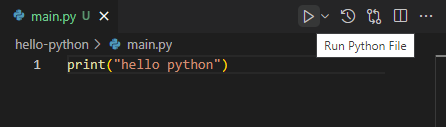
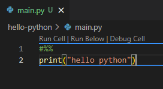

Chapter ini membahas tentang pilihan opsi cara run program Python di Visual Studio Code.

## A.2.1. Cara run program Python di VSCode

### ◉ Menggunakan command `python`

Command ini sudah kita terapkan pada chapter [Program Pertama ➜ Hello Python](/basic/hello-python), cara penggunaannya cukup mudah, tinggal jalankan saja command di terminal.

```bash
# python <nama_file_program>
python main.py
```

### ◉ Menggunakan tombol run `▶`

Cara run program ini lebih praktis karena tingal klik-klik saja. Di toolbar VSCode sebelah kanan atas ada tombol `▶`, gunakan tombol tersebut untuk menjalankan program.



### ◉ Menggunakan jupyter `code cells`

Untuk menerapkan cara ini, tambahkan kode `#%%` atau `# %%` pada baris di atas statement `print("hello python")` agar blok kode di bawahnya dianggap sebagai satu `code cell`.



Setelah itu, muncul tombol `Run Cell`, klik untuk run program.


---

<div class="section-footnote">

## Catatan chapter 📑

### ◉ Chapter relevan lainnya

- [Program Pertama ➜ Hello Python](/basic/hello-python)

### ◉ Referensi

- https://code.visualstudio.com/docs/python/python-tutorial
- https://code.visualstudio.com/docs/datascience/jupyter-notebooks
- https://docs.python.org/3/using/cmdline.html

</div>
