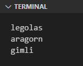
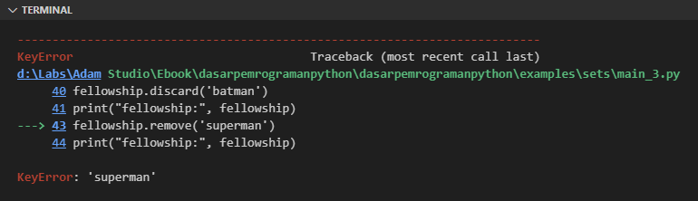

Set adalah tipe data yang digunakan untuk menampung nilai kolektif unik, jadi tidak ada duplikasi elemen. Elemen yang ada pada set disimpan secara tidak urut.

Pada chapter ini, selain mempelajari tentang `set` kita akan bahas juga satu variasinya yaitu `frozenset`.

## A.15.1. Set vs. Tuple vs. List

Tipe data set sekilas memiliki kemiripan jika dibandingkan dengan tuple dan list, namun sebenarnya lebih banyak perbedaannya. Silakan lihat tabel berikut untuk lebih jelasnya.

<table class="no-content-background">
    <thead>
        <tr>
            <th>&nbsp;</th>
            <th class="align-center">Set</th>
            <th class="align-center">Tuple</th>
            <th class="align-center">List</th>
        </tr>
    </thead>
    <tbody>
        <tr>
            <td>Literal</td>
            <td class="align-center"><code>set()</code>, atau<br />elemen ditulis diapit <code>&#123;</code> dan <code>&#125;</code></td>
            <td class="align-center"><code>()</code>, atau <code>tuple()</code>,<br />atau elemen ditulis tanpa <code>()</code></td>
            <td class="align-center"><code>[]</code>, atau <code>list()</code></td>
        </tr>
        <tr>
<td>Contoh</td>
<td class="vertical-align-top">

```
x = set()
```

```
x = {1, True, "h", 2}
```

</td>
<td class="vertical-align-top">

```
x = ()
```

```
x = tuple()
```

```
x = (1, True, "h", 2, 1)
```

```
x = 1, True, "h", 2, 1
```

</td>
<td class="vertical-align-top">

```
x = []
```

```
x = list()
```

```
x = [1, True, "h", 2, 1]
```

</td>
        </tr>
        <tr>
            <td>Urutan elemen</td>
            <td class="align-center">tidak urut</td>
            <td class="align-center" colspan="2">urut sesuai index</td>
        </tr>
        <tr>
            <td>Pengaksesan elemen</td>
            <td class="align-center">hanya via perulangan</td>
            <td class="align-center" colspan="2">via index dan perulangan</td>
        </tr>
        <tr>
            <td><i>Mutability</i></td>
            <td class="align-center">elemen bisa diubah</td>
            <td class="align-center">elemen tidak bisa diubah</td>
            <td class="align-center">elemen bisa diubah</td>
        </tr>
        <tr>
            <td>Duplikasi elemen</td>
            <td class="align-center">elemen selalu unik</td>
            <td class="align-center" colspan="2">elemen bisa duplikat</td>
        </tr>
        <tr>
            <td>Tipe data elemen</td>
            <td class="align-center" colspan="3">bisa sejenis maupun berbeda satu sama lain</td>
        </tr>
    </tbody>
</table>

## A.15.2. Pengenalan Set

Implementasi tipe data set cukup mudah, langsung tulis saja nilai elemen dengan separator `,` dan diapit menggunakan tanda kurung kurawal `{ }`. Contoh:

```python
data_1 = {1, 'abc', False, ('banana', 'spaghetti')}

print("data:", data_1)
# output ➜ data: {1, 'abc', False, ('banana', 'spaghetti')}

print("len:", len(data_1))
# output ➜ len: 4
```

- Set bisa menampung element yang tipe datanya bisa sejenis bisa tidak, sama seperti tuple dan list.
- Fungsi `len()` digunakan untuk menghitung lebar set.

:::info

Untuk deklarasi set kosong (tanpa isi), gunakan fungsi `set()`, bukan `{}` karena literal tersebut akan menciptakan data bertipe lainnya yaitu dictionary.

```python
data_2 = set()

print("data:", data_2)
# output ➜ data: set()

print("len:", len(data_2))
# output ➜ len: 0
```

Hanya gunakan kurung kurawal buka dan tutup untuk deklarasi set yang ada elemennya (tidak kosong).

:::

## A.15.3. Mengakses elemen set

Nilai set *by default* hanya bisa diakses menggunakan perulangan:

```python
fellowship = {'aragorn', 'gimli', 'legolas'}

for p in fellowship:
    print(p)
```



Dari limitasi ini, set difungsikan untuk menyelesaikan masalah yang cukup spesifik seperti eliminasi elemen duplikat.

### ◉ Eliminasi elemen duplikat

Tipe data set memang didesain untuk menyimpan data unik, duplikasi elemen tidak mungkin terjadi, bahkan meskipun dipaksa. Contoh:

```python
data = {1, 2, 3, 2, 1, 4, 5, 2, 3, 5}
print(data)
# output ➜ {1, 2, 3, 4, 5}
```

Variabel `data` yang diisi dengan data set dengan banyak elemen duplikasi, sewaktu di-print elemennya adalah unik.

Ok, selanjutnya, pada contoh kedua berikut kita akan coba gunakan set untuk mengeliminasi elemen duplikat pada suatu list.

```python
data = [1, 2, 3, 2, 1, 4, 5, 2, 3, 5]
print(data)
# output ➜ [1, 2, 3, 2, 1, 4, 5, 2, 3, 5]

data_unique_set = set(data)
print(data_unique_set)
# output ➜ {1, 2, 3, 4, 5}

data_unique = list(data_unique_set)
print(data_unique)
# output ➜ [1, 2, 3, 4, 5]
```

Penjelasan untuk kode di atas:

- Variabel `data` berisi list dengan banyak elemen duplikasi
- Data list kemudian dikonversi ke bentuk set dengan cara membungkus variabelnya menggunakan fungsi `set()`. Operasi ini menghasilkan nilai set berisi elemen unik.
- Selanjutnya data set dikonversi lagi ke bentuk list menggunakan fungsi `list()`.

### ◉ Mengecek apakah element ada

Selain untuk kasus di atas, set juga bisa digunakan untuk pengecekan membership dengan kombinasi keyword `if` dan `in`.

Pada contoh berikut, variabel `fellowship` dicek apakah berisi string `gimli` atau tidak.

```python
fellowship = {'aragorn', 'gimli', 'legolas'}
to_find = 'gimli'

if to_find in fellowship:
    print(to_find, 'is exists within fellowship')
```

## A.15.4. Operasi pada set

### ◉ Menambah element

Method `add()` milik tipe data set digunakan untuk menambahkan element baru. O iya, perlu diingat bahwa tipe data ini didesain untuk mengabaikan urutan elemen, jadi urutan tersimpannya elemen bisa saja acak.

```python
fellowship = set()

fellowship.add('aragorn')
print("len:", len(fellowship), "data:", fellowship)
# output ➜ len: 1 data: {'aragorn'}

fellowship.add('gimli')
print("len:", len(fellowship), "data:", fellowship)
# output ➜ len: 2 data: {'gimli', 'aragorn'}

fellowship.add('legolas')
print("len:", len(fellowship), "data:", fellowship)
# output ➜ len: 3 data: {'gimli', 'legolas', 'aragorn'}
```

### ◉ Menghapus element secara acak

Gunakan method `pop()` untuk menghapus satu elemen secara acak atau random.

```python
fellowship = {'narya', 'nenya', 'nilya'}

fellowship.pop()
print("len:", len(fellowship), "data:", fellowship)
# output ➜ len: 2 data: {'narya', 'nilya'}

fellowship.pop()
print("len:", len(fellowship), "data:", fellowship)
# output ➜ len: 1 data: {'nilya'}

fellowship.pop()
print("len:", len(fellowship), "data:", fellowship)
# output ➜ len: 0 data: set()
```

### ◉ Menghapus spesifik elemen

Ada dua method tersedia untuk kebutuhan menghapus elemen tertentu dari suatu set, yaitu `discard()` dan `remove()`. Penggunaan keduanya adalah sama, harus disertai dengan 1 argument pemanggilan method, yaitu elemen yang ingin dihapus.

Pada contoh berikut, elemen `boromir` dihapus dari set menggunakan method `discard()`, dan elemen `gandalf` dihapus menggunakan method `remove()`. 

```python
fellowship = {'aragorn', 'gimli', 'legolas', 'gandalf', 'boromir', 'frodo', 'sam', 'merry', 'pippin'}
print("fellowship:", fellowship)
# output ➜ fellowship: {'aragorn', 'gimli', 'legolas', 'gandalf', 'boromir', 'frodo', 'sam', 'merry', 'pippin'}

fellowship.discard('boromir')
print("fellowship:", fellowship)
# output ➜ fellowship: {'legolas', 'pippin', 'sam', 'aragorn', 'gimli', 'frodo', 'gandalf', 'merry'}

fellowship.remove('gandalf')
print("fellowship:", fellowship)
# output ➜ fellowship: {'legolas', 'pippin', 'sam', 'aragorn', 'gimli', 'frodo', 'merry'}
```

Perbedaan dua method di atas: jika elemen yang ingin dihapus tidak ada, method `discard()` tidak memunculkan error, sedangkan method `remove()` memunculkan error. Contoh:

```python
fellowship = {'aragorn', 'gimli', 'legolas', 'gandalf', 'boromir', 'frodo', 'sam', 'merry', 'pippin'}
print("fellowship:", fellowship)

fellowship.discard('batman')
print("fellowship:", fellowship)

fellowship.remove('superman')
print("fellowship:", fellowship)
```



### ◉ Mengosongkan isi set

Method `clear()` digunakan untuk mengosongkan isi set.

```python
fellowship = {'aragorn', 'gimli', 'legolas'}
fellowship.clear()

print("len:", len(fellowship), "data:", fellowship)
# output ➜ len: 0 data: set()
```

### ◉ *Copy* set

Method `copy()` digunakan untuk meng-*copy* set, menghasilkan data set baru.

```python
data1 = {'aragorn', 'gimli', 'legolas'}
print("len:", len(data1), "data1:", data1)
# output ➜ len: 3 data1: {'gimli', 'legolas', 'aragorn'}

data2 = data1.copy()
print("len:", len(data2), "data2:", data2)
# output ➜ len: 3 data2: {'gimli', 'legolas', 'aragorn'}
```

Pada contoh di atas, statement `data1.copy()` menghasilkan data baru dengan isi sama seperti isi `data1` ditampung oleh variabel bernama `data2`.

> Operasi copy disini jenisnya adalah shallow copy.<br />
> Lebih detailya mengenai shallow copy vs deep copy dibahas pada chapter terpisah.

### ◉ Pengecekan *difference* antar set

Method `difference()` digunakan untuk mencari perbedaan elemen antara data (dimana method dipanggil) vs. data pada argument pemanggilan method tersebut.

Sebagai contoh, pada variabel `fellowship` berikut akan dicari elemen yang tidak ada di variabel `hobbits`.

```python
fellowship = {'aragorn', 'gimli', 'legolas', 'gandalf', 'boromir', 'frodo', 'sam', 'merry', 'pippin'}
hobbits = {'frodo', 'sam', 'merry', 'pippin', 'bilbo'}

diff = fellowship.difference(hobbits)
print("diff:", diff)
# output ➜ diff: {'boromir', 'legolas', 'aragorn', 'gimli', 'gandalf'}
```

Selain method di atas, adalagi method `difference_update()` yang kegunaannya adalah mengubah nilai data (dimana method dipanggil) dengan nilai baru yang didapat dari perbedaan elemen antara data tersebut vs. data pada argument pemanggilan method.

```python
fellowship.difference_update(hobbits)
print("fellowship:", fellowship)
# output ➜ fellowship: {'boromir', 'legolas', 'aragorn', 'gimli', 'gandalf'}
```

### ◉ Pengecekan *intersection* antar set

Method `intersection()` digunakan untuk mencari elemen yang ada di data (dimana method dipanggil) vs. data pada argument pemanggilan method tersebut.

Pada variabel `fellowship` berikut akan dicari elemen yang juga ada pada variabel `hobbits`.

```python
fellowship = {'aragorn', 'gimli', 'legolas', 'gandalf', 'boromir', 'frodo', 'sam', 'merry', 'pippin'}
hobbits = {'frodo', 'sam', 'merry', 'pippin', 'bilbo'}

diff = fellowship.intersection(hobbits)
print("diff:", diff)
# output ➜ duplicates: {'frodo', 'pippin', 'sam', 'merry'}
```

Tersedia juga method `intersection_update()` yang berguna untuk mengubah nilai data (dimana method dipanggil) dengan nilai baru yang didapat dari kesamaan elemen antara data tersebut vs. data pada argument pemanggilan method.

```python
fellowship.intersection_update(hobbits)
print("fellowship:", fellowship)
# output ➜ fellowship: {'frodo', 'pippin', 'sam', 'merry'}
```

### ◉ Pengecekan keanggotaan *subset*

Di awal chapter ini kita telah sedikit menyinggung pengecekan membership menggunakan kombinasi keyword `if` dan `in`. Selain metode tersebut, ada alternatif cara lain yang bisa digunakan untuk mengecek apakah suatu data (yang pada konteks ini adalah set) merupakan bagian dari element set lain, caranya menggunakan method `issubset()`.

Method `issubset()` menerima argument berupa data set. Contohnya bisa dilihat pada kode berikut:

```python
fellowship = {'aragorn', 'gimli', 'legolas', 'gandalf', 'boromir', 'frodo', 'sam', 'merry', 'pippin'}

hobbits_1 = {'frodo', 'sam', 'merry', 'pippin', 'bilbo'}
res_1 = hobbits_1.issubset(fellowship)
print("res_1:", res_1)
# output ➜ res_1: False

hobbits_2 = {'frodo', 'sam', 'merry', 'pippin'}
res_2 = hobbits_2.issubset(fellowship)
print("res_2:", res_2)
# output ➜ res_2: True
```

- Nilai `res_1` adalah `False` karena set `hobbits_1` memiliki setidaknya satu elemen yang bukan anggota dari `fellowship`, yaitu `bilbo`.
- Nilai `res_2` adalah `True` karena set `hobbits_2` semua elemennya adalah anggota dari `fellowship`.

### ◉ Pengecekan keanggotaan *superset*

Selain `issubset()`, ada juga `issuperset()` yang fungsinya kurang lebih sama namun kondisinya pengecekannya dibalik.

Agar lebih jelas, silakan lihat kode berikut:

```python
fellowship = {'aragorn', 'gimli', 'legolas', 'gandalf', 'boromir', 'frodo', 'sam', 'merry', 'pippin'}

hobbits_1 = {'frodo', 'sam', 'merry', 'pippin', 'bilbo'}
res_1 = fellowship.issuperset(hobbits_1)
print("res_1:", res_1)
# output ➜ res_1: False

hobbits_2 = {'frodo', 'sam', 'merry', 'pippin'}
res_2 = fellowship.issuperset(hobbits_2)
print("res_2:", res_2)
# output ➜ res_2: True
```

- Nilai `res_1` adalah `False` karena set `hobbits_1` memiliki setidaknya satu elemen yang bukan anggota dari `fellowship`, yaitu `bilbo`.
- Nilai `res_2` adalah `True` karena set `hobbits_2` semua elemennya adalah anggota dari `fellowship`.

### ◉ Pengecekan keanggotaan *disjoint*

Method ini mengembalikan nilai `True` jika set pada pemanggilan fungsi berisi elemen yang semuanya bukan anggota data dimana method dipanggil.

```python
fellowship = {'aragorn', 'gimli', 'legolas', 'gandalf', 'boromir', 'frodo', 'sam', 'merry', 'pippin'}

res_1 = fellowship.isdisjoint({'aragorn', 'gimli'})
print("res_1:", res_1)

res_2 = fellowship.isdisjoint({'pippin', 'bilbo'})
print("res_2:", res_2)

res_3 = fellowship.isdisjoint({'bilbo'})
print("res_3:", res_3)
```

- Nilai `res_1` adalah `False` karena beberapa anggota set `fellowship` adalah `aragorn` dan `gimli'`.
- Nilai `res_2` adalah `False` karena beberapa anggota set `fellowship` adalah `pippin`. Sedangkan `bilbo` ia bukanlah anggota `fellowship`, tapi karena setidaknya ada 1 elemen yang match, maka method `isdisjoint` mengembalikan nilai `False`.
- Nilai `res_3` adalah `True` karena `bilbo` bukanlah anggota `fellowship`.

### ◉ *Extend/concat/union* element

Operasi *extend* (atau *concat* atau *union*) adalah operasi penggabungan dua data set. Ada beberapa metode yang tersedia, diantaranya:

- via method `union()`:

    ```python
    hobbits = {'frodo', 'sam', 'merry', 'pippin'}
    dunedain = {'aragorn'}
    elf = {'legolas'}
    dwarf = {'gimly'}
    human = {'boromir'}
    maiar = {'gandalf'}

    fellowship_1 = hobbits.union(dunedain).union(dunedain).union(elf).union(dwarf).union(human).union(maiar)
    print("fellowship_1:", fellowship_1)
    # output ➜ fellowship_1: {'boromir', 'gimly', 'legolas', 'pippin', 'sam', 'aragorn', 'frodo', 'gandalf', 'merry'}
    ```

- via method `update()`:

    ```python
    hobbits = {'frodo', 'sam', 'merry', 'pippin'}
    dunedain = {'aragorn'}
    elf = {'legolas'}
    dwarf = {'gimly'}
    human = {'boromir'}
    maiar = {'gandalf'}

    fellowship_2 = set()
    fellowship_2.update(hobbits)
    fellowship_2.update(dunedain)
    fellowship_2.update(dunedain)
    fellowship_2.update(elf)
    fellowship_2.update(dwarf)
    fellowship_2.update(human)
    fellowship_2.update(maiar)
    print("fellowship_2:", fellowship_2)
    # output ➜ fellowship_2: {'boromir', 'gimly', 'legolas', 'pippin', 'sam', 'aragorn', 'frodo', 'gandalf', 'merry'}
    ```

Bisa dilihat perbedaannya ada di-bagaimana nilai balik method disimpan.

- Pada method `union()`, pemanggilan method tersebut mengembalikan data setelah penggabungan, dan bisa di-chain langsung dengan pemanggilan method `union()` lainnya.
- Pada method `update()`, data yang digunakan untuk memanggil method tersebut diubah secara langsung nilainya.

### ◉ Operator bitwise pada set

- Operasi `or` pada set menggunakan operator `|`

    ```python
    a = set('abracadabra') # {'c', 'a', 'r', 'd', 'b'}
    b = set('alacazam')    # {'c', 'z', 'a', 'm', 'l'}

    res = a | b
    print(res)
    # output ➜ {'c', 'z', 'a', 'r', 'd', 'b', 'm', 'l'}
    ```

    Nilai `res` berisi elemen set unik kombinasi set `a` dan set `b`.

- Operasi `and` pada set menggunakan operator `&`

    ```python
    a = set('abracadabra') # {'c', 'a', 'r', 'd', 'b'}
    b = set('alacazam')    # {'c', 'z', 'a', 'm', 'l'}

    res = a & b
    print(res)
    # output ➜ {'c', 'a'}
    ```

    Nilai `res` berisi elemen set yang merupakan anggota set `a` dan set `b`. Operasi seperti ini biasa disebut dengan operasi *and*.

- Operasi `exclusive or` pada set menggunakan operator `^`

    ```python
    a = set('abracadabra') # {'c', 'a', 'r', 'd', 'b'}
    b = set('alacazam')    # {'c', 'z', 'a', 'm', 'l'}

    res = a ^ b
    print(res)
    # output ➜ {'z', 'r', 'b', 'd', 'm', 'l'}
    ```

    Nilai `res` berisi elemen set yang ada di set `a` atau set `b` tetapi tidak ada di-keduanya.

### ◉ Operator `-` pada set

Digunakan untuk pencarian perbedaan elemen. Contoh penerapan:

```python
a = set('abracadabra') # {'c', 'a', 'r', 'd', 'b'}
b = set('alacazam')    # {'c', 'z', 'a', 'm', 'l'}

res = a - b
print(res)
# output ➜ {'b', 'd', 'r'}
```

Nilai `res` berisi elemen set unik yang merupakan anggota set `a` tapi bukan anggota set `b`

## A.15.5. Fungsi `set()`

### ◉ Konversi string ke set

String dibungkus menggunakan method `set()` menghasilkan data set berisi karakter string yang unik.

```python
data = set('abcda')
print('data', data)
# output ➜ data {'c', 'b', 'a', 'd'}
```

### ◉ Konversi list ke set

Data list bisa diubah menjadi set dengan mudah dengan cara membungkusnya menggunakan fungsi `set()`. Isi dari set adalah elemen unik list.

```python
data = set(['a', 'b', 'c', 'd', 'a'])
print('data', data)
# output ➜ data {'c', 'b', 'a', 'd'}
```

### ◉ Konversi tuple ke set

Data tuple juga bisa diubah menjadi set via fungsi `set()`. Isi dari set adalah elemen unik tuple.

```python
data = set(('a', 'b', 'c', 'd', 'a'))
print('data', data)
# output ➜ data {'c', 'b', 'a', 'd'}
```

### ◉ Konversi range ke set

Data range (hasil dari pemanggilan fungsi `range()`) bisa dikonversi ke bentuk set via fungsi `set()`.

```python
data = set(range(1, 5))
print('data', data)
# output ➜ data {1, 2, 3, 4}
```

## A.15.6. Set comprehension

Metode [comprehension](/basic/list-comprehension) juga bisa diterapkan pada set. Contohnya bisa dilihat pada kode berikut, statement set comprehension dibuat untuk melakukan pengecekan apakah ada element pada set `set('abracadabra')` yang bukan anggota element `set('abc')`.

```python
res = {x for x in set('abracadabra') if x not in set('abc')}
print(res)
# output ➜ {'d', 'r'}
```

## A.15.7. `frozenset`

`frozenset` adalah `set` yang *immutable* atau tidak bisa diubah nilai elemennya setelah dideklarasikan.

Cara penggunaannya seperti set, perbedaannya pada deklarasi frozenset, fungsi `frozenset()` digunakan dan bukan `set()`.

```python
a = frozenset('abracadabra')
print(a)
# output ➜ frozenset({'c', 'a', 'r', 'd', 'b'})

b = frozenset('alacazam')
print(b)
# output ➜ frozenset({'c', 'z', 'a', 'm', 'l'})
```

Semua operasi set, method milik set bisa digunakan pada frozenset, kecuali beberapa operasi yang sifatnya *mutable* atau mengubah elemen. Contohnya seperti method `add()`, `pop()`, `remove()` dan lainnya tidak bisa digunakan di frozenset.

---

<div class="section-footnote">

## Catatan chapter 📑

### ◉ Source code praktik

<pre>
    <a href="https://github.com/novalagung/dasarpemrogramanpython-example/tree/master/set">
        github.com/novalagung/dasarpemrogramanpython-example/../set
    </a>
</pre>

### ◉ Chapter relevan lainnya

- [List](/basic/list)
- [List Comprehension](/basic/list-comprehension)
- [Tuple](/basic/tuple)

### ◉ Referensi

- https://docs.python.org/3/tutorial/datastructures.html
- https://docs.python.org/3/library/stdtypes.html#set-types-set-frozenset

</div>
