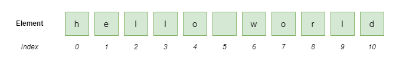
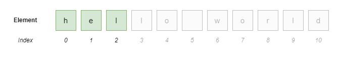
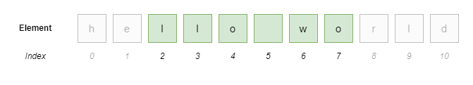
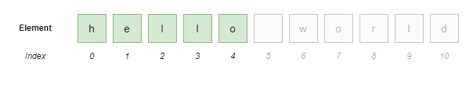
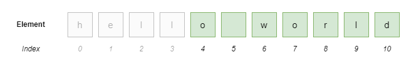
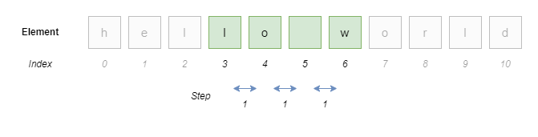
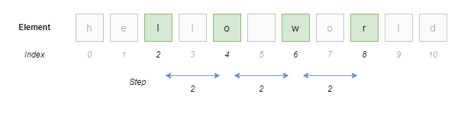
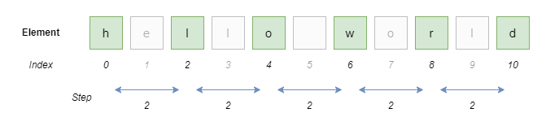

Pada chapter ini kita akan belajar tentang penerapan teknik slice pada data sequence.

## A.20.1. Pengenalan slice

Teknik slice atau slicing digunakan untuk mengakses sekumpulan element/item dari data sequence sesuai dengan index yang diinginkan. Data sequence sendiri adalah klasifikasi tipe data yang berisi kumpulan data terurut atau sekuensial. Yang termasuk dalam tipe data sequence adalah [list](/basic/list), [range](/basic/for-range#a92-penerapan-fungsi-range), [tuple](/basic/tuple), dan [string](/basic/string).

Operasi slice mengembalikan data bertipe sama seperti data aslinya, sedangkan isi sesuai dengan index yang ditentukan.

Salah satu penerapan slice adalah dengan memanfaatkan notasi `data[start:end]` atau `data[start:end:step]`.

- `start` adalah index awal slicing. Misalkan index `start` adalah `2` maka slicing dimulai dari element index ke-2.
- `end` adalah index akhir slicing. Misalkan index `end` adalah `5` maka slicing berakhir **sebelum** element index ke-5 (yang berarti element ke-4).
- `step` by default nilainya `1`, kegunaannya untuk menentukan apakah element yang dikembalikan adalah setiap `step` index.

Lanjut praktek. Pada contoh berikut disiapkan variabel `data_str` berisi string `hello world` yang kemudian akan di-slice datanya.

```python
data_str = "hello world"
print(data_str)
# output ➜ hello world
```

Variabel `data_str` visualisasinya dalam bentuk *sequence* kurang lebih seperti ini. Lebar element data adalah `11` dengan index awal `0` dan index akhir `10`.



Ok, sekarang kita coba slice `data_str`:

- Slicing element index ke-0 hingga ke-2, maka notasinya adalah `data_str[0:3]`. Perlu diketahui bahwa `end` diisi dengan nilai `index-1`, jadi jika ingin mengambil element hingga index ke-2 maka nilai `end` adalah `3`.

    ```python
    data_str = "hello world"

    slice1 = data_str[0:3]
    print(slice1)
    # output ➜ hel
    ```

    

- Slicing element index ke-2 hingga ke-7, maka notasinya adalah `data_str[2:8]`.

    ```python
    slice2 = data_str[2:8]
    print(slice2)
    # output ➜ llo wo
    ```

    

- Slicing element hingga index ke-4, maka notasinya adalah `data_str[:5]`. Nilai `start` jika tidak diisi maka default-nya adalah `0`. Notasi tersebut adalah ekuivalen dengan `data_str[0:5]`.

    ```python
    slice3 = data_str[:5]
    print(slice3)
    # output ➜ hello
    ```

    

- Slicing element dimulai index ke-4, maka notasinya adalah `data_str[4:]`. Nilai `end` jika tidak diisi maka default-nya adalah nilai jumlah element data (ekuivalen dengan notasi `data_str[4:len(data_str)]`).

    ```python
    slice4 = data_str[4:]
    print(slice4)
    # output ➜ o world
    ```

    

- Slicing element dimulai index ke-3 hingga ke-6 dengan element yang dikembalikan adalah setiap 1 element, maka notasinya adalah `data_str[3:7:1]`.

    ```python
    slice5 = data_str[3:7:1]
    print(slice5)
    # output ➜ lo w
    ```

    

- Slicing element dimulai index ke-2 hingga ke-8 dengan ketentuan element yang dikembalikan adalah setiap 2 element, notasinya: `data_str[2:9:2]`.

    ```python
    slice6 = data_str[2:9:2]
    print(slice6)
    # output ➜ lowr
    ```

    

- Slicing seluruh element bisa dilakukan dengan notasi `data_str[:]`. Notasi tersebut adalah ekuivalen dengan `data_str[0:len(data_str)]`.

    ```python
    slice7 = data_str[:]
    print(slice7)
    # output ➜ hello world
    ```

    

- Slicing seluruh element dengan ketentuan element yang dikembalikan adalah setiap 2 element, ditulis dengan notasi `data_str[::2]`. Notasi tersebut adalah ekuivalen dengan `data_str[0:len(data_str):2]`.

    ```python
    slice8 = data_str[::2]
    print(slice8)
    # output ➜ hlowrd
    ```

    

### ◉ Tentang slicing seluruh element

Slicing seluruh element bisa dilakukan dengan notasi `data[0:len(data)]` atau `data[0:len(data):1]`. Sebagai contoh, 3 statement printing tuple berikut memunculkan output yang sama meskipun data tuple yang ditampilkan adalah dari variabel yang berbeda.

```python
data_tuple = (1, 3, 5, 7, 9, 11, 13, 14)
print(data_tuple)
# output ➜ (1, 3, 5, 7, 9, 11, 13, 14)

tuple1 = data_tuple[0:len(data_tuple)]
print(tuple1)
# output ➜ (1, 3, 5, 7, 9, 11, 13, 14)

tuple2 = data_tuple[0:len(data_tuple):1]
print(tuple2)
# output ➜ (1, 3, 5, 7, 9, 11, 13, 14)
```

Ok, lalu kenapa harus menggunakan teknik ini? padahal operasi assignment data tuple ke variabel baru jauh lebih mudah, misalnya:

```python
tuple3 = data_tuple
print(tuple3)
# output ➜ (1, 3, 5, 7, 9, 11, 13, 14)
```

Statement assignment `tuple3` di atas isinya adalah sama dengan data hasil operasi slicing `tuple1` dan `tuple2`, namun *reference*-nya adalah berbeda.

> Pembahasan detail mengenai *reference* ada di chapter [Object ID & Reference](/basic/object-id-reference)

## A.20.2. Fungsi `slice()`

Notasi penulisan slice bisa disimpan pada suatu variabel dengan memanfaatkan fungsi `slice()`. Nilai `start`, `end`, dan `step` dijadikan argument pemanggilan fungsi tersebut dengan notasi `slice(start, end)` atau `slice(start, end, step)`.

Pada contoh berikut, perhatikan bagaimana perbedaan slicing pada `list1`, `list2`, dan `list3`:

```python
data_list = [2, 4, 6, 7, 9, 11, 13]
print(data_list)
# output ➜ [2, 4, 6, 7, 9, 11, 13]

list1 = data_list[2:6:1]
print(list1)
# output ➜ [6, 7, 9, 11]

list2 = data_list[slice(2, 6, 1)]
print(list2)
# output ➜ [6, 7, 9, 11]

sl = slice(2, 6)
list3 = data_list[sl]
print(list3)
# output ➜ [6, 7, 9, 11]
```

---

<div class="section-footnote">

## Catatan chapter 📑

### ◉ Source code praktik

<pre>
    <a href="https://github.com/novalagung/dasarpemrogramanpython-example/tree/master/slice">
        github.com/novalagung/dasarpemrogramanpython-example/../slice
    </a>
</pre>

### ◉ Chapter relevan lainnya

- [List](/basic/list)
- [Tuple](/basic/tuple)
- [String](/basic/string)
- [Object ID & Reference](/basic/object-id-reference)

### ◉ TBA

- Negative index slicing

### ◉ Referensi

- https://docs.python.org/3/library/stdtypes.html#sequence-types-list-tuple-range
- https://python-reference.readthedocs.io/en/latest/docs/functions/slice.html
- https://stackoverflow.com/questions/509211/how-slicing-in-python-works

</div>
