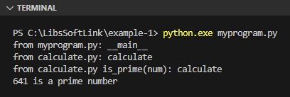
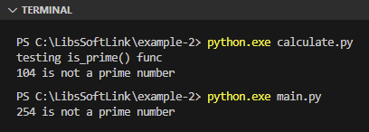
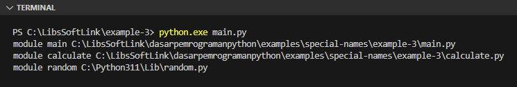

Chapter ini membahas tentang variabel spesial yang ada di Python (umumnya disebut special names).

Python memiliki variabel spesial yang bisa diakses secara global. Ciri khas special names adalah penulisannya diawali dan diakhiri dengan karakter `__`. Salah satunya adalah variabel `__all__` yang telah diulas di chapter sebelumnya.

Setiap special names memiliki kegunaan yang unik dan berbeda satu sama lain.

## A.30.1. Variabel `__name__`

Variabel `__name__` adalah salah satu special names di Python. Isinya mencakup informasi nama modul atau string `__main__`, tergantung apakah variabel tersebut di-print dari file entrypoint eksekusi program atau di-import. File entrypoint yang dimaksud disini adalah file yang digunakan pada argument command `python <nama_file_program>`.

Agar lebih jelas, mari kita langsung praktekan. Silakan siapkan folder project baru dengan struktur file seperti ini:

<div style={{ width: '250px' }}>

```bash title="Project structure example-1"
example-1/
│─── calculate.py
└─── my_program.py
```

</div>

Folder project `example-1` ini berisi hanya 2 file, yaitu `calculate.py` dan `my_program.py`.

Selanjutnya, buka `calculate.py` dan tulis kode untuk mencari bilangan prima:

```python title="File: calculate.py"
print("from calculate.py:", __name__)

def is_prime(num):
    print("from calculate.py is_prime(num):", __name__)

    flag = False

    if num == 1:
        print(num, "is not a prime number")
    elif num > 1:
        for i in range(2, num):
            if (num % i) == 0:
                flag = True
                break

        if flag:
            print(num, "is not a prime number")
        else:
            print(num, "is a prime number")
```

File `calculate.py` difungsikan sebagai module bernama `calculate`, yang nantinya di-import pada file `my_program.py`. Statement `print("from calculate.py:", __name__)` akan otomatis dieksekusi saat ter-import. Selain itu, ada juga fungsi `is_prime()` yang berisi kode pencarian bilangan prima.

> Penjelasan detail mengenai module ada di chapter [Modules](/basic/modules)

Lanjut, buka file `my_program.py` dan isi dengan kode berikut:

```python title="File: my_program.py"
print("from my_program.py:", __name__)

import calculate

import random
num = random.randint(0, 999)
calculate.is_prime(num)
```

File `my_program.py` nantinya kita gunakan sebagai entrypoint eksekusi program via perintah `python.exe my_program.py`. Isi file tersebut adalah 5 buah statement yang masing-masing penjelasannya bisa dilihat di bawah ini:

1. Statement `print("from my_program.py:", __name__)` dieksekusi
2. Module `calculate` di-import
3. Module `random` di-import
4. Fungsi `randint()` dalam module `random` dieksekusi
5. Fungsi `is_prime()` milik module `calculate` dieksekusi

Jalankan program menggunakan command `python my_program.py`, lalu lihat outputnya:



Dari contoh, dapat dilihat bahwa special names `__name__` jika di-print dari `my_program.py` memiliki value string `"__main__"`. Hal ini karena file `my_program.py` adalah entrypoint program. Sedangkan pada module `calculate`, variabel yang sama menghasilkan output berbeda, yaitu `calculate` yang merupakan nama module file `calculate.py`.

> Untuk mengetahui file mana yang merupakan file entrypoint eksekusi program, selain dengan mengecek nilai variabel `__name__` bisa juga dengan melihat argument eksekusi program. Misalnya `python my_program.py`, maka file entrypoint adalah `my_program.py`

Variabel `__name__` biasanya dimanfaatkan sebagai kontrol entrypoint program, misalnya untuk membedakan statement yang akan dieksekusi ketika module digunakan sebagai entrypoint atau digunakan sebagai dependency atau module yang di-import di module lain.

Contoh pengaplikasian skenario yang disebutkan dapat ditemukan pada contoh program ke-2 berikut:

<div style={{ width: '250px' }}>

```bash title="Project structure example-2"
example-2/
│─── calculate.py
└─── main.py
```

</div>

```python title="File: calculate.py"
def is_prime(num):
    flag = False

    if num == 1:
        print(num, "is not a prime number")
    elif num > 1:
        for i in range(2, num):
            if (num % i) == 0:
                flag = True
                break

        if flag:
            print(num, "is not a prime number")
        else:
            print(num, "is a prime number")

if __name__ == '__main__':
    num_test = 104
    print("testing is_prime() func")
    is_prime(num_test)
```

```python title="File: main.py"
import calculate

import random
num = random.randint(0, 999)
calculate.is_prime(num)
```

Penjelasan:

- Module `calculate` jika di-run sebagai entrypoint, maka statement dalam blok seleksi kondisi `if __name__ == '__main__'` otomatis tereksekusi. Jika tidak digunakan sebagai entrypoint, maka tidak ada statement yang dieksekusi.

- Module `main` jika di-run sebagai entrypoint, maka module tersebut akan meng-import module `calculate` lalu memanggil fungsi `is_prime()` yang dideklarasikan didalamnya.



## A.30.2. Variabel `__file__`

Variabel special name `__file__` berisi informasi path file di mana variabel tersebut ditulis atau digunakan. Ada dua cara untuk menggunakan variabel ini:

- Dengan mengaksesnya secara langsung
- Dengan mempergunakannya sebagai property dari module, misalnya: `random.__file__`

Contoh penerapannya bisa dilihat pada program berikut:

<div style={{ width: '250px' }}>

```bash title="Project structure example-3"
example-3/
│─── calculate.py
└─── main.py
```

</div>

```python title="File: calculate.py"
def is_prime(num):
    flag = False

    if num == 1:
        print(num, "is not a prime number")
    elif num > 1:
        for i in range(2, num):
            if (num % i) == 0:
                flag = True
                break

        if flag:
            print(num, "is not a prime number")
        else:
            print(num, "is a prime number")
```

```python title="File: main.py"
print("module main", __file__)

import calculate
print("module calculate", calculate.__file__)

import random
print("module random", random.__file__)
```

Bisa dilihat pada gambar berikut bahwa output program adalah memunculkan nama module beserta lokasi di mana file module tersebut berada:



Penggunaan `__file__` akan menampilkan path file dimana variabel tersebut ditulis, sedangkan penggunaannya sebagai property module (misalnya `calculate.__file__`) menghasilkan informasi path module.

## A.30.3. Variabel `__all__` & file `__init__.py`

Variabel `__all__` digunakan untuk menentukan module apa saja yang ter-import ketika statement `import *` digunakan. Variabel `__all__` wajib ditulis di file `__init__.py` yang ditempatkan dalam package.

> Penjelasan detail mengenai `import *` ada pada chapter [Packages](/basic/packages).

## A.30.4. Attribute `__name__` milik class `type`

Kita telah menggunakan fungsi `type()` beberapa kali pada banyak chapter sebelum ini. Fungsi `type()` adalah fungsi yang mengembalikan data dengan tipe yaitu class `type`.

Class `type` memiliki attribute bernama `__name__` isinya informasi nama class. Contoh penerapan pengaksesan attribute ini:

```python
data1 = "Noval Agung"
print(f"var: data1, data: {data1}, type: {type(data1).__name__}")
# output ➜ var: data1, data: Noval Agung, type: str

data2 = 24 * 7
print(f"var: data2, data: {data2}, type: {type(data2).__name__}")
# output ➜ var: data2, data: 168, type: int
```

## A.30.5. Attribute `__class__` milik semua class / tipe data

Setiap tipe data memiliki akses ke attribute bernama `__class__`. Isi dari attribute ini adalah data yang sama hasil pemanggilan fungsi `type()` yaitu informasi tipe data atau class.

Pada kode sebelumnya, statement `type(data1)` menghasilkan nilai balik yang sama dengan statement `data1.__class__`. Dari nilai balik (yang bertipe `type`) tersebut bisa langsung dilakukan pengaksesan attribute `__name__`.

```python
data1 = "Noval Agung"
print(f"var: data1, data: {data1}, type: {data1.__class__.__name__}")
# output ➜ var: data1, data: Noval Agung, type: str

data2 = 24 * 7
print(f"var: data2, data: {data2}, type: {data2.__class__.__name__}")
# output ➜ var: data2, data: 168, type: int
```

## A.30.6. Attribute `__mro__` milik semua class / tipe data

Class attribute `__mro__` berisi informasi hirarki class dalam tipe data tuple. Penjelasan lebih lanjut mengenai `__mro__` ada di chapter [OOP ➜ Class Inheritance](/basic/class-inheritance).

## A.30.7. Package `__future__`

Package `__future__` berisi modules yang hanya tersedia di Python versi terbaru. Package ini biasa di-import pada program yang dijalankan menggunakan Python versi lama (misalnya 2.5), yang didalamnya ada penerapan kode yang hanya ada di versi Python terbaru.

Salah satu contoh adalah penggunaan operator `//` untuk operasi **floor division** atau pembagian dengan hasil dibulatkan. Operator tersebut hanya tersedia di Python 3.0+.

Agar bisa menggunakan operator tersebut di Python versi lama harus ada, perlu untuk meng-import module `division` dari package `__future__`. Tulis statement import di file program baris paling atas sendiri.

```python
from __future__ import division

print(8 / 7)
# output ➜ 1.1428571428571428

print(8 // 7)
# output ➜ 1
```

## A.30.8. Fungsi `__init__()`

Fungsi `__init__()` digunakan untuk membuat konstruktor pada suatu class. Penjelasan lebih lanjut mengenai `__init__()` ada di chapter [OOP ➜ Class & Object](/basic/class-object).

## A.30.9. Attribute `__doc__` milik semua class dan fungsi

Attribute `__doc__` digunakan untuk melihat informasi komentar docstring. Penjelasan lebih lanjut mengenai `__doc__` ada di chapter [DocString](/basic/docstring).

---

<div class="section-footnote">

## Catatan chapter 📑

### ◉ Source code praktik

<pre>
    <a href="https://github.com/novalagung/dasarpemrogramanpython-example/tree/master/special-names">
        github.com/novalagung/dasarpemrogramanpython-example/../special-names
    </a>
</pre>

### ◉ Chapter relevan lainnya

- [Modules](/basic/modules)
- [Packages](/basic/packages)
- [OOP ➜ Class & Object](/basic/class-object)
- [OOP ➜ Class Inheritance](/basic/class-inheritance)

### ◉ Referensi

- https://docs.python.org/3/tutorial/modules.html
- https://docs.python.org/3/tutorial/special-names.html
- https://stackoverflow.com/questions/7075082/what-is-future-in-python-used-for-and-how-when-to-use-it-and-how-it-works

</div>
