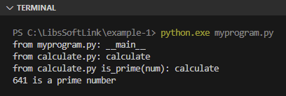
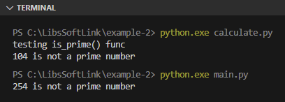
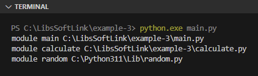

Chapter ini membahas tentang variabel spesial yang ada di Python (umumnya disebut special names).

Ada beberapa variabel spesial yang bisa diakses secara global dengan ciri khas nama variabel diawali dan diakhiri dengan karakter `__`, misalnya variabel `__all__` yang telah dibahas pada chapter sebelumnya.

## A.29.1. Variabel `__name__`

Variabel `__name__` merupakan salah satu special names yang ada di Python, isinya adalah informasi nama modul atau string `__main__` tergantung apakah variabel tersebut di-print dari file entrypoint eksekusi program atau di-import. File entrypoint yang dimaksud disini adalah file yang digunakan pada argument command `python <nama_file_program>`.

Agar lebih jelas, mari kita langsung praktekan. Silakan siapkan folder project baru dengan struktur file seperti ini:

<div style={{ width: '250px' }}>

```bash title="Project structure example-1"
example-1/
│─── calculate.py
└─── my_program.py
```

</div>

Source code program yang dipraktekan disimpan pada folder `example-1`. Folder ini isinya hanya 2 file yaitu `calculate.py` dan `my_program.py`.

Selanjutnya, buka `calculate.py` lalu tulis kode untuk pencarian bilangan prima berikut:

```python title="File: calculate.py"
print("from calculate.py:", __name__)

def is_prime(num):
    print("from calculate.py is_prime(num):", __name__)

    flag = False

    if num == 1:
        print(num, "is not a prime number")
    elif num > 1:
        for i in range(2, num):
            if (num % i) == 0:
                flag = True
                break

        if flag:
            print(num, "is not a prime number")
        else:
            print(num, "is a prime number")
```

File `calculate.py` difungsikan sebagai module bernama `calculate`, yang nantinya di-import pada file `my_program.py`. Statement `print("from calculate.py:", __name__)` akan otomatis tereksekusi saat import. Selain itu, ada juga fungsi `is_prime()` yang berisi kode pencarian bilangan prima.

> Penjelasan lebih detail mengenai module akan di chapter terpisah, yaitu chapter [Modules](/basic/modules)

Ok, sekarang buka file `my_program.py` isi dengan kode berikut:

```python title="File: my_program.py"
print("from my_program.py:", __name__)

import calculate

import random
num = random.randint(0, 999)
calculate.is_prime(num)
```

File `my_program.py` nantinya kita gunakan sebagai entrypoint eksekusi program via perintah `python.exe my_program.py`. isi file tersebut adalah 5 buah statement yang penjelasannya bisa dilihat di bawah ini:

1. Statement `print("from my_program.py:", __name__)` dieksekusi
2. Module `calculate` di-import
3. Module `random` di-import
4. Fungsi `randint()` dalam module `random` dieksekusi
5. Fungsi `is_prime()` milik module `calculate` dieksekusi

Lihat output program dengan menjalankan perintah `python my_program.py`:



Bisa dilihat bahwa special names `__name__` jika di-print dari `my_program.py` nilainya adalah `__main__`, hal ini karena file `my_program.py` merupakan entrypoint program (bisa diketahui dari command yang dieksekusi yaitu `python my_program.py`). Sedangkan pada module `calculate` variabel yang sama menghasilkan output berbeda, yaitu `calculate` yang merupakan nama module file `calculate.py`.

Dari penjelasan di atas, variabel `__name__` biasa dimanfaatkan sebagai kontrol untuk entrypoint program, misalnya untuk membedakan statement yang akan dieksekusi ketika module digunakan sebagai entrypoint atau digunakan sebagai dependency atau module yang di-import di module lain.

Contoh pengaplikasian skenario yang disebutkan ada pada contoh program ke-2 berikut:

<div style={{ width: '250px' }}>

```bash title="Project structure example-2"
example-2/
│─── calculate.py
└─── main.py
```

</div>

```python title="File: calculate.py"
def is_prime(num):
    flag = False

    if num == 1:
        print(num, "is not a prime number")
    elif num > 1:
        for i in range(2, num):
            if (num % i) == 0:
                flag = True
                break

        if flag:
            print(num, "is not a prime number")
        else:
            print(num, "is a prime number")

if __name__ == '__main__':
    num_test = 104
    print("testing is_prime() func")
    is_prime(num_test)
```

```python title="File: main.py"
import calculate

import random
num = random.randint(0, 999)
calculate.is_prime(num)
```

Module `calculate` jika di-run sebagai entrypoint maka statement dalam blok seleksi kondisi `if __name__ == '__main__'` di-eksekusi. Jika tidak digunakan sebagai entrypoint, maka tidak ada statement yang dieksekusi.

Module `main` ketika di-run sebagai entrypoint akan meng-import module `calculate` lalu menggunakan fungsi `is_prime()` yang dideklarasikan didalamnya.



## A.29.2. Variabel `__file__`

Variabel special name `__file__` berisi informasi path file dimana variabel tersebut ditulis atau digunakan. Ada dua cara untuk menggunakan variabel ini:

- Dengan mengaksesnya secara langsung
- Dengan mempergunakannya sebagai property dari module, misalnya: `random.__file__`

Contohnya penerapannya bisa dilihat pada program berikut:

<div style={{ width: '250px' }}>

```bash title="Project structure example-3"
example-3/
│─── calculate.py
└─── main.py
```

</div>

```python title="File: calculate.py"
def is_prime(num):
    flag = False

    if num == 1:
        print(num, "is not a prime number")
    elif num > 1:
        for i in range(2, num):
            if (num % i) == 0:
                flag = True
                break

        if flag:
            print(num, "is not a prime number")
        else:
            print(num, "is a prime number")
```

```python title="File: main.py"
print("module main", __file__)

import calculate
print("module calculate", calculate.__file__)

import random
print("module random", random.__file__)
```

Bisa dilihat pada gambar berikut output program di atas menampilkan nama module beserta lokasi dimana file module tersebut berada:



Penggunaan `__file__` akan menampilkan path file dimana variabel tersebut ditulis, sedangkan penggunaannya sebagai property module (misalnya `calculate.__file__`) menghasilkan informasi path module.

## A.29.3. Variabel `__all__` & file `__init__.py`

Variabel `__all__` digunakan untuk menentukan module apa saja yang ter-import pada statement `import *`. Variabel tersebut wajib ditulis di file `__init__.py` yang ditempatkan dalam package.

Penjelasan lebih detailnya ada pada chapter sebelumnya, yaitu [Packages](/basic/packages).

## A.29.4. Package `__future__`

Package `__future__` berisikan modules yang hanya tersedia di Python versi terbaru. Package ini biasa di-import pada program dengan Python versi lama (misalnya 2.5) yang didalam program tersebut berisi penerapan kode yang hanya ada di versi Python terbaru.

Salah satu contohnya adalah operator `//` untuk operasi **floor division** atau pembagian dengan hasil dibulatkan. Operator tersebut hanya tersedia di Python 3.0+.

Untuk bisa menggunakan operator tersebut pastikan meng-import module `division` dari package `__future__`. Letakkan statement import tersebut di baris atas.

```python
from __future__ import division

print(8 / 7)
# output ➜ 1.1428571428571428

print(8 // 7)
# output ➜ 1
```

## A.29.5. Fungsi `__init__()`

Fungsi `__init__()` digunakan untuk membuat konstruktor pada suatu class. Nantinya akan dibahas lebih detail di chapter terpisah yaitu [Class & object](/basic/class-object).

---

<div class="section-footnote">

## Catatan chapter 📑

### ◉ Source code praktik

<pre>
    <a href="https://github.com/novalagung/dasarpemrogramanpython-example/tree/master/special-names">
        github.com/novalagung/dasarpemrogramanpython-example/../special-names
    </a>
</pre>

### ◉ Chapter relevan lainnya

- [Modules](/basic/modules)
- [Packages](/basic/packages)
- [Class & object](/basic/class-object)

### ◉ Referensi

- https://docs.python.org/3/tutorial/modules.html
- https://docs.python.org/3/tutorial/special-names.html
- https://stackoverflow.com/questions/7075082/what-is-future-in-python-used-for-and-how-when-to-use-it-and-how-it-works

</div>
