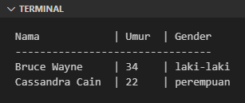

String (atau `str`) merupakan kumpulan data `char` atau karakter yang tersimpan secara urut (*text sequence*). String di Python mengadopsi standar Unicode dengan *default encoding* adalah `UTF-8`.

## A.17.1. Pengenalan String

Python mendesain tipe data string dalam bentuk yang sangat sederhana dan mudah digunakan. Untuk membuat string cukup tulis saja text yang diinginkan dengan diapit tanda petik satu atau petik dua. Contoh:

```python
text = "hello python"
print(text)
# output ➜ hello python

text = 'hello python'
print(text)
# output ➜ hello python
```

### ◉ Multiline string

Untuk string *multiline* atau lebih dari satu baris, cara penulisannya bisa dengan:

- Menggunakan karakter spesial `\n`:

    ```python
    text = "a multiline string\nin python"

    print(text)
    # output ↓ 
    #
    # a multiline string
    # in python
    ```

- Atau menggunakan tanda `"""` atau `'''` untuk mengapit text. Contoh:

    ```python
    text = """a multiline string
    in python"""

    print(text)
    # output ↓ 
    #
    # a multiline string
    # in python
    ```
    
    > Teknik penulisan string menggunakan tanda `"""` atau `'''` selain digunakan untuk membuat multiline string, juga bisa dimanfaatkan untuk hal lain yaitu pembuatan docstring.
    >
    > Lebih detailnya mengenai docstring dibahas di chapter [DocString](/basic/docstring).

### ◉ Escape character

Python mengenal *escape character* umum yang ada di banyak bahasa pemrograman, contohnya seperti `\"` digunakan untuk menuliskan karakter `"` (pada string yang dibuat menggunakan literal `" "`). Penambahan karakter `\` adalah penting agar karakter `"` terdeteksi sebagai penanda string.

Sebagai contoh, dua statement berikut adalah ekuivalen:

```python
text = 'this is a "string" in python'
print(text)
# output ➜ this is a "string" in python

text = "this is a \"string\" in python"
print(text)
# output ➜ this is a "string" in python
```

## A.17.2. String *special characters*

Di atas telah dicontohkan bagaimana cara menulis karakter *newline* atau baris baru menggunakan `\n`, dan karakter petik dua menggunakan `\"`. Dua karakter tersebut adalah contoh dari *special characters*.

Python mengenal banyak special characters yang masing-masing memiliki kegunaan yang cukup spesifik. Agar lebih jelas silakan lihat tabel berikut:

| Special character | Kegunaan |
| :-: | :- |
| \\\\ | karakter backslash (\\) |
| \' | tanda petik satu (') |
| \" | tanda kutip (petik dua) (") |
| \a | bunyi *beeb* (ASCII BEL) |
| \b | backspace (ASCII BS) |
| \f | page separator / formfeed (ASCII FF) |
| \n | karakter baris baru linefeed (ASCII LF) |
| \r | karakter baris baru carriage return (ASCII CR) |
| \t | horizontal tab (ASCII TAB) |
| \v | vertical tab (ASCII VT) |
| \\{oktal} | nilai oktal, contoh: `\122`, `\004`, `\024` |
| \x{hex} | nilai heksadesimal, contoh: `\xA4`, `\x5B` |

Tambahan contoh penggunaan salah satu special character `\t` (horizontal tab):

```python
print("Nama\t\t| Umur\t| Gender")
print("--------------------------------")
print("Bruce Wayne\t| 34\t| laki-laki")
print("Cassandra Cain\t| 22\t| perempuan")
```

Program di atas menghasilkan output berikut:




> Syntax `0xC548` adalah salah satu penulisan numerik berbasis hexadecimal. Pembahasan detailnya ada di chapter [Number](/basic/number-bilangan).

## A.17.3. String formatting

String formatting adalah teknik untuk mem-format string agar menghasilkan text sesuai dengan format yang diinginkan.

Cara termudah melakukan string formatting adalah dengan menggunakan **f-strings** (atau [formatted string literals](https://docs.python.org/3/reference/lexical_analysis.html#f-strings)). Tulis string seperti biasa tapi diawali dengan huruf `f` atau `F` sebelum penulisan `" "`.

Pada contoh berikut, sebuah string dibuat dimana dua bagian string didalamnya datanya bersumber dari variabel string lain.

```python
name = "Aiden Pearce"
occupation = "IT support"

text = f"hello, my name is {name}, I'm an {occupation}"
print(text)
# output ➜ hello, my name is Aiden Pearce, I'm an IT support
```

Penjelasan:

- String dibuat dengan metode f-strings, dimana struktur text adalah `hello, my name is {name}, I'm an {occupation}`.
- Text `{name}` di dalam string di-replace oleh nilai variable `name`, yang pada konteks ini nilainya `Aiden Pearce`.
- Text `{occupation}` di dalam string di-replace oleh nilai variable `occupation`, yang pada konteks ini nilainya `IT support`.
- f-strings di atas menghasilkan text `hello, my name is Aiden Pearce, I'm an IT support`.

> Pada penerapan metode **f-strings**, isi dari `{}` tidak harus data string, tetapi tipe data lainnya juga bisa digunakan asalkan *printable* atau bisa di-print.

Selain menggunakan metode di atas, ada beberapa alternatif cara lain yang bisa digunakan, diantaranya:

```python
text = "hello, my name is {name}, I'm an {occupation}".format(name = name, occupation = occupation)
print(text)
# output ➜ hello, my name is Aiden Pearce, I'm an IT support

text = "hello, my name is {0}, I'm an {1}".format(name, occupation)
print(text)
# output ➜ hello, my name is Aiden Pearce, I'm an IT support

text = "hello, my name is {}, I'm an {}".format(name, occupation)
print(text)
# output ➜ hello, my name is Aiden Pearce, I'm an IT support
```

Semua metode string formatting yang telah dipelajari menghasilkan nilai balik yang sama, yaitu `hello, my name is Aiden Pearce, I'm an IT support`. Mana yang lebih baik? Silakan pilih saja metode yang sesuai selera.

## A.17.4. Penggabungan string & split string

### ◉ Penggabungan string (concatenation)

Ada beberapa metode yang bisa digunakan untuk *string concatenation* atau operasi penggabungan string.

- Menggunakan teknik penulisan string literal sebaris.

    Caranya dengan langsung tulis saja semua string-nya menggunakan separator karakter spasi.

    ```python
    text = "hello " "python"
    print(text)
    # output ➜ hello python
    ```

- Menggunakan operator `+`.

    Operator `+` jika diterapkan pada string menghasilkan penggabungan string.

    ```python
    text_one = "hello"
    text_two = "python"
    text = text_one + " " + text_two

    print(text)
    # output ➜ hello python
    ```

    Untuk data non-string jika ingin digabung harus dibungkus dengan fungsi `str()` terlebih dahulu. Fungsi `str()` digunakan untuk mengkonversi segala jenis data ke bentuk string.

    ```python
    text = "hello"
    number = 123
    yes = True

    message = text + " " + str(number) + " " + str(yes)

    print(message)
    # output ➜ hello 123 True
    ```

- Menggunakan method `join()` milik string.

    Pada penerapannya, karakter pembatas atau *separator* ditulis terlebih dahulu, kemudian di-*chain* dengan method join dengan isi argument adalah list yang ingin digabung.

    ````python
    text = " ".join(["hello", "python"])
    print(text)
    # output ➜ hello python
    ```

### ◉ Split string

Split string adalah operasi pemisahan karakter string menjadi list dengan element berisi string. Operasi ini merupakan kebalikan dari penggabungan string.

Cara penggunaannya adalah dengan mengakses method `split()` langsung dari data string. Pemanggilan method tersebut perlu disertai argument berisi separator atau karakter pemisah string.

Pada contoh berikut, string `hello python 12345` di split menggunakan karakter spasi (` `).

```python
text = "hello python 12345"
res = text.split(" ")
print(res)
# output ➜ ['hello', 'python', '12345']
```

> Parameter method `split()` boleh untuk tidak diisi apapun, dengan efek adalah string menjadi di-split menggunakan separator `\n`, `\r`, `\t`, `\f` atau spasi (` `).

## A.17.5. Operasi sequence pada string

String masih termasuk kategori tipe data sequence, yang artinya bisa digunakan pada operasi standar sequence, contoh seperti perulangan, pengaksesan elemen, dan slicing.

### ◉ Mengecek lebar karakter string

Fungsi `len()` ketika digunakan pada tipe data string mengembalikan informasi jumlah karakter string.

```python
text = "hello python"

print("text:", text)
# output ➜ hello python

print("length:", len(text))
# output ➜ 12
```

### ◉ Mengakses element string

Setiap elemen string bisa diakses menggunakan index. Penulisan notasi pengaksesannya sama seperti pada tipe data sequence lainnya, yaitu menggunakan `string[index]`.

```python
text = "hello python"
print(text[0])
# output ➜ h

print(text[1])
# output ➜ e

print(text[2])
# output ➜ l
```

Selain via index, keyword perulangan `for` bisa dimanfaatkan untuk mengiterasi elemen string. Contoh:

```python
for c in text:
    print(c)
```

Contoh lain menggunakan `range()`:

```python
for i in range(0, len(text)):
    print(text[i])
```

Output:


:::danger

Pengaksesan elemen menggunakan index di-luar kapasitas data akan menghasilkan error.

Sebagai contoh, string `text = "hello"`, jika diakses index ke-5-nya misalnya (`text[5]`) hasilnya adalah error. 

:::

### ◉ *Slicing* string

Teknik slicing bisa diterapkan pada data string. Contoh:

```python
text = "hello python"

print(text[1:5])
# output ➜ ello

print(text[7:])
# output ➜ ython

print(text[:4])
# output ➜ hell
```

> Pembahasan detail mengenai slice ada di chapter [Slice](/basic/slice)

## A.17.6. Operasi *character & case*

Tipe data string memiliki beberapa method yang berguna untuk keperluan operasi string yang berhubungan dengan *character & case*

### ◉ Pengecekan karakter alfabet dan angka

- Method `isalpha()` digunakan untuk mengecek apakah string berisi karakter alfabet atau tidak. Nilai kembaliannya `True` jika semua karakter dalam string adalah alfabet.

    ```python
    print("abcdef".isalpha())
    # output ➜ True, karena abcdef adalah alfabet

    print("abc123".isalpha())
    # output ➜ False, karena ada karakter 123 yang bukan merupakan alfabet

    print("موز".isalpha())
    # output ➜ True, karena موز adalah abjad arabic 

    print("バナナ".isalpha())
    # output ➜ True, karena バナナ adalah karakter jepang
    ```

- Method `isdigit()` digunakan untuk mengecek apakah string berisi karakter digit atau tidak. Nilai kembaliannya `True` jika semua karakter dalam string adalah angka numerik (termasuk pangkat).

    ```python
    print("123456".isdigit())
    # output ➜ True, karena 123456 adalah digit

    print("123abc".isdigit())
    # output ➜ False, karena ada karakter abc yang bukan merupakan digit

    print('2⅓'.isdigit())
    # output ➜ False, karena bilangan pecahan memiliki karakter `/` yang tidak termasuk dalam kategori digit

    print('4²'.isdigit())
    # output ➜ True, karena 4² adalah bilangan pangkat

    print('٢٨'.isdigit())
    # output ➜ True, karena ٢٨ adalah digit arabic

    print('𝟜'.isdigit())
    # output ➜ True, karena 𝟜 adalah digit
    ```

- Method `isdecimal()` digunakan untuk mengecek apakah string berisi karakter desimal atau tidak. Nilai kembaliannya `True` jika semua karakter dalam string adalah angka numerik desimal.

    ```python
    print("123456".isdecimal())
    # output ➜ True, karena 123456 adalah angka desimal

    print("123abc".isdecimal())
    # output ➜ False, karena ada karakter abc yang bukan merupakan angka desimal

    print('2⅓'.isdecimal())
    # output ➜ False, karena bilangan pecahan memiliki karakter `/` yang tidak termasuk dalam kategori angka desimal

    print('4²'.isdecimal())
    # output ➜ False, karena bilangan pangkat yang tidak termasuk dalam kategori angka desimal

    print('٢٨'.isdecimal())
    # output ➜ True, karena ٢٨ adalah angka desimal arabic

    print('𝟜'.isdecimal())
    # output ➜ True, karena 𝟜 adalah angka desimal
    ```

- Method `isnumeric()` digunakan untuk mengecek apakah string berisi karakter desimal atau tidak. Nilai kembaliannya `True` jika semua karakter dalam string adalah angka numerik (termasuk pecahan, pangkat, dan angka numerik lainnya).

    ```python
    print("123456".isnumeric())
    # output ➜ True, karena 123456 adalah angka numerik

    print("123abc".isnumeric())
    # output ➜ False, karena ada karakter abc yang bukan merupakan numerik

    print('2⅓'.isnumeric())
    # output ➜ True, karena bilangan pecahan termasuk dalam kategori numerik

    print('4²'.isnumeric())
    # output ➜ True, karena bilangan pangkat termasuk dalam kategori numerik

    print('٢٨'.isnumeric())
    # output ➜ True, karena ٢٨ adalah angka numerik arabic

    print('𝟜'.isnumeric())
    # output ➜ True, karena 𝟜 adalah angka numerik
    ```

- Method `isalnum()` digunakan untuk mengecek apakah string berisi setidaknya karakter alfabet atau digit, atau tidak keduanya. Nilai kembaliannya `True` jika semua karakter dalam string adalah alfabet atau angka numerik.

    ```python
    print("123abc".isalnum())
    # output ➜ True, karena 123 adalah digit dan abc adalah alfabet 

    print("12345⅓".isalnum())
    # output ➜ True, karena 12345⅓ adalah digit

    print("abcdef".isalnum())
    # output ➜ True, karena abcdef adalah alfabet

    print("abc 12".isalnum())
    # output ➜ False, karena ada karakter spasi yang bukan merupakan karakter digit ataupun alfabet

    print("موز".isalnum())
    # output ➜ True, karena موز adalah abjad arabic 

    print("バナナ".isalnum())
    # output ➜ True, karena バナナ adalah karakter jepang
    ```

### ◉ Pengecekan karakter *whitespace*

Method `isspace()` digunakan untuk mengecek apakah string berisi karakter *whitespace*.

```python
print(" ".isspace())
# output ➜ True, karena string berisi karakter spasi

print("\n".isspace())
# output ➜ True, karena string berisi karakter newline

print("\n\r".isspace())
# output ➜ True, karena string berisi karakter newline 

print("hello\n\r".isspace())
# output ➜ False, karena string berisi tulisan hello yang tidak termasuk dalam kategori whitespace
```

### ◉ Pengecekan karakter *case*

- Method `islower()` digunakan untuk mengecek apakah semua karakter string adalah ditulis dalam huruf kecil (*lower case*), jika kondisi tersebut terpenuhi maka nilai kembaliannya adalah `True`.

    ```python
    print("hello python".islower())
    # output ➜ True

    print("Hello Python".islower())
    # output ➜ False

    print("HELLO PYTHON".islower())
    # output ➜ False
    ```

- Method `istitle()` digunakan untuk mengecek apakah kata dalam string adalah ditulis dengan awalan huruf besar (*title case*), jika kondisi tersebut terpenuhi maka nilai kembaliannya adalah `True`.

    ```python
    print("hello python".istitle())
    # output ➜ False

    print("Hello Python".istitle())
    # output ➜ True

    print("HELLO PYTHON".istitle())
    # output ➜ False
    ```

- Method `isupper()` digunakan untuk mengecek apakah semua karakter string adalah ditulis dalam huruf besar (*upper case*), jika kondisi tersebut terpenuhi maka nilai kembaliannya adalah `True`.

    ```python
    print("hello python".isupper())
    # output ➜ False

    print("Hello Python".isupper())
    # output ➜ False

    print("HELLO PYTHON".isupper())
    # output ➜ True
    ```

### ◉ Mengubah karakter *case*

Beberapa method yang bisa digunakan untuk mengubah *case* suatu string:

- Method `capitalize()` berfungsi untuk mengubah penulisan karakter pertama string menjadi huruf besar (*capitalize*).
- Method `title()` berfungsi untuk mengubah penulisan kata dalam string diawali dengan huruf besar (*title case*).
- Method `upper()` berfungsi untuk mengubah penulisan semua karakter string menjadi huruf besar (*upper case*).
- Method `lower()` berfungsi untuk mengubah penulisan semua karakter string menjadi huruf kecil (*lower case*).
- Method `swapcase()` berfungsi untuk membalik penulisan case karakter string. Untuk karakter yang awalnya huruf kecil menjadi huruf besar, dan sebaliknya.

```python
print("hello python".capitalize())
# output ➜ Hello python

print("hello python".title())
# output ➜ Hello Python

print("hello python".upper())
# output ➜ HELLO PYTHON

print("Hello Python".lower())
# output ➜ hello python

print("Hello Python".swapcase())
# output ➜ hELLO pYTHON
```

## A.17.7. Operasi pencarian string & substring

### ◉ Pengecekan string menggunakan keyword `in`

Keyword `in` bisa digunakan untuk mengecek apakah suatu string merupakan bagian dari string lain. Nilai balik statement adalah boolean. Contoh:

```python
text = "hello world"
print("ello" in text)
# output ➜ True
```

Teknik tersebut bisa dikombinasikan dengan seleksi kondisi `if`:

```python
text = "hello world"
if "ello" in text:
    print(f"py is in {text}")
# output ➜ py is in hello world
```

### ◉ Pengecekan substring

Ada beberapa Method yang bisa digunakan untuk keperluan pengecekan substring, apakah suatu string merupakan bagian dari string lain.

- Menggunakan method `startswith()` untuk mengecek apakah suatu string diawali dengan huruf/kata tertentu.

    ```python
    print("hello world".startswith("hell"))
    # output ➜ True

    print("hello world".startswith("ello"))
    # output ➜ False
    ```

- Menggunakan method `endswith()` untuk mengecek apakah suatu string diakhiri dengan huruf/kata tertentu.

    ```python
    print("hello world".endswith("orld"))
    # output ➜ True

    print("hello world".endswith("worl"))
    # output ➜ False
    ```

- Menggunakan method `count()` untuk mengecek apakah suatu string merupakan bagian dari string lain.

    ```python
    print("hello world".count("ello"))
    # output ➜ 1
    ```

    Method ini mengembalikan jumlah huruf/kata yang ditemukan. Jika kebutuhannya adalah mencari tau apakah suatu substring ada atau tidak, maka gunakan operasi logika lebih dari 0 (atau `n > 0`).

    ```python
    print("hello world".count("ello") > 0)
    # output ➜ True
    ```

### ◉ Pencarian index substring

Method-method berikut sebenarnya kegunaannya mirip seperti method untuk pengecekan substring, perbedaannya adalah nilai balik pemanggilan method berupa index substring.

- Method `count()` mengembalikan jumlah substring yang ditemukan sesuai kata kunci yang dicari.

    ```python
    text = "hello world hello world"
    print(text.count("ello"))
    # output ➜ 2
    ```

- Method `index()` mengembalikan index substring pertama yang ditemukan sesuai kata kunci yang dicari. Jika substring tidak ditemukan, method ini menghasilkan error.

    ```python
    text = "hello world hello world"
    print(text.index("worl"))
    # output ➜ 6
    ```

- Method `rindex()` mengembalikan index substring pertama yang ditemukan sesuai kata kunci yang dicari dengan urutan pencarian adalah dari kanan. Jika substring tidak ditemukan, method ini menghasilkan error.

    ```python
    text = "hello world hello world"
    print(text.rindex("worl"))
    # output ➜ 18
    ```

- Method `find()` mengembalikan index substring pertama yang ditemukan sesuai kata kunci yang dicari. Jika substring tidak ditemukan, method ini menghasilkan nilai `-1`.

    ```python
    text = "hello world hello world"
    print(text.find("worl"))
    # output ➜ 6
    ```

- Method `rfind()` mengembalikan index substring pertama yang ditemukan sesuai kata kunci yang dicari dengan urutan pencarian adalah dari kanan. Jika substring tidak ditemukan, method ini menghasilkan nilai `-1`.

    ```python
    text = "hello world hello world"
    print(text.rfind("worl"))
    # output ➜ 18
    ```

## A.17.8. Operasi string lainnya

### ◉ Replace substring

Method `replace()` digunakan untuk me-replace suatu substring dengan string lain. Contoh penggunaan:

```python
str_old = "hello world"
str_new = str_old.replace("world", "python")
print(str_new)
# output ➜ hello python
```

### ◉ Trim / strip

Metode trimming/stripping digunakan untuk menghapus *whitespace* yang diantaranya adalah baris baru dan juga spasi.

Sebelum kita mulai, coba perhatikan kode berikut. String `text` dideklarasikan menggunakan `""" """` yang dalam penerapannya tidak akan meng-*escape* whitespace.

```python
text = """
hello python
"""

print(f"--{text}--")
# output ↓
#
# --
# hello python
# --
```

Bisa dilihat saat di print kelihatan *newline* atau baris barunya pada awal string dan juga akhir string.

Dengan menggunakan teknik trimming, whitespace bisa dihilangkan. Ada beberapa method yang bisa digunakan, diantaranya:

- Method `lstrip()` untuk trim *whitespace* karakter di awal atau sebelah kiri string.

    ```python
    text = """
    hello python
    """

    print(f"--{text.lstrip()}--")
    # output ↓
    #
    # --hello python
    # --
    ```

- Method `rstrip()` untuk trim *whitespace* karakter di akhir atau sebelah kanan string.

    ```python
    text = """
    hello python
    """

    print(f"--{text.rstrip()}--")
    # output ↓
    #
    # --
    # hello python--
    ```

- Method `strip()` untuk trim *whitespace* karakter di awal dan akhir string.

    ```python
    text = """
    hello python
    """

    print(f"--{text.strip()}--")
    # output ➜ --hello python--
    ```

### ◉ Join string

Method `join()` berguna untuk menggabungkan list berisi element string. String yang digunakan untuk memanggil method ini menjadi *separator* operasi join.

```python
data = ["hello", "world", "abcdef"]
res = "-".join(data)
print(res)
# output ➜ hello-world-abcdef
```

### ◉ Konversi data ke string

Ada beberapa metode konversi tipe data ke string, diantaranya:

- Menggunakan fungsi `str()`.

    Fungsi ini bisa digunakan untuk mengkonversi data bertipe apapun ke bentuk string. Contoh penerapan:

    ```python
    number = 24
    string1 = str(number)
    print(string1)
    # output ➜ 24

    items = [1, 2, 3, 4]
    string2 = str(items)
    print(string2)
    # output ➜ [1, 2, 3, 4]

    obj = {
        "name": "AMD Ryzen 5600g",
        "type": "processor",
        "igpu": True,
    }
    string3 = str(obj)
    print(string3)
    # output ➜ {'name': 'AMD Ryzen 5600g', 'type': 'processor', 'igpu': True}
    ```

- Menggunakan teknik string formatting. Contoh:

    ```python
    number = 24
    string1 = f"{number}"
    print(string1)
    # output ➜ 24

    items = [1, 2, 3, 4]
    string2 = f"{items}"
    print(string2)
    # output ➜ [1, 2, 3, 4]

    obj = {
        "name": "AMD Ryzen 5600g",
        "type": "processor",
        "igpu": True,
    }
    string3 = f"{obj}"
    print(string3)
    # output ➜ {'name': 'AMD Ryzen 5600g', 'type': 'processor', 'igpu': True}
    ```

---

<div class="section-footnote">

## Catatan chapter 📑

### ◉ Source code praktik

<pre>
    <a href="https://github.com/novalagung/dasarpemrogramanpython-example/tree/master/string">
        github.com/novalagung/dasarpemrogramanpython-example/../string
    </a>
</pre>

### ◉ Chapter relevan lainnya

- [String ➜ Unicode](/basic/unicode)
- [Slice](/basic/slice)

### ◉ TBA

- Bytes
- Konversi tipe data ke string

### ◉ Referensi

- https://docs.python.org/3/library/string.html
- https://docs.python.org/3/library/stdtypes.html#text-sequence-type-str
- https://docs.python.org/3/reference/lexical_analysis.html#f-strings

</div>
