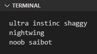
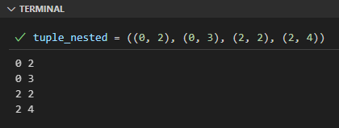
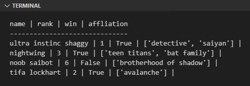

Tuple adalah tipe data sequence yang ideal digunakan untuk menampung nilai kolektif yang isinya tidak akan berubah (*immutable*), berbeda dengan list yang lebih cocok untuk data yang bisa berubah nilai elemen-nya (*mutable*).

Pada chapter ini kita akan belajar tentang topik ini.

## A.15.1. Tuple vs. List

Tipe data tuple sekilas memiliki beberapa kemiripan dan juga perbedaan jika dibandingkan dengan list.

<table class="no-content-background">
    <thead>
        <tr>
            <th>&nbsp;</th>
            <th class="align-center">Tuple</th>
            <th class="align-center">List</th>
        </tr>
    </thead>
    <tbody>
        <tr>
            <td>Literal</td>
            <td class="align-center"><code>()</code>, atau <code>tuple()</code>,<br />atau elemen ditulis tanpa <code>()</code></td>
            <td class="align-center"><code>[]</code>, atau <code>list()</code></td>
        </tr>
        <tr>
<td>Contoh</td>
<td class="vertical-align-top">

```
x = ()
```

```
x = tuple()
```

```
x = (1, True, "h", 2, 1)
```

```
x = 1, True, "h", 2, 1
```

</td>
<td class="vertical-align-top">

```
x = []
```

```
x = list()
```

```
x = [1, True, "h", 2, 1]
```

</td>
        </tr>
        <tr>
            <td>Urutan elemen</td>
            <td class="align-center" colspan="2">urut sesuai index</td>
        </tr>
        <tr>
            <td>Pengaksesan elemen</td>
            <td class="align-center" colspan="2">via index dan perulangan</td>
        </tr>
        <tr>
            <td><i>Mutability</i></td>
            <td class="align-center">elemen tidak bisa diubah</td>
            <td class="align-center">elemen bisa diubah</td>
        </tr>
        <tr>
            <td>Duplikasi elemen</td>
            <td class="align-center" colspan="2">elemen bisa duplikat</td>
        </tr>
        <tr>
            <td>Tipe data elemen</td>
            <td class="align-center" colspan="2">bisa sejenis maupun berbeda satu sama lain</td>
        </tr>
    </tbody>
</table>

## A.14.2. Pengenalan Tuple

Deklarasi tuple menggunakan literal `()` dengan delimiter tanda koma (`,`). Contoh syntax-nya bisa dilihat pada kode berikut:

```python
tuple_1 = (2, 3, 4, "hello python", False)

print("data:", tuple_1)
# output ➜ data: (2, 3, 4, "hello python", False)

print("total elem:", len(tuple_1))
# output ➜ total elem: 5
```

- Tuple bisa menampung element yang tipe datanya bisa sejenis bisa tidak, sama seperti list.
- Fungsi `len()` digunakan untuk menghitung lebar tuple.

## A.14.3. Mengakses element tuple via index

Element tuple bisa diakses menggunakan notasi `tuple[index]`.

```python
tuple_1 = (2, 3, 4, 5)

print("elem 0:", tuple_1[0])
# output ➜ elem 0: 2

print("elem 1:", tuple_1[1])
# output ➜ elem 1: 3
```

:::danger

Pengaksesan elemen menggunakan index di-luar kapasitas data akan menghasilkan error.

Sebagai contoh, data `tuple_1` di atas jika diakses index ke-4-nya misalnya (`tuple_1[4]`) hasilnya adalah error. 

```python
tuple_1 = (2, 3, 4, 5)

print("elem 0:", tuple_1[5])
# output ➜ IndexError: tuple index out of range
```

:::

## A.14.4. Perulangan tuple

Tuple adalah salah satu tipe data yang bisa digunakan secara langsung pada perulangan menggunakan keyword `for`.

Pada contoh berikut, variabel `tuple_2` dimasukan ke blok perulangan. Di setiap iterasinya, variabel `t` berisi element tuple.

```python
tuple_2 = ('ultra instinc shaggy', 'nightwing', 'noob saibot')

for t in tuple_2:
    print(t)
```



Perulangan di atas ekuivalen dengan perulangan berikut:

```python
tuple_2 = ('ultra instinc shaggy', 'nightwing', 'noob saibot')

for i in range(0, len(tuple_2)):
    print("index:", i, "elem:", tuple_2[i])
```

### ◉ Fungsi `enumerate()`

Fungsi `enumerate()` digunakan untuk membuat data sequence menjadi data enumerasi, yang jika dimasukan ke perulangan di setiap iterasinya bisa kita akses index beserta element-nya.

```python
tuple_2 = ('ultra instinc shaggy', 'nightwing', 'noob saibot')

for i, v in enumerate(tuple_2):
    print("index:", i, "elem:", v)
```

## A.14.5. Mengecek apakah element ada

Kombinasi keyword `if` dan `in` bisa digunakan untuk mengidentifikasi apakah suatu element merupakan bagian dari tuple atau tidak. Contoh penerapannya:

```python
tuple_1 = (10, 70, 20)
n = 70

if n in tuple_1:
    print(n, "is exists")
else:
    print(n, "is NOT exists")

# output ➜ 70 is exists
```

## A.14.6. Nested tuple

Nested tuple dibuat dengan menuliskan data tuple sebagai element tuple. Contoh:

```python
tuple_nested = ((0, 2), (0, 3), (2, 2), (2, 4))

for row in tuple_nested:
    for cell in row:
        print(cell, end=" ")
    print()
```



Penulisan data literal nested tuple bisa dalam bentuk horizontal maupun vertikal. Perbandingannya bisa dilihat pada kode berikut:

```python
# horizontal
tuple_nested = ((0, 2), (0, 3), (2, 2), (2, 4))

# vertikal
tuple_nested = (
    (0, 2),
    (0, 3),
    (2, 2),
    (2, 4)
)
```

## A.14.7. List dan tuple

Tipe data list dan tuple umum dikombinasikan. Keduanya sangat mirip tapi memiliki perbedaan yang jelas, yaitu nilai tuple tidak bisa dimodifikasi sedangkan list bisa.

```python
# deklarasi data list berisi elemen tuple
data = [
    ("ultra instinc shaggy", 1, True, ['detective', 'saiyan']),
    ("nightwing", 3, True, ['teen titans', 'bat family']),
]

# append tuple ke list
data.append(("noob saibot", 6, False, ['brotherhood of shadow']))

# append tuple ke list
data.append(("tifa lockhart", 2, True, ['avalanche']))

# print data
print("name | rank | win | affliation")
print("------------------------------")
for row in data:
    for cell in row:
        print(cell, end=" | ")
    print()
```



## A.14.8. Fungsi `tuple()`

### ◉ Konversi string ke tuple

Fungsi `tuple()` bisa digunakan untuk konversi data string ke tuple. Hasilnya adalah nilai tuple dengan element berisi setiap karakter yang ada di string. Contoh:

```python
alphabets = tuple('abcdefgh')
print(alphabets)
# output ➜ ('a', 'b', 'c', 'd', 'e', 'f', 'g', 'h')
```

### ◉ Konversi list ke tuple

Konversi list ke tuple bisa dilakukan dengan mudah menggunakan fungsi `tuple()`. Contoh penerapannya:

```python
numbers = tuple([2, 3, 4, 5])
print(numbers)
# output ➜ (2, 3, 4, 5)
```

### ◉ Konversi range ke tuple

Range juga bisa dikonversi ke tuple menggunakan fungsi `tuple()`.

```python
r = range(0, 3)
rtuple = tuple(r)
print(rtuple)
# output ➜ (0, 1, 2)
```

## A.14.9. Tuple *packing* dan *unpacking*

### ◉ Tuple *packing*

*Packing* adalah istilah untuk menggabungkan beberapa data menjadi satu data kolektif. Contoh pengaplikasiannya bisa dilihat pada program berikut, ada 3 variabel dengan isi berbeda di-*pack* menjadi satu data tuple.

```python
first_name = "aerith gainsborough"
rank = 11
win = False

row_data = (first_name, rank, win)

print(row_data)
# output ➜ ('aerith gainsborough', 11, False)
```

Bisa dilihat penerapan metode *packing* cukup mudah. Tulis saja data atau variabel yang ingin di-*pack* dalam notasi tuple, kemudian gunakan sebagai nilai pada operasi *assignment*.

Pada contoh di atas, variabel `row_data` menampung nilai tuple hasil *packing* variabel `first_name`, `rank`, dan `win`.

O iya, penulisan tuple boleh juga dituliskan tanpa menggunakan karakterk `(` & `)`.

```python
# dengan ()
row_data = (first_name, rank, win)

# tanpa ()
row_data = first_name, rank, win
```

Namun, pastikan untuk hati-hati dalam penerapan penulisan tuple tanpa `()`, karena bisa jadi salah paham. Jangan gunakan metode ini pada saat menggunakan tuple sebagai nilai argument pemanggilan fungsi, karena interpreter akan menganggapnya sebagai banyak argument.

```python
# fungsi print() dengan satu argument berisi tuple (first_name, rank, win)
print((first_name, rank, win))

# fungsi print() dengan isi 3 arguments: first_name, rank, win
print(first_name, rank, win)
```

> Penjelasan detail mengenai packing ada di chapter [Pack Unpack ➜ Tuple, List, Set, Dict](/basic/pack-unpack-elements)

### ◉ Tuple *unpacking*

*Unpacking* adalah istilah untuk menyebar isi suatu data kolektif ke beberapa variabel. *Unpacking* merupakan kebalikan dari *packing*.

Contoh penerapan tuple *unpacking*:

```python
row_data = ('aerith gainsborough', 11, False)
first_name, rank, win = row_data

print(first_name, rank, win)
# output ➜ aerith gainsborough 11 False
```

> Penjelasan detail mengenai packing ada di chapter [Pack Unpack ➜ Tuple, List, Set, Dict](/basic/pack-unpack-elements)

## A.14.10. Tuple kosong `()`

Tuple bisa saja tidak berisi apapun, contohnya data `()`, yang cukup umum digunakan untuk merepresentasikan data kolektif yang isinya bisa saja kosong.

```python
empty_tuple = ()
print(empty_tuple)
# output ➜ ()
```

Berikut adalah contoh penerapannya, dimisalkan ada data kolektif yang didapat dari database berbentuk array object. Data tersebut perlu disimpan oleh variabel list yang element-nya adalah tuple dengan spesifikasi:

- Tuple element index 0 berisi `name`.
- Tuple element index 1 berisi `rank`.
- Tuple element index 2 berisi `win`.
- Tuple element index 3 berisi `affliation`, dimana affliation bisa saja kosong.

Sample data bisa dilihat berikut ini:

```python
data = [
    ("ultra instinc shaggy", 1, True, ('detective', 'saiyan')),
    ("nightwing", 3, True, ('teen titans', 'bat family')),
    ("kucing meong", 7, False, ()),
]
```

Bisa dilihat data `kucing meong` tidak memiliki `affliation`, karena terisi dengan nilai tuple `()`.

---

<div class="section-footnote">

## Catatan chapter 📑

### ◉ Source code praktik

<pre>
    <a href="https://github.com/novalagung/dasarpemrogramanpython-example/tree/master/tuple">
        github.com/novalagung/dasarpemrogramanpython-example/../tuple
    </a>
</pre>

### ◉ Chapter relevan lainnya

- [List](/basic/list)

### ◉ TBA

- Slicing tuple
- Zip

### ◉ Referensi

- https://docs.python.org/3/tutorial/datastructures.html
- https://docs.python.org/3/library/stdtypes.html#typesseq

</div>
