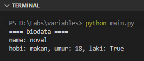
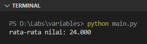

Dalam konsep programming, variabel adalah suatu nama yang dikenali komputer sebagai penampung nilai/data yang disimpan di memory. Sebagai contoh nilai `3.14` disimpan di variabel bernama `PI`.

Pada chapter ini kita akan belajar tentang penerapan variabel di Python.

## A.4.1. Deklarasi variabel

Agar dikenali oleh komputer, variabel harus dideklarasikan. Deklarasi variabel di Python cukup sederhana, caranya tinggal tulis saja nama variabel kemudian diikuti operator *assignment* beserta nilai awal yang ingin dimasukan ke variabel tersebut. Contoh:

```python
nama = "noval"
hobi = 'makan'
umur = 18
laki = True
```

Karakter `=` adalah **operator assignment**, digunakan untuk operasi penugasan. Nilai yang ada di sebelah kanan `=` ditugaskan untuk ditampung oleh variabel yang berada di sebelah kiri `=`. Contoh pada statement `nama = "noval"`, nilai `"nama"` ditugaskan untuk ditampung oleh variabel `nama`.

> Nilai string bisa dituliskan dengan menggunakan literal `"` ataupun `'`

Ok. Selanjutnya, coba kita munculkan nilai ke-empat variabel di atas ke layar menggunakan fungsi `print()`. Caranya:

```python
print("==== biodata ====")
print("nama: %s" % (nama))
print("hobi: %s, umur: %d, laki: %r" % (hobi, umur, laki))
```



Penjelasan mengenai program di atas bisa dilihat di bawah ini:

### ◉ *String formatting* `print`

Di program yang sudah ditulis, ada statement berikut:

```python
print("==== biodata ====")
```

Statement tersebut adalah contoh cara memunculkan string ke layar output (`stdout`):

Lalu di bawahnya ada statement ini, yang merupakan contoh penerapan teknik *string formatting* atau *output formatting* untuk mem-format string ke layar output:

```python
print("nama: %s" % (nama))
# output ➜ "nama: noval"
```

Karakter `%s` disitu akan di-replace dengan nilai variabel `nama` sebelum dimunculkan. Dan `%s` disini menandakan bahwa data yang akan me-replace-nya bertipe data `string`.

Selain `%s`, ada juga `%d` untuk data bertipe numerik integer, dan `%r` untuk data bertipe `bool`. Contoh penerapannya bisa dilihat pada statement ke-3 program yang sudah di tulis.

```python
print("hobi: %s, umur: %d, laki: %r" % (hobi, umur, laki))
# output ➜ "hobi: makan, umur: 18, laki: True"
```

> Pembahasan detail mengenai string formatting ada di chapter [String ➜ formatting](/basic/string#a173-string-formatting)

## A.4.2. *Naming convention* variabel

Mengacu ke dokumentasi [PEP 8 – Style Guide for Python Code](https://peps.python.org/pep-0008/), nama variabel dianjurkan untuk ditulis menggunakan [`snake_case`](https://en.wikipedia.org/wiki/Snake_case).

```python
pesan = 'halo, selamat pagi'
nilai_ujian = 99.2
```

## A.4.3. Operasi *assignment*

Di pemrograman Python, deklarasi variabel adalah pasti operasi assignment. Variabel dideklarasikan dengan ditentukan langsung nilai awalnya.

```python
nama = "noval"
umur = 18
nama = "noval agung"
umur = 21
```

## A.4.4. Deklarasi variabel beserta tipe data

Tipe data variabel bisa ditentukan secara eksplisit, penulisannya bisa dilihat pada kode berikut:

```python
nama: str = "noval"
hobi: str = 'makan'
umur: int = 18
laki: bool = True
nilai_ujian: float = 99.2
```

> Pembahasan detail mengenai tipe data ada di chapter [Tipe Data](/basic/tipe-data)

## A.4.5. Deklarasi banyak variabel sebaris

Contoh penulisan deklarasi banyak variabel dalam satu baris bisa dilihat pada kode berikut:

```python
nilai1, nilai2, nilai3, nilai4 = 24, 25, 26, 21
nilai_rata_rata = (nilai1 + nilai2 + nilai3 + nilai4) / 4

print("rata-rata nilai: %f" % (nilai_rata_rata))
```

> Karakter `%f` digunakan untuk mem-format nilai `float`

Output program di atas:



---

<div class="section-footnote">

## Catatan chapter 📑

### ◉ Source code praktik

<pre>
    <a href="https://github.com/novalagung/dasarpemrogramanpython-example/tree/master/variables">
        github.com/novalagung/dasarpemrogramanpython-example/../variables
    </a>
</pre>

### ◉ Chapter relevan lainnya

- [Tipe Data](/basic/tipe-data)
- [String](/basic/string)
- [Number](/basic/number-bilangan)

### ◉ Referensi

- https://www.w3schools.com/python/python_datatypes.asp
- https://peps.python.org/pep-0008/
- https://en.wikipedia.org/wiki/Snake_case
- https://www.learnpython.org/en/String_Formatting

</div>
