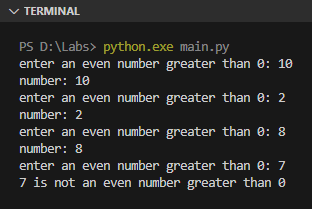
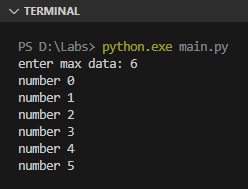
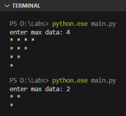

Di Pyhon, selain keyword `for` ada juga keyword `while` yang fungsinya kurang lebih sama yaitu untuk perulangan. Bedanya, perulangan menggunakan `while` terkontrol via operasi logika atau nilai `bool`.

Pada chapter ini kita akan mempelajari cara penerapannya.

## A.10.1. Keyword `while`

Cara penerapan perulangan ini adalah dengan menuliskan keyword `while` kemudian diikuti dengan nilai `bool` atau operasi logika. Contoh:

```python
should_continue = True

while should_continue:
    n = int(input("enter an even number greater than 0: "))

    if n <= 0 or n % 2 == 1:
        print(n, "is not an even number greater than 0")
        should_continue = False
    else:
        print("number:", n)
```



Program di atas memunculkan *prompt* inputan `enter an even number greater than 0:` yang dimana akan terus muncul selama user tidak menginputkan angka ganjil atau angka dibawah sama dengan `0`.

Contoh lain penerapan `while` dengan kontrol adalah operasi logika:

```python
n = int(input("enter max data: "))
i = 0

while i < n:
    print("number", i)
    i += 1
```



### ◉ Operasi *increment* dan *decrement*

Python tidak mengenal operator *unary* `++` dan `--`. Solusi untuk melakukan operasi *increment* maupun *decrement* bisa menggunakan cara berikut:

| Operasi | Cara 1 | Cara 2 |
| :-: | :-: | :-: |
| *Increment* | `i += 1` | `i = i + 1` |
| *Decrement* | `i -= 1` | `i = i - 1` |

## A.10.2. Perulangan `while` vs `for`

Operasi `while` cocok digunakan untuk perulangan yang dimana kontrolnya adalah operasi logika atau nilai boolean yang tidak ada kaitannya dengan *sequence*.

Pada program yang sudah di tulis di atas, perulangan akan menjadi lebih ringkas dengan pengaplikasian keyword `for`, silakan lihat perbandingannya di bawah ini:

- Dengan keyword `while`:

    ```python
    n = int(input("enter max data: "))
    i = 0

    while i < n:
        print("number", i)
        i += 1
    ```

- Dengan keyword `for`:

    ```python
    n = int(input("enter max data: "))

    for i in range(n):
        print("number", i)
    ```

Sedangkan keyword `for` lebih pas digunakan pada perulangan yang kontrolnya adalah data *sequence*, contohnya seperti range dan list.

## A.10.3. Perulangan bercabang / *nested* `while`

Contoh perulangan bercabang bisa dilihat pada kode program berikut ini. Caranya cukup tulis saja keyword `while` di dalam block kode `while`.

```python
n = int(input("enter max data: "))
i = 0

while i < n:
    j = 0

    while j < n - i:
        print("*", end=" ")
        j += 1
    
    print()
    i += 1
```



## A.10.4. Kombinasi `while` dan `for`

Kedua keyword perulangan yang sudah dipelajari, yaitu `for` dan `while` bisa dikombinasikan untuk membuat suatu *nested loop* atau perulangan bercabang.

Pada contoh berikut, kode program di atas diubah menggunakan kombinasi keyword `for` dan `while`.

```python
n = int(input("enter max data: "))
i = 0

for i in range(n):
    j = 0

    while j < n - i:
        print("*", end=" ")
        j += 1
    
    print()
```

---

<div class="section-footnote">

## Catatan chapter 📑

### ◉ Source code praktik

<pre>
    <a href="https://github.com/novalagung/dasarpemrogramanpython-example/tree/master/while">
        github.com/novalagung/dasarpemrogramanpython-example/../while
    </a>
</pre>

### ◉ Referensi

- https://docs.python.org/3/tutorial/controlflow.html

</div>
