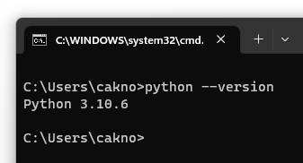

Ada banyak cara yang bisa dipilih untuk instalasi Python, silakan pilih sesuai preferensi dan kebutuhan.

## Instalasi Python

### ◉ Instalasi di Windows

- Via [Microsoft Store Package](https://apps.microsoft.com/store/detail/python-310/9PJPW5LDXLZ5?hl=en-id&gl=id&rtc=1)
- Via [Official Python installer](https://www.python.org/downloads/release/python-3106/)
- Via [Chocolatey package manager](https://community.chocolatey.org/packages/python/3.10.6)
- Via [Windows Subsystem for Linux (WSL)](https://learn.microsoft.com/en-us/windows/python/web-frameworks)

### ◉ Instalasi di MacOS

- Via [Homebrew](https://docs.brew.sh/Homebrew-and-Python)
- Via [Official Python installer](https://www.python.org/downloads/release/python-3106/)

### ◉ Instalasi di OS lainnya

- Via package manager masing-masing sistem operasi

### ◉ Instalasi via source code

- Tarball source code bisa diunduh di [situs official Python](https://www.python.org/downloads/release/python-3106/)

### ◉ Instalasi via Anaconda

- File installer bisa diunduh di [situs official Anaconda](https://www.anaconda.com/download/)

## Konfigurasi path Python

1. Pastikan untuk mendaftarkan path dimana Python ter-install ke OS environment variable, agar nantinya mudah dalam pemanggilan binary `python`.
2. Jika diperlukan, set juga variabel `PYTHONHOME` yang mengarah ke base folder dimana Python terinstall. Biasanya editor akan mengacu ke environment variabel ini untuk mencari dimana path Python berada.
3. Kemudian, jalankan command `python --version` untuk memastikan binary sudah terdaftar di `$PATH` variable.

